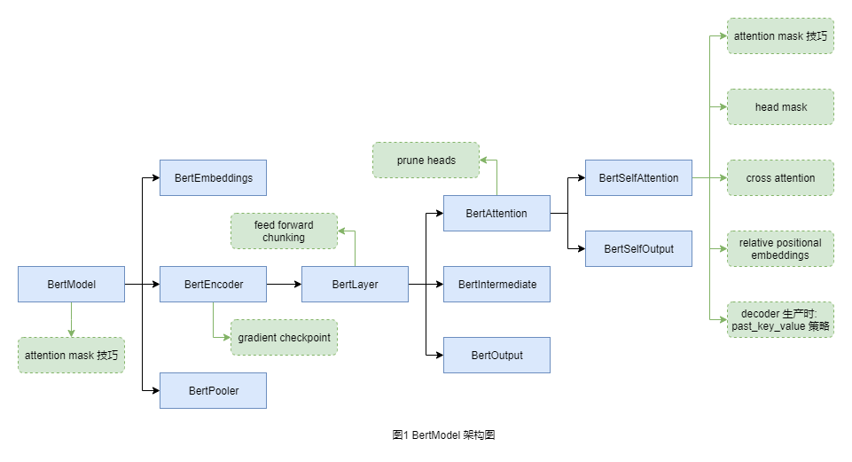
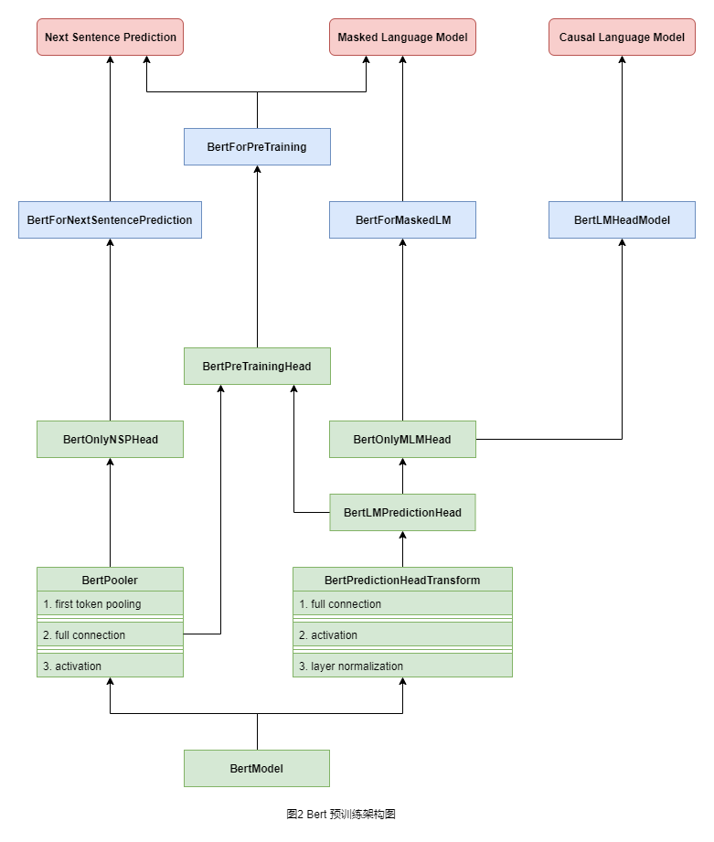

# BERT 源码解读

[TOC]

## 引言

本文是针对 HuggingFace Transformers 库中关于 `BERT` 模型 PyTorch 源码的解读。目前的版本是 4.x, 这个库更新地很快, 但是从目前来看模型代码更新地不频繁。截至 2022 年 9 月, 其源码都可以在 [transformers/modeling_bert.py](https://github.com/huggingface/transformers/blob/main/src/transformers/models/bert/modeling_bert.py) 中找到。

在 transformers 中, 所有用户可以使用的 PyTorch 模块都继承自 `PreTrainedModel`, 内部的模块是继承自 `nn.Module`。`BERT` 源码中对 `PreTrainedModel` 进行了修改, 变成了 `BertPreTrainedModel`, 因此在 `BERT` 源码中, 所有用户可使用的类都是继承自 `BertPreTrainedModel`, 内部使用的模块继承自 `nn.Module`。

继承自 `BertPreTrainedModel` 的类大体上可以分成三种类型:

+ 基础模块: `BertModel`
+ 预训练模块: `BertForPreTraining`, `BertLMHeadModel`, `BertForMaskedLM`, `BertForNextSentencePrediction`,
+ 微调模块: `BertForSequenceClassification`, `BertForMultipleChoice`, `BertForTokenClassification`, `BertForQuestionAnswering`

这些类也是有很多内部的模块组成, 内部的模块大体上可以分成两种类型:

+ 用于构建基础模块: `BertEmbeddings`, `BertSelfAttention`, `BertSelfOutput`, `BertAttention`, `BertIntermediate`, `BertOutput`, `BertLayer`, `BertEncoder`
+ 用于构建预训练模块: `BertPooler`, `BertPredictionHeadTransform`, `BertLMPredictionHead`, `BertOnlyMLMHead`, `BertOnlyNSPHead`, `BertPreTrainingHeads`

接下来我们按照上面的思路来分析源码。

## 一、基础模块

基础模块就是 `BertModel`。`BERT` 原本就是 `Transformer` 的 encoder 模块, 然而作者很厉害, 将 `Transformer` 的 decoder 模块也写了进去, 同时变量名起的很奇怪, 导致了代码的可读性很低。在读代码之前, 请确保理解下面的内容:

我们知道, 在 `Transformer` 中, 一共有三种 `Attention` 层:

+ self attention 层: encoder 中的自注意力层
+ masked self attention 层: decoder 中的掩码自注意力层
+ cross attention 层: 连接 encoder 和 decoder 的注意力层, 其中 KEY 和 VALUE 来自 encoder, QUERY 来自 decoder

我们知道, 在 `GPT` 系列模型中, 其用的是标准的语言模型, 也就是 `Transformer` 的 decoder 模块, 但是这个 decoder 模块中是没有 cross attention 层的。

整个 `BertModel` 和组成其的内部模块之间的关系如下图 (图一): (蓝色表示模块, 绿色表示知识点)

### 残差模块

在 `BERT` 源码中, residual block 包含三个部分: 投影, 相加 和 标准化 (`nn.LayerNorm`)。如果我们设输入张量为 $x$, 张量 $x$ 经过某种运算后变成张量 $y$, 那么 residual 所做的事情是将张量 $y$ 投影到和张量 $x$ 一样的维度, 然后相加, 最后再标准化。图中的 `BertSelfOutput` 和 `BertOutput` 两个类就是 residual block, 分别对经过 `BertSelfAttention` 和 `BertIntermediate` 运算的张量进行残差连接。

### Feed Forward 模块

`BertIntermediate` 是常规的神经网络层, 全连接层加激活函数 (`gelu`), 全连接层输出的维度是输入维度的 4 倍, 对象是针对每一个词向量, 因此论文中将其称为 position-wise 的。

由于全连接层的输出是输入的 4 倍, 这样的运算很吃显存, 于是就有了 Feed Forward Chunking, 将原本一次的线性变换拆成若干次进行:

+ 先在 `seq_len` 维度上进行截断, 分成若干份
+ 每一份经过 `BertIntermediate` 后直接进行 `BertOutput` 中的投影运算
+ 运算完成后再拼接起来, 以避免生成过大的张量

虽然使用 chunking 的原因是 `hidden_size` 过大, 但是注意截断的维度是 `seq_len`, 能这么做的原因是这一步是 position-wise 的操作。

我认为比较好的代码风格是将 `BertImmediate` 和 `BertOutput` 类像 `Attention` 一样额外组合成一个类, 然后将 chunking 放在这个类中, 可能是为了兼容原版 TensorFlow 的代码, 没有进行额外的组装, 将 chunking 放在了 `BertLayer` 类中, 看起来有些奇怪。

### Attention 模块

`BertSelfAttention` 就是整个代码的核心了, 其支持 `Transformer` 中的所有 `Attention` 运算。~~(所以为什么不将类名改成 TransformerAttention 呢)~~ 关于其中的知识点就不一一说了, 这里重点说一下两个 mask: attention mask 和 head mask:

如果了解 `nn.TransformerEncoderLayer` 模块的话, 在 PyTorch 中, 会将 mask 分成两部分: `src_mask` 和 `src_key_padding_mask`。

+ `src_mask` 是对 token-pair 进行 mask, 其 shape 是 `[seq_len, seq_len]`
+ `src_key_padding_mask` 是对输入中所有补零的部分进行 mask, 其 shape 是 `[batch_size, seq_len]`

在这里, mask 是一个 `BoolTensor`, `True` 表示要掩掉，`False` 表示不要掩掉, 在 `nn.MultiHeadAttention` 中用 `torch.masked_fill` 方法进行掩码, 变成 `-inf`。

在 HuggingFace Transformers 中用了完全不一样的掩码方式: 直接和 `attention_scores` 相加的方式。运算流程是这样的:

+ `attention_mask` 传入 `BertModel` 中时, 是 `LongTensor`, 形状是 `[batch_size, seq_len]`, 其中 `1` 表示参与运算, 不要掩掉,`0` 表示不参与计算, 需要掩掉。
+ 在 `BertModel` 中有 `get_extended_attention_mask` 方法, 会进行如下转换:
  + broadcast: 将 shape 从 `[batch_size, seq_len]` 变成 `[batch_size, 1, 1, seq_len]`
  + 转换: `0` 变成 `-10000.`, `1` 变成 `0.`
  + 如果是 masked self attention, 那么再加上其所需要的mask, shape 为: `[batch_size, 1, seq_len, seq_len]`
+ 一层层往下传, 在 `BertSelfAttention` 中, 会直接和 `attention_scores` 相加, 被掩掉的部分会变成约等于 `-10000.` 的数, `exp(-10000)` 和 `exp(-inf)` 差不多

实验证明这种加法的 mask 比 PyTorch 中使用的 `torch.masked_fill` 方法要快!

head mask 表示的是让部分头不参与运算, 具体的做法如下:

+ 在传入 `BertModel` 中时, `head_mask` 的维度是 `[num_layers, num_heads]`, 表示的是每一层哪一个 head 要被掩掉: 0 表示不参与运算, 掩掉, 1 表示参与运算, 不掩掉
+ 在 `BertModel` 中有 `get_head_mask` 方法, 会将其维度 broadcast 成 `[num_layers, 1, num_heads, 1, 1]`
+ 在 `BertEncoder` 层中, 会迭代每一层, 传入的是 `[1, num_heads, 1, 1]`
+ 在 `BertSelfAttention` 层中, 会直接让其和 `attention_probs` 相乘, 是 `0` 的整个部分计算出来都是 `0`, 是 `1` 的部分值不变, 任务完成

这种 head mask 虽然让部分头不参与运算了, 但是也存在问题: 不能减少计算量, 这时候就需要剪枝了 (prune heads)。`BertAttention` 层是将 `Attention` 操作和 残差操作合在了一起, 支持剪枝注意力的 "头":

+ `BertModel` 中有 `prune_heads` 方法, 其参数类型是是一个字典, 其 key 值表示的是 `BertLayer` 的索引值, value 是一个列表, 表示这层中需要剪枝的 "头" 的索引值, 都是 0-based index。
+ `prune_heads` 是父类 `PreTrainedModel` 的方法, 其会调用子类的 `_prune_heads` 方法, `_prune_heads` 方法会调用 `BertAttention` 中的 `prune_heads` 方法。
+ 传到 `BertAttention` 中的 `prune_heads` 方法时, 参数就是列表, 表示当前层需要剪枝的 "头" 的索引值
+ 我们知道线性层的权重维度是 `[out_features, in_features]`, 将一个 "头" 剪掉, 意味着:
  + `query`, `key` 和 `value` 的线性变换中, 输出的特征维度会减少, 权重维度会变成: `[pruned_out_features, in_features]`, 也就是减少线性函数的数量
  + 残差层中投影所对应的线性变换中, 输入的特征维度会减少, 权重维度会变成: `[out_features, pruned_in_features]`, 也就是减少每一个线性函数输入的特征数

最后说一下 cross attention, 在 cross attention 中:

+ decoder 中的每一个 cross attention 中 KEY 和 VALUE 都来自于 encoder 最终输出的 hidden_state, 对应 `encoder_hidden_state` 参数
+ cross attention 的 QUERY 来自于 decoder 本身, 对应 `hidden_state` 参数
+ attention 中关于 padding 的 mask 是针对 KEY 矩阵的, 因此 cross attention 中的 mask 是来自于 encoder 的, 对应 `encoder_attention_mask` 参数
+ 无论 QUERY, KEY 和 VALUE 来自于哪 (在 `nn.MultiHeadAttention` 中也是一样), 都需要先进行线性变换

如果理解了上面所说, 同时了解 encoder-decoder 生产时的过程, 那么 `past_key_value` 参数就很好理解了, 本质上来说是一种减少重复运算的过程。

关于相对位置编码见另一个文档。

### 其它

关于 gradiend checkpoint 的含义, 见其它文档。`BertEncoder` 中包含了若干个 `BertEncoderLayer`, 对每一层设置 gradient checkpoint。注意这里虽然类的名字是叫 encoder, 但其实也实现了 decoder, 不仅如此, decoder 还分加 cross attention 的 decoder 和不加 cross attention 的 decoder, 因此看起来很凌乱, 可以考虑将 decoder 部分删除再看, 会发现就没有几行代码了。

`BertEmbeddings` 层没什么好说的, 就是三个嵌入层相加再标准化。如果不想用 `BERT` 的 word embeddings, 还可以直接传入 `inputs_embeds`。

`BertPooler` 是对所有词向量的池化。在之前的很多模型中, 都是对所有词向量进行 max pooling, 但是这里直接取第一个词向量作为池化的结果, 经过线性变换 + 激活层后输出。

## 二、预训练任务

在 HuggingFace Transformers 中, **PreTrained** 表示已经训练好的模型, **PreTraining** 表示预训练任务, 整个 `BERT` 预训练架构如下图 (图二): 图中的红色表示具体的任务名, 蓝色表示用户可使用的模块, 绿色表示内部的构建模块。

### Next Sentence Prediction

架构很简单, `BertModel` 输出的每个词的词向量, (这里将 `BertModel` 和 `BertPooler` 分开了, 将两者合在一起其实感觉挺奇怪的), 通过 `BertPooler` 池化后变成一个向量。其中, first token pooling 的含义就是取第一个词向量作为整句 "池化" 的结果。唯一要说的就是 `BertPooler` 层中有激活函数。

在 `BertOnlyNSPHead` 中有一个分类的全连接层, 输出的就是两个句子是否是连接在一起的, 属于二分类任务, loss 计算在 `BertForNextSentencePrediction` 中, 使用的是 `CrossEntropyLoss`, 也就是使用的是 softmax 函数来分类, 而不是 sigmoid 函数。

### Masked Language Model

按照论文中所说, 会在所有输入句子的 token 中随机选择 15% 的 token 掩掉, 来进行 token+词表 级别的预测。输入的构建如下:

+ 未选中的 token 就是原本的词表 ID
+ 在选中的 token 中:
  + 随机选择 80% 的 token, 映射成 `[MASK]` 所对应的词 ID
  + 随机选择 10% 的 token, 不映射, 还是原来的词 ID
  + 随机选择 10% 的 token, 映射成其它随机的词 ID

这样做的原因是为了解决预训练和微调时输入不一致的情况, 也就是说, 微调时输入的 token 中没有 `[MASK]` 特殊字符。换句话说, 20% 的词不映射成 `[MASK]` 的原因是作者希望模型可以学习到词与词之间的关系, 而不仅仅是词与 `[MASK]` 特殊字符之间的关系。

输出的构建如下:

+ 未选中的 token, 其标签就是 `-100`, 表示其不参与 loss 的计算
+ 所有选中的 token, 其标签就是原来词的 ID

`BertLMPredictionHead` 中进行的就是 token+词表 级别的分类。我们知道 word embedding 中词嵌入的维度是 `[vocab_size, hidden_size]`, 而这里分类的线性层权重维度是 `[hidden_size, vocab_size]`。在早期的语言模型中, 两者都可以作为其它任务的词嵌入, 前者被称为 input embedding, 后者被称为 output embedding。在 2016 年, 有人提出可以让 input embedding 和 output embedding 是同一个张量, 参数共享, 被称为 weight tying。

`BERT` 源码中也使用了 weight tying 技巧, 里面的 `get_output_embeddings`，`set_output_embeddings`, `get_input_embeddings` 和 `set_input_embeddings` 就是干这件事的。具体参考源码路线: `post_init` -> `init_weights` -> `tie_weights`。值得注意的是, 在这里面还有一个 output-only bias, input embedding 中是没有的, 我的理解是 output embedding 是要做分类任务的, 添加 bias 是为了提高分类任务的能力。

`BertPredictionHeadTransform` 非常简单, 就是全连接 + 激活 + 标准化。但是在使用 weight tying 的情况下就很奇怪, 因为其破环了整体神经网络的对称性。虽然 MLM 任务不是标准的 auto-encoder 模型 (输入和输出是一致的), 虽然 `BertLMPredictionHead` 中的 output-only bias 也破环了对称性, 但是还是很奇怪。

一般的解释是越靠近 loss 层的网络越是 task-specified, 苏剑林也有提到过这个问题: [模型优化漫谈：BERT的初始标准差为什么是0.02？](https://kexue.fm/archives/8747) 。关于这个问题需要关注更多语言模型的的工作才能理解。

### causal language model

CLM, 因果语言模型, 或者说标准的语言模型, 就是在只有上文的情况下预测下文, 和 GPT 是一致的。`BertLMHeadModel` 就是做这个事情的, 看源码会发现, 在计算 loss 时, 会将标签往右移一位。GPT 对应的是 `is_decoder=True` 和 `add_crossattention=False` 的情况。

不需要做过多的说明, 只想吐槽你的类名为什么不是 `BertForCausalLM` ... 顺便吐槽一句, 不会有人拿 `BERT` 当 decoder 吧, 其是针对 NLU 的预训练模型, 真用于 NLG 效果会非常不好的。当然你要是用 `BERT` 去训练 decoder 的预训练模型当我没说 ...

### bert pretraining

`BERT` 的预训练包含 NSP 和 MLM 两个任务, 做法是在预训练时对一篇文章中的句子随意拼接, 两个句子相邻, 其 NSP 的标签就是 `1`, 否则就是 `0`。然后再从这些句子中抽取部分词语进行替换, 生成 MLM 任务的标签。

在训练时, 两个任务是一起训练的, loss 直接相加, 没有调任务的权重。差不多网络架构就是这样, 剩下的就是训练技巧了。

## 三、微调任务

微调任务一共有四个, 都是直接使用的 `BertModel`, 其本质都是分类任务, 一个一个来看:

### 文本分类

`BertForSequenceClassification` 文本属于哪一个类别的, 可以是 sentence-pair 的文本分类, `BertPooler` 的输出直接接分类全连接层, 输出分数。

如果是 single label classification, 也就是一个文本对应一个类, 那么计算 loss 就是 `CrossEntropyLoss`

如果是 multi label classification, 也就是一个文本对应多个类, 那么计算 loss 就是 `BCEWithLogitsLoss`

还支持 regression, 计算 loss 使用的是 `MSELoss`

### 单项选择

multiple choice 对应我们平常的单选题, 其也是文本分类, 不过有细微的不同:

首选, 输入的 `input_ids` 不再是 `[batch_size, seq_len]` 了, 而是 `[batch_size, num_choices, seq_len]`。这里的输入都是 sentence-pair 的句子, 由问题+选项拼接而成, 有几个选项就拼接几次。

其次, 分类全连接层只有一个分类的线性函数, 具体操作如下:

+ 将输入 reshape 成 `[batch_size * num_choices, seq_len]`
+ 经过 `BertModel` 和 `BertPooler`, 输出 `[batch_size * num_choices, hidden_size]`
+ 经过分类层, 输出 `[batch_size * num_choices, 1]`
+ reshape 成 `[batch_size, num_choices]`
+ 用 `torch.argmax` 寻找每一个样本最大的分数

为什么用一个线性函数给所有类别打分呢? 我们可以认为其是在做同一个类别的分类任务。单项选择题显然是和选项顺序无关的, 因此我们只能有一个线性方程来给所有的选项进行打分, 而不能像其它分类任务一样每一个类别用一个线性方程来打分。

### token 分类

对每一个 token 进行分类, 其只支持 single label classification, 和图像中的关键点识别很类似, 值得一提的是这种任务往往各个类别的数量是非常不均衡的, 其没有用 focal loss 等等其它技巧, 可见 `BERT` 能力之强。

### 知识问答

这里实现的是提取式的知识问答, 解决方法是: span classification。

提取式的知识问答任务是: 任务就是给定一段文本和问题, 然后从文本中寻找一个文本片段作为问题的答案。

span classification 解决问题的方式: 既然答案只是文本中的片段, 没有额外的扩展, 那么我们只需要知道片段的开始和结束就可以了。那么我们进行 token 级别的分类, 预测哪一个 token 是答案的开始, 哪一个 token 是答案的结束就可以了。

这里实现的和一般的 token classification 还是不一样的 (限定了答案是文本中的一个片段, 而不是多个片段):

+ 输入是由 问题 加 文本拼接的 sentence-pair
+ 分类 (打分) 的线性函数有两个, 含义是: 这个 token 是答案文本片段 开始/结束 的分数
+ 计算 loss 使用的是 `CrossEntropy`, 是将所有 token 的分数用 softmax 函数归一化, 换句话说, 分类的类别数是会变的, 和文本的 token 数保持一致
+ 有两个分类任务, 两个任务的 loss 计算出来后相加取平均
+ 在预测时, 分数最大的那个 token 即为答案文本片段的 开始/结束 token, 然后取两者间的文本即可

也就是说, 这里虽然有两个分类任务, 但不是多标签分类, 其分类的类别数是变化的, 和 token 数是一致的, 属于单标签分类 (其限定了一句话中只能有一个 token 是开始, 一个 token 是结束)。

`BERT` 源码中有一个细小的问题: 分类时, 最佳的类别应该是所有文本部分的 token, 但是代码中将 `[PAD]` 部分的 token 和问题部分的 token 都加进去了。因此在解码时要注意这个问题。

## References

+ [BERT (huggingface.co)](https://huggingface.co/docs/transformers/model_doc/bert) (Accessed on 2022-08-30)
+ [BERT: Pre-training of Deep Bidirectional Transformers for Language Understanding](https://arxiv.org/abs/1810.04805) (Accessed on 2022-08-30)
+ [Attention Is All You Need](https://arxiv.org/abs/1706.03762) (Accessed on 2022-08-30)
+ [Self-Attention with Relative Position Representations](https://arxiv.org/abs/1803.02155) (Accessed on 2022-08-30)
+ [Improve Transformer Models with Better Relative Position Embeddings](https://arxiv.org/abs/2009.13658) (Accessed on 2022-08-30)
