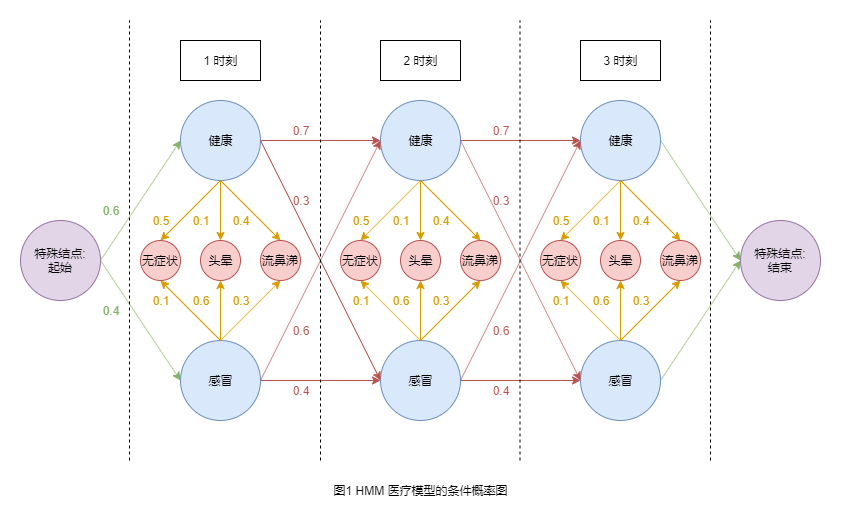
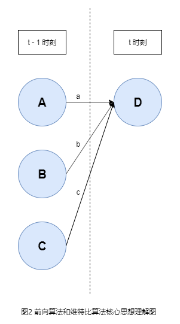

# HMM & CRF 详解

[TOC]

## 简介

在统计自然语言阶段, 解决序列标注问题的方法主要有三个: 隐马尔科夫模型, 结构化感知机和随机向量场。从最本质上来说, 这三者所做的事情是一致的, 但是解释方法完全是不一样的, 计算上也有很大的差别。

如果你了解它们, 那么 "一致性" 是很好理解的:

+ 一阶马尔可夫链, 结构化感知机 (仅将上一时刻的标签作为转移特征) 和 线性链 CRF 在图示上区别不大。
+ 它们的解码算法都是维特比算法。

它们的区别主要体现在对过程的解释和建模上:

+ 三者所对应的建模概念分别是: 有向概率图, 感知机和无向概率图。
+ HMM 是生成式模型, 直接计算序列发生的概率; 结构化感知机 和 CRF 是判别式模型, 计算序列的分数, 分数高的对应序列发生的概率大。
+ HMM 是直接寻找观测到的状态和标签之间的关系, 而结构化感知机 和 CRF 则是要根据观测到的状态提取特征, 寻找特征和标签之间的关系。
+ 结构化感知机 和 CRF 虽然都是计算序列的分数, 但是 CRF 比 结构化感知机多一步, 那就是用 `softmax` 函数将分数转化成 "概率"。
+ HMM 的参数是用古典概率直接计算得到的; 结构化感知机和 CRF 的参数都可以用 SGD 的方式得到, 前者和感知机是一致的, 后者和逻辑回归是一致的。

更多关于这部分的内容可以参考何晗的 "自然语言处理入门" 这本书或者别人整理出来的博客: [《自然语言处理入门》笔记](https://blog.csdn.net/tiantianzs/article/details/121551458) 。如果你上网找资料, 还会看到其它的模型, 比方说: 最大熵马尔科夫模型 (MEMM) 等等都可以去了解。

这篇文章并不是从无向概率图的角度来解释 CRF, 而是从有向概率图出发, 解释 HMM, 最后扩展到 CRF 中。

## 隐马尔可夫模型

### HMM 引言

隐马尔可夫模型 (Hidden Markov Model, HMM) 要解决的问题: **序列标注** 问题。我们用 **词性标注** 问题来举例:

现在有一个已经分过词的句子, 比方说: `["今天", "的", "月亮", "很", "圆"]`, 我们需要模型去预测每一个词语的词性, 比方说: `["名词", "助词", "名词", "程度副词", "形容词"]`。

在这个问题中, 词语是已知的, 可以观测到的, 我们一般称为 **显状态**, 词性是未知的, 需要模型去预测的, 不易观测到的, 我们一般称为 **隐状态**。给每一个显状态一个隐状态标签的任务被称为 **序列标注** 任务。

为了方便后面的说明, 我们用一个经典且简单的医疗模型的例子:

+ 我们假定人的症状有三种: 无症状(normal), 头晕(dizzy) 和 流鼻涕(cold); 其很容易观测到, 属于显状态
+ 我们假定确诊疾病有两种: 健康(healthy) 和 感冒 (fever); 其不容易观测到, 需要通过一定时间的病毒培养和细菌培养来确定, 属于隐状态
+ 我们观测的时间单位是任意的, 可以是 "天", 也可以是 "小时", 这里统称为 "时刻"

HMM 模型对序列标注问题进行如下的假设:

+ 每一个时刻的隐状态仅仅依赖于上一个时刻的隐状态
+ 每一个时刻的显状态仅仅依赖于当前时刻的隐状态

我们知道, 对于有向概率图来说:

+ 从 A 结点指向 B 结点表示在 A 事件发生的情况下 B 事件发生的概率, 即 $P(B|A)$, 因此从某一结点指出的所有 边(Edge) 的概率之和应该是 1.
+ 从 A 结点指向 B 结点的另一种说法是 B 结点依赖于 A 结点.

因此, 根据上面的假设, 我们可以将医疗模型画成如下的有向概率图 (假定只有 3 个时刻): (记作图1)

在上图中, 蓝色结点表示隐状态, 红色结点表示显状态, 紫色结点表示特殊结点, 用于限制起始和结束的隐状态。注意在大部分建模时, 仅仅会限制起始隐状态, 不会限制结束隐状态, 这个例子中也是这样。我们将绿色部分称为 **初始隐状态概率**, 橘黄色部分称为 **发射概率**, 红色部分称为 **转移概率**。

知道这些后, 我们可以开始计算概率了。现在我们求显状态序列为 [头晕, 流鼻涕] 的概率:

显然此时有四条路径可以选择:

+ P((健康, 头晕), (健康, 流鼻涕)) = 0.6 \* 0.1 \* 0.7 \* 0.4 = 0.0168
+ P((健康, 头晕), (感冒, 流鼻涕)) = 0.6 \* 0.1 \* 0.3 \* 0.3 = 0.0054
+ P((感冒, 头晕), (健康, 流鼻涕)) = 0.4 \* 0.6 \* 0.6 \* 0.4 = 0.0576
+ P((感冒, 头晕), (感冒, 流鼻涕)) = 0.4 \* 0.6 \* 0.4 \* 0.3 = 0.0288

然后将四条路径的概率值加起来即可, 也就是 P(头晕, 流鼻涕) = 0.0168 + 0.0054 + 0.0576 + 0.0288 = 0.1086

在这个问题中, 我们发现路径的数量取决于隐状态的数量和序列的长度, 如果隐状态的数量是 $a$, 序列长度是 $b$, 那么路径数是 $a^b$ (每一步都有 $a$ 种选择)。无论是当 $a$ 还是当 $b$ 很大时, 其计算量都是天文数字级别的。怎么办呢? **前向算法** 可以帮助我们解决问题。

### 前向概率和后向概率

我们设某一序列长度为 $T$, $t$ 表示序列中的某一个时刻, $v_t$ 表示 $t$ 时刻的显状态, $h_t$ 表示 $t$ 时刻的隐状态, 那么我们可以定义 $t$ 时刻的前向概率和后向概率:

前向概率 $\alpha_t(h_t)$ 表示的是从起始时刻 (1 时刻) 到 t 时刻的显状态为 $v_1, v_2, ..., v_t$ 且 $t$ 时刻的隐状态为 $h_t$ 的概率

后向概率 $\beta_t(h_t)$ 表示的是从 $t$ 时刻到结束时刻 ($T$ 时刻)的显状态为 $v_t, v_{t+1}, ..., v_T$, 且 $t$ 时刻的隐状态为 $h_t$ 的概率

### 前向算法

一句话表述其核心思想为, 在 $t$ 时刻某一隐状态的前向概率等于: 在 $t - 1$ 时刻所有隐状态的前向概率乘以对应的权重, 再求和。具体理解见下图 (记作图2):

我们现在求的是在 D 结点处的前向概率, 即到达 D 结点所有路径概率的和。到达 D 结点的路径有很多, 但是我们可以分成 3 组, 分别是

+ 经过 A 结点到达 D 结点的, 这些路径的概率都可以提取出来公因式 $a$, 如果知道到达 A 结点所有路径概率之和, 乘以 $a$, 就是通过 A 结点到达 D 结点所有路径概率之和
+ 进过 B 结点到达 D 结点的, 这些路径的概率都可以提取出来公因式 $b$, 如果知道到达 B 结点所有路径概率之和, 乘以 $b$, 就是通过 B 结点到达 D 结点所有路径概率之和
+ 经过 C 结点到达 D 结点的, 这些路径的概率都可以提取出来公因式 $c$, 如果知道到达 C 结点所有路径概率之和, 乘以 $c$, 就是通过 C 结点到达 D 结点所有路径概率之和

因此根据乘法分配率, 我们可以得到: $\alpha_t(D) = \alpha_{t-1}(A) \times a + \alpha_{t-1}(B) \times b + \alpha_{t-1}(C) \times c$ , 也就是说在 D 结点的前向概率等于在 A, B 和 C 结点的前向概率分别乘以对应的转移概率 $a$, $b$ 和 $c$, 再将三个数求和即可。

回到上面求 [头晕, 流鼻涕] 概率的例子:

+ 第一个时刻, 健康的前向概率: $\alpha_1(健康) = 0.6 \times 0.1 = 0.06$
+ 第一个时刻, 感冒的前向概率: $\alpha_1(感冒) = 0.4 \times 0.6 = 0.24$
+ 第二个时刻, 健康的前向概率: $\alpha_2(健康) = \alpha_1(健康) \times 0.7 \times 0.4 + \alpha_1(感冒) \times 0.6 \times 0.4 = 0.0744$
+ 第二个时刻, 感冒的前向概率: $\alpha_2(感冒) = \alpha_1(健康) \times 0.3 \times 0.3 + \alpha_1(感冒) \times 0.4 \times 0.3 = 0.0342$

由此可以得到: $P(头晕, 流鼻涕) = \alpha_2(健康) + \alpha_2(感冒) = 0.1086$

至此, 我们将求某一显状态序列的概率问题转化为求每一步每一个隐状态的前向概率, 此时就可以用 **动态规划** 算法来求解了, 子任务是求每一步每一个隐状态的前向概率。

### Viterbi 算法

前向算法解决了求某一显状态序列的概率问题, 而维特比算法解决的问题是如何根据某一显状态序列去预测隐状态序列。

如何去预测隐状态的序列, 那就是遍历所有的路径, 找出概率最大的那一条。

又是遍历所有的路径!!! 问题和之前一样, 当然做法也很之前的相似。(维特比算法的做法的本质和前向概率是一致的)

我们用 $MP$ 表示在某一时刻到达某一隐状态的所有路径中, 概率的最大值。则核心思想可以表述为:

在 $t$ 时刻到达某一隐状态的 $MP$ 等于: 在 $t - 1$ 时刻到达每一个隐状态的 $MP$ 乘以对应的权重后的最大值。

我们可以用图2来理解: 现在求的是到达 D 结点所有路径概率的最大值。到达 D 结点的路径有很多, 但是我们可以分成 3 组, 分别是

+ 经过 A 结点到达 D 结点的, 这些路径的概率值都要乘以 $a$, 因此通过 A 结点到达 D 结点的最大概率路径 和 到达 A 结点的最大概率路径是一致的
+ 经过 B 结点到达 D 结点的, 这些路径的概率值都要乘以 $b$, 因此通过 B 结点到达 D 结点的最大概率路径 和 到达 B 结点的最大概率路径是一致的
+ 经过 C 结点到达 D 结点的, 这些路径的概率值都要乘以 $c$, 因此通过 C 结点到达 D 结点的最大概率路径 和 到达 C 结点的最大概率路径是一致的

那么就可以得到: $MP(D) = \max \enspace (MP(A) \times a, \enspace \enspace MP(B) \times b, \enspace \enspace MP(C) \times c)$

我们还用之前的例子, 在医疗模型中, 我们知道显状态序列为 [头晕, 流鼻涕], 那么怎么去预测隐状态序列呢?

我们设 $MP_t(h_t)$ 表示在 $t$ 时刻到达隐状态 $h_t$ 的所有路径概率最大值, 则:

+ 第一个时刻时, $MP_1(健康) = 0.6 \times 0.1 = 0.06$
+ 第一个时刻时, $MP_1(感冒) = 0.4 \times 0.6 = 0.24$
+ 第二个时刻时, $MP_2(健康) = \max(0.7 \times 0.4 \times MP_1(健康), 0.6 \times 0.4 \times MP_1(感冒)) = 0.0576$
+ 第二个时刻时, $MP_2(感冒) = \max(0.3 \times 0.3 \times MP_1(健康), 0.4 \times 0.3 \times MP_1(感冒)) = 0.0288$

此时, 我们怎么获得隐状态序列呢? 那就是每一步要记录最大值所对应的隐状态 (也被称为前驱隐状态):

+ 在计算 $MP_2(健康)$ 时, 我们知道 $0.6 \times 0.4 \times MP_1(感冒)$ 的值比较大, 那么我们就将 "感冒" 存储起来
+ 在计算 $MP_2(感冒)$ 时, 我们知道 $0.4 \times 0.3 \times MP_1(感冒)$ 的值比较大, 那么我们就将 "感冒" 存储起来
+ 由于 $MP_2(健康) > MP_2(感冒)$, 我们知道第二个时刻的隐状态是 "健康"
+ 回溯, 然后我们知道第一个时刻的隐状态是 "感冒"

由此可以得到隐状态序列可能性最大的是: [感冒, 健康]

### HMM 总结

**前向算法** 和 **维特比算法** 很相似, 总结如下:

+ 两者的前提都是已知显状态序列, 但是解决的问题不同:
  + 前向算法: 这个显状态序列发生的概率: 遍历所有的隐状态路径, 求出每一个路径的概率, 再求和即可
  + 维特比算法: 通过这个显状态序列去找概率最高的隐状态序列: 遍历所有的隐状态路径, 求出每一个路径的概率, 然后选取概率最大的那一个隐状态路径
+ 两者的核心思想也是相似的:
  + 前向算法: 在 $t$ 时刻, 某一隐状态的前向概率等于: 在 $t-1$ 时刻, 所有隐状态的前向概率乘以对应的权重, 再求和
  + 维特比算法: 在 $t$ 时刻, 某一隐状态的 $MP$ 等于: 在 $t-1$ 时刻, 所有隐状态的 $MP$ 乘以对应的权重, 再求最大值
+ 两者在算法分类上都属于 **动态规划**, 做法和子任务都是相似的:
  + 前向算法: 遍历每一个时刻, 按照上面的核心思想求每一个隐状态的前向概率
  + 维特比算法: 遍历每一个时刻, 按照上面的核心思想求每一个隐状态的 $MP$, 并记录到达当前隐状态的前驱隐状态

有了上面的知识后, 我们来看两个算法的通用表示:

+ 前向算法

> 设隐状态标签有 $N$ 个; $m$ 和 $n$ 表示隐状态标签的索引值, 也就是说 $m = 1, 2, \cdots, N$ 并且 $n = 1, 2, \cdots, N$;
>
> 设序列长度为 $T$; $t$ 表示序列中的某一个时刻, 也就是说 $t = 1,2, \cdots, T$;
>
> $\alpha$ 表示前向概率, $\alpha_t(n)$ 表示在 $t$ 时刻隐状态是 $n$ 的前向概率;
>
> $o$ 表示显状态, $o_t$ 表示在 $t$ 时刻的显状态;
>
> 设 $\pi$ 是初始概率, $\pi_n$ 表示隐状态是 $n$ 的初始概率;
>
> 设 $b$ 是发射概率, $b_n(o_t)$ 表示 $n$ 隐状态 "发射" 到 $o_t$ 显状态的概率;
>
> 设 $a$ 是转移概率, $a_{mn}$ 表示从 $m$ 隐状态 "转移" 到 $n$ 隐状态的概率;
>
> 设 $O$ 是显状态序列, $P(O)$ 表示显状态序列发生的概率
>
> 第一步: 计算 $1$ 时刻每一个隐状态的前向概率:
>
> $\alpha_1(n) = \pi_n \times b_n(o_1)$, 其中 $n = 1, 2, \cdots, N$
>
> 第二步: 递推计算 $2$ 时刻到 $T$ 时刻每一个隐状态的前向概率:
>
> $\alpha_{t+1}(n) = [ \enspace \sum_{m=1}^N \alpha_t(m) \times a_{mn} \enspace ] \times b_n(t+1)$, 其中 $t = 1, 2, \cdots, T-1$ 并且 $n = 1, 2, \cdots, N$
>
> 第三步: 求显状态序列的概率
>
> $P(O) = \sum_{m=1}^N  \alpha_T(m)$

+ 维特比算法

> 除了上面的符号, 我们设 $\delta$ 表示所有路径的最大概率, $\delta_t(i)$ 表示在 $t$ 时刻到达 $i$ 隐状态的所有路径的最大概率;
>
> 我们设 $\psi$ 表示, $\psi_t(i)$ 表示在 $t$ 时刻到达 $i$ 隐状态的最大概率路径中, $t-1$ 时刻的隐状态 (前驱隐状态);
>
> 我们设输出的最优隐状态路径为 $S^\ast = (s_1^\ast, s_2^\ast, \cdots, s_T^\ast)$;
>
> 第一步: 计算 $1$ 时刻每一个隐状态的 $\delta$
>
> $\delta_1(n) = \pi_n \times b_n(o_1)$, 其中 $n = 1, 2, \cdots, N$
>
> 第二步: 递推计算 $2$ 时刻到 $T$ 时刻每一个隐状态的 $\delta$ 和 $\psi$
>
> $\delta_{t+1}(n) = \max \limits_{1 <= m <= N} [\enspace \delta_t(m) \times a_{mn} \enspace] \times b_n(t+1)$
>
> $\psi_{t+1}(n) = \argmax \limits_{1 <=m<=N} [\enspace \delta_t(m) \times a_{mn} \enspace] $
>
> 其中 $t = 1, 2, \cdots, T-1$ 并且 $n = 1, 2, \cdots, N$
>
> 第三步: 计算最佳路径在 $T$ 时刻的隐状态
>
> $s_T^\ast = \argmax \limits_{1 <=m<=N} [\enspace \delta_T(m) \enspace]$
>
> 第四步: 回溯获得最佳路径
>
> $s_t^\ast = \psi_{t+1}(s_{t+1}^\ast)$

### HMM References

+ [隐马尔科夫模型（HMM）一前向与后向算法](https://zhuanlan.zhihu.com/p/27056207)
+ [Viterbi算法（维特比算法）](https://blog.csdn.net/Flag_ing/article/details/123123660)
+ [统计学习方法——维特比算法](https://blog.csdn.net/qq_35082030/article/details/78816161)

## 随机向量场

### CRF 引言

在很多情况下, 用古典概率来计算参数值并不是一个很好的选择, 其要求训练数据的分布和真实的分布尽可能地相似。更好的方式是给序列打分, 如果需要概率, 再用 `softmax` 函数转换。

现在将 HMM 中计算概率的部分变成计算分数, 不再计算 初始隐状态概率, 隐状态转移概率 和 隐状态到显状态的发射概率了, 变成计算 初始隐状态分数, 隐状态转移分数 和 隐状态和显状态之间的发射分数, 这样的模型我们称为 线性链条件随机场 (linear-chain conditional random fields)。那么我们怎么计算一个序列的分数呢? 按照 HMM 的方式将各个部分的分数相加即可。那么 CRF 比 HMM 有什么优势呢?

+ 可以设计隐状态和显状态之间的打分函数, 也就是说 CRF 可以根据显状态来提取特征, 实际上特征工程对 CRF 来说很重要
+ 模型的设计更好合理, 不再用古典概率来估算参数值, 而是用类似逻辑回归模型的方式来更新参数值 (`L-BFGS` 或者 `SGD` 的方式来拟合参数)

在 NLP 中, 往往会选用 BERT+CRF 模型来解决 NER 任务:

+ 用 BERT 模型来提取一句话中每一个词语的特征, 将词语编码成词向量
+ 用多元一次函数给词向量打分, 得到词语和每一个标签之间的发射分数
+ 标签的初始分数 和 标签间的转移分数 属于模型的参数, 通过 "训练" 得到

前两步和 BERT+softmax 模型是一致的, 也就是说, BERT+CRF 比 BERT+softmax 多添加了标签之间的依赖。

那么我们应该如何训练 CRF 的参数呢? 又如何解码呢?

### CRF 训练

对于一个显状态序列, 在训练时, 我们知道其隐状态序列, 根据逻辑回归和 SGD, 我们损失函数的计算如下:

1. 计算隐状态序列的得分, 记作 $s_{gold}$
2. 计算所有可能的隐状态序列的得分, 记作 $s_1, s_2, \cdots, s_{gold}, \cdots, s_{n^t}$
3. 用 `softmax` 计算概率, 即 $p = \exp(s_{gold}) / exp(s_1 + s_2 + \cdots + s_{gold} + \cdots + s_{n^t})$
4. 计算损失值, 即 $loss = -log(p)$

我们将第三步的公式代入第四步中, 可以得到: $loss = -s_{gold} + logsumexp (s_1, s_2, \cdots, s_{gold}, \cdots, s_{n^t})$

我们将 $logsumexp (s_1, s_2, \cdots, s_{gold}, \cdots, s_{n^t})$ 部分记作 $Z$, 在很多教程中, 会将其称为 **配分函数**, 那么怎么计算 $Z$ 呢?

答案是前向算法, 不过先要掌握下面的知识:

> 我们将 **加法** 和 **乘法** 映射成 `logsumexp` 运算 和 **加法**, 也就是说:
>
> 在 HMM 中, 我们是将每一步的概率 **乘** 起来, 得到路径概率, 再对所有的路径概率就和
>
> 现在是将每一步的分数 **加** 起来, 得到路径的分数, 再对所有的路径分数进行 `logsumexp` 运算
>
> 原来的加法分配律 $a+b+c+d = (a+b) + (c+d)$, 变成:
>
> $$
> logsumexp(a, b, c, d) = logsumexp(logsumexp(a, b), \enspace logsumexp(c, d))
> \tag{1}
> $$
>
> 原来的乘法结合律 $a*c+b*c=(a+b)*c$, 变成:
>
> $$
> logsumexp(a+c, b+c) = c + logsumexp(a, b)
> \tag{2}
> $$
>
> 公式 $(1)$ 和 公式$(2)$ 的证明用对数的定义和运算法则就可以证明了。

对应到图二中是:

我们现在求的是到达 D 结点的所有路径分数的 `logsumexp` 值。到达 D 结点的路径有很多, 但是我们可以用公式 $(1)$ 分成 3 组, 分别是

+ 经过 A 结点到达 D 结点的, 根据公式 $(2)$, 这些路径分数的 `logsumexp` 可以提取出来公共项 $a$
+ 进过 B 结点到达 D 结点的, 根据公式 $(2)$, 这些路径分数的 `logsumexp` 可以提取出来公共项 $b$
+ 经过 C 结点到达 D 结点的, 根据公式 $(2)$, 这些路径分数的 `logsumexp` 可以提取出来公共项 $c$

如果我们设到达某一结点所有路径分数的 `logsumexp` 值为 $SLSE$, 那么 $SLSE(D) = logsumexp(a + SLSE(A), \enspace b + SLSE(B), \enspace  c+SLSE(C))$

对应到上面的公式表述应该改为:

> 设隐状态标签有 $N$ 个; $m$ 和 $n$ 表示隐状态标签的索引值, 也就是说 $m = 1, 2, \cdots, N$ 并且 $n = 1, 2, \cdots, N$;
>
> 设序列长度为 $T$; $t$ 表示序列中的某一个时刻, 也就是说 $t = 1,2, \cdots, T$;
>
> $\delta$ 表示所有路径分数的 `logsumexp` 值, $\delta_t(n)$ 表示在 $t$ 时刻到达 $n$ 隐状态的所有路径分数的 $logsumexp$ 值;
>
> $o$ 表示显状态, $o_t$ 表示在 $t$ 时刻的显状态;
>
> 设 $\pi$ 是初始分数, $\pi_n$ 表示隐状态是 $n$ 的初始分数; 设 $\lambda$ 是结束分数, $\lambda_n$ 表示隐状态是 $n$ 的结束分数;
>
> 设 $b$ 是发射分数, $b_n(o_t)$ 表示 $n$ 隐状态 和 $o_t$ 显状态之间的分数; 设 $a$ 是转移分数, $a_{mn}$ 表示从 $m$ 隐状态 "转移" 到 $n$ 隐状态的分数;
>
> 设 $Z$ 是所有路径的 `logsumexp` 值。
>
> 第一步: 计算 $1$ 时刻每一个隐状态的前向 `logsumexp` 值:
>
> $\delta_1(n) = \pi_n + b_n(o_1)$
>
> 其中 $n = 1, 2, \cdots, N$
>
> 第二步: 递推计算 $2$ 时刻到 $T$ 时刻每一个隐状态的前向 `logsumexp` 值:
>
> $\delta_{t+1}(n)) = [ \enspace \mathop{logsumexp} \limits_{1<= m <= N} \enspace \delta_t(m) + a_{mn} \enspace ] + b_n(t+1)$
>
> 其中 $t = 1, 2, \cdots, T-1$ 并且 $n = 1, 2, \cdots, N$
>
> 第三步: 求 $Z$ 值
>
> $Z = \mathop{logsumexp} \limits_{1<= m <= N} [ \enspace \alpha_T(m) + \lambda_m \enspace ]$

这就是 CRF 中的前向算法, 需要将 HMM 中的 加法 和 乘法对应为 `logsumexp` 和 加法即可。

### CRF 解码

解码过程和 HMM 一样, 只是将算路径概率变成路径分数, 将 **乘法** 改成 **加法** 即可, 这里不需要额外的说明。

### CRF 总结

对于 CRF 来说, 其本质就是分类任务, 如果序列长度是 $n$, 标签数量是 $k$, 那么就是一个 $k^n$ 中选一个的分类问题。$k^n$ 是一个很恐怖的数字, 如果标签数是 3, 序列长度是 512, 那么一共有 $1.93e244$ 种路径, 可以说是天文数字级别的。虽然有前向算法和维特比算法帮我们解决路径过多的问题, 但是站在分类的角度上来说, 这样的任务很难去训练。怎么办呢? 设置较大的学习率。一般情况下, 在 BERT+CRF 模型中, 会将 CRF 层的学习率设置成其它层的 1000 倍!!! 甚至更多。也就是说:

+ CRF 相比 HMM 模型而言, 设计地合理很多, 可以提取特征, 不再计算概率, 而是分数
+ BERT+CRF 比 BERT+softmax 方法合理很多, 因为考虑到了标签之间的依赖关系
+ 在计算标签间的依赖关系时仅仅考虑了前一个标签, 这是语言模型固有的问题
+ 从分类问题的角度上来说, 设计的很不合理, 因为解空间太大了
+ 序列模型固有的问题, 计算要一步步算, 不能并行化

### CRF References

+ [Implementing a linear-chain Conditional Random Field (CRF) in PyTorch](https://towardsdatascience.com/implementing-a-linear-chain-conditional-random-field-crf-in-pytorch-16b0b9c4b4ea)
+ [CRF Layer on the Top of BiLSTM - 5](https://createmomo.github.io/2017/11/11/CRF-Layer-on-the-Top-of-BiLSTM-5/)
+ [pytorch-crf documentation](https://pytorch-crf.readthedocs.io/en/stable/)
