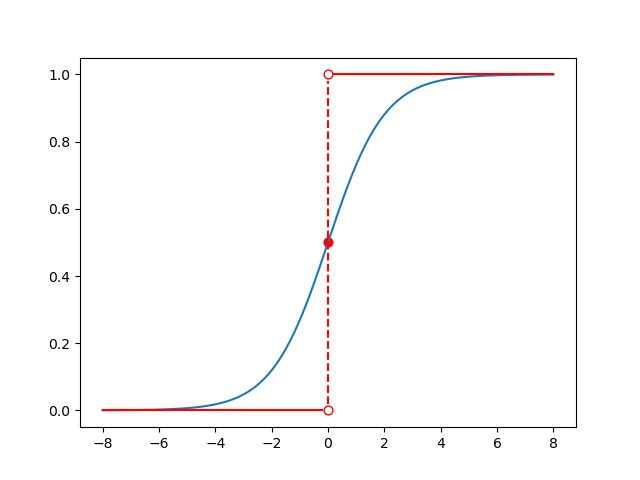

# Smooth Function

[TOC]

## 简介

本篇博客主要是理解汇总苏剑林在 [寻求一个光滑的最大值函数](https://kexue.fm/archives/3290) 和 [函数光滑化杂谈：不可导函数的可导逼近](https://kexue.fm/archives/6620) 中所说的。

## max, argmax 和 hardmax

在逻辑回归中, 取最大值是一个非常常规的操作。`max` 操作是取序列中的最大值, `argmax` 操作是取序列中最大值的索引。

在 PyTorch 中, `torch.max` 函数是可导的, 在最大值处的导数为 `1`, 其它位置的导数是 `0`; `torch.argmax` 函数是不可导的, 可以通过下面一段代码来理解

```python
import torch 

param = torch.nn.Parameter(torch.tensor([1.1, 3.4, 2.5]))
max_value = torch.max(param)
argmax_value = torch.argmax(param)

# torch.max 函数是可导的
print(max_value.requires_grad)  # True
# 只会在最大值处有导数, 其它位置没有导数
max_value.backward()
print(param.grad)  # tensor([0., 1., 0.])


# torch.argmax 函数是不可导的
print(argmax_value.requires_grad)  # False
```

在机器学习中, 往往会使用 ont-hot 的形式来表示向量, `hardmax` 操作就是将类别索引映射成 one-hot 向量, 我们可以定义:

$$
\mathbf{hardmax} \left( \vec{x} \right) = \mathbf{onehot} \left( \mathbf{argmax} \left( \vec{x} \right) \right) \tag{1}
$$

具体举例就是:

+ `max([1.1, 3.4, 2.5]) = 3.4`
+ `argmax([1.1, 3.4, 2.5]) = 2`
+ `hardmax([1.1, 3.4, 2.5]) = [0, 1, 0]`

在 TensorFlow 的额外扩展库中, 有这个函数: [tfa.seq2seq.hardmax](https://tensorflow.google.cn/addons/api_docs/python/tfa/seq2seq/hardmax) , PyTorch 中则没有这个函数。

## 构造 max 函数的光滑近似函数

`max` 函数是可导的, 但不是处处可导的, 如果将 `z = max(x, y)` 画在一个三维空间中, 可以参考 matrix67 的这篇博客的图 [如何构造一个平滑的最大值函数](http://www.matrix67.com/blog/archives/2830) , 会存在一条直线 `x = y`, 在这条直线上不可导。虽然深度学习框架不要求函数处处可导 (比方说 `relu`), 但是能构建一个处处可导的函数肯定是更好的。那么怎么构建呢?

苏剑林在博客 [寻求一个光滑的最大值函数](https://kexue.fm/archives/3290) 中寻找的过程是:

+ 将 $\max$ 函数转化成含有绝对值的函数 $\max_1$
+ 寻找绝对值函数 $f(x) = |x|$ 的光滑近似函数 $f_2(x)$
  + 求绝对值函数的导函数 $f^{\prime}(x)$
  + 用单位阶跃函数来表示这个导函数, 得到 $f_1^{\prime}(x)$
  + 将 [单位阶跃函数的光滑近似函数](https://zh.wikipedia.org/wiki/%E5%8D%95%E4%BD%8D%E9%98%B6%E8%B7%83%E5%87%BD%E6%95%B0) 代入 $f_1^{\prime}(x)$, 得到 $f_2^{\prime}(x)$
  + 将 $f_2^{\prime}(x)$ 用分部积分法求原函数 $f_2(x)$, 这个函数就是绝对值函数 $f(x)$ 的光滑近似函数
+ 将函数 $f_2(x)$ 代入到函数 $\max_1$ 中, 即可以得到 $\max$ 函数的光滑近似函数

最终得到的 $\max$ 函数的标准近似函数是:

$$
\max(x,y)=\lim_{k\to +\infty} \frac{1}{k}\ln(e^{kx}+e^{ky}) \tag{2}
$$

当 $k=1$ 时, 这个近似函数就是 $\mathbf{logsumexp}$ 。

## LogSumExp

[维基百科](https://en.wikipedia.org/wiki/LogSumExp) 上关于 `logsumexp` 的定义是:

> The **LogSumExp** (LSE) (also called **RealSoftMax** or multivariable **softplus**) function is a smooth maximum - a smooth approximation to the maximum function, mainly used by machine learning algorithms. It is defined as the logarithm of the sum of the exponentials of the arguments:
>
> $$
> {\displaystyle \mathrm {LSE} (x_{1}, \dots , x_{n}) = \log \left( \exp(x_{1}) + \cdots + \exp(x_{n}) \right)} \tag{3}
> $$

`logsumexp` 最主要的性质就是其是 `max` 函数的光滑近似函数, 维基百科中给出了其的边界公式:

$$
\displaystyle \max {\{x_{1},\dots ,x_{n}\}}\leq \mathrm {LSE} (x_{1},\dots ,x_{n})\leq \max {\{x_{1},\dots ,x_{n}\}}+\log(n) \tag{4}
$$

也就是说, $\mathbf{LSE}(m, n)$ 和 $\max(m, n)$ 的偏差值不会比 $\log(2) = 0.6931$ 大。如果有 100 个数, `logsumexp` 和 `max` 的差值也不会比 $\log(100)=4.61$ 大。因此可以说, `logsumexp` 是一个非常好的 `max` 函数的光滑近似函数。

## 重新认识指数函数

对于指数运算, 最出名的就是指数爆炸, 这一节我们就来谈一谈指数爆炸的相关问题。

在计算机中, `float64` 是最长用的浮点类型, 由于有指数位的存在, 其最大可以约表示 $1.79\times10^{308}$。虽然可以这么表示, 但是其最大安全整数大约是 $9\times10^{15}$, 超过这个数字后运算就会不稳定了。

在 Python 中, 默认的浮点类型就是 `float64`, 我们可以通过 `sys.float_info.max` 来查看其能表示的最大值。还有一个值是 `sys.float_info.min`, 其表示的是最小的正浮点数 (实际上还能再小一点)。

用计算机进行运算, 不能避免的就是 overflow 和 underflow 的问题:

+ overflow 就是运算结果超出了当前类型所能表示的最大的数, 此时会抛出异常或者返回 `inf` / `-inf`
+ underflow 就是运算结果过于接近 0, 比当前类型所能表示的最小正数还要小, 此时会返回 `0.0`

在 Python 中, 所能表示的最小正数大约是 `3e-324`, 如果是 `1e-324`, 则会被直接判定位 `0.0`, 可以用 `assert 1e-324 == 0.0` 来验证, 这种情况就是 underflow。

需要注意的是, 在这种极限的情况下, 运算是非常不稳定的, 比方说: `3e-324` 会被判定和 `5e-324` 是相等的, 可以用 `assert 3e-324 == 5e-324` 来验证。

一般情况下, 我们的计算是不会出现 overflow 和 underflow 的问题的, 但是指数运算除外:

+ 传入 `max.exp` 函数的最大值可以通过 `math.log(sys.float_info.max)` 来获得, 大约是 `709.78`
+ 传入 `max.exp` 函数的最小值可以通过 `math.log(3e-324)` 来获得, 大约是 `-744.44`

我们可以认定 `math.exp` 函数参数的极限区间大约是 `(-745, 710)`, 超过这个区间会怎么样呢?

+ `math.exp(710)` 会直接报异常错误: `OverflowError: math range error`
+ `math.exp(-745)` 会直接返回 `0.0`

由此可知指数爆炸的恐怖。那指数爆炸有什么好处吗? 有, 那就是可以用来当作分段函数或者 max 函数这样极端函数的光滑近似函数。

为了方面理解, 我们定义一个新的函数, 是 `sumexp`, 就是将一组数分别进行指数运算后求和, 和 `logsumexp` 相比, 没有最终的求对数的运算, 我们进行如下的分析:

+ 假设我们求 `sumexp(10, 12)`:
  + `exp(10)=22026`, `exp(12)=162754`, 经过了指数运算后, 原来仅仅相差 2 的两个数字现在相差了 7 倍多, 差值达到 14 万之多
  + 此时对两个数进行求和, 结果中大部分值都是由 `exp(12)` 贡献的, 占比达到 88% 以上
+ 假设我们求 `sumexp(-12, -10)`:
  + `exp(-10)=5.54e-5`, `exp(-12)=6.14e-6`, 此时两者间的差值是 $3.93\times10^{-5}$, 貌似是一个很小的数, 此时就要看和谁比较了, 如果和 `exp(-12)` 比, 是其的 6.4 倍
  + 如果我们看倍数的话, `exp(-10)` 也是 `exp(-12)` 的 7 倍之多, 此时对两个数进行求和, 结果中绝大部分都是由 `exp(-10)` 贡献的, 占比达到 88% 以上

其实任意相差 2 的两个数字都有类似上面的性质。也就是说, 一组数经过 `sumexp` 运算后, 结果中绝大部分的值都是由这组数中的最大值贡献的。也正是因为此, `logsumexp` 可以作为 `max` 函数的光滑近似函数。由此可见, 指数爆炸真的很恐怖。

## 再看 LogSumExp

上面说了指数运算的 overflow 和 underflow 问题, 是基于 `float64` 的。但是在深度学习中, 我们不需要那么高的精确度 (用 `float64` 运算慢而且效果还不好), 往往只会用 `float32`, 更有甚者, 会使用 `float16`。此时, 指数运算的 overflow 和 underflow 问题会更严重。如果我们用公式 $(3)$ 来计算, 会出现什么问题呢:

+ 如果一组数中有一个数比 710 大, 要不然报错无法计算, 要不然会返回 `inf`
+ 如果一组数中所有的数都比 -745 小, 此时经过指数运算后都是 0.0, 求和后还是 0.0, 计算 `math.log(0.0)` 就会报 `ValueError: math domain error` 的错误 (因为 0 的对数值没有定义)

怎么解决这个问题呢? 这里就要使用下面的 [技巧](https://www.johndcook.com/blog/2010/01/20/how-to-compute-the-soft-maximum/) 公式了:

$$
\log(\exp(x)+\exp(y)) = \log(\exp(x –k) + \exp(y–k) ) + k \tag{5}
$$

这个公式很好证明, 用对数和指数的运算法则笔划一下就可以了。一般情况下, $k$ 的取值就是 $\max(x, y)$, 也就是说:

+ 将一组数都减去这组数的最大值, 那么此时这组数中的最大值就是 `0`, 并且必定有一个数是 `0`
+ 由于进行 `logsumexp` 运算时, 输入数据的最大值是 `0`, 就不会存在 overflow 的问题了
+ 此时依然存在 underflow 的问题, 但是由于输入的一组数中必定有一个数是 `0`, 哪怕其它的数再小, 最终输入 `log` 函数中的值也不可能是 `0.0`, 至少是 `1.0`, 这样运算就没有问题了

这样, 我们就可以得到一个稳定版本的 `logsumexp` 计算方式了, `torch.logsumexp` 就是这样实现的。

很重要的一点是, `logsumexp` 是 convex function (凸函数), 具有性质: 局部最优解就是全局最优解。更多关于 `logsumexp` 的性质, 可以参考博文: [logsumexp运算的几个不等式](https://kexue.fm/archives/9070) 。

## SoftMax

[维基百科](https://en.wikipedia.org/wiki/Softmax_function) 上关于 `softmax` 函数的介绍是:

> This article is about the smooth approximation of **one-hot argmax**. For the smooth approximation of max, see **LogSumExp**.
>
> The **softmax function,** also known as **softargmax** or **normalized exponential function**, converts a vector of K real numbers into a probability distribution of K possible outcomes. It is a generalization of the logistic function to multiple dimensions, and used in multinomial logistic regression. The softmax function is often used as the last activation function of a neural network to normalize the output of a network to a probability distribution over predicted output classes, based on Luce's choice axiom.

上面这段话已经说出了 `softmax` 函数的重要性质:

+ 其计算过程可以用 **normalized exponential function** 来概括, 就是将一组数先进行指数运算, 再用求和的方式归一化
+ 为什么要用 `softmax` 函数, 因为其是 ont-hot argmax 函数的光滑近似函数, 也就是我们上面定义的 `hardmax` 函数的近似函数, 也正是因为此, 其叫 **softargmax** 函数更加合适
+ 其主要作用是用于多标签单分类任务

为什么 `softmax` 是 `hardmax` 函数的近似函数, 其在上面已经说过了, 其分母就是 `sumexp` 运算, `softmax` 求的就是一组数经过指数运算后在 `sumexp` 运算结果中的占比, 肯定是最大值占据了绝大部分的比例。

苏剑林给出数学上的理解是将这一组数减去最大值, 然后再经过 `softmax` 运算, 从上面的思想不难想出结果会和 one-hot 向量相近。

## sigmoid

说到 `softmax` 肯定要说 `sigmoid`。那么 `sigmoid` 函数是谁的光滑近似函数呢? 答案就是之前提及的 单位阶跃函数 (unit step function):

$$
{\displaystyle H(x)=
{\begin{cases}
    0, & x<0 \\
    {\frac{1}{2}}, & x=0 \\
    1, & x>0
\end{cases}}}
\tag{6}
$$

$$
\mathbf{sigmoid}(x) = \frac{1}{1 + e^{-x}} \tag{7}
$$

公式 $(6)$ 是单位阶跃函数, 公式 $(7)$ 是 `sigmoid` 函数, 作图出来的样式是:



观察 `sigmoid`, 我们可以得到: 当 x 的值为 4.6 时, sigmoid 函数的值就已经比 0.99 大了; 当 x 的值为 -4.6 时, sigmoid 函数的值就已经比 0.01 小了。很好地 "光滑" 了分段函数。

对于二分类问题来说, 一般只计算正类的 logits 值, 然后用 `sigmoid` 将正类的 logits 值映射成正类的概率。因此, 当 logits 值大于 0 时, 概率值大于 0.5, 我们认为其属于正类; 当 logits 值小于 0 时, 概率值小于 0.5, 我们认为是负类。

我们可以将 `softmax` 和 `sigmoid` 函数统一起来吗? 答案是可以的:

+ 我们认为负类的 logits 值恒为 0
+ 模型计算出来的 logits 值是正类的 logits 值

此时 `softmax` 和 `sigmoid` 的运算结果就是一致的, 如果设模型计算出来的正类 logits 值是 $s$, 则 `softmax` 计算出来的值就是 `[1-sigmoid(s), sigmoid(s)]`, 这个笔划一下就出来了。

## Accuracy Loss

对于单分类多标签问题来说, 我们设:

+ logits 是一个 `[num_classes, ]` 的张量, 表示每一个类别的分数
+ y_true 是一个 `[num_classes, ]` 的张量, one-hot 形式

如果是 `CrossEntropy`, 计算方式如下:

+ 用 `softmax` 将 logtis 转化成概率, 得到 y_pred
+ 将 y_true 当作真实的概率分布, 将 y_pred 当作预测的概率分布, 计算两者间的交叉熵作为 loss 值

那么怎么用向量化的方式计算 accuracy 呢:

+ 用 `hardmax` 将 logits 转化成概率, 得到 y_pred
+ 将 y_pred 和 y_true 进行点乘, 得到 accuracy (两者都是 one-hot 向量, 预测正确, 则值为 1, 预测错误, 则值为 0)

怎么将上面计算 accuracy 转化成一个光滑的凸函数呢? 很简单, 将 `hardmax` 换成 `softmax` 函数即可。

计算出来后, 我们用 1 - accuracy 就可以作为 `AccuracyLoss` 了。

由于 y_true 是一个 one-hot 函数, `CrossEntropy` 是将目标类所对应的概率值的信息熵作为 loss 值, 而 `AccuracyLoss` 是将所有非目标类的概率之和作为 loss 值, 两者相比, 肯定是 `CrossEntropy` 更加合理。

对于二分类问题来说, 过程是类似的:

+ 我们设二分类的 logits 值为 $[0, s]$, 其中 $s$ 表示的是模型计算出来的正类 logits
+ 此时用 `softmax` 计算出来的预测向量就是: $[1-\mathbf{sigmoid}(s), \mathbf{sigmoid(s)}]$
+ y_true 是 one-hot 向量, 我们用 $[1-t, t]$ 来表示, 如果是正类, t 的值为 1, 否则为 0
+ `AccuracyLoss` 可以表示为 $(1-t) \times (1-\mathbf{sigmoid}(s)) + t \times \mathbf{sigmoid}(s)$
+ 这个形式其实和 `BinaryCrossEntropy` 的形式很相近

注意对于多标签多分类来说, 一般计算 accuracy 要求一个样本中所有的类别都预测正确才算正确, 有一个错误都不行。但是这种计算 accuracy 的方式无法用向量运算来表示, 因此也无法去寻找其 "光滑" 地表示。

## Precision, Recall & F1 Score Loss

我们可以将 true positive, false positive 和 false negative 用向量计算的形式来表示:

+ 继续用上面二分类的符号
+ true positive 的光滑表示为: $\mathbf{sigmoid}(s) \times t$
+ false positive 的光滑表示为: $\mathbf{sigmoid}(s) \times (1-t)$
+ false negative 的光滑表示为: $(1 - \mathbf{sigmoid}(s)) \times t$

然后计算一个 batch 中的这些指标, 再去计算 precision, recall 和 f1 score。需要注意的是这里和其它 loss (包括之前所说的 accuracy loss) 不一样, 不是计算每一个样本的 loss, 再去求平均, 而是对于 tp, fp, fn 在样本上求和, 再根据这些指标直接计算精确率, 召回率和 F1 分数, 公式如下: (很好推理的)

$$
\mathbf{precision} = \frac{\sum_{batch} [\mathbf{sigmoid}(s) \times t]}{\sum_{batch} [\mathbf{sigmoid}(s)]} \tag{7}
$$

$$
\mathbf{recall} = \frac{\sum_{batch} [\mathbf{sigmoid}(s) \times t]}{\sum_{batch} [t]} \tag{8}
$$

$$
\mathbf{F1 \enspace Score} = \frac
{2 \times \sum_{batch} [\mathbf{sigmoid}(s) \times t]}
{\sum_{batch} [t] + \sum_{batch} [\mathbf{sigmoid}(s)]}
\tag{9}
$$

需要注意的是在更多情况下, 计算 P, R 和 F1 时, 是 "正类" 的类别有多个, "负类" 的类别只有一个, 此时的运算无法用向量运算来表示, 也就很难去寻找其的光滑函数了。另一方面, 建议模型训练好后用 f1 score 这样的指标作为 loss 值, 不要一上来就用他们, 否则效果会很不好。

另一个需要注意的是如果用 F1 score 作为 loss 的话, 可能不能使用梯度累积了, 因为梯度累积是建立在每一个样本的 loss 可单独计算的基础上。另外, 使用 F1 score 时显存应尽可能地大, 因为每一次计算的是一个 batch 中的 F1 Score, 如果 batch 过小, 可能会有很大地影响, 此时对显存要求较高。
