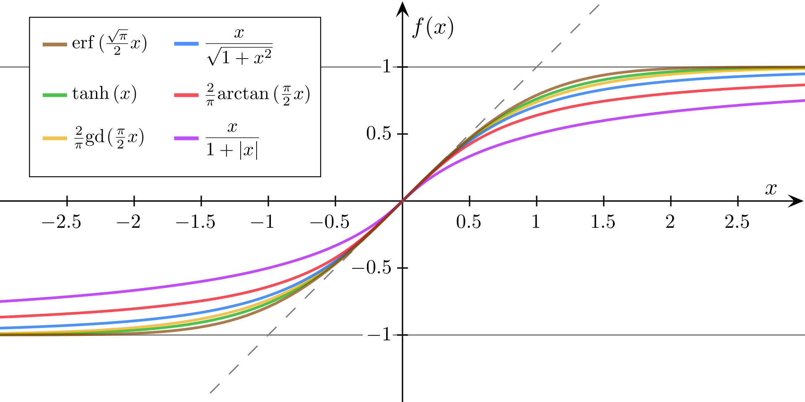
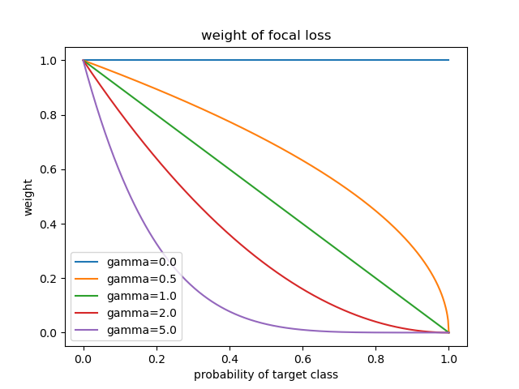

# Loss

[TOC]

## 术语统一

在机器学习中, 分类问题可以分成两大类:

+ [multi-label classification](https://en.wikipedia.org/wiki/Multi-label_classification): 一个样本可以没有, 有一个或者多个标签
+ [multi-class classification](https://en.wikipedia.org/wiki/Multiclass_classification): 一个样本只能有一个标签

在本系列博客中, 会将前者称为 **多标签分类**, 后者称为 **多分类**。对于多分类来说, 如果标签数只有两个, 那么就是 **二分类** ([Binary classification](https://en.wikipedia.org/wiki/Binary_classification)) 问题。

对于二分类问题, 很多情况下对于类别的范式是:

+ 正类 (positive class): 样本拥有某种特性, 或者是属于某一类 (在 class-imbalanced 问题中, 一般情况下是样本数量较少的类别)
+ 负类 (negative class): 样本没有某种特性, 或者是不属于某一类 (在 class-imbalanced 问题中, 一般情况下是样本数量较多的类别)

在目前的深度神经网络中, 通常解决多标签分类问题的方式是采用上面所说的二分类问题范式, 此时问题就变成了多个二分类问题。因此, 在本系列博客中, 对于分类任务, 只有两种类型:

+ 二分类问题 (包含多标签分类问题), 通常解决问题的方式是逻辑回归, 对应 PyTorch 中的 `BCEWithLogitsLoss` 和 `BCELoss`
+ 多分类问题, 通常解决问题的方式是 softmax 回归, 对应 PyTorch 中的 `CrossEntropyLoss` 和 `NLLLoss`

在很多问题中, 会出现样本类别分布不均衡的情况, 即某一类的样本数量远远大于其它类, 这时候的分类问题被称为 class-imbalanced 或者 imbalanced classification。

对于二分类问题, 经典的解决办法是 **逻辑回归** (logistic regression), 使用的是 [sigmoid](https://en.wikipedia.org/wiki/Sigmoid_function) 函数:

$$
\mathbf{sigmoid} \left( x \right) = \frac{e^x}{e^x + 1} = \frac{1}{1 + e^{-x}} \tag{1}
$$

从更广义的方面来说, sigmoid 函数泛指的是所有 "S" 形状的函数, 可以参考下面 [维基百科中的图片](https://en.wikipedia.org/wiki/Sigmoid_function#/media/File:Gjl-t(x).svg) :

而公式 $(1)$ 实际上是 [logistic function](https://en.wikipedia.org/wiki/Logistic_function) 的一种特殊情况。本系列博客后续所说的 sigmoid 函数均指的是公式 $(1)$ 。

另一个容易混淆的概念是 logits, 在统计学中, [logit](https://en.wikipedia.org/wiki/Logit) 函数通常指 sigmoid 函数的倒数。然而, 在 TensorFlow 和 PyTorch 中, logits 通常指的是模型输出类别的分数, 谷歌给出的 [定义](https://developers.google.cn/machine-learning/glossary?hl=en#logits) 如下:

> The vector of raw (non-normalized) predictions that a classification model generates, which is ordinarily then passed to a normalization function. If the model is solving a multi-class classification problem, logits typically become an input to the softmax function. The softmax function then generates a vector of (normalized) probabilities with one value for each possible class.

在本系列博客中, 后续所说的 logits 和上面谷歌的定义保持一致。logits 值有时也会被称为是 "分数"。

对于多分类问题来说, 经典的解决办法是 softmax regression, 其更加学术化的名字应该是 [multinomial logistic regression](https://en.wikipedia.org/wiki/Multinomial_logistic_regression), 本系列后续的博客都会使用 softmax regression 这个名字, 其更加通俗易懂。

对于分类模型来说, 后续的博客会使用如下的表述:

+ 目标类: 样本实际所属的类别
+ 非目标类: 样本实际不属于的类别
+ 目标概率分布: 样本实际的概率分布, 一般都是 one-hot 的形式, 目标类是 1, 非目标类都是 0
+ 预测类: 模型预测样本所属的类别
+ 非预测类: 模型预测样本不属于的类别
+ 预测概率分布: 模型输出的 logits 值经过 softmax 函数归一化后得到的概率分布

## Softmax Regression

+ 如果有 $m$ 个类别, 那么就有 $m$ 个线性函数, 每一个线性函数的输入都是样本的特征向量, 输出的是对应类别的 logits 值
+ 在预测阶段, 我们认定 logits 值最大的类别就是 预测类, 其它类别是 非预测类, 此时我们可以用 `onehot argmax` 函数获取预测的概率分布
+ 如果用 `onehot argmax` 函数来获取预测的概率分布, 有以下的问题:
  + 没有办法计算各个类别的 "信息量", 因为 `log(0)` 没有定义
  + 不是一个光滑可导的函数, 如果求梯度的话, 只有 预测类 有梯度, 非预测类都没有梯度
+ 解决上述问题的方式是寻找 `onehot argmax` 函数的光滑近似函数, 答案是 `softmax` 函数, 因此我们用 `softmax` 函数来获取预测的概率分布
+ 在训练阶段, 我们用 "信息量" 作为样本每一个类别的 "损失值"
+ 我们用 目标概率分布 来计算 预测概率分布"信息量" 的期望, 作为最终的样本 "损失值", 这个值也被称为是 "交叉熵"
+ 上述过程也可以描述为: 目标概率分布向量 和 预测概率分布"信息量"向量 点乘的结果作为最终样本的 "损失值"
+ 由于目标概率分布是 one-hot 向量, 样本的 "损失值" 也可以描述为: 目标类的预测概率对应的 "信息量"
+ 在一个 batch 中, 我们将所有样本的 "损失值" 求和 或者 求平均, 得到这个 batch 的最终 "损失值", 然后反向传播计算梯度, 再更新参数

苏剑林大神给出的另一种理解是:

我们设分类问题的类别数是 $n$, 目标类的索引值是 $t$ (也就是说, $t \in \{1,2,\dots,n\}$) 每一个类别的 logits 值为 $s$, 那么交叉熵的样本损失函数如下:

$$
loss = -\log \frac{\exp(s_t)}{\sum\limits_{i=1}^n \exp(s_i)}
= -\log \frac{1}{\sum\limits_{i=1}^n \exp(s_i-s_t)}
= \log \sum\limits_{i=1}^n \exp(s_i-s_t)
\approx \max \{ s_1-s_t, \cdots,  s_n-s_t\}
\tag{2}
$$

从另一个角度来说, 交叉熵损失函数可以理解为:

+ 先求所有类别 logits 值和目标类 logits 值之间的差值, 再对求出的差值进行 `logsumexp` 运算
+ `logsumexp` 函数是 `max` 函数的光滑近似函数
+ 差值中肯定有一项恒为 0, 即目标类自己减去自己的那一项
+ 我们要最小化损失函数, 而损失函数是 `max` 函数, 且其中有一项恒为 0, 那么我们期待的就是 `max` 函数中其它项都小于 0, 这样损失函数就可以取到最小值 0 了
+ 差值小于 0 的另一种理解: 非目标类的 logits 值小于目标类的 logits 值

总结一下, softmax 回归期待的是非目标类的 logits 值比目标类的 logits 值小。

## Logistic Regression

如果理解了 softmax 回归, 逻辑回归就很容易理解了。观察 `sigmoid` 和 `softmax` 函数, 不难发现:

+ 其规定了 "负类" 的 logits 值恒为 0
+ 此时我们只需要一个线性打分函数, 为 "正类" 进行打分, 计算出来 "正类" 的 logits 值即可

也就是说, 逻辑回归学习的是正类 logits 值和 0 的大小关系, 比 0 大就是正类, 反之就是负类

从这里可以看出, 很多人所说的根据 "置信度" (`sigmoid` 函数输出的 "正类" 的概率值) 进行筛选其实并不可靠, 因为在定义问题时, 就没有这一概念。如果你是为了提高 precision/recall 值的话, 可以选择 "置信度" 大于/小于 0.5; 但是实际情况是, 通过 `sigmoid` 出来的概率值并不可靠, 直接将 "正类" 的 logits 值和 0 比大小即可。

## 多标签分类 与 class-imbalanced

这部分的理解主要是来自: [将“softmax+交叉熵”推广到多标签分类问题](https://kexue.fm/archives/7359), 首先确保已经理解公式 $(2)$

引言: 如果类别有 10 类, 假设每一类的样本数量分布是 10%, 此时对于多分类问题来说, 没有 class-imbalanced 的问题。但是对于多标签分类问题来说, 就有问题了, 因为对于每一个二分类任务来说, 10% 是 "正类", 90% 是 "负类"。

那么问题来了, 在这种情况下, 为什么多分类问题没有 class-imbalanced 的问题呢? 原因在公式 $(2)$ 中, 其倾向于将非目标类和目标类之间 logits 差值最大的作为损失值, 综合考虑了每一个非目标类和目标类之间 logits 的差值 (可以参考原博客评论的第六层)。而对于多标签分类来说, 不同类别之间是相互独立的二分类任务, 都是 "负类" 数量是 "正类" 数量的几倍多, 没有办法综合来考虑, 效果自然不好。

这时候怎么办呢? 一般的答案是 "调参", 调整每一个任务的权重值, 苏剑林大神根据 circle loss 给出了一种减少调参的方式:

+ 和逻辑回归一样, 我们依然需要计算每一个类别的 logits 值
+ 对于多标签分类来说, 目标类有多个, 我们设 $T$ 是样本的目标类集合, $T^c$ 是样本的非目标类集合, 很显然, 两个集合是互斥的
+ 我们期待:
  + a. 目标类的 logits 值比非目标类的 logits 值大
  + b. 同时目标类的 logits 值比 0 大
  + c. 非目标类的 logits 值比 0 小
+ 最后再用 `logsumexp` 函数自动去平衡各个部分

此时的公式为: ($i$ 表示 $T$ 集合中的类别, $j$ 表示 $T^c$ 集合中的类别)

$$
loss = \log \left(
\exp(0) +
\sum\limits_{i\in T, j\in T^c} \exp(s_j-s_i) +
\sum\limits_{i\in T} \exp(0-s_i) +
\sum\limits_{j\in T^c} \exp(s_j-0)
\right)
\tag{3}
$$

简单解释一下, 公式 $(3)$ 中的 loss 由四部分组成:

+ $0$ 是一个固定的数, 由于是最小化 loss 函数, 而 `logsumexp` 函数是 `max` 函数的光滑近似函数, 在其中加入 $0$ 表示我们希望 loss 函数的最小值为 0, 不要比这个再小了; 同时也表示我们期待 `logsumexp` 函数中的其它项小于 $0$
+ $s_j-s_i$ 表示非目标类的 logits 值和目标类的 logits 值之间的差值, 我们期待其值小于 $0$, 也就是说 $s_i > s_j$, 对应上面的 "期待 a"
+ 同理, $0-s_i$ 表示目标类的 logits 值大于 $0$, 对应上面的 "期待 b"
+ 同理, $s_j-0$ 表示非目标类的 logits 值小于 $0$, 对应上面的 "期待 c"

最后用 `logsumexp` 函数自动去平衡各项值 (倾向于寻找值最大的部分), 作为最终的损失值。公式 $(3)$ 经过化简得到:

$$
loss = \log \left(1 + \sum\limits_{i\in T} \exp(-s_i)\right) + \log \left(1 + \sum\limits_{j\in T^c} \exp(s_j)\right)
\tag{4}
$$

根据上面所说, 在预测阶段, logits 大于 0 的类为目标类, logits 小于 0 的类为非目标类。

最后要申明的是: 这里所说的 loss 解决的问题是: 类别均衡的 "多标签" 分类任务转换成多个 "二分类" 任务时造成的类别不均衡问题。如果 "多标签" 分类任务本身就是类别不均衡的, 比方说 10 类中有一类是的样本占比是 1%, 其它类的占比是 11%, 那么其也很难保证占比少的得到充分的训练。

另外需要说明的是, 不要产生 softmax 回归比逻辑回归好的想法。对于二分类问题来说, 逻辑回归和 softmax 回归的数学形式是一样的, 没有太大区别。这里探讨的仅仅是任务本身造成的类别不均衡的问题, 如果说 10 类中每一类的样本占比都接近 50% (多标签分类任务每一类的样本占比是随意的), 那么直接用逻辑回归的效果也是不会差的。

## Focal Loss

何凯明大神在 2017 年提出了 focal loss, 其核心思想是解决 "难" 样本分类任务。什么是 "难" 样本呢?

在 CV 领域, 很多数据集会自己定义难样本测试集, 其中包含的图片往往是模糊的, 或者目标物很小的。这里所说的难样本是针对特定样本的。

focal loss 中所说的难样本和上面不一样, 其是针对 "预测概率" 来说的。

在分类任务中, 我们肯定是希望目标类的 logits 值比非目标类的 logits 值大, 并且是越大越好。这里就是使用 `softmax` 归一化后的概率来判断难易样本 (也就是通常所说的 "置信度" ~你前面不是刚刚说过这个东西不靠谱的吗~):

我们认为如果目标类的预测概率越大, 那么其越 "容易"。比方说, 如果目标类的预测概率大于 0.8, 那么这个样本就是非常 "容易" 的样本; 如果目标类的预测概率小于 0.2, 那么这个样本就是 非常 "难" 的样本。

对于难样本, 我们希望其 loss 应该尽可能地大, 对于容易的样本, 我们希望其 loss 应该尽可能地小。也就是说, 我们需要一个权重函数, 这个权重函数是一个关于概率的减函数: 概率越大, 权重越低; 概率越小, 权重越高。何凯明大神给出的权重函数是:

$$
weight(p) = (1 − p) ^ \gamma
\tag{5}
$$

在公式 $(5)$ 中, $p$ 是概率值, 取值范围是在 0 到 1 之间, $\gamma$ 是一个超参数, 取值大于 0 即可。很容易分析得到, $weight(p)$ 的取值范围在 1 到 0 之间, 是一个单调减函数, 具体的可以参考下图:

观察上图不难发现, gamma 值越大, 权重函数在 0 到 0.5 的区间内下降的越快, 对于难样本的惩罚度越高; gamma 值越小, 权重函数在 0 到 0.5 的区间内下降的越慢, 对于难样本的惩罚度越低。如果 gamma 值为 0, 就和原本的 loss 函数没有区别了。

上面说了, softmax 回归的 loss 值是: 目标类的预测概率对应的 "信息量"。focal loss 就是在原本的 loss 之前加上了一个权重函数, 这个权重函数是一个关于目标类预测概率的减函数, 统一起来就是:

$$
loss = −(1 − p_t) ^ \gamma \log(p_t)
\tag{6}
$$

其中 $p_t$ 是目标类的预测概率, $\gamma$ 是调节因子。

focal loss 是根据目标类的预测概率来定义样本的难易程度, 也就是说这里的 "难" 与 "易" 是相对的, 会随着训练过程变化而变化。其也可以解决类别不均衡的问题, 因为类别少的在训练过程中基本都属于难样本, 何凯明大神在原论文中就是使用其解决类别不均衡的问题。

不过使用 focal loss 函数需要 "精密" 的调参。在原论文中, 其任务是二分类问题, 正类的数量远远多于负类的数量, 设置的参数有两部分:

+ focal loss 部分: $\gamma=2$
+ 正类的固定权重值是 0.25, 负类的固定权重值是 0.75

"正类" 的数量少结果其固定权重值还高? 对, 就是这样的, 很反直觉。这说明了 focal loss 的权重调节能力非常强, 由于 "正类" 样本过少, 基本都会被当作难样本, 导致了 "负类" 样本在最终 loss 中基本没有占比了。怎么办呢? 用固定的权重值来提高 "负类" 样本在最终 loss 中的占比。由此可见, focal loss 效果好是建立在大量调参的基础上的。

## L2 regularization & Label Smoothing

regularization 往往会被翻译成 "正则化", 但是通过这个名字是无法理解其含义的。想要更好地理解这个概念, 请参考 [维基百科](https://en.wikipedia.org/wiki/Regularization_(mathematics)), 其涉及到统计学的 "参数估计" 和 "模型泛化" 部分。

用一句话概括就是 regularization 使模型变得更加 "简单", 防止过拟合。

更具体一点的说法是, 模型的损失值可以分成 bias error 和 variance error 两部分。bias error 高表示模型本身的拟合能力差, variance error 高表示模型本身的拟合能力强 (将 noise 也拟合进去了), 其分别对应 underfitting 和 overfitting。regularation 做的事情是减少模型的 variance error 增加 bias error。这种方式也被称为 [bias–variance tradeoff](https://en.wikipedia.org/wiki/Bias%E2%80%93variance_tradeoff) 。想要更加深入的了解这些内容, 可以去了解 bias-variance decomposition, [mlxtend](https://github.com/rasbt/mlxtend) 库中有相关的实现: [code](https://github.com/rasbt/mlxtend/blob/master/mlxtend/evaluate/bias_variance_decomp.py) 。

通常的 regularization 包括: L2 regularization, dropout, label smoothing 等等, 具体可以参考: [文章](https://theaisummer.com/regularization/) 。

这里要说的是和 loss 相关的两种 regularization, 分别是 L2 regularization 和 Label Smoothing。

L2 regularization 也被称为 weight decay 和 ridge regression。其将网络中的每一个参数的平方值也作为 loss 中的一部分 (相加关系), 公式化的表示方法是:

$$
L2regularization = \frac{\lambda}{2} w^2
\tag{7}
$$

$w$ 是模型的参数值, $\lambda$ 是超参数, 取值大于 0 即可, 用以调控 L2 regularization 的程度, 一般取值会比 0.001 小。公式 $(7)$ 求导后就是 $\lambda \cdot w$ 。需要注意的是, 其对于模型中每一个参数都是独立的, 因此在 PyTorch 中, loss 层不会去计算这个值, 而是在 "更新参数" 时直接更新。公式中的 $\lambda$ 对应 `Optimizer` 中的 `weight_decay` 参数。

另一个需要说明的是, 通常只会对线性方程中的 `weight` 参数进行 L2 regularization, 不会对 `bias` 参数进行 L2 Regularation。PyTorch 中默认是对所有参数进行 L2 regularization, 如果要改回去, 需要对模型的参数分组。

L2 regularization 的目的是希望模型参数值尽可能地小。一般认为, 模型的参数值越大越容易过拟合, 更多的解释参考 [知乎](https://www.zhihu.com/question/389848505) 。

Label Smoothing 是谷歌在 2015 年的论文 [Rethinking the Inception Architecture for Computer Vision](https://arxiv.org/pdf/1512.00567.pdf) 中提出的。我们知道对于样本来说, 我们标定的类别并不一定正确, 错误的标定类别我们称为 noise, 而模型过拟合的原因就是对 noise 也进行了建模。换句话说, 过分相信标定数据是造成过拟合的原因之一。那么怎么办呢? 谷歌给出的办法是修改目标概率分布:

+ 目标类的概率由 1 变成 $1 - \epsilon + \frac{\epsilon}{n}$
+ 非目标类的概率由 0 变成 $\frac{\epsilon}{n}$

其中 $n$ 是类别数, $\epsilon$ 是超参数, 值在 0 到 1 之间。如果值是 0, 那么和原来的没有区别。如果值是 1, 目标类和非目标类的概率就相等了。在原论文中, $n=1000$ 并且 $\epsilon = 0.1$; 也就是说, 目标类的概率是 0.9001, 非目标类的概率是 0.0001。在 PyTorch 中, `CrossEntropyLoss` 中有实现, 其中 `label_smoothing` 参数对应 $\epsilon$ 超参数; 在 `BCEWithLogitsLoss` 中, 可以通过修改 `target` 参数值间接实现。

## PyTorch 中的基础 Loss 类

在 PyTorch 中, 关于分类的基础类有两个: `CrossEntropyLoss` 和 `BCEWithLogitsLoss`, 这里详细说一下这两个类。

`BCE` 的含义是 binary cross entropy, 因此 `CrossEntropyLoss` 是针对多分类任务的, `BCEWithLogitsLoss` 是针对二分类任务的。

`CrossEntropy` 的 `forward` 参数:

+ `input`: 模型出来每一类的 logits 值 (不需要经过 `softmax` 函数计算概率值)
  + 其 shape 是 `[batch_size, num_classes, other_dims, ...]`, 其中只有 `num_classes` 维度是必须的
  + 一个 batch 中的样本数不是 `batch_size`, 而是 `batch_size * other_dims * ...`
  + 注意: `num_classes` 只能在第 1 维或者第 0 维, 不是在最后一维
+ `target`: 每一个样本的目标类索引值, (类型是 `LongTensor`, 不是 `FloatTensor`)
  + 其 shape 是 `[batch_size, other_dims, ...]`, 必须和 `input` 中保持一致
  + 注意: 如果 `input` 的 shape 是 `[num_classes, ]`, 那么 `target` 应该是没有维度的, 也就是一个标量
+ 返回值是一个张量, 如果 `reduction` 不是 `none`, 返回的就是一个标量 (没有维度); 如果 `reduction` 是 `none`, 返回张量的维度和 `target` 是一致的

`CrossEntropy` 初始化参数:

+ `weight` 是一个张量, 其 shape 是 `[num_classes, ]`, 表示每一类的权重值, 默认是 `None`
+ `ignore_index` 是一个整形, 如果样本的目标类是 `ignore_index`, 那么这个样本不参与到最终的 loss 计算, 默认 `-100`
+ `reduction` 是求 batch loss 的方式, 其值有三种形式, 默认是 `mean`
  + `mean`: 对所有样本的 loss 值求加权平均数, 每一个样本的权重值就是 目标类在 `weight` 张量中的权重值, 没有就是 1
  + `sum`: 将所有样本的 loss 值求和
  + `none`: 直接返回所有的样本 loss
+ `label_smoothing` 参数上面已经说过了, 是一个浮点数, 值在 0 到 1 之间, 默认 `0.0`, 也就是不使用
+ `size_average`, `reduce` 已经被弃用

`BCEWithLogitsLoss` 的 `forward` 参数:

+ `input`: 模型出来的每一个样本 "正类" 的 logits 值 (不需要用 `sigmoid` 函数计算 "正类" 概率值)
  + 其 shape 是任意的, 可以表示为 `[other_dims, ...]`
  + 一个 batch 中的样本数是 `other_dims * ...`
+ `target`: 每一个样本 "正类" 的概率值 (是 `FloatTensor`, 不是 `LongTensor`)
  + 其 shape 和 `input` 保持一样即可
  + 一般情况下, "正类" 的概率值是 1, "负类" 的概率值是 0, 但不绝对, 比方说上面的 label smoothing
+ 返回的是一个张量, 如果 `reduction` 不是 `none`, 返回的就是一个标量 (没有维度); 如果 `reduction` 是 `none`, 返回张量的维度和 `input` 以及 `target` 是一致的

`BCEWithLogitsLoss` 初始化参数:

+ `weight` 是一个张量, 其 shape 只要能和 `input` 张量进行 element-wise 运算即可, 默认是 `None`
  + 注意: 这里的 `weight` 和 `CrossEntropy` 中的 `weight` 含义不一样
  + 这里的 `weight` 可以理解成不同 "任务" 的权重值, 而 `CrossEntropy` 中的 `weight` 是不同 "类别" 的权重
+ `pos_weight` 是一个张量, 其 shape 只要能和 `input` 张量进行 element-wise 运算即可, 默认是 `None`
  + 这里 `weight` 的含义是 "正类" 的权重值, 和 `CrossEntropy` 中的 `weight` 是一样的
  + 和逻辑回归相似, 这里将 "负类" 的权重值定死了, 是 1
  + 在 balanced cross entropy 中, 如果 "正类" 的权重是 $\alpha$, 那么 "负类" 的权重是 $1 - \alpha$, 和 PyTorch 中的做法是不一致的
+ `reduction` 和 `CrossEntropy` 中的是一致的, 需要注意的是, 这里的 `mean` 不再是加权平均数了, 只是平均数, 因为 PyTorch 中将 "负类" 的权重定死为 1
+ `size_average`, `reduce` 已经被弃用

## References

+ [如何训练你的准确率？](https://kexue.fm/archives/9098)
+ [BCEWithLogitsLoss](https://pytorch.org/docs/stable/generated/torch.nn.BCEWithLogitsLoss.html)
+ [CrossEntropyLoss](https://pytorch.org/docs/stable/generated/torch.nn.CrossEntropyLoss.html)
