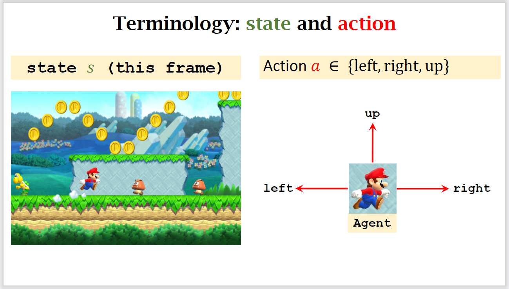

# 强化学习系列 (一) 基础概念

[TOC]

## 任务描述

强化学习 (reinforcement learning) 是解决 **控制任务 (control task)** 或者说 **决策问题 (decision problem)** 的一种框架。强化学习常常用于 游戏 AI 的开发, 机械臂和机器人的控制, 汽车自动驾驶技术等等。

在强化学习中, 我们将我们开发的程序称为 **agent 程序**。agent 的含义是 代理人, 这里采用了拟人化的方式, 表示程序代替人进行控制和操作。因此很多人会将 agent 翻译成 **智能体**, 或者 **AI 程序**, 本文后面统一用 **agent** 表示。

我们将 agent 控制和操作的对象称为 **环境 (environment)**。在游戏 AI 中, **环境** 指的是游戏程序; 在汽车自动驾驶中, **环境** 指的是实际的交通路况。

现在, 可以这样描述强化学习的任务: 我们需要开发一个 **agent** 程序, 代替人, 对 **环境** 程序进行操作或者控制。

除此之外, 强化学习还对 agent 程序和 环境程序 之间的 **交互方式** 有明确的定义。我们将 agent 程序对于 环境程序 的操作称为 **action**, 环境程序 的状态称为 **state**。举例来说, 对于 超级马里奥 这款游戏来说, 我们可能的 action 有: 前进, 后退 和 向上跳, 而 state 就是当前游戏的截图。



整个交互流程如下:

1. agent 程序从 环境程序 中获取初始 state, 记作 $s_0$
2. agent 程序根据 $s_0$, 进行判断, 选取合适的 action, 记作 $a_0$, 传给 环境程序
3. 环境程序 根据 $a_0$, 生成新的 $s_1$, 返回给 agent 程序
4. 反复进行第二步和第三步的操作, 直到环境程序返回给 agent 程序的状态 $s$ 是最终状态

为了达成上述的交互流程, 在开发 agent 程序前, 我们往往要对 环境 进行封装, 以确保能和 agent 程序进行交互。幸运的是, [OpenAI](https://openai.com/) 开源了 [gym](https://github.com/openai/gym) 库, 帮助我们封装好了一些游戏的环境程序。后来, 这个项目交给了 [The Farama Foundation](farama.org) 手上, 项目名变成了 [Gymnasium](https://github.com/Farama-Foundation/Gymnasium) 。

下面的代码就是一个简单的 agent 程序:

```python
import gymnasium as gym
from gymnasium import Env
import matplotlib.pyplot as plt

# env 是 `环境程序`
# 关于 frozen lake 相关的内容可以参考: https://gymnasium.farama.org/environments/toy_text/frozen_lake/ 
env_program: Env = gym.make(
    "FrozenLake-v1", 
    map_name="4x4", is_slippery=False, render_mode="rgb_array"
)


def show_ui():
    plt.imshow(env_program.render())
    plt.show()


def policy(state_id):
    return env_program.action_space.sample()


# 获得初始的 state 状态
state_id, _ = env_program.reset()
show_ui()

while True:
    # policy: 根据 state 状态选取 action 
    action_id = policy(state_id)

    # 将 action 转给 环境程序, 获得 下一个 state 状态
    state_id, _, terminated, truncated, _ = env_program.step(action_id)
    show_ui()

    # If terminated or truncated finish the episode
    if terminated or truncated:
        break
```

我们将从头到尾的整个流程称为一个 episodic, 也就是一局游戏是一个 episodic。假设一个 episodic 有 $t$ 步, 那么 $s_t$ 就是终止状态, 没有 $a_t$。但是从 $0$ 到 $t-1$ 时刻都有 state 和 action。现在, 一个 episodic 可以用一个 state 和 action 二元组构成的序列来表示, 我们将这个序列称为 trajectory, 用字母 $\tau$ 表示。

对于某些问题, 比方说 自动驾驶程序 和 自动炒股程序, 它们的流程是没有终点的, 或者说终点不是由 环境程序 决定的, 这类任务被称为 continuing task。相反, 终点由环境程序决定的任务被称为 episodic task。

对于某些问题, 比方说迷宫游戏, state 集合是有限的, 这类问题可以用传统的算法 (比方说, 深度优先搜索) 解决, 也可以用强化学习的方式解决。但是对于更多的问题来说, state 集合非常的大, 甚至是无限的, 比方说棋类游戏, 超级玛丽等等, 此时就是深度强化学习的主场了。

除了 state 集合可以是无限的, action 集合也可能是无限的, 比方说对于自动驾驶程序来说, 方向盘转的角度是是一个连续的 action, 此时的问题就会非常复杂。

另外, 更准确地说, state 表示的是全局状态。这对于迷宫类和棋类任务来说没有问题, 但是对于像超级玛丽或者自动驾驶这样的任务, 是无法获得全局的状态, 此时我们将获得到的局部状态称为 observation。后面为了方便, observation 和 state 统称为 state。

除此之外, 像英雄联盟这样的游戏, 我们可能需要多个 agent, 每一个 agent 操作一个英雄。这类问题被称为 multi-agents 问题。

最后说明一下什么是 policy。观察上面的代码, 我们发现有一个函数就是 policy。这个函数是 agent 程序的大脑, 其主要的功能是根据 state 输出下一步要操作的 action。目前的做法是随机输出一个 action, 并没有根据 state 进行判断。在后面的教程中, 主要就是要说明如何设计 policy 函数, 让其可以根据 state 选取对应的 action。

仔细观察代码, 不难发现, 在 agent 程序中, 不同算法对应的 policy 函数是不同的, 其它的代码是不需要修改的, 因此 policy 是我们的主要研究对象。我们用字母 $\pi$ 表示 policy。

这一部分说明了很多概念, 需要记住的有: agent, environment, state, action, policy $\pi$, episodic 和 trajectory $\tau$ 。

## 评估方式: "奖励"

我们定义完成上面的内容后, 一个很自然的问题是如何评价一个 **路径 (trajectory)** 的好坏呢?

在强化学习中, 我们对于 环境程序 有一个额外的要求, 那就是每一步除了返回新的 state 外, 还需要返回一个 **reward** 奖励值, 用来评估这一步的好坏。

需要强调的是, 我们在开发 agent 程序时, 可以用 reward 来训练和评价模型, 但是在实际推理时, 不能使用 reward 值来辅助决策, 只能使用 state 值。

我们将一个 路径 中每一步的 reward 值加起来, 称为 total reward, 用 $R$ 表示。强化学习的目标就是 agent 程序根据每一步的 state 决定 action, 最终得到的路径 $R$ 值尽可能地大。这里面包含一个假设, 那就是最大 $R$ 值路径就是我们想要的路径。这个假设被称为 reward 假设。

我们定义, 在 $t$ 时刻的 return (回报) 值等于从 $t$ 时刻开始到 $T$ 时刻结束, 每一步的 reward 值之和, 即:

$$
U_t = r_t + r_{t+1} + r_{t+2} + \cdots + r_{T}
$$

由于 return 是计算未来所有的 reward 和, 因此也被称为 cumulative future reward。agent 在每一步决策时, 会尽量选择 $U_t$ 最大的路径。

更具体地说, agent 在 $t$ 步进行决策时, 可以用到 $0$ 到 $t$ 时刻所有的 state 状态, 并期望可以找到从 $t$ 到 $T$ 时刻 reward 和最大的路径。

当然, 你可能会产生疑问, 我们要的不应该是全局最优路径吗? 这里为什么变成局部最优路径了呢? 这就和 reward 函数的设计方式有关了。

在字母表示方面, state 和 action 在初始 $0$ 时刻有值, 在结束 $T$ 时刻没有值 ($s_T$ 是终止状态, 我们不关注)。而 reward 在初始 $0$ 时刻没有值, 但是结束的 $T$ 时刻是有值的。(环境程序根据 $a_0$ 返回 $s_1$ 给 agent 程序, 同时生成 $r_1$)

## Reference

+ [HuggingFace Deep RL Course](https://huggingface.co/learn/deep-rl-course/unit1/introduction)
+ [李宏毅 Deep Reinforcement Learning, 2018](https://www.youtube.com/playlist?list=PLJV_el3uVTsODxQFgzMzPLa16h6B8kWM_)
+ [王树森 Deep Reinforcement Learning](https://github.com/wangshusen/DRL)
