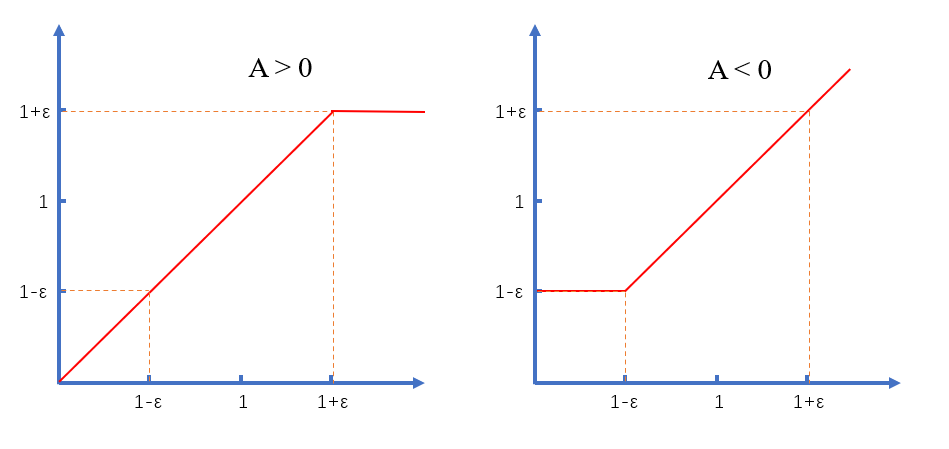

# 强化学习系列 (二) 策略梯度

[TOC]

## 简介

我们将一个 episodic 中的 **路径** 用 $\tau$ 表示, 一共有 $T$ 步, $t$ 表示具体的每一步。$s$ 表示 state 状态, $a$ 表示 action 操作。

我们设模型的参数为 $\theta$, 模型根据当前的状态输出 action 的概率分布, 我们用 $p_{\theta} (a_t|s_t)$ 表示。

我们假设环境程序输出的 state 并不是固定的, 而是具有一定的随机性, 那么可以用 $p(s_{t+1}|s_t, a_t)$ 来表示。

那么, 根据 **条件概率** 公式, 可以得到下面的式子:

$$
\begin{align*}
p_{\theta}(\tau) &= p(s_0) \cdot p_{\theta} (a_0|s_0) \cdot p(s_1|s_0, a_0) \cdot p_{\theta}(a_1|s_1) \cdot p(s_2|s_1, a_1) \cdots \\
&= p(s_0) \cdot \prod_{t=0}^{T-1} p_{\theta} (a_t|s_t) \cdot p(s_{t+1}|s_t, a_t)
\end{align*}
\tag{1.1}
$$

我们用 $r$ 表示每一步的 reward 奖励, 用 $R(\tau)$ 表示整个路径的奖励。那么可以得到:

$$
R(\tau) = \sum_{t=1}^{T} r_t \tag{1.2}
$$

我们知道, 实际上的 $\tau$ 有很多种可能性, 也就是说 $R(\tau)$ 是一个随机变量。那么, 在给定模型 $\theta$ 的情况下, 我们可以求出 $R$ 的期望值, 也就是 $\overline{R}_{\theta}$, 公式如下:

$$
\overline{R}_{\theta} = \sum_{\tau} R(\tau) \cdot p_{\theta} (\tau) \tag{1.3}
$$

对于分类问题或者回归问题而言, 我们希望的是模型的 loss 值越低越好, 下限是 0。在这里, 我们希望 $R$ 的期望值越高越好, 上限和 reward 函数设计有关。

换一种说法, 训练过程实际上是, 模型通过调整参数 $\theta$, 让 $R$ 越大的路径生成概率越高, $R$ 越小的路径生成概率越低。

在分类问题 / 回归问题中, 我们求 loss 关于模型参数 $\theta$ 的梯度, 然后用梯度下降法更新参数。在这里, 我们也是求 $R$ 期望值关于模型参数 $\theta$ 的梯度, 然后用 **梯度上升法** 更新参数。

那么 $\overline{R}_{\theta}$ 关于 $\theta$ 的梯度是什么呢? 这里直接给出答案, 具体的证明过程可以参考: [the Policy Gradient Theorem](https://huggingface.co/learn/deep-rl-course/unit4/pg-theorem) 。

$$
\nabla \overline{R}_{\theta} = {\frac{1}{N}} \sum_{n=1}^{N} \sum_{t=1}^{T_n} R(\tau^n) \cdot \nabla \log p_{\theta} (a_t^n|s_t^n) \tag{1.4}
$$

我们对公式 $(1.4)$ 使用不定积分, 可以得到我们在实现时使用的目标函数:

$$
J(\theta) = {\frac{1}{N}} \sum_{n=1}^{N} \sum_{t=1}^{T_n} R(\tau^n) \cdot \log p_{\theta} (a_t^n|s_t^n) \tag{1.5}
$$

公式 $(1.5)$ 中的 $N$ 表示我们一共采样了 $N$ 个路径, $n$ 是 $N$ 路径的索引, $T_n$ 表示第 $n$ 条路径一共有多少步。

现在观察公式 $(1.5)$, 你可能会对 $\log p_{\theta} (a_t^n|s_t^n)$ 产生疑问。如果你对分类问题以及交叉熵很熟悉的话, 那么就很容易理解这个公式了。

在分类问题中, loss 值是 模型预测目标类概率 的 负对数。对于 图片分类 任务来说, 如果我们用 $s_t^n$ 表示图片, $a_t^n$ 表示 目标类, 那么 $loss = - \log p_{\theta} (a_t^n|s_t^n)$ , 我们的目的是最小化 loss 值。

在强化学习中, $s_t^n$ 是 state, 模型根据 $s_t^n$ 生成 action 集合的概率分布。然后我们根据这个概率分布抽样出来 $a_t^n$ 。然后我们对这个 概率 取对数, 用公式表示就是 $\log p_{\theta} (a_t^n|s_t^n)$ , 为了方便后续说明, 我们用 nloss 来表示这个值。

在分类问题中, 我们的目标非常明确, 就是最小化 loss 值, 也就是最大化 模型预测目标类 的概率。

在强化学习中, 如果我们只用 nloss, 那么就会变成最大化模型预测 $a_t^n$ 的概率值。但是这里面有一个很大的问题, 那就是 $a_t^n$ 不一定是我们想要的, 它是我们采样出来的, 可能是非常糟糕的选择, 怎么办呢?

我们在 nloss 前面乘以 $R(\tau)$ 。如果 $\tau$ 路径的 $R$ 值很大, 也就是我们想要的路径, 那么会增加模型输出 $a_t^n$ 的概率; 相反, 如果 $\tau$ 路径的 $R$ 值很小, 不是我们想要的路径, 那么会减小模型输出 $a_t^n$ 的概率。

我们将 $R(\tau)$ 和 nloss 相乘的结果求梯度, 得到公式 $(1.4)$, 公式 $(1.4)$ 中的梯度也被称为 policy gradient (策略梯度)。

上面, 我非常感性的说明了 强化学习 在做什么, 而不是从公式 $(1.3)$ 入手, 理性的介绍 强化学习。HuggingFace 的教程中有一个非常清晰的图描述整个过程:

## 训练技巧

### Baseline

在实际的问题中, reward 值可能永远是正数。观察公式 $(1.5)$, 我们会发现, 这相当于增加 $\tau$ 路径所有 action 的预测概率。如果我们采样的足够多, 那么是没有问题的, 因为不同 $\tau$ 的 reward 值是有大有小的, 每一次增加预测 action 概率的程度是不同的。

但是很多情况下, 我们的采样是不够充分的。模型训练时, 采样到的 action 概率都有不同程度的 "上升", 没有采样到的 action 概率则没有经历过 "上升" 的过程, 那么预测其的概率就会非常低。

怎么解决这个问题呢? 那当然是 reward 值有正有负, 正数时增加 $\tau$ 路径上的 action 预测概率, 负数时减少 $\tau$ 路径上的 action 预测概率。一种比较简单的方式是直接添加 baseline, 将公式 $(1.4)$ 中的 $R(\tau^n)$ 变成:

$$
R(\tau^n) - b \tag{2.1}
$$

其中 $b$ 可以是常数, 也可以是 $R(\tau)$ 的期望值, 甚至还可以是神经网络计算出来的。

### Credit

在公式 $(1.4)$ 中, 对于一个 $\tau$ 上所有的 action, 我们是 "公平" 对待的, 即每一个 action 的 **权重值** 都是 $R(r^n)$ 。但是实际上, 我们希望的是给每一个 action 赋予不同的 **权重值**。思路如下:

1. 对于 action $a_t$ 来说, 其对于 $1$ 到 $t - 1$ 步的 reward 值几乎没有影响, 主要是影响 $t$ 到 $T$ 步的 reward 值, 因此我们可以用 $t$ 到 $T$ 步 reward 值之和 $U_t$ 作为其的 **权重值**
2. 对于 action $a_t$ 来说, 离其越远的 reward 值影响越小, 因为有其它的 action 参与了决策, 对应的 **权重值** 也就越低

综合以上两点, 我们可以将公式 $(1.4)$ 中的 $R(\tau)$ **权重值** 改成:

$$
\sum_{t^\prime=t}^{T_n} \gamma^{t^\prime - t} \cdot r_{t^\prime}^n \tag{2.2}
$$

其中 $\gamma$ 就是衰减因子, 取值在 0 到 1 之间, 一般取 0.9 到 0.99 之间的数字。

### Advantage Function

我们可以将公式 $(2.1)$ 和公式 $(2.2)$ 合并, 称为 Advantage Function, 表示形式如下:

$$
A^{\theta} (s_t, a_t) = \left [ \sum_{t^\prime=t}^{T_n} \gamma^{t^\prime - t} \cdot r_{t^\prime}^n \right ] - b
\tag{2.3}
$$

为什么在 $A$ 和 $\theta$ 有关, 会在 actor-critic 的方法中说明。此时, 公式 $(1.5)$ 可以变成:

$$
J(\theta) = {\frac{1}{N}} \sum_{n=1}^{N} \sum_{t=1}^{T_n} A^{\theta} (s_t^n, a_t^n) \cdot \log p_{\theta} (a_t^n|s_t^n) \tag{2.4}
$$

## Off Policy

在说明 off-policy 之前, 我们先介绍一下 **抽样**。我们在计算路径 $\tau$ 的总奖励期望值时, 有两种方式:

$$
\begin{align*}
    \overline{R}_{\theta} &= \sum_{\tau} R(\tau) \cdot p_{\theta} (\tau) \\
                          &= \frac{1}{N} \sum_{n=1}^{N} R(\tau^{n})
\end{align*}
\tag{3.1}
$$

其中, 第一个是直接用 **概率** 求期望, 第二个是用 **抽样** 求期望。在公式 $(1.3)$ 推导公式 $(1.4)$ 的过程中, 两种方式都用到了, 完整的过程可以参考: [the Policy Gradient Theorem](https://huggingface.co/learn/deep-rl-course/unit4/pg-theorem) 。

我们在训练的过程中, 模型每迭代一次, 就要重新进行 **抽样**。如果只观察公式 $(1.4)$, 你或许会产生疑问, 为什么模型迭代一次就要 **抽样** 一次呢?

答案很明确, 那就是在训练过程中, 我们 **倾向于** 选择模型输出的概率大的 $\tau$ 进行迭代。对于模型输出的概率大的 $\tau$, 如果 reward 是正数, 那么就增加预测其的概率, 如果 reward 是负数, 那么就减少预测其的概率。

<!--

在训练的后期, 模型输出的概率大的 $\tau$ 的 reward 值会比较大, 我们继续提升 $\tau$ 路径中的 action 预测概率, 使得模型更加稳定。这种策略被称为 Exploitation 策略。

但是这样在训练的初期阶段会有问题, 比方说 $\tau^a$ 是最优路径, $\tau^b$ 是次优路径, 由于参数初始化的原因, $\tau^a$ 的预测概率值低, $\tau^b$ 的预测概率值高, 那么 $\tau^a$ 很可能永远都采样不到, 而 $\tau^b$ 会被反复采样到, 这样模型就永远找不到最优路径, 只能找到次优路径。解决方式是 Exploration 策略, 即我们不用模型预测的结果去采样 action, 而是随机 (均匀分布) 来采样 action, 然后希望在训练初期就可以采样到 $\tau^a$ 。

Exploration 策略适合模型训练的早期, Exploitation 策略适合模型训练的后期。在实际使用时, 我们可以设置 $\epsilon$ 参数, 每一次采样时有 $\epsilon$ 的概率使用 Exploitation 策略, $1 - \epsilon$ 的概率使用 Exploration 策略。在第一次采样时, 让 $\epsilon = 0$, 然后每一次采样都增加 $\epsilon$ 的值, 在最后一次采样时, 让 $\epsilon = 1$。这种方案被称为折中方案, 英文名: Exploration/Exploitation trade-off。

-->

在实际进行训练的过程中, 如果我们每一次迭代都进行抽样, 那么将会是一件十分耗时的事情。我们希望的是一次采样可以训练多次, 这种方式属于 off-policy 的方式。

我们定义: on-policy 表示训练和推理阶段, agent 程序使用的 policy 是一致的; off-policy 表示训练和推理阶段, agent 程序使用的 policy 是不一致的。原来的采样一次就迭代一次的方式是 on-policy, 现在采样一次迭代多次的方式是 off-polcy。

我们设 **采样** 的模型为 $\theta^{\prime}$, 正在 **迭代** 的模型为 $\theta$ 。用 $\theta^{\prime}$ 采样出来的 $\tau$ 并不一定 "适合" $\theta$ 模型去训练, 因此我们需要 "修正", 方式如下:

$$
\begin{align*}
    \overline{R}_{\theta} &= \sum_{\tau} R(\tau) \cdot p_{\theta} (\tau) \\
                          &= \sum_{\tau} R(\tau) \cdot \frac{p_{\theta} (\tau)}{p_{\theta^{\prime}} (\tau)} \cdot p_{\theta^{\prime}} (\tau)\\
                          &= \frac{1}{N} \sum_{n=1}^{N} \frac{p_{\theta} (\tau)}{p_{\theta^{\prime}} (\tau)} \cdot R(\tau^{n})
\end{align*}
\tag{3.2}
$$

如果对 **采样** 理解的不够深刻, 可能会产生疑问, 为什么从第二步到第三步, 后面的 $p_{\theta^{\prime}} (\tau)$ 没有了。因为我们现在是基于 $p_{\theta^{\prime}} (\tau)$ 采样的, 和公式 $(3.1)$ 的道理是一致的。这种方式被称为 **重要性采样** importance sampling。

感性一些来解释, 如果 $p_{\theta^{\prime}} (\tau) < p_{\theta} (\tau)$ , 即采样到 $\tau$ 的概率变小, 我们就乘以一个小于 1 的值, 来减小这一次参数更新的影响; 如果 $p_{\theta^{\prime}} (\tau) > p_{\theta} (\tau)$, 即采样到 $\tau$ 的概率变大, 我们就乘以一个大于 1 的值, 来增加这一次参数更新的影响。

直接对公式 $(3.2)$ 求导是有问题的, 我们无法求 $p_{\theta^{\prime}} (\tau)$ 的值。结合公式 $(2.3)$ 和公式 $(2.4)$, 我们可以对于 $(s, a)$ 进行采样, 那么我们的目标函数公式如下:

$$
J^{\theta^{\prime}} (\theta) = \frac{1}{N} \sum_{n=1}^{N} \frac{p_{\theta} (a_n|s_n)}{p_{\theta^{\prime}} (a_n|s_n)} \cdot A^{\theta^{\prime}} (s_t, a_t) \tag{3.3}
$$

对公式 $(3.3)$ 进行求导, 可以得到:

$$
\nabla J^{\theta^{\prime}} (\theta) = \frac{1}{N} \sum_{n=1}^{N} \frac{p_{\theta} (a_n|s_n)}{p_{\theta^{\prime}} (a_n|s_n)} \cdot A^{\theta^{\prime}} (s_t, a_t) \cdot \nabla \log p_{\theta} (a_t^n|s_t^n) \tag{3.4}
$$

需要注意的是, 在计算 advantage 时, 我们使用的是 $\theta^{\prime}$ 模型, 而不是 $\theta$ 模型, 这里李宏毅教授并没有将原因说明的很清楚, 挖一个坑, 后续知道了我再补充。李宏毅教授推导公式 $(3.4)$ 是从公式 $(1.4)$ 入手的, 然后得到公式 $(3.3)$ 。这里, 我直接正向给出结果。

观察公式 $(2.4)$ 和公式 $(3.3)$, 你会发现同样是目标函数, 但是相差很大, 一个用到了交叉熵, 一个没有用到。这个和 **采样** 的关系很大, 也就是公式 $(3.1)$ 。如果不理解的话, 建议手推一遍公式。

## PPO

上面介绍的 off policy 方案主要是基于 **重要性采样**。其有一个很大的问题, 那就是 $P_\theta (\tau)$ 和 $P_{\theta^{\prime}} (\tau)$ 的概率分布不能相差特别多。

道理很简单, 如果 $\tau_a$ 在 $\theta$ 模型下的概率很高, 那么我们应该优先选择它去更新参数。但是 $\tau_a$ 在 $\theta^{\prime}$ 模型下的概率很低, 很可能会采样不到, 结果会导致模型的训练效果不好。

TRPO 和 PPO 都是为了解决这一问题。这里主要讲解 PPO 算法。

PPO (Proximal Policy Optimization) 算法主要是修改了训练的目标函数, 有两个版本: 公式 $(4.1)$ 和公式 $(4.2)$。

$$
J^{\theta^{\prime}}_{PPO} (\theta) = J^{\theta^{\prime}} (\theta) - \beta KL(\theta, \theta^{\prime})
\tag{4.1}
$$

在公式 $(4.1)$ 中, 新增的 KL 项类似于 L2 正则化。需要注意的是, 这里的 KL 散度衡量的是两个模型输出的差异, 也就是 action 概率分布的差异, 我们希望两者之间的差异不要太大。

$$
J^{\theta^{\prime}}_{PPO2} (\theta) =
\frac{1}{N} \sum_{n=1}^{N}
\min \left \{
\frac{p_{\theta} (a_n|s_n)}{p_{\theta^{\prime}} (a_n|s_n)} \cdot A^{\theta^{\prime}} (s_t, a_t),
\mathrm{clip} \left( \frac{p_{\theta} (a_n|s_n)}{p_{\theta^{\prime}} (a_n|s_n)}, 1 - \epsilon, 1 + \epsilon \right) \cdot A^{\theta^{\prime}} (s_t, a_t)
\right \}
\tag{4.2}
$$

很多人估计看到公式 $(4.2)$ 都想打人了, 其实仔细观察一下, 会发现有很多同质的项, 只要了解 clip 函数就不难理解了, 那么它究竟在做什么事情呢?

当 advantage 值大于 0 时, 也就意味着需要增加模型输出 $(s_n, a_n)$ 对的概率, 也就意味着 $p_{\theta}(a_n|s_n)$ 很可能是大于 $p_{\theta^{\prime}} (a_n | s_n)$ 。此时我们希望两者之间的比值不要大于 $1 + \epsilon$。如果大于 $1 + \epsilon$, 那么我们就让 目标函数值 和 $\theta$ 没有关系, 参数的梯度为 0, 不再更新。换言之, 训练时的概率只会比采样时的概率多 $1 - \epsilon$ 倍。

同理, 当 advantage 值小于 0 时, 也就意味着需要减小模型输出 $(s_n, a_n)$ 对的概率, 也就意味着 $p_{\theta}(a_n|s_n)$ 很可能小于 $p_{\theta^{\prime}} (a_n | s_n)$ 。此时我们希望两者之间的比值不要小于 $1 - \epsilon$。如果小于 $1 - \epsilon$, 那么我们就让 目标函数值 和 $\theta$ 没有关系, 参数的梯度为 0, 不再更新。换言之, 训练时的概率只会比采样时的概率少 $1 - \epsilon$ 倍。

我们可以用下图来表示实际的情况, 其中横轴是两个概率的比值, 纵轴是最终 advantage 之前的权重值。

可以看出, 整体的思想是非常简单的, 之所以要写成公式 $(4.2)$ 的样子, 是为了方便求导数。

## 总结

这篇博客主要是 follow 李宏毅教授 2018 年强化学习课程写的。写的过程中, 我感受到了我对于 **梯度** 和 **采样** 概念理解还不够深刻, 之后发现错误再修正。

<!--

简单说一下 "梯度": 并不是目标函数的值越大, 梯度就越大, 这个是要看导函数的。模型更新的 "程度" 取决于 "梯度" !!!

我们在分析这种 "程度" 时, 一定要取绝对值, 即 "梯度" 越接近于 0, 模型更新的 "程度" 越低。

虽然这些道理很简单, 但是很容易忽略。另外, 这也非常考验基本功, 比方说: KL 散度的梯度怎么计算还记得吗?

-->

网上基本上所有关于 PPO 的实现都是基于 Actor-Critic 算法的, 李宏毅教授是在后面的课程中说明的。

在一些关于强化学习的库中, 会将 PPO 归为 on-policy 的算法, 具体可以参考: [知乎博客](https://zhuanlan.zhihu.com/p/387193698) 。

## Reference

+ [HuggingFace Deep RL Course](https://huggingface.co/learn/deep-rl-course/unit1/introduction)
+ [李宏毅 Deep Reinforcement Learning, 2018](https://www.youtube.com/playlist?list=PLJV_el3uVTsODxQFgzMzPLa16h6B8kWM_)
