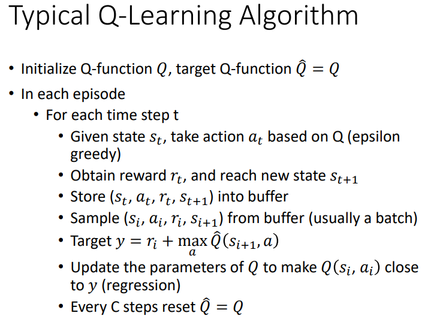

# 强化学习系列(三) Q-Learning

[TOC]

## 简介

在 Policy Gradient 的方法中, 我们让 **函数** (模型) 根据 state 输出 action 的概率, 属于 **分类问题**。我们每一次在选取 action 时, 可以选择概率最大的 action, 也可以根据概率对 action 进行 **采样**。

在 Q-Learning 中, 我们让 **函数** 根据 state 输出 action 的 "质量" (Quality), 或者说一个 "分数", 分数越高表示 action 越好, 属于 **回归问题**。现在我们选取 action 的方式只有一种了, 那就是选取 "质量" 最高的 action, 这种方式也被称为 贪心 (greedy) 策略 / Exploitation 策略。我们将这个函数记作 Q 函数。

我们用 $Q^{\pi} (s, a)$ 来表示 Q 函数, 也就是说, Q 函数的值由 状态 $s$ , 动作 $a$ 和 策略 $\pi$ 共同决定。其计算方式有两种:

第一种是 MC (Monte-Carlo) 的方式, 即 "质量" 值等于 cumulated reward, 用公式表示如下:

$$
Q^{\pi} (s_t, a_t) = U_t = r_t + r_{t+1} + \cdots + r_{T} \tag{1}
$$

需要注意的是, 表面上这个公式和 $\pi$ 是没有关系的, 实际上从 $t+1$ 时刻起, 所有的 action 都是由 $\pi$ 选取出来的, 因此 Q 值和 $\pi$ 是强相关的。只有 $t$ 时刻的 action 是预先定好的, 即 $a_t$ 。如果说 环境程序 有随机性, 那么 $U_t$ 是一个随机变量, 这里的 Q 值应该是 $U_t$ 的期望值。

第二种方式是 TD (Temporal-Difference) 的方式。用公式表示如下:

$$
Q^{\pi} (s_t, a_t) = r_t + Q^{\pi} (s_{t+1}, \pi(s_{t+1})) \tag{2}
$$

我们知道, 在强化学习的过程中, $\pi$ 根据 $s_t$ 生成 $a_t$, 环境程序根据 $s_t$ 和 $a_t$ 生成 $s_{t+1}$ 和 $r_t$ 。我们可以将 $(s_t, a_t, r_t, s_{t+1})$ 的四元组来表示。简单解释公式 $(2)$ 就是第 $t$ 步和第 $t+1$ 步的 Q 值相差 $r_t$ 。

实际上在推理时, 我们并不会用公式 $(1)$ 和公式 $(2)$ 来计算 Q 值, 而是需要去另外找一个函数, 来估算 Q 值。如果环境中的 state 和 action 数量是有限的, 那么这个函数可以是 table 函数; 如果这个函数是 深度神经网络, 我们称为 DQN (Deep Q-Learning Network)。

更多关于 table 函数的内容, 可以参考 HuggingFace 的教程: [Introducing Q-Learning](https://huggingface.co/learn/deep-rl-course/unit2/q-learning) 。

最后额外补充一些概念: 在强化学习中, 我们一般将 Policy Gradient 的方法称为 policy-based 方法, 将 Q-Learning 的方法称为 value-based 方法。上面所说的 Q 函数也被称为 action-state value function, 除此之外, 还有 state value function, 用字母 $V^{\pi}(s)$ 来表示, 评估 $s$ 状态的好坏, 计算方式和上面是差不多的。(如果对这些概念有疑问, 建议放一放, 后续再了解。)

## DQN 模型架构

在 DQN 中, 我们会将 state 作为模型的输入, 经过多个卷积或者线性层后, 输出每一个 action 的 Q 值。在推理阶段, 我们取 Q 值最大的 action 作为下一步的 action; 在训练阶段, 我们使用公式 $(1)$ 或者公式 $(2)$ 进行迭代。

在公式 $(1)$ 中, 虽然 $U_t$ 是随机变量, 但是我们实际上不会去求它的期望, 因为其随机性是来自于 环境程序 的, 而不是我们的模型, 真要计算的话需要大量的采样, 消耗的时间会非常地多。如果我们用单次的结果来计算 $U_t$, 那么会产生的问题是 $U_t$ 的值方差特别大, 这是 MC 方式的问题。

在公式 $(2)$ 中, 方差大的问题得到解决, 但是产生了新的问题, 那就是 $Q^{\pi} (s_{t+1}, \pi(s_{t+1}))$ 估算的并不一定是准确的, 这是 TD 方式的问题。

一般情况下, 我们会选择 TD 的方式, 因为随着模型的不断训练, 估算不准的问题可以得到解决。那么现在整体的架构是:

先利用 $\pi$ 和环境程序, 收集大量的 $(s_t, a_t, r_t, s_{t+1})$ 四元组, 然后用模型分别估算 $Q^{\pi} (s_t, a_t)$ 和 $r_t + Q^{\pi} (s_{t+1}, \pi(s_{t+1}))$ 的值, 使用 MSE 计算两者之间的 loss 值, 然后最小化 loss 值即可。在一个路径中的 $\tau$, 应该是靠后的 四元组 的估算首先变得更加准确, 然后再是靠前的 四元组 估算变成准确。我们将公式 $(2)$ 中右边的部分, 即 $r_t + Q^{\pi} (s_{t+1}, \pi(s_{t+1}))$ 称为 TD Target。

这样的训练虽然没有问题, 但是很难去训练。原因是我们的目标值 TD Target 也是变动的, 不是固定的。训练过程就像是 $Q^{\pi} (s_t, a_t)$ 在追着 TD Target 跑一样。解决方式是让 TD Target 不动, 整体的网络架构如下:

在 Policy Gradient 中, $\tau$ 的生成是根据每一步 action 概率采样得到的, 具有随机性; 但是在 Q-Learning 中, $\tau$ 的生成是直接选取 Q 值最大的 action, 随机性全靠 环境程序。这样采样得到的数据会过于单一, 并不是我们想要的, 此时一般会使用 Exploration/Exploitation trade-off 的策略。

Exploitation 的含义是 "利用", 我们也可以称为 "贪婪", 和上面说的一样, 每一步选取 Q 值最大的 action; Exploration 的含义是 "探索", 即每一步随机选取 action (用均匀分布进行采样)。一般在模型训练的初期, 需要使用 Exploration 策略探索更多的可能, 模型训练的后期使用 Exploitation 策略使得模型更加稳定。那么在训练时怎么去选择呢?

我们用 $\epsilon$ 表示采用 Exploration 探索策略的概率, 用 $1 - \epsilon$ 表示采用 Exploitation 策略的概率, 每一步都进行采样。第一次收集数据时, 让 $\epsilon$ 值为 1, 完全使用 Exploration 探索策略，最后一次收集数据时, 让 $\epsilon$ 值为 0, 完全使用 Exploitation 贪心策略。这种方式也被称为 Epsilon Greedy Policy。需要注意的是, 如果使用了这种方式, 我们的模型不再是 on-policy 的模型了, 而是 off-policy 的模型。

最后, 对于强化学习来说, 真正耗时间的不是训练神经网络, 而是收集数据。那么怎么减少数据收集的时间呢? 答案是 Replay Experience。我们将 $(s_t, a_t, r_t, s_{t+1})$ 四元组称为 Experience, 然后构建一个 buffer。每一次收集数据时, 将收集到的 Experience 全部放入 buffer 中, 如果 buffer 满了, 就将最早收集到的数据丢弃 (FIFO 队列)。每一次训练时, 我们会从 buffer 中随机抽取数据。这样的好处有两个, 一个是减少了数据收集的时间; 另一个是确保部分数据得到了充分的利用。

整个训练的流程如下:

## DQN 训练技巧

### Double DQN

在上面的过程中, 我们用 $Q_{\pi}$ 表示需要更新的模型, $Q^{-}_{\pi}$ 表示 Target 模型。在估算 TD Target 的过程中, 我们使用 $Q^{-}_{\pi}$ 来选择 $t+1$ 时刻的 action 值。

这种做法存在一个很大的问题, 那就是我们往往会 "高估" Q 的值。原因很简单, 在训练初期, 我们估算的 Q 值是不准确的, 然而我们会选取不准确的 Q 值中最大的那一个来计算 TD Target, 这样估算出来的值自然会偏高。怎么解决这个问题呢?

在训练的初期, 除了 $\tau$ 中最后一个四元组, 其它估算的都不准, 此时选择哪一个 Q 值来计算 TD Target都是可以的; 但是在训练的后期, 我们一定要尽量选择最大的 Q 值来计算 TD Target。

在这种情况下, 就有了 Double DQN: 在估算 TD Target 时, 我们使用 $Q_{\pi}$ 来选择 $t+1$ 时刻的 action 值, 然后再用 $Q^{-}_{\pi}$ 来计算 Q 值。在训练的初期, $Q_{\pi}$ 和 $Q^{-}_{\pi}$ 相差较大, 这样选出的 Q 值一般不会是最大值; 在训练的后期, $Q_{\pi}$ 和 $Q^{-}_{\pi}$ 相差较小, 这样选择出的 Q 值会和最大的 Q 值接近。采用这种方式, 可以缓解 "高估" Q 值的问题。

### Dueling DQN

现在, 我们用另一种方式来描述上一部分所说的神经网络: 对于 state, 我们首先用几层神经网络作为特征提取器 (如果 state 是图片, 那么就是 CNN 层); 然后有几个 action 就有几个线性层, 每一个线性层负责估算对应 action 的 Q 值。

由于我们收集数据的方式是 epsilon greedy, 有一些 $(s, a)$ 对是收集不到的, 此时对应的 action 线性层就没有更新, 模型的效果可能就不是很好。怎么办呢?

Dueling DQN 采取的措施是对 Q 值进行拆分。首先, 我们将原本估算出来的 Q 值记作 A 值, 用 $A(s, a)$ 来表示; 然后, 我们额外增加一个线性层, 用于估算当前 state 的好坏, 记作 $V(s)$; 最后, $Q(s, a) = A(s, a) + V(s)$ 。

我们希望模型能尽可能地通过 $V(s)$ 来估算 Q 值, 这样没有收集到的 $(s, a)$ 对也能得到一定程度的更新。除此之外, 为了让模型尽可能地通过 $V(s)$ 来估算 Q 值, 我们还需要对 $A(s, a)$ 进行一定程度地限制, 比方说让同一个 $s$ 下的所有 $A(s, a)$ 值和为 0 (实现方法就是减去 **平均数**)。

### Rainbow

除了上面所说的两种方法外, 还有 Prioritized Replay, Multi-step (MC 和 TD 的折中方案), Noisy Net 和 Distributional Q-Function 四种常见的改进方式。

这些改进是互相不冲突的, 如果和在一起, 则被称为 Rainbow, 可以说是 DQN 比较完善的一种形式了。

具体的内容可以见 DeepMind 2017 年 10 月的论文: [Rainbow: Combining Improvements in Deep Reinforcement Learning](https://arxiv.org/abs/1710.02298) 。

### Continuous Action

在实际的一些问题中, action 可能不是离散的, 而是连续的。比方说 机械臂 移动的距离, 旋转的角度等等, 具体可以参考论文: [Deep Reinforcement Learning for Robotic Manipulation with Asynchronous Off-Policy Updates](https://arxiv.org/abs/1610.00633) 。

## Actor-Critic

在 Q-Learning 中, $Q(s, a)$ 表示的是在状态 $s$ 的情况下进行 $a$ 操作可以得到的 **累积奖励值** 的期望, $V(s)$ 表示的是在状态 $s$ 的情况下可以得到的 **累积奖励值** 的期望, 用公式表示如下:

$$
Q^{\pi}(s_t, a_t) = \mathbb{E} [U_t | s_t, a_t] \tag{3}
$$

$$
V^{\pi}(s_t) = \mathbb{E}_A [Q^{\pi}(s_t, A)] = \mathbb{E} [U_t | s_t] \tag{4}
$$

我们假设在 $s_t$ 的情况下执行 $a_t$ 得到的 $r_t$ 和 $s_{t+1}$ 是固定的 (不考虑环境程序的随机性), 将公式 $(3)$ 和公式 $(4)$ 代入公式 $(1)$, 可以得到:

$$
\begin{align*}
    Q^{\pi} (s_t, a_t) &= \mathbb{E} [U_t | s_t, a_t] \\
    &= \mathbb{E} [r_t + r_{t+1} + \cdots + r_{T} | s_t, a_t] \\
    &= r_t + \mathbb{E} [r_{t+1} + \cdots + r_{T} | s_{t+1}] \\
    &= r_t + V^{\pi} (s_{t+1})
\end{align*}
\tag{5}
$$

需要注意的是, 公式 $(5)$ 是基于 MC 方式得到的, 不是 TD 的方式。

在 Policy Gradient 中, 我们的 Advantage Function 形式如下:

$$
\begin{align*}
    A^{\theta} (s_t, a_t) &= \left [ \sum_{t^\prime=t}^{T_n} r_{t^\prime}^n \right ] - b \\
    &= r_t + U_{t+1} - b
\end{align*}
\tag{6}
$$

在公式 $(6)$ 中, 我们可以看出其是基于 MC 方法的, 在 $t$ 步的 action 是预先定义好的, $U_{t+1}$ 是由 $\pi$ 决定的, 那么就会存在一个问题, $U_{t+1}$ 计算出来的结果方差非常大。怎么办呢? 在了解过 Q-Learning 后, 我们可以使用函数来估算 $U_{t+1}$ 的值就好啦, 而这个函数恰好是 $V^{\pi}(s_{t+1})$ 。

$b$ 的值怎么估算呢? 我们可以让其等于 $U_t$ 的期望值, 这样就能保证 Advantage 值有正有负, 最终, 公式 $(6)$ 变成:

$$
A^{\theta} (s_t, a_t) = r_t + V^{\pi}(s_{t+1}) - V^{\pi}(s_{t}) \tag{7}
$$

现在, 我们需要两个函数 actor 和 critic, critic 用于估算状态 $s$ 的 "质量" 值, actor 用于决策即可。

## 总结

Asynchronous Advantage Actor Critic

Pathwise Derivative Policy Gradient
