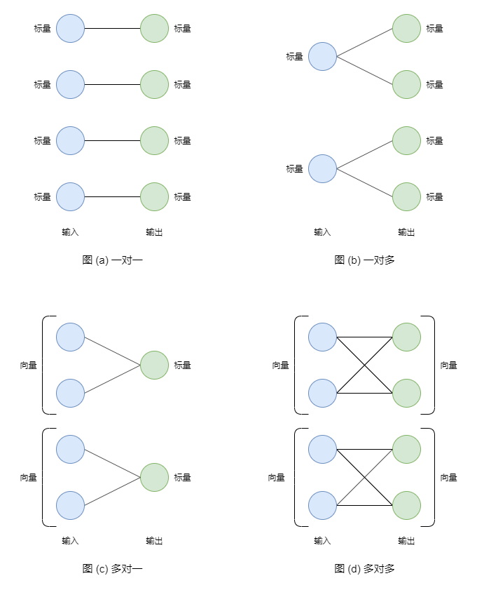

# 反向传播算法实现

[TOC]

本文承接之前关于 [深度学习和梯度](https://zhuanlan.zhihu.com/p/668156356) 的博客, 来介绍 PyTorch 中常见 **基本运算** 反向过程的实现方法, 并加强对于这些运算本身的理解。

## 一、VJP 运算

神经网络是由很多 **基本运算** 构成, 它们的输入和输出一般都是 **张量** (多维数组)。神经网络本身的输入和输出也是 张量。

训练神经网络就是在 优化 目标函数, 即寻找使得 目标函数值 最小的 自变量值。其中, 自变量 就是模型参数, 目标函数值 被称为 loss 值。需要注意的是, **loss 值一定是标量**!!! 我们很难同时 "优化" 多个函数值。

对于一个 **基本运算** 而言, 其输入和输出都是张量, 我们可以将它们 "平铺" 成向量, 分别记作 $\bold{o}$ 和 $\bold{x}$。根据 **多元链式求导法则**, loss 对于向量 $\bold{x}$ 中单一元素 $x_i$ 的偏导数计算公式如下:

$$
\frac{\partial \mathrm{loss}}{\partial x_i} =
\frac{\partial \mathrm{loss}}{\partial o_1} \cdot \frac{\partial o_1}{\partial x_i} +
\frac{\partial \mathrm{loss}}{\partial o_2} \cdot \frac{\partial o_2}{\partial x_i} +
\cdots +
\frac{\partial \mathrm{loss}}{\partial o_n} \cdot \frac{\partial o_n}{\partial x_i}
\tag{1.1}
$$

公式 $(1.1)$ 符合 **对应位置相加再求和** 的形式, 那么我们就可以用 **向量点乘** 的方式来表示。我们令向量 $\bold{v}_o$ 是 loss 关于向量 $\bold{o}$ 中每一个元素的偏导数, 则:

$$
\bold{v}_o = \frac{\partial \mathrm{loss}}{\partial \bold{o}} =
\begin{bmatrix}
    \frac{\partial \mathrm{loss}}{\partial o_1} & \frac{\partial \mathrm{loss}}{\partial o_2} & \cdots & \frac{\partial \mathrm{loss}}{\partial o_n}
\end{bmatrix}
\tag{1.2}
$$

我们令向量 $\bold{J}_i$ 是向量 $\bold{o}$ 中每一个元素关于 $x_i$ 的偏导数, 则:

$$
\bold{J}_i = \frac{\partial \bold{o}}{\partial x_i} =
\begin{bmatrix}
    \frac{\partial o_1}{\partial x_i} & \frac{\partial o_2}{\partial x_i} & \cdots & \frac{\partial o_n}{\partial x_i}
\end{bmatrix}
\tag{1.3}
$$

假设向量 $\bold{v}$ 和 $\bold{J}_i$ 都是 列向量, 那么, 公式 $(1.1)$ 可以简写成:

$$
\frac{\partial \mathrm{loss}}{\partial x_i} = \bold{J}^{\mathsf{T}}_i \cdot \bold{v}_o
\tag{1.4}
$$

我们将所有的向量 $\bold{J}_i$ 以列向量的形式组成矩阵 $\bold{J}$, 那么整个过程就可以用 矩阵 和 向量 的乘法来表示了。如果用向量 $\bold{v}_x$ 表示 loss 关于向量 $\bold{x}$ 中每一个元素的偏导数, 那么:

$$
\bold{v}_x = \bold{J}^{\mathsf{T}} \cdot \bold{v}_o
\tag{1.5}
$$

我们将矩阵 $\bold{J}$ 称为 **雅可比矩阵** (Jacobian matrix), 公式 $(1.5)$ 被称为 VJP (vector-Jacobian Production) 运算。对于一个 **基本运算** 而言, 其 反向过程 就是在进行 VJP 运算, 输入 是 $\bold{v}_o$, 输出 是 $\bold{v}_x$。

## 二、可视化反向过程

PyTorch 中的大部分 **基本运算**, 虽然 输入 和 输出 是任意维度的张量, 但是实际上是以 **标量** 或者 **向量** 为单位的运算。其它维度仅仅起到 **循环** 的作用, 我们可以认为是 **基本运算** 的 "批处理"。

比方说, `torch.sin` 函数就是一个以 标量 为单位的运算。其 输入张量 和 输出张量 的 size 是一致的, 对 输入张量 的每一个 元素值 (标量) 计算 正弦值, 并输出。假设 输入张量 的 size 是 `[2, 3, 4]`, 那么相当于进行 2 x 3 x 4 = 24 次正弦值计算。

再比方说, `torch.sum` 函数就是一个以 向量 为单位的运算。如果没有指定 `dim` 参数, 那么就将整个 输入张量 "平铺" 成 向量进行求和, 返回标量。如果指定 `dim` 参数, 那么就在指定的维度上进行求和。假设 输入张量 的 size 是 `[2, 3, 4]`, 同时 `dim=1`, 那么就是进行 2 x 4 = 8 次求和运算, 每一次对 3 个元素的向量进行求和, 最终返回张量的 size 是 `[2, 4]`。

我们称这样的编程方式为 [向量化编程](https://en.wikipedia.org/wiki/Array_programming) (vectorization), 其优势在于运算速度快! 高级语言的循环效率肯定比底层语言要低, 但是开发效率高。那么不如把 循环 交给底层语言, 把 逻辑 交给高级语言。

我们用下图进一步理解上面所说的内容:



左边蓝色的结点表示 输入张量 中的元素值, 右边绿色的结点表示 输出张量 中的元素值。如果 输入元素值 参与了 输出元素值 的计算, 那么就说 两者之间 有对应关系, 并将两个结点相连。

如果是以 标量 为单位的运算, 那么结构如 图 (a) 或者 图 (b) 所示, 输入和输出元素值是 **一对一** 或者 **一对多** 的关系。刚刚所说的 `torch.sin` 就是 一对一 的关系。

如果是以 向量 为单位的运算, 那么结构如 图 (c) 或者 图 (d) 所示, 输入和输出元素值是 **多对一** 或者 **多对多** 的关系。`torch.sum` 就是 多对一 的关系。

我们知道, 如果 输入元素 不参与 输出元素 的计算, 那么 输出元素 对于 输入元素 的导数一定为 $0$, 因此我们在 反向过程 中也不用考虑它们。

上图是仿照 全连接层示意图 画的。借助这张图, 我们可以用 graph 数据结构 的方式来描述 反向传播算法: 绿色结点的 **分数值** 是 loss 关于输出元素的偏导数, 蓝色结点的 **分数值** 是 loss 关于输入元素的偏导数, 每一个连线的 **权重值** 是输出元素关于输入元素的偏导数。

一个蓝色结点 **分数值** 的计算方式是: 遍历所有能够到达其的绿色结点, 将绿色结点的分数值乘以对应路径的 **权重值**, 再求和即可。一个 **基本运算** 的反向过程就是求所有蓝色结点的 **分数值**。

需要注意的是, 在 前向过程 中, 不同的 **基本运算** 计算方式是不同的; 但是在 反向过程 中, 不同的 **基本运算** 计算方式都是相同的, 只有输出对输入偏导数的计算方式不同!!!

下面, 让我们看看 四种对应关系 的反向过程应该如何实现。

## 三、一对一运算

从学习函数开始, 我们就接触了很多 一元函数, 比方说 幂函数 $y = x^2$, 指数函数 $y = e^x$, 对数函数 $y = \log x$, 三角函数 $y = \sin x$ 等等。它们的 输入 和 输出 都是 **标量**。在 PyTorch 中, 上面列举的函数分别对应: `torch.pow`, `torch.exp`, `torch.log` 和 `torch.sin`。它们都属于 **一对一运算**。

以 $y = \sin x$ 为例, 其导函数是 $y^{\prime} = \cos x$。假设输入的向量 $\bold{x}$ 是:

$$
\bold{x} = \begin{bmatrix} x_1 & x_2 & x_3 \end{bmatrix}
\tag{3.1}
$$

那么, 输出的向量 $\bold{o}$ 是:

$$
\bold{o} = \begin{bmatrix} \sin x_1 & \sin x_2 & \sin x_3 \end{bmatrix}
\tag{3.2}
$$

此时的 雅可比矩阵 是:

$$
\bold{J} = \begin{bmatrix}
    \cos x_1 & 0 & 0 \\
    0 & \cos x_2 & 0 \\
    0 & 0 & \cos x_3
\end{bmatrix}
\tag{3.3}
$$

假设 loss 关于输出的偏导数 $\bold{v}_o$ 是:

$$
\bold{v}_o = \begin{bmatrix} v_{o_1} & v_{o_2} & v_{o_3} \end{bmatrix}
\tag{3.4}
$$

那么, loss 关于 输入 $\bold{x}$ 的偏导数 $\bold{v}_x$ 是:

$$
\bold{v}_x = \bold{J}^{\mathsf{T}} \cdot \bold{v}_o =
\begin{bmatrix}
    \cos x_1 & 0 & 0 \\
    0 & \cos x_2 & 0 \\
    0 & 0 & \cos x_3
\end{bmatrix} \cdot
\begin{bmatrix} v_{o_1} \\ v_{o_2} \\ v_{o_3} \end{bmatrix} =
\begin{bmatrix} \cos x_1 \cdot v_{o_1} \\ \cos x_2 \cdot v_{o_2} \\ \cos x_3 \cdot v_{o_3} \end{bmatrix}
\tag{3.5}
$$

如果输入 $\bold{x}$ 不是向量, 那么我们就 "平铺" 成向量。实现代码如下:

```python
import torch 
from torch import Tensor, nn 


@torch.no_grad()
def sin_backward(input: Tensor, output_grad: Tensor) -> Tensor:
    if input.size() != output_grad.size():
        raise ValueError("input 和 output_grad 的 size 应该相同!")

    # step1: 求解 output 关于 input 的导数
    derivative = torch.cos(input)

    # step2: 计算 input 的梯度值
    input_grad = derivative * output_grad

    return input_grad


# 验证是否正确
input_ = nn.Parameter(torch.randn(2, 3, 4, 5).double())
output_grad_ = torch.randn_like(input_).double()

# PyTorch 求导方式
torch.sin(input_).backward(output_grad_)
result1 = input_.grad

# 自己实现的求导方式
result2 = sin_backward(input_, output_grad_)

print(torch.allclose(result1, result2))
```

我们将 VJP 运算简化成了 逐位相乘 运算。所有类似的运算都可以这样实现 反向过程。深度学习中的大部分 激活函数 也属于这一类, 比方说 [sigmoid](https://en.wikipedia.org/wiki/Sigmoid_function) 和 [ReLU](https://en.wikipedia.org/wiki/Rectifier_(neural_networks))。下面, 我们来实现一下这两个函数的反向过程。

sigmoid 函数是 [单位阶跃函数](https://en.wikipedia.org/wiki/Heaviside_step_function) 的光滑近似函数, 主要在 $[-4, 4]$ 的范围内光滑, 计算公式如下:

$$
\mathrm{sigmoid} (x) = \frac{1}{1 + e^{-x}}
\tag{3.6}
$$

其 导函数 的图像和 标准正太分布 的图像是相似的, 只有在 $[-4, 4]$ 的范围内导数值不为 $0$, 当 $x = 0$ 时取得最大值 $0.25$, 计算公式如下:

$$
\mathrm{sigmoid}^{\prime} (x) = \mathrm{sigmoid} (x) \cdot (1 - \mathrm{sigmoid} (x))
\tag{3.7}
$$

那么, 代码实现如下:

```python
@torch.no_grad()
def sigmoid_backward(input: Tensor, output_grad: Tensor) -> Tensor:
    output = torch.sigmoid(input)
    derivative = output * (1 - output)
    input_grad = output_grad * derivative
    return input_grad
```

ReLU 函数是分段函数, 计算公式如下:

$$
\mathrm{relu} (x) = \begin{cases} x & x \gt 0 \\ 0 & x \le 0 \end{cases}
\tag{3.8}
$$

其 导函数 是 [单位阶跃函数](https://en.wikipedia.org/wiki/Heaviside_step_function), 计算公式如下:

$$
\mathrm{relu}^{\prime} (x) = \begin{cases} 1 & x \gt 0 \\ 0 & x \le 0 \end{cases}
\tag{3.9}
$$

代码实现如下:

```python
@torch.no_grad()
def relu_backward(input: Tensor, output_grad: Tensor) -> Tensor:
    # torch.heaviside: 单位阶跃函数
    derivative = torch.heaviside(input, torch.tensor(0, dtype=input.dtype))
    input_grad = derivative * output_grad
    return input_grad
```

一些和 张量维度 或者 size 相关的操作也属于 一对一运算, 比方说 [unsqueeze](https://pytorch.org/docs/stable/generated/torch.unsqueeze.html), [squeeze](https://pytorch.org/docs/stable/generated/torch.squeeze.html), [flatten](https://pytorch.org/docs/stable/generated/torch.flatten.html) [reshape](https://pytorch.org/docs/stable/generated/torch.reshape.html), [transpose](https://pytorch.org/docs/stable/generated/torch.transpose.html), [permute](https://pytorch.org/docs/stable/generated/torch.permute.html) 等等。由于 输入元素 和 输出元素 是一致的, 那么 输出元素 关于 输入元素 的导数都是 $1$。那么我们在实现 反向过程 时, 直接对 `output_grad` 进行相反的操作即可。

## 四、一对多运算

在 PyTorch 中, 如果两个张量的 size 相同, 那么它们的 **逐位相加** 和 **逐位相乘** 也符合 一对一运算。但是, 如果这两个运算涉及到 **广播机制** ([broadcasting](https://pytorch.org/docs/stable/notes/broadcasting.html)), 那就属于 一对多运算 了。此时应该怎么实现 反向过程 呢?

广播机制 是通过 扩展 ("复制") 的方式使得两个张量的 size 一致! 观察图 (b), 我们可以这样实现: 先求 loss 关于 扩展后张量 的偏导数, 然后对所有 扩展 出来的维度求和, 就可以得到 loss 关于 扩展前张量 的偏导数。

对于 **逐位相加** 来说, 输出张量 关于 两个输入张量 的导数都是 $1$, 那么, 实现代码如下:

```python
@torch.no_grad()
def add_backward(input1: Tensor, input2: Tensor, output_grad: Tensor) -> tuple[Tensor, Tensor]:

    if torch.broadcast_shapes(input1.shape, input2.shape) != output_grad.shape:
        raise ValueError

    # step1: 求 output 关于 input 的导数
    input1_derivative = input2_derivative = torch.ones_like(output_grad)

    # step2: 求 input 的梯度值
    input1_grad = output_grad * input1_derivative
    input2_grad = output_grad * input2_derivative

    # step3: 处理 广播机制
    for _ in range(input1_grad.ndim - input1.ndim):
        input1_grad = input1_grad.sum(dim=0)
    for _ in range(input2_grad.ndim - input2.ndim):
        input2_grad = input2_grad.sum(dim=0)

    for i, (r, s) in enumerate(zip(input1_grad.shape, input1.shape)):
        if r != s:
            input1_grad = input1_grad.sum(dim=i, keepdim=True)
    for i, (r, s) in enumerate(zip(input2_grad.shape, input2.shape)):
        if r != s:
            input2_grad = input2_grad.sum(dim=i, keepdim=True)
    
    return input1_grad, input2_grad
```

对于 **逐位相乘** 来说, 输出张量 关于 `input1` 的导数是 `input2`, 输出张量 关于 `input2` 的导数是 `input1`, 那么, 实现代码如下:

```python
@torch.no_grad()
def mul_backward(input1: Tensor, input2: Tensor, output_grad: Tensor) -> tuple[Tensor, Tensor]:

    input1_grad = output_grad * input2
    input2_grad = output_grad * input1

    for _ in range(input1_grad.ndim - input1.ndim):
        input1_grad = input1_grad.sum(dim=0)
    for _ in range(input2_grad.ndim - input2.ndim):
        input2_grad = input2_grad.sum(dim=0)

    for i, (r, s) in enumerate(zip(input1_grad.shape, input1.shape)):
        if r != s:
            input1_grad = input1_grad.sum(dim=i, keepdim=True)
    for i, (r, s) in enumerate(zip(input2_grad.shape, input2.shape)):
        if r != s:
            input2_grad = input2_grad.sum(dim=i, keepdim=True)
    
    return input1_grad, input2_grad
```

[expand](https://pytorch.org/docs/stable/generated/torch.Tensor.expand.html) 运算的反向过程实现方式和上面是相似的。除此之外, [repeat](https://pytorch.org/docs/stable/generated/torch.Tensor.repeat.html) 运算, [repeat_interleave](https://pytorch.org/docs/stable/generated/torch.repeat_interleave.html) 运算, 整形索引 等等也属于 一对多运算。这些运算的反向过程在 Python 层面很难实现, 或者说用 PyTorch 支持的 向量化编程 方式很难实现, 需要用 底层语言 实现。它们求导也非常容易, 输出元素 和 输入元素 是一致的, 那么 导数值 就是 $1$。注意求和即可。

## 五、多对一运算

PyTorch 中有很多以 **向量** 为单位, 并且输出是 **标量** 的运算, 我们一般称为 [reduction 运算](https://en.wikipedia.org/wiki/Reduction_operator)。包括但不限于: 求和 `torch.sum`, 求积 `torch.prod`, 求平均值 `torch.mean`, 求最大值 `torch.max`, 求方差 `torch.var` 等等。这些运算一般都有 `dim` 参数:

如果不指定, 就是将整个输入张量都 "平铺" 成向量进行 reduction 运算, 输出标量。此时的 反向过程 比较简单, 直接求 输出标量 关于 输入张量 的导数, 然后和 `output_grad` 标量进行 数乘 即可。

如果指定 `dim` 参数, 那么就在指定维度上进行 reduction 运算。此时, 对于每一个 输入元素, 求对应 输出元素 关于其的 导数, 再和 `output_grad` (需要扩展维度) 进行 **逐位相乘** 即可。

假设输入向量 $\bold{x} = \begin{bmatrix}x_1 & x_2 & x_3\end{bmatrix}$, 输出的标量是 $o$。 下面来看一些具体的例子:

(1) 对于 求和运算 来说, 其输出标量是:

$$
o = x_1 + x_2 + x_3
\tag{5.1}
$$

那么, 输出标量 关于 输入向量 的导数是:

$$
\frac{\partial{o}}{\partial{x_1}} = \frac{\partial{o}}{\partial{x_2}} = \frac{\partial{o}}{\partial{x_3}} = 1
\tag{5.2}
$$

实现代码如下:

```python
@torch.no_grad()
def sum_backward(input: Tensor, output_grad: Tensor, dim: int = None) -> Tensor:
    if dim is None:
        # 如果没有指定 dim, 那么 loss 关于 input 的偏导数就是 output_grad 标量值
        return torch.full_like(input, fill_value=output_grad.item())
    
    # 如果指定 dim, 那么直接 扩展 output_grad 即可
    return output_grad.unsqueeze(dim).expand_as(input)
```

(2) 对于 求积运算 来说, 其输出标量是:

$$
o = x_1 \cdot x_2 \cdot x_3
\tag{5.3}
$$

那么, 输出标量 关于 输入向量 的导数是:

$$
\begin{align*}
    \frac{\partial{o}}{\partial{x_1}} &= x_2 \cdot x_3 \\
    \frac{\partial{o}}{\partial{x_2}} &= x_1 \cdot x_3 \\
    \frac{\partial{o}}{\partial{x_3}} &= x_1 \cdot x_2 \\
\end{align*}
\tag{5.4}
$$

实现代码如下:

```python
@torch.no_grad()
def prod_backward(input: Tensor, output_grad: Tensor, dim: int = None) -> Tensor:
    if dim is None:
        # 如果没有指定 dim, 那么 output 标量对于 input 张量的导数就是 output / input
        output = torch.prod(input)
        derivative = output / input
        return derivative * output_grad

    output = torch.prod(input, dim=dim)
    derivative = output.unsqueeze(dim=dim) / input
    return derivative * output_grad.unsqueeze(dim)
```

(3) 对于 平均数运算 来说, 其输出标量是:

$$
o = \frac13 \cdot (x_1 + x_2 + x_3)
\tag{5.5}
$$

那么, 输出标量 关于 输入向量 的导数是:

$$
\frac{\partial{o}}{\partial{x_1}} = \frac{\partial{o}}{\partial{x_2}} = \frac{\partial{o}}{\partial{x_3}} = \frac13
\tag{5.6}
$$

实现代码如下:

```python
@torch.no_grad()
def mean_backward(input: Tensor, output_grad: Tensor, dim: int = None) -> Tensor:
    if dim is None:
        num_elements = input.numel()
        return torch.full_like(input, fill_value=output_grad.item()) / num_elements

    num_elements = input.size(dim=dim)
    return output_grad.unsqueeze(dim).expand_as(input) / num_elements
```

(4) 对于 最大值运算 来说, 假设 $x_2$ 值最大, 其输出标量是:

$$
o = x_2 \tag{5.7}
$$

那么, 输出标量 关于 输入向量 的导数是:

$$
\begin{align*}
    \frac{\partial{o}}{\partial{x_1}} &= \frac{\partial{o}}{\partial{x_3}} = 0 \\
    \frac{\partial{o}}{\partial{x_2}} &= 1
\end{align*}
\tag{5.8}
$$

实现代码如下:

```python
@torch.no_grad()
def max_backward(input: Tensor, output_grad: Tensor, dim: int = None) -> Tensor:
    if dim is None:
        # 在没有指定 dim 参数的情况下, torch.max 仅仅返回最大值
        # 此时, 如果有多个值都是最大值, 此时会平分梯度值 (不知道为什么)
        max_value = torch.max(input)
        mask = input == max_value
        return (mask * output_grad) / mask.sum()

    # 在指定 dim 参数的情况下, torch.max 返回 最大值 和 索引
    # 此时, 输出关于输入 在 索引 处导数为 1, 其余为 0, 即使有相同最大值也不需要取平均值
    max_value, max_idx = torch.max(input, dim=dim)
    input_grad = torch.zeros_like(input)
    input_grad.scatter_(
        dim=dim, index=max_idx.unsqueeze(dim=dim), 
        src=output_grad.unsqueeze(dim=dim)
    ) # scatter_ 和 gather 互为反运算
    return input_grad
```

(5) 对于 方差 来说, 我们设平均数是 $\mu$, 其输出的标量是:

$$
o = \frac{1}{3} \left[ (x_1 - \mu)^2 + (x_2 - \mu)^2 + (x_3 - \mu)^2 \right] \tag{5.9}
$$

那么, 输出标量 关于 输入向量 的导数是:

$$
\begin{align*}
    \frac{\partial{o}}{\partial{x_1}} &= \frac23 \left[(x_1 - \mu) \cdot (1 - \frac13) + (x_2 - \mu) \cdot (0 - \frac13) + (x_3 - \mu) \cdot (0 - \frac13)\right] \\
    \frac{\partial{o}}{\partial{x_2}} &= \frac23 \left[(x_1 - \mu) \cdot (0 - \frac13) + (x_2 - \mu) \cdot (1 - \frac13) + (x_3 - \mu) \cdot (0 - \frac13)\right] \\
    \frac{\partial{o}}{\partial{x_3}} &= \frac23 \left[(x_1 - \mu) \cdot (0 - \frac13) + (x_2 - \mu) \cdot (0 - \frac13) + (x_3 - \mu) \cdot (1 - \frac13)\right] \\
\end{align*}
\tag{5.10}
$$

公式 $(5.10)$ 是直接基于我观察出来的规律列的式子, 实现代码如下:

```python
@torch.no_grad()
def var_backward(input: Tensor, output_grad: Tensor, dim: int = None) -> Tensor:
    if dim is None:
        deviation = input - input.mean()  # 偏差
        num_elements = input.numel()

        # 计算 derivative
        derivative = - deviation.sum() / num_elements + deviation
        derivative = 2. / num_elements * derivative

        input_grad = derivative * output_grad
        return input_grad 

    # 将 dim 维移动到最后一个维度, 方便后续处理
    input = input.movedim(dim, -1)

    num_elements = input.size(-1)
    deviation = input - input.mean(dim=-1, keepdim=True)  # 偏差 (b, n)

    # 计算 derivative
    derivative = torch.eye(num_elements) - (1. / num_elements)
    derivative = torch.sum(derivative * deviation.unsqueeze(-2), dim=-1)
    derivative = 2. / num_elements * derivative

    input_grad = derivative * output_grad.unsqueeze(-1)
    input_grad = input_grad.movedim(-1, dim)

    return input_grad
```

## 六、多对多运算

softmax 函数是最典型的, 输入和输出都是 **向量** 的函数, 属于 多对多运算。除此之外, cumsum 运算, cumprod 运算也属于这一类。和上一节所说的 reduction 运算不同, 这些运算必须指定 `dim` 参数。它们反向过程的可以直接用 VJP 方式实现。下面, 让我们来看看具体的例子。

设 输入向量 $\bold{x} = \begin{bmatrix} x_1 & x_2 & x_3 \end{bmatrix}$, 输出向量 $\bold{o} = \begin{bmatrix} o_1 & o_2 & o_3 \end{bmatrix}$。

(1) softmax 函数是 one-hot argmax 函数 (hardmax) 的光滑近似函数, 其计算方式如下:

$$
\begin{align*}
    o_1 &= \frac{\exp(x_1)}{\exp(x_1) + \exp(x_2) + \exp(x_3)} \\
    o_2 &= \frac{\exp(x_2)}{\exp(x_1) + \exp(x_2) + \exp(x_3)} \\
    o_3 &= \frac{\exp(x_3)}{\exp(x_1) + \exp(x_2) + \exp(x_3)}
\end{align*}
\tag{6.1}
$$

对其进行求导, 可以得到:

$$
\bold{J} = \begin{bmatrix}
    o_1 \cdot (1 - o_1) & o_1 \cdot (0 - o_2) & o_1 \cdot (0 - o_3) \\
    o_2 \cdot (0 - o_1) & o_2 \cdot (1 - o_2) & o_2 \cdot (0 - o_3) \\
    o_3 \cdot (0 - o_1) & o_3 \cdot (0 - o_2) & o_3 \cdot (1 - o_3) \\
\end{bmatrix}
\tag{6.2}
$$

实现代码如下:

```python
@torch.no_grad()
def softmax_backward(input: Tensor, output_grad: Tensor, dim: int) -> Tensor:    
    # ## step1: 将 dim 维度移动到最后
    # input / output / input_grad / output_grad : [n, ]
    input = input.movedim(dim, -1)
    output_grad = output_grad.movedim(dim, -1)

    # ## step2: 求雅可比矩阵: [n, n]
    output = torch.softmax(input, dim=-1)
    num_elements = input.size(-1)
    jacobian = (torch.eye(num_elements) - output.unsqueeze(-2)) * output.unsqueeze(-1)
    
    # ## step3: 求 input_grad: [n, n] @ [n, 1]
    input_grad = torch.matmul(jacobian.transpose(-1, -2), output_grad.unsqueeze(-1))
    input_grad = input_grad.squeeze(-1).movedim(-1, dim)
    return input_grad
```

(2) cumsum 函数是 累加函数, 其计算方式如下:

$$
\begin{align*}
    o_1 &= x_1 \\
    o_2 &= x_1 + x_2 \\
    o_3 &= x_1 + x_2 + x_3
\end{align*}
\tag{6.3}
$$

对其进行求导, 可以得到:

$$
\bold{J} = \begin{bmatrix} 1 & 0 & 0 \\ 1 & 1 & 0 \\ 1 & 1 & 1 \\ \end{bmatrix}
\tag{6.4}
$$

实现代码如下:

```python
@torch.no_grad()
def cumsum_backward(input: Tensor, output_grad: Tensor, dim: int) -> Tensor:    
    # ## step1: 将 dim 维度移动到最后
    # input / output / input_grad / output_grad : [n, ]
    input = input.movedim(dim, -1)
    output_grad = output_grad.movedim(dim, -1)

    # ## step2: 求雅可比矩阵: [n, n]
    num_elements = input.size(-1)
    jacobian = torch.ones(num_elements, num_elements).tril().to(input.dtype)
    
    # ## step3: 求 input_grad: [n, n] @ [n, 1]
    input_grad = torch.matmul(jacobian.transpose(-1, -2), output_grad.unsqueeze(-1))
    input_grad = input_grad.squeeze(-1).movedim(-1, dim)
    return input_grad
```

(3) cumprod 函数是 累乘函数, 其计算方式如下:

$$
\begin{align*}
    o_1 &= x_1 \\
    o_2 &= x_1 \cdot x_2 \\
    o_3 &= x_1 \cdot x_2 \cdot x_3
\end{align*}
\tag{6.5}
$$

对其进行求导, 可以得到:

$$
\bold{J} = \begin{bmatrix}
    1 & 0 & 0 \\
    x_2 & x_1 & 0 \\
    x_2 \cdot x_3 & x_1 \cdot x_3 & x_1 \cdot x_2 \\
\end{bmatrix}
= \begin{bmatrix}
    \frac{o_1}{x_1} & 0 & 0 \\
    \frac{o_2}{x_1} & \frac{o_2}{x_2} & 0 \\
    \frac{o_3}{x_1} & \frac{o_3}{x_2} & \frac{o_3}{x_3} \\
\end{bmatrix}
\tag{6.6}
$$

实现代码如下:

```python
@torch.no_grad()
def cumprod_backward(input: Tensor, output_grad: Tensor, dim: int) -> Tensor:    
    # ## step1: 将 dim 维度移动到最后
    # input / output / input_grad / output_grad : [n, ]
    input = input.movedim(dim, -1)
    output_grad = output_grad.movedim(dim, -1)

    # ## step2: 求雅可比矩阵: [n, n]
    output = torch.cumprod(input, dim=-1)
    jacobian = torch.tril(output.unsqueeze(-1) / input.unsqueeze(-2))
    
    # ## step3: 求 input_grad: [n, n] @ [n, 1]
    input_grad = torch.matmul(jacobian.transpose(-1, -2), output_grad.unsqueeze(-1))
    input_grad = input_grad.squeeze(-1).movedim(-1, dim)
    return input_grad
```

## 七、矩阵乘法

最后来说一说 矩阵乘法 [matmul](https://pytorch.org/docs/stable/generated/torch.matmul.html) 运算的反向过程, 其集合了 [dot](https://pytorch.org/docs/stable/generated/torch.dot.html), [mm](https://pytorch.org/docs/stable/generated/torch.mm.html) 和 [bmm](https://pytorch.org/docs/stable/generated/torch.bmm.html) 运算, 并且还支持广播机制。大致的规则如下:

+ 如果输入的是 两个向量, 返回点乘的结束, 类型是 标量
+ 如果输入的是 矩阵 和 向量, 返回 矩阵-向量 乘法的结果, 类型是 向量
+ 如果输入的是 两个矩阵, 返回 矩阵-矩阵 乘法的结果, 类型是 矩阵
+ 如果输入张量的维度超过 2, 超过的部分相当于 "循环", 并支持广播机制, 注意最后两个维度没有广播机制

我们分情况解析:

(1) 首先是 向量点乘: 我们设输入为向量 $\bold{x}$ 和 $\bold{w}$, 输出为标量 $o$, 那么:

$$
o = \bold{x} \cdot \bold{w} = x_1 \times w_1 + x_2 \times w_2
\tag{7.1}
$$

求导之后可以得到:

$$
\begin{matrix}
    \frac{\partial o}{\partial x_1} = w_1 &
    \frac{\partial o}{\partial x_2} = w_2 &
    \frac{\partial o}{\partial w_1} = x_1 &
    \frac{\partial o}{\partial w_2} = x_2 \\
\end{matrix}
\tag{7.2}
$$

也就是说, 标量 $o$ 关于向量 $\bold{x}$ 的导数是向量 $\bold{w}$, 关于向量 $\bold{w}$ 的导数是向量 $\bold{x}$, 两者是 "相互" 的关系。

(2) 如果是 矩阵-向量 乘法呢? 我们可以分成两个运算, 一个是针对 向量 的, 一个是针对 矩阵 的。

对于 向量 来说, 每一个输入 都参与了 每一个输出 的计算, 也就是 多对多运算, 那么我们可以求 雅可比矩阵:

设输入是 矩阵 $\bold{W}$ 和 向量 $\bold{x}$ 分别是:

$$
\bold{W} = \begin{bmatrix}w_{11} & w_{12} & w_{13} \\ w_{21} & w_{22} & w_{23}\end{bmatrix}
\tag{7.3}
$$

$$
\bold{x} = \begin{bmatrix}x_1 & x_2 & x_3\end{bmatrix} \tag{7.4}
$$

那么, 输出向量 $\bold{o} = \bold{W} \cdot \bold{x}$, 那么:

$$
\begin{align*}
    o_1 &= w_{11} \cdot x_1 + w_{12} \cdot x_2 + w_{13} \cdot x_3 \\
    o_2 &= w_{21} \cdot x_1 + w_{22} \cdot x_2 + w_{23} \cdot x_3
\end{align*}
\tag{7.5}
$$

那么, 雅可比矩阵是:

$$
\bold{J} = \begin{bmatrix}w_{11} & w_{12} & w_{13} \\ w_{21} & w_{22} & w_{23}\end{bmatrix}
\tag{7.6}
$$

可以发现, 矩阵 $\bold{J}$ 和矩阵 $\bold{W}$ 是一致的! 这很容易理解: 一阶微分 就是用 线性函数 来近似任意函数。

对于 矩阵 来说, 我们可以认为是 行向量 的 reduction 运算, 或者说将 行向量 reduce 成一个数字, 属于 多对一运算。输出标量 $o_1$ 对 行向量 $\bold{w}_1$ 的导数是 向量 $\bold{x}$, 输出标量 $o_2$ 对 行向量 $\bold{w}_2$ 的导数也是 向量 $\bold{x}$。

(3) 对于 矩阵-矩阵 乘法呢? 我们还是拆分成两个运算, 一个是针对 左矩阵, 一个是针对 右矩阵。

矩阵-矩阵 乘法可以理解为 左矩阵的行向量 和 右矩阵 相乘, 也就是 左矩阵行向量 的 多对多运算, 每一个 行向量 的导数都是 右矩阵, 因此反向过程是 输出梯度矩阵的行向量 和 右矩阵转置 相乘。

同理, 矩阵-矩阵 乘法可以理解为 左矩阵 和 右矩阵的列向量 相乘, 也就是 右矩阵列向量 的 多对多运算, 每一个 列向量 的导数都是 左矩阵, 因此反向过程是 输出梯度矩阵的列向量 和 左矩阵转置 相乘。

综合上面的内容, 实现代码如下:

```python
@torch.no_grad()
def matmul_backward(input1: Tensor, input2: Tensor, output_grad: Tensor) -> tuple[Tensor, Tensor]:
    if input1.ndim == 1 and input2.ndim == 1:  # [n, ] @ [n, ] ==> []
        # ## case1: 向量点乘: 多对一运算
        # output 对 input1 和 input2 的导数是 input2 和 input1
        input1_grad = output_grad * input2
        input2_grad = output_grad * input1
    
    elif input2.ndim == 1:  # [b, n] @ [n, ] ==> [b, ]
        # ## case2: 矩阵-向量乘法 (需要考虑 广播机制)
        # #  step1: 转换成标准样式
        matrix = torch.flatten(input1, start_dim=0, end_dim=-2)
        vector = input2
        output_grad = torch.flatten(output_grad)
        # #  step2: 求 向量 的梯度, 属于 多对多运算, 此时的雅可比矩阵就是 matrix 
        vector_grad = torch.matmul(matrix.transpose(-1, -2), output_grad)  # [n, b] @ [b, ] ==> [n, ]
        # #  step3: 求 矩阵 的梯度, 属于 多对一运算, 那么方式和 向量点乘 是一致的
        matrix_grad = output_grad.unsqueeze(-1) * vector.unsqueeze(-2)
        # #  step4: 转换回原来的样式
        input1_grad = matrix_grad.reshape_as(input1)
        input2_grad = vector_grad
    
    elif input1.ndim == 1:  # [b, ] @ [b, n] ==> [n, ]
        # ## case3: 向量-矩阵乘法 (不需要考虑 广播机制)
        input1_grad = torch.matmul(input2, output_grad)  # [b, n] @ [n, ] ==> [b, ]
        input2_grad = output_grad.unsqueeze(-2) * input1.unsqueeze(-1)
    
    else:  # [b, n] @ [n, s] ==> [b, s]
        # ## case4: 矩阵-矩阵乘法 (需要考虑 广播机制)
        # #  step1: 求 右矩阵 的梯度
        # 对于 右矩阵 来说, 是 列向量 的多对多运算, 每一个 列向量 的雅可比矩阵是 左矩阵
        # VJP 过程就是 左矩阵的转置 乘以 输出列向量, 拼在一起就是 左矩阵的转置 乘以 输出矩阵
        input2_grad = torch.matmul(input1.transpose(-1, -2), output_grad)  # [n, b] @ [b, s] ==> [n, s]
        for _ in range(input2_grad.ndim - input2.ndim):
            input2_grad = input2_grad.sum(dim=0)
        for i, (r, s) in enumerate(zip(input2_grad.shape[:-2], input2.shape[:-2])):
            input2_grad = input2_grad.sum(dim=i, keepdim=True) if r != s else input2_grad
        # #  step2: 求 左矩阵 的梯度
        # 此时 可以把 左矩阵 变成右矩阵: [s, n] @ [n, b] ==> [s, b]; C = A @ B ==> C^T = B^T @ A^T
        input1_grad = torch.matmul(output_grad, input2.transpose(-1, -2))  # [b, s] @ [s, n] ==> [b, n]
        for _ in range(input1_grad.ndim - input1.ndim):
            input1_grad = input1_grad.sum(dim=0)
        for i, (r, s) in enumerate(zip(input1_grad.shape[:-2], input1.shape[:-2])):
            input1_grad = input1_grad.sum(dim=i, keepdim=True) if r != s else input1_grad

    return input1_grad, input2_grad
```

## 八、总结

阅读完本文, 相信你对 反向传播算法 有了更深的理解。caffe 框架是以 单一网络层 为单位实现的反向过程, 而 PyTorch 框架是以 NumPy 中的 基本运算 为单位实现的反向过程。因此, 我们说 PyTorch 框架支持 **自动求导机制** (automatic differentiation), 而 caffe 不支持。现在, 你再去看 [torch.autograd.Function](https://pytorch.org/docs/stable/autograd.html#function), 就很容易理解了。

对于 向量化编程, 我们可以将其理解成支持 "批处理" 的数学库。因此, 我们在研究 基本运算 时, 应该关注它们是以 标量, 向量 还是 矩阵 为单位的运算, 对于多出来的维度, 一律按照 "循环" 处理, 不要去深究其含义。只有当我们具体用这些 基本运算 实现某一任务时, 才需要去思考每一个维度的含义, 也就是我们究竟在算什么。

目前, 深度学习是 实验为主, 数学为辅 的状态。其涉及到很多数学领域的知识, 包括 微积分, 线性代数, 凸优化, 概率论, 统计学, 信息论 等等。但是, 相较而言, 深度学习中涉及到的数学运算还是比较简单的, 主要由本文所说的 基本运算 构成, 很少涉及到 矩阵的逆, 特征向量, 行列式, SVD 分解 等等复杂的运算。实际上, 这些复杂的运算也是可以进行求导的, PyTorch 中也是支持的。矩阵求导 相关的知识很多, 如果有兴趣, 可以参考 [The Matrix Cookbook](https://www.math.uwaterloo.ca/~hwolkowi/matrixcookbook.pdf) 中的内容。

在之后的文章中, 打算分别探讨 全连接层, 卷积层, RNN 层 (BPTT) 以及 Attention 层的求导方式, 加深对于 深度学习 中概念的理解。
