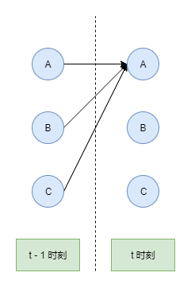
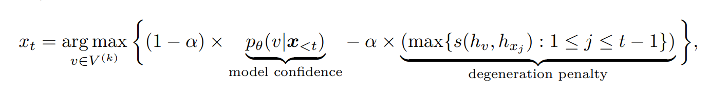

# 文本生成

[TOC]

## 引言

标准的 **语言模型** 就是 **时序模型**, 根据前 $n$ 个 token 去预测第 $n+1$ 个 token。

**文本生成** 任务其实就是 **序列生成** 任务, 和 NER 是类似的。

本文主要介绍 **文本生成** 的策略, 参考三篇 HuggingFace 的文章:

+ [Text generation strategies](https://huggingface.co/docs/transformers/generation_strategies)
+ [How to generate text: using different decoding methods for language generation with Transformers](https://huggingface.co/blog/how-to-generate)
+ [Generating Human-level Text with Contrastive Search in Transformers](https://huggingface.co/blog/introducing-csearch)

## 最佳策略

**最佳策略** 的名字是我自己取的, 其含义是选取所有 **文本序列** 中 **概率** 最高的序列作为结果。

### 穷举搜索 exhaustive search

很多时候, 利用计算机解决问题的核心思想就是: 穷举所有的可能性。我们设生成的序列长度为 $T$, 词表的大小是 $V$。文本生成任务就是每一步从 $V$ 个词语中选择一个出来, 那么一共有 $V^T$ 种可能的路径。

如果你熟悉 NER 任务以及 HMM 或者 CRF 模型的话, 应该很快就能反应过来, 这不是相同的问题吗? 那么可以相同的解码方式: **viterbi 算法**。其巧妙地缓解了 **穷举** 的压力。

其核心思想可以用下面的图和公式表示:

$$
S_{t}^{A} = max(S_{t-1}^{A} + E_{A}^{A}, S_{t-1}^{B} + E_{B}^{A}, S_{t-1}^{C} + E_{C}^{A}) \tag{1}
$$

其中, $S_{t}^{A}$ 表示的是 $t$ 时刻到达 $A$ 结点所有路径的最大分数; $E_{A}^{B}$ 表示从 A 结点转移到 B 结点的分数。

剩下就是 **动态规划** 问题了, 先前向求每一个结点的 $S$ 分数, 再回溯获得路径, 属于 **广度优先** 搜索。除此之外, **前向算法** 的思路也是差不过的。如果忘记了可以自行去找相关的资料。

我们知道, 对于长度为 $r$ 的列表, 如果用 `max` 函数去寻找最大值, 那么时间复杂度为 $O(r)$, 因为需要进行 $r-1$ 次 **比较**。这里算时间复杂度也是一样的。

不用 viterbi 算法, 虽然只需要 1 次 `max` 函数, 但是列表长度是 $V^T$, 因此时间复杂度是 $O(V^T)$, 如果使用 viterbi 算法, 需要使用 $T \cdot V$ 次 max 函数, 每一次的列表长度是 $V$, 因此时间复杂度是 $O(T \cdot V^2)$ 。

无论怎么处理, 都需要遍历所有的结点, 遍历次数是 $V^T$ 。

上面对于 NER 任务是没有问题的, 但是对于 **文本生成** 任务呢?

首先, 我们知道, 对于 NER 任务来说, 一般标签不会太多, 主要是 token 比较长, 此时 $V \ll T$, 用 viterbi 算法完全能够接受, 因为我们将时间复杂度从 指数级别 降到了 常数级别。但是对于 文本生成 任务来说, 标签集合就是词表啊, 一般情况下都会有几万个。在这种情况下, 往往是 $V \gg T$, 即使是 viterbi 算法, 时间也是不可接受的。

其次, 对于 NER 任务来说, 标签的转移概率是固定的, 但是对于 文本生成 任务来说, 标签的转移概率不是固定的, 每一次都需要通过模型获得。也就意味着, 在遍历每一个结点时, 我们都需要模型来计算下一步概率, 一共要计算 $V^{T-1}$ 次。虽然可以通过设置 batch_size 进行并行化运算, 但是大语言模型的计算依旧是十分缓慢的, 这一部分消耗的时间会远远大于上面计算的时间。

无论是上面哪一个因素, 都让我们没有办法选择 **穷举搜索**。

### 贪婪搜索 greedy search

**贪婪** 策略的思想就很简单了, 在生成文本时, 每一步我们只取概率最大的 token。此时 **比较** 的时间复杂度就是 $O(T \cdot V)$, 小了很多, 但是最主要的还是模型的计算次数下降了, 只需要 $T$ 次即可。

贪婪算法的最大问题是没有考虑到全局的状态, 如果 概率高的词语 藏在了 概率低的词语 后面, 那么就无法生成了, 效果自然也是不好的。

### 束搜索 beam search

这是 **穷举** 方案和 **贪婪** 方案的折中。在生成文本的每一步中, 我们保留概率最高的 $k$ 条路径。最后我们从生成的 $k$ 条路径中取概率最高的那一条即可。如果 $k=1$, 那么 **束搜索** 和 **贪婪搜索** 是没有区别的。

这里不再使用 `max` 函数了, 而是使用 `topk` 函数, **比较** 的时间复杂度是 $O(T \cdot k \cdot V)$ 。在 $k$ 值不是很大的情况下, 我们可以通过设置 batch_size 来并行计算, 那么此时的模型计算次数依然是 $T$ 。

这里多了一个 **超参数** $k$, 一般在代码中用 `num_beams` 表示。一般设置成 5 即可。

### "最佳策略" 的问题

概率最大的序列真的是我们想要的吗? 研究发现, beam search 一个很严重的问题, 那就是: 会生成 **重复文本**, 也就是一段文本反复出现。

一般的解释是, 高质量的人类写的文本并不服从词的概率分布。这很容易理解, 人类在写文本时当然不是按照概率来写啊, 而是按照 逻辑 或者 情感来写。但是对于模型来说, 一段文本后面接重复的文本可能才符合词的概率分布。

那么在这种情况下, 我们如何避免模型生成 **重复文本** 呢?

n-grams penalties 是一种策略, 即如果生成的文本中出现了长度为 $n$ 的重复片段, 那么就将这个序列剔除掉, 选择次优的序列继续生成。

这种策略对于 **摘要生成** 任务来说比较实用, 因为 **摘要** 需要的就是简洁, 不需要重复的文本。但是对于 **故事续写** 任务来说效果就很不好了。比方说, 如果故事是关于 乌鲁木齐 的, 你将 $n$ 设置为 4, 那么这个词在生成的小说中只会出现一次, 这显然是不合理的。

除此之外, 如果你生成的文本长度是可预测的, 比方说 **翻译** 和 **摘要** 任务, 那么 beam search 的效果还是很不错的。但是对于文本长度无限制的情况, 比方说 **故事续写** 和 **对话** 任务, 那么 beam search 的效果就不是很好。

为什么 **翻译** 和 **摘要** 任务生成的文本长度可预测呢? 对于 **翻译** 来说, 生成的文本长度可以根据输入的文本长度 和 对应的语种 大致估计出来; 对于 **摘要** 来说, 生成的文本长度可以通过你的训练集大致估计出来。

为什么效果相差很多呢? **翻译** 和 **摘要** 任务不需要模型有很强的创造性, 按照输入的文本来即可。但是对于 **故事续写** 来说, 我们肯定希望模型能输出具有创造性的内容。富有创造性的内容往往不是 "最优" 的序列。

因此, 我们的解码方式需要一定的 **随机性**, 这就是 **采样策略**。

## 采样策略

### 基础采样

我们延续 **穷举搜索** 的思想, 但是每一步不再取 **概率** 最高的 token 了, 而是根据词表的概率分布进行采样, 随机生成下一个 token。

这样做效果如何呢? 答案是很容易生成不连贯, 胡言乱语的句子。

我们可以简单的将词的概率分布分成两种形式:

+ flatten dist: topk 个词的 概率 差不多的
+ sharp dist: topk 个词的 概率 相差较大, top1 / top2 词的概率远远大于后面的词

根据概率论, 我们知道, flatten dist 为我们的输出带来了 "创造性", 因为生成的多样性增加了, 但同时也增加了的输出 "胡言乱语" 的可能性。现在的问题就是 flatten dist 过于 "自由", 我们需要对其进行限制, 使其更像 sharp dist, 减少其输出 "胡言乱语" 的可能性。

那么怎么做呢? 一种常用的方式是引入温度 $t$。logits 值在输入 softmax 函数之前先除以 $t$。如果 $t$ 值在 0 到 1 之间, logits 值会增大。由于 softmax 函数对于极端值是非常敏感的, 这使得词的概率分布更加 sharp, 扩大了不同词之间的概率差距。

如果 $t$ 值趋近于 0, 那么和 贪婪搜索 就没有区别了, 一般选择 0.7。

这种方式基本已经达到了我们的要求。但是, 在采样时, 概率过低的词还是有可能生成的。怎么避免呢? 当然是将概率过低的词直接截掉咯。

### top-k 采样 和 top-p 采样

**top-k 采样** 是选取概率最高的 $k$ 个词进行采样。

**top-p 采样** 则先将所有的词按照概率大小排序, 选取 累积概率分布 大于 $p$ 的最少 token 集合进行采样。

两种方式的思想都很直接, 但是都有问题:

对于 top-k 采样来说, 如果 $k$ 值过小, 对于 flatten dist 来说, 可能会将概率相差不多的词语给截掉, 降低了模型的 "创造性"; 如果 $k$ 值过大, 对于 sharp dist 来说, 可能还是会有很多低概率的 token。

对于 top-p 采样来说, 如果 $p$ 值过小, 对于 flatten dist 来说, 还是会截掉部分概率较高的 token, 降低模型的 "创造性"; 如果 $p$ 值过大, 对于 sharp dist 来说, 可能会包含非常多低概率的 token。

HuggingFace Transformers 中实现了一种更好的方式: 同时设置 $k$ 和 $p$ 的值。

如果我们设置 $k=50$, $p=0.95$, 那么 Transformers 会首先将 logits 矩阵按照从大到小排序, 然后取前 50 个词, 输入 softmax 函数中, 获得这 50 个词的概率分布后, 计算累积概率分布, 找到 0.95 的位置, 后面的词也都去掉, 构成候选 token 集合。然后在这个候选集合中进行采样。

## 最佳策略 (二)

我们可以将 **最佳策略** 称为 deterministic method, 因为生成的序列是固定的; **采样策略** 称为 stochastic method, 因为生成的序列具有随机性。

在实际使用时, 比方说 **智能客服系统**, 我们肯定希望模型的输出是 稳定 的, 不稳定的输出可能会带来不必要的麻烦。那么此时又回到了 **最佳策略** 上。能不能使用 **最佳策略** 生成质量高的文本呢?

### 对比搜索 contrastive search

这个方案是最近 (NeurIPS 2022) 提出的, 属于目前的 SOTA 方案, 并被 HuggingFace Transformers 库采纳。

束搜索的主要问题是会生成重复的, 不自然的文本, 我们称为 **模型退化** (model degeneration)。而 **对比搜索** 主要的改进就是对相似文本进行惩罚。方式如下:

1. 在每一步预测时, 我们将已有的文本称为 **前缀文本** (prefix context)。根据 **前缀文本**, 通过模型, 可以计算出来下一个词的概率。有了词表的概率分布后, 取概率最高的 $k$ 个词作为 **候选词** 集合, 我们将每一个 **候选词** 的生成概率称为 **model confidence** 。
2. 计算 **候选词** 和 **前缀文本** 的相似性分数, 方式如下: 首先, 将 **前缀文本** 和 **候选词** 拼接在一起, 输入模型中, 进行编码, 得到每一个词的向量; 然后, 计算 **前缀文本** 中的每一个词向量和 **候选词** 向量之间的 cosine 相似度, 取最大值作为 **候选词** 和 **前缀文本** 的相似度, 记作 **degeneration penalty** 。
3. 用 model confidence 分数减去 degeneration penalty 分数, 并用 $\alpha$ 参数调节两部分的占比, 作为最终的候选词分数。取分数最高的词作为下一个词。

用公式表示如下:

其中 $x_t$ 表示在第 $t-1$ 步预测的第 $t$ 步词语的 ID 值, $x_{\lt t}$ 表示 **前缀文本**。

$k$ 表示侯选词个数, $V$ 表示词表, $V^{(k)}$ 表示候选词集合, 即概率最高的 $k$ 个词, $v$ 表示某一个候选词。

$\theta$ 表示模型, $p_{\theta}(v | x_{\lt t})$ 表示候选词 $v$ 的生成概率, 也被称为 **model confidence** 。

$h_v$ 表示候选词 $v$ 的词向量, $j$ 表示 **前缀文本** 中词语的索引, $h_{x_{j}}$ 表示 **前缀文本** 中索引为 $j$ 词语的词向量。

$s(,)$ 表示的是 cosine 相似性函数。$\alpha$ 表示 degeneration penalty 部分的占比, 取值在 0 到 1 之间。

结合上面的说明, 这个公式应该不难看懂。

整体方案采用的是 **贪婪** 方式, 如果 $\alpha$ 值为 0, 整个方案和 贪婪搜索 的结果是一致的。因此, 这个方案有和 贪婪搜索 一样的问题: 局部最优。

需要注意的是, 在第 $t - 1$ 步计算出来的候选词词向量, 可以用于第 $t$ 步的词表预测, 因此每一步需要 $k$ 次模型计算, 计算量和 束搜索 是一致的。这里也表明了为什么不能多保留一些路径, 而选择贪婪策略: 计算量太大吃不消。

整个方案一共有两个超参数: $k$ 和 $\alpha$ 。一般情况下, $k = 5$, $\alpha = 0.6$ 。

## 总结

**文本生成** 本质上就是 **序列生成** 问题。但是由于 **计算量** 的限制以及 **重复文本** 的问题, 而产生了不同的策略方案。随着 AIGC 越来越火, 这类方案肯定会越来越多, 也是值得关注的方向之一。

之后有时间可以读一下相关论文, 并复现论文中的实验:

+ [Contrastive Search Is What You Need For Neural Text Generation](https://arxiv.org/abs/2210.14140)
