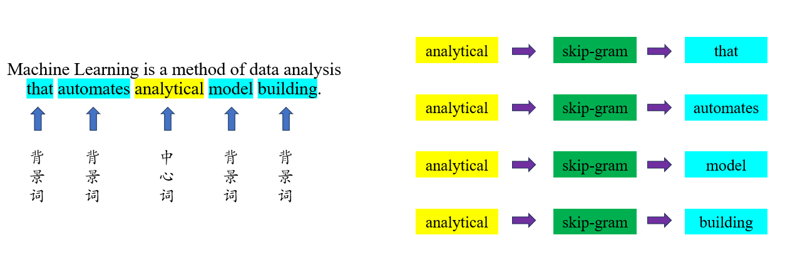

# word2vec 与 对比学习

[TOC]

## preface

本来是想重新了解 **对比学习** 的相关知识, 后来发现其和 [word2vec](https://arxiv.org/abs/1310.4546) 有非常大的相关性。本文将重新梳理 word2vec 相关的知识, 并且和 **对比学习** 之间构建相关性, 方便入门 **对比学习**。

个人认为, 入门 NLP 不应该过分关注 word2vec 算法。本文的主要目的是构建一个相对完善的知识网, 因此会提及很多其它相关的知识。如果你是想入门 NLP, 不建议看这篇文章。

作为入门 对比学习 的文章, 如果想对 NCE (nnoise contrastive estimation) 有较为深刻的了解, 则非常推荐阅读。

## introduction

在早期的自然领域中, **词语向量** 都是以 **独热编码** (one-hot encoding) 的形式出现的。一段文本中所有的 **词语向量** 相加就构成了 **文本 TF 向量** ([CounterVectorizer](https://scikit-learn.org/stable/modules/generated/sklearn.feature_extraction.text.CountVectorizer.html)), 再和 idf 向量进行 **逐位相乘** (element-wise multiplication) 变成 **文本 TF-IDF 向量** ([TfidfVectorizer](https://scikit-learn.org/stable/modules/generated/sklearn.feature_extraction.text.TfidfVectorizer.html))。

更近一步, 可以利用 LSA ([TruncatedSVD](https://scikit-learn.org/stable/modules/generated/sklearn.decomposition.TruncatedSVD.html)) 或者 LDA ([LatentDirichletAllocation](https://scikit-learn.org/stable/modules/generated/sklearn.decomposition.LatentDirichletAllocation.html)) **主题模型** 对 **文本向量** 进行 **降维** 操作, 从 稀疏向量 (sparse vector) 变成 稠密向量 (dense vector)。可以看出, 在这个时期, 大家的研究方向主要是 文本向量, 而不是 词语向量。

word2vec 算法要做的事情就是研究 词语向量, 不再使用 独热编码 这种 稀疏向量, 而是将其转化为 稠密向量, 方便进行后续的运算。我们将这种 稠密向量 称为 **词嵌入** (word embedding)。

我们可以认为 独热编码 是一种集中式的表示方式, 也就是 信息 集中在某一个维度上, 其它维度的值为 0。其实, 所有的 稀疏向量 可以理解成集中式的, 高维的表示方式, 包括 文本 TF / TF-IDF 向量。

而 词嵌入 和 文本主题向量 则不同, 它们属于 稠密向量, 信息分散在每一个维度中, 此时自然不需要那么高的维度。因此, 这类向量也被称为 **distributed representation**, 可以翻译成 分散式表示。

和 词嵌入 相比, 词语 独热编码 的优缺点有:

+ 优点: 独热编码 可以借助 稀疏向量 相关的技术, 计算快, 省内存
+ 缺点: 无法探索词与词之间的相关性 (任意两个词向量点乘的结果都是 0)

word2vec 和 主题模型 虽然都是去寻找 稠密向量, 但是思想上发生了很大的变化。在 主题模型 中, 我们还在尝试为 文本向量 中的每一个维度寻找 "意义"。每一个维度都有一个类似 idf 向量的 **主题向量**, 通过研究 **主题向量** 来理解 文本向量 每一个维度的意义。但是在 word2vec 中, 我们不再尝试为 词向量 的每一个维度去寻找 "意义", 只是希望 含义相近 的词语分布在 向量空间 中相近的位置即可。

词嵌入和神经网络的思想很相似。在神经网络中, 每一层输出的特征是之前特征的组合, 我们不会去探索每一层输出特征维度的意义。我们只是反复的计算, 最终能得到我们想要的结果即可。

综上所述, word2vec 算法要做的事情是: 为词表中的每一个词寻找一个 稠密向量/分散式表示 (或者说将词表直接映射到一个向量空间中), 使得意思相近的词语在空间中的位置相近, 同时不探索向量空间每一个维度的意义。

我们可以这样理解 NLP 深度模型 (包括 LSTM, BERT, GPT 等等): 首先将 token 直接映射到一个向量空间中, 经过一系列的运算来达成目标 (文本分类, 结构化预测, 完形填空, 词语接龙等等)。在训练模型时, 我们要做的事情就是, 优化每一个 token 在向量空间中的位置, 以及一系列运算中的参数, 使得 loss 值越低越好。

也就是说, NLP 深度模型第一步做的事情和 word2vec 算法要做的事情是相同的。也正是因为此, 在 BERT 和 GPT 等语言模型出来之前, 经常会用 word2vec 算法得到的 词嵌入 来初始化 深度模型 的 词嵌入 层。

## pretext task

pretext task 的意思是 **代理任务**, 属于 对比学习 中的概念, 和 **预训练任务** (pretrain task) 的作用是一致的。我们可以认为是同一个事情在不同领域有不同的表述方式。

上一部分说了, word2vec 算法要让意思相近的词语分布在 向量空间 中相近的位置。如何做到这样的一件事情呢? 最自然的想法应该是基于类似 [WordNet](https://en.wikipedia.org/wiki/WordNet) 这样的 **同义词词典** 来做文章。

但是, 在 word2vec 中, 并不是这样做的, 而是使用 skip-gram 和 cbow 这种 **代理任务** 来实现。换言之, word2vec 做的事情是: 训练 skip-gram 或者 cbow 任务的模型, 训练完成后, 取神经网络中的一部分作为 词嵌入。此时, 有很大的概率, 意思相近的词语会分布在向量空间中相近的位置。

不仅如此, 如果模型训练的比较好的话, 词嵌入还有 **类比** (analogy) 的能力, 即: $\mathrm{vec(king) - vec(man) \approx vec(queen) - vec(woman)}$。

这和用 预训练模型 作为初始化参数微调 下游任务 的道理是相似的。至于为什么会有这么神奇的效果, 目前并没有非常好的解释, 只能说通过 代理任务 确实学习到了相关信息吧。当然, 上面所说的效果并不是可控的, 有可能训练完成后 相似 和 类比 的能力都没有。

词嵌入 模型的好坏很难去评测。最好的方式是直接用 下游任务 进行测试。另一种常用的方式是测试 **类比** 的能力。目前开源出来的 **类比** 数据集有: [WordSim353](http://alfonseca.org/eng/research/wordsim353.html) 和 [Chinese Word Vectors](https://github.com/Embedding/Chinese-Word-Vectors)。

下面就让我们来看看 skip-gram 和 cbow 这两个任务吧。

## skip-gram

在 NLP 中, 有一句名言: You shall know a word by the company it keeps. 意思是你需要根据 **上下文** 来判断一个词语的含义。所谓的 **上下文**, 指的就是一篇文章中其它的语句。在阅读文章时, 这个 上下文 有可能相隔非常长。但是在 NLP 中, 上下文 指的是某一个词周围的一些词, 相隔太远的词语很难研究相关性。

在一句话中, 对于某一个词 $w$ 来说, 我们将其左边的 $m$ 个词和右边的 $m$ 个词称为 **上下文** (context) 或者 **背景词**, 用符号 $c$ 来表示。和 **背景词** 相互对应, 我们将 $w$ 称为 **中心词**。

我们将 中心词 和其相关的 背景词 放在一起, 称为 **窗口** (window), $m$ 称为 **窗口大小** (window size)。也就是说, 一个 **窗口** 中有 $2m+1$ 个词语。

skip-gram 做的事情是: 输入中心词 $w$, 输出背景词 $c$ 的概率分布。或者说, 根据中心词 $w$ 来预测背景词 $c$。下图形象化的表示出其含义:



在上图中, 窗口大小 $m=2$。对于中心词 `analytical` 来说, 有 `the`, `automates`, `model` 和 `building` 四个背景词。在训练阶段, 一共产生四个样本, 使用 softmax 回归计算 loss。

word2vec 属于深度学习早期的模型, 只有两层, 用 PyTorch 实现的代码如下:

```python
import torch
from torch import nn, LongTensor, Tensor


class SkipGram(nn.Module):
    def __init__(self, vocab_size: int, hidden_size: int):
        super().__init__()

        self.input_embed = nn.Embedding(vocab_size, hidden_size)
        self.output_embed = nn.Linear(hidden_size, vocab_size, bias=True)
    
    def forward(self, input_ids: LongTensor, labels: LongTensor = None) -> Tensor:
        # input_ids & labels: [batch_size, ]
        logits: Tensor = self.output_embed(self.input_embed(input_ids))

        if labels is None:
            return logits  # [batch_size, vocab_size]

        loss = nn.functional.cross_entropy(logits, labels)
        return loss  # [batch_size, ]
```

最终, `input_embed` 部分就是我们需要的部分, 作为 词嵌入, 也就是 word2vec 算法需要得到的内容。而 `output_embed` 部分则直接丢弃掉。

此时, 你或许会产生一个疑问: 在数据集中, 一个输入有多种输出, 这样训练分类任务真的没问题吗? 这里需要我们从另一个角度来理解 loss 函数。虽然任务描述用的是 softmax 回归, 但是做的事情是 MLE 任务。下面我们来看看怎么理解这句话。

模型 $\theta$ 要做的事情是, 根据输入 $w$, 估算输出 $c$ 的概率, 用条件概率表示是: $p_{\theta}(c|w)$。对于 softmax 回归来说, loss 值是 目标类概率的负对数 (或者说 目标类的信息量), 用公式表示是:

$$
\mathrm{loss} = - \log p_{\theta}(c|w) \tag{4.1}
$$

在训练集中, 中心词 $w$ 和背景词 $c$ 一起出现的次数肯定不止一次。假设在训练阶段的某一次迭代中, 模型输入的中心词都是 $w$, 但是输出的背景词 $c$ 是从数据集中采样得到的, 则 loss 可以写成:

$$
\begin{align*}
    \mathrm{loss} = - \frac{1}{n} \sum_c \log p_{\theta}(c|w)
\end{align*}
\tag{4.2}
$$

观察上述公式, 结合 **期望** 的定义, 我们可以得到:

$$
\mathrm{loss} = - \mathbb{E}_{c \sim P_d(C|w)} \big [ \log p_{\theta}(c|w) \big ]
\tag{4.3}
$$

其中, $P_d$ 表示数据集中的概率分布, $P_{\theta}$ 表示模型估算出来的概率分布。$P_d(C|w)$ 表示在数据集中, 给定中心词 $w$ 的情况下, 背景词 $c$ 的概率分布。这个概率分布我们是不知道的, 但是可以从中进行采样。我们希望模型估算出来的 $P_{\theta}(C|w)$ 和 $P_d(C|w)$ 越接近越好。

同理, 中心词 $w$ 在训练集中是反复出现的, 其出现的概率符合概率分布 $P_d(W)$, 则整个训练过程的 loss 可以写成:

$$
\mathrm{loss} = -\mathbb{E}_{w \sim P_d(W)} \bigg[ \mathbb{E}_{c \sim P_d(C|w)} \big [ \log p_{\theta}(c|w) \big ] \bigg]
\tag{4.4}
$$

个人认为, 从 **期望** 的角度来理解 skip-gram 模型的 loss 至关重要。虽然对于输入 $w$ 来说, 输出 $c$ 并不是唯一的, 但是两者在数据集中共同出现的次数一般也不止一次。而训练的过程就是: 如果 $w$ 和 $c$ 共同出现的次数越多, logit 值越大; 反之越小。因此整个训练过程是成立的。

换言之, 我们现在在做的事情并不是 分类, 而是在拟合数据集的概率分布。更加合理的表述方式是, 我们在进行 **最大似然估计** (Maximum Likelihood Estimation): 假设周围词的概率分布只和中心词有关, 和其它的无关, 那么一个句子的概率可以表示为:

$$
L_{MLE} = \prod_{t=1}^{T} \prod_{-m \le j \le m, j \ne 0} p_{\theta} (w^{(t+j)}|w^{(t)}) \tag{4.5}
$$

其中, $w^{(t)}$ 表示一个句子中第 $t$ 个词语。整个训练集的概率就是所有句子概率的积。

接下来, 我们从 **检索** 的角度来理解。在上面所说的网络结构中, 如果不考虑 `output_embed` 层的 bias 参数, 那么我们可以将其理解为是一个编码器。那么, 此时就可以和 双塔模型 (dual encoder) 联系起来。其中, `input_embed` 类似于 `query` 编码器, 而 `output_embed` 类似于 `key` (或者说 `document`) 编码器。我们要做的事情就是, 输入一个词语 $w$, 作为 query, 查询在其周围出现概率最大的词语。在 [MoCo](https://arxiv.org/abs/1911.05722) 论文中, 也提到了类似的思想。对于 word2vec 算法中, 我们可以理解为 中心词 和 背景词 进行 对比学习。

在说清楚上面的内容后, 我们再思考一个问题: $p_{\theta} (c|w)$ 的计算问题。我们设 $V$ 是词表, $s_{\theta}(w, c)$ 表示在给定 $w$ 的情况下 $c$ 的 logit 值。则:

$$
p_{\theta} (c|w) = \frac{\exp(s_{\theta}(w, c))}{\sum_{c^{\prime} \in V} \exp(s_{\theta}(w, c^{\prime}))} = \frac{\exp(s_{\theta}(w, c))}{Z_{\theta}(w)}
\tag{4.6}
$$

我们将 $Z_{\theta}(w)$ 称为 **配分函数**。此时就产生了新的问题: **配分函数** 的计算问题。词表中有多少个词, 我们就要进行多少次指数计算, 再求和。如果词表中只有 5 万个词, 那么还是可以计算的。但是如果词表中有几十万个, 甚至几百万个词呢? 此时的计算开销非常大。接下来, 让我们来看看如何解决这个问题。

## noise contrastive estimation

NCE 的目的就是解决分类类别过多的情况, 属于 对比学习 的基石。下面让我们看看具体是怎么做的。

这里, 我们接着公式 $(4.3)$ 的假设往下走, 也就是在训练阶段的某一次迭代中, 模型输入的中心词都是 $w$。然后, 我们设定好一个 噪声分布 $P_n(C|w)$, 从这个分布中采样出的样本 $c$ 称为 **噪声样本**。之前也说过了, 在数据集中存在 $P_d(C|w)$, 我们不知道具体的分布, 但是可以从中进行采样, 我们将采样出来的样本 $c$ 称为 **数据样本**。

NCE 要做的事情就是在给定 $w$ 的情况下, $c$ 从噪声分布 $P_n(C|w)$ 中采样出来的概率大还是从数据集 $P_d(C|w)$ 分布中采样出来的概率大。或者说, $c$ 是 **噪声样本** 的概率大还是 **数据样本** 的概率大。

我们用 $D=1$ 表示 $c$ 从数据集中采样出来的, $D=0$ 表示 $c$ 从噪声分布中采样出来的。$k$ 表示 **噪声样本** 比 **数据样本** 的重要程度。或者说, 计算概率时, 如果 **数据样本** 的权重值是 $1$, 那么 **噪声样本** 的权重值就是 $k$。由此我们可以知道:

$$
\begin{gather*}
    p(D=1, c|w) = \frac{1}{k+1} \cdot p_d (c|w) \tag{5.1} \\
    p(D=0, c|w) = \frac{k}{k+1} \cdot p_n (c|w) \tag{5.2}
\end{gather*}
$$

$D=0$ 和 $D=1$ 是互斥事件, 则对于整个采样过程来说:

$$
p(c|w) = p(D=1, c|w) + p(D=0, c|w) \tag{5.3}
$$

条件概率公式是: $p(a, b) = p(a|b) \times p(b)$, 给所有概率加上条件后依然成立, 即 $p(a, b|c) = p(a|b, c) \times p(b|c)$。

由上面的结论, 并根据公式 $(5.1)$ 到 $(5.3)$, 可知:

$$
\begin{gather*}
    p(D = 1|c, w) = \frac{p(D=1, c|w)}{p(c|w)} = \frac{p_d(c|w)}{p_d(c|w) + k \cdot p_n(c|w)} \tag{5.4} \\
    p(D = 0|c, w) = \frac{p(D=0, c|w)}{p(c|w)} = \frac{k \cdot p_n(c|w)}{p_d(c|w) + k \cdot p_n(c|w)} \tag{5.5}
\end{gather*}
$$

上面也说过了, NCE 要做的事情是, 给定 $w$ 和 $c$, 判断 $c$ 是从 $P_d(C|w)$ 中采样出来的还是从 $P_n(C|w)$ 中采样出来的。那么损失函数可以写成:

$$
\mathrm{loss} = - \mathbb{E} \big [\log p (D|c, w) \big ] = - \sum_c p(c|w) \cdot \log p (D|c, w) \tag{5.6}
$$

由于现在我们用神经网络来估算 $p_d(c|w)$, 那么在公式 $(5.1)$ 到 $(5.5)$ 中, 所有的 $p_d(c|w)$ 都可以替换成 $p_{\theta}(c|w)$, 代入到公式 $(5.6)$ 进行化简, 可以得到:

$$
\begin{align*}
\mathrm{loss} = &- \mathbb{E}_{c \sim P_d(C|w)} \bigg [ \log \frac{p_{\theta} (c|w)}{p_{\theta} (c|w) + k \cdot p_n (c|w)} \bigg] \\
&- k \cdot \mathbb{E}_{c \sim P_n(C|w)} \bigg[ \log \frac{k \cdot p_n (c|w)}{p_{\theta} (c|w) + k \cdot p_n (c|w)}\bigg]
\end{align*}
\tag{5.7}
$$

如果对公式 $(4.3)$ 和公式 $(5.7)$ 进行求导, 可以发现发现当 $k \to \infin$ 时, 两者是相等的。因此, 我们可以用 NCE 来代替 MLE, 同时 $k$ 越大越好。

我们绕了一大圈, 找到了和 MLE 任务等价的 NCE 任务。可是, 配分函数 $Z_{\theta}(w)$ 的计算还是没有解决啊。一种常见的方式是: 假设 $Z_{\theta}(w)$ 的值就是常数 $1$, 也就是说 $p_{\theta}(c|w) = \exp(s_{\theta}(w, c))$。这种方式被称为 self normalization。至于为什么能这样做, 目前没有特别强的理论证明, 后面会说说我的理解。

至此, NCE 的理论推导就结束了。那么, 怎么实现呢?

上面说过了, $k$ 值要越大越好, 因为这样才能逼近 MLE 任务。一般情况下, 是直接从数据集分布 $P_d(C|w)$ 中采样出来一个样本, 从噪声分布 $P_n(C|w)$ 中采样出来 $k$ 个样本。$k$ 的取值一般在 $5$ 左右, 也有取 $1$ 的, 属于超参数, 效果怎么好怎么来。

至于噪声分布 $P_n(C|w)$, 一般情况下不会考虑 $w$, 也就是对于所有的 中心词 用同一个分布, 可以是均匀分布, 也可以是 词语的词频。一般使用后者, 也是效果怎么好怎么来。

我们用 $\sigma$ 表示 sigmoid 函数。对于数据集中采样出来的样本, 其 loss 的计算方式如下:

$$
\begin{align*}
    \mathrm{loss}_d &= \log \frac{p_{\theta} (c|w)}{p_{\theta} (c|w) + k \cdot p_n (c|w)} \\
    &= \log \frac{1}{1 + \exp (\log \frac{k \cdot p_n (c|w)}{p_{\theta} (c|w)}) } \\
    &= \log \sigma(\log \frac{p_{\theta} (c|w)}{k \cdot p_n (c|w)}) \\
    &= \log \sigma(\log \frac{\exp(s_{\theta}(w, c))}{k \cdot p_n (c|w)}) \\
    &= \log \sigma(s_{\theta}(w, c) - \log (p_n (c|w)) - \log k) \tag{5.8}
\end{align*}
$$

同理, 对于 噪声分布 中采样出来的样本, 其 loss 的计算方式如下:

$$
\begin{align*}
    \mathrm{loss}_n &= \log \frac{k \cdot p_n (c|w)}{p_{\theta} (c|w) + k \cdot p_n (c|w)} \\
    &= \log \left[ 1 - \frac{p_{\theta} (c|w)}{p_{\theta} (c|w) + k \cdot p_n (c|w)} \right ] \tag{5.9}
\end{align*}
$$

结合公式 $(5.8)$ 和 $(5.9)$, 我们就可以用 [BCEWithLogitsLoss](https://pytorch.org/docs/stable/generated/torch.nn.BCEWithLogitsLoss.html) 实现了。参考 [Pytorch-NCE](https://github.com/Stonesjtu/Pytorch-NCE), 这里给出代码:

```python
import math 

import torch 
from torch import nn, Tensor 
from torch.nn import functional as F


def nce_loss(
    target_logits: Tensor,    # [batch_size, ]
    target_logprobs: Tensor,  # [batch_size, ]
    noise_logits: Tensor,     # [batch_size, num_noise]
    noise_logprobs: Tensor,   # [batch_size, num_noise]
) -> Tensor:

    """
    logits 表示模型计算出来的分数, logprobs 表示预先设置好的 噪声分布 的对数值;
    target 表示从数据集采样的词, noise 表示从 噪声分布 中采样的词。
    """

    logits = torch.cat([
        target_logits.unsqueeze(-1), 
        noise_logits
    ], dim=-1)  # [batch_size, num_noise + 1]

    logprobs = torch.cat([
        target_logprobs.unsqueeze(-1),
        noise_logprobs
    ], dim=-1)  # [batch_size, num_noise + 1]

    noise_ratio = noise_logits.size(-1)

    scores = logits - logprobs - math.log(noise_ratio)  # [batch_size, num_noise + 1]

    labels = torch.zeros_like(logits)  # [batch_size, num_noise + 1]
    labels[..., 0] = 1.

    # 需要注意, 这里是 相加, 不是 取平均, 不知道为什么的可以参考公式 5.7
    loss = F.binary_cross_entropy_with_logits(
        scores, labels, reduction="none"
    ).sum(dim=-1)  # [batch_size, ]

    return loss.mean()
```

从公式 $(5.8)$ 和 $(5.9)$ 可以看出来, 如果 $c$ 是从数据集 $P_d(C|w)$ 中采样出来的, 我们优化的方向是 $s_{\theta} (c, w)$ 变大; 如果 $c$ 是从噪声分布 $P_n(C|w)$ 中采样出来的, 我们优化的方向是 $s_{\theta} (c, w)$ 变小。

而在 MLE 中, 对于从数据集 $P_d(c|w)$ 中采样出来的 $c$, 我们优化的方向是 $s_{\theta} (c, w)$ 变大; 其它所有可能的 $c$, 我们优化的方向是 $s_{\theta} (c, w)$ 变小。如果此时我们将 配分函数 $Z_{\theta} (w)$ 的值固定为 $1$, 会发生什么呢? 优化方向只有前半部分, 没有后半部分, 所有的 $s_{\theta} (c, w)$ 都是越大越好, 此时训练肯定会崩溃。

这也解释了为什么 NCE 能使用 self normalization, 而 MLE 任务不可以的原因。同时, skip-gram 属于 代理任务, 训练完成后这个任务就没有意义了。即使最后 $\exp(s_{\theta} (c, w))$ 和 $p_{\theta} (c|w)$ 相差甚远也没有关系, 只要优化方向是相同的即可。我们需要的仅仅是 词嵌入 而已, 只要 词嵌入 的效果好即可。

也就是说, NCE 做的事情是: 对于训练样本 $(w, c)$, 优化参数 $\theta$, 使得 $s_{\theta} (w, c)$ 值变大, 同时随机从词表中选择 $k$ 个词 $c^{\prime}$, 使得 $s_{\theta} (w, c^{\prime})$ 值变小。而 $P_n(C|w)$ 起到控制更新程度的作用: 对于经常采样到的噪声样本, 减少更新幅度; 对于不经常采样到的噪声样本, 增加更新幅度。

## negative sampling

其实, 在 word2vec 中, 真正用于解决 配分函数 计算问题的不是 NCE, 而是 **负采样** (negative sampling), 两者非常相似。

首先, 我们起一个名字。将从数据集中采样出来的样本称为 **正样本**, 从噪声分布中采样出来的样本称为 **负样本**。现在要做的事情是, 给定 $w$ 和 $c$, 判断两者是 正样本 的概率高还是 负样本 的概率高。

对于每一个 **样本** $(w, c^{pos})$, 我们将其本身作为 **正样本**, 从噪声分布中采样出来 $k$ 个 $c^{neg}$, 和 $w$ 一起构成 **负样本**。我们用 $\sigma(s_{\theta} (w, c))$ 表示 $w$ 和 $c$ 是正样本的概率, 则:

$$
\begin{align*}
    \mathrm{loss} &= - \log \sigma (s_{\theta} (w, c^{pos})) - \sum_{c^{neg}} \log \big [ 1 - \sigma (s_{\theta} (w, c^{neg})) \big ] \\
    &= - \log \sigma (s_{\theta} (w, c^{pos})) - \sum_{c^{neg}} \log \big [\sigma (-s_{\theta} (w, c^{neg})) \big ]
\end{align*}
\tag{6.1}
$$

需要注意的是, 虽然 loss 的计算用到了 逻辑回归, 但是和 逻辑回归 完全是两件事! 现在一个 **样本** 由 一个 **正样本** 和 $k$ 个 **负样本** 构成。不要将 **样本** 和 **正样本** 混为一谈。注意公式 $(6.1)$ 是求和, 不是取平均数！对于不同 **样本** 的 loss, 我们才需要取平均数！

观察公式 $(6.1)$ 和公式 $(5.8)$ 以及 $(5.9)$, 会发现 **负采样** 和 NCE 本质上是一样的, 但是 **负采样** 的 loss 没有考虑 **噪声分布** 的影响。只有当 NCE 中的噪声分布使用 均匀分布 时, 两者才是一致的。这样造成的问题是: **噪音分布** 对训练结果的影响非常之大。在 word2vec 中, **噪声分布** 一般使用 词频 的 $0.75$ 次方作为 采样权重。

对于 NCE 来说, 排除 self normalization 的影响, 和 MLE 任务是相似的。然而, 对于 **负采样** 来说, 和 MLE 任务就没有很强的关联性了, 但是两者的 **优化方向** 是相同的 (在 NCE 部分已经说过了)。

## cbow

上面主要介绍了 skip-gram 任务, 下面让我们来看看 cbow 任务。skip-gram 是根据 中心词 输出 背景词 的概率分布, 而 cbow 是根据 背景词 输出 中心词 的概率分布。此时背景词有多个, 怎么办呢? 取平均。

这里不绕弯了, 直接给出代码:

```python
import torch
from torch import nn, LongTensor, Tensor


class CBOW(nn.Module):
    def __init__(self, vocab_size: int, hidden_size: int):

        super(CBOW, self).__init__()

        self.input_embed = nn.Embedding(vocab_size, hidden_size)
        self.output_embed = nn.Linear(hidden_size, vocab_size, bias=True)

    def forward(self, input_ids: LongTensor, labels: LongTensor = None) -> Tensor:
        # input_ids: [batch_size, window_size * 2]
        # labels: [batch_size, ]

        # [batch_size, window_size * 2, hidden_size]
        word_vectors = self.input_embed(input_ids)
        # [batch_size, hidden_size]
        context_vectors = torch.mean(word_vectors, dim=1)
        # [batch_size, vocab_size]
        logits = self.output_embed(word_vectors)

        if labels is None:
            return logits

        # [batch_size, ]
        loss = nn.functional.cross_entropy(logits, labels)
        return loss
```

虽然上面使用 softmax 回归, 但是其本质是 MLE 任务。也有 配分函数 的计算问题, 可以用 NCE 或者 负采样 的方式进行估算。

由此可以发现, cbow 输入的多样性远远大于 skip-gram, 因此概率分布的拟合难度更高, 需要更多的数据才能达到比较好的效果。所以, cbow 在大规模语料库下的效果比较好, skip-gram 在小规模语料库下的效果比较好。

## subsampling

什么是 subsampling 呢? [springer link](https://link.springer.com/referenceworkentry/10.1007/978-94-007-0753-5_2909) 给出的定义是: "Subsampling refers to collecting data in two or more stages at successive levels of observation". 个人认为, 翻译成 **二次采样** 是最好的, 属于 **统计学** 的范畴。

而在 CNN 网络中的 pooling 层, 使用 [downsampling](https://en.wikipedia.org/wiki/Downsampling_(signal_processing)) 这个词更好, 翻译成 **下采样**。与之相反的是 [upsampling](https://en.wikipedia.org/wiki/Upsampling) **上采样**。两者同属于 [resampling](https://en.wikipedia.org/wiki/Sample-rate_conversion) **重采样**, 都是 **信号处理** 领域的相关概念。

在 word2vec 中, subsampling 做的事情是 去除高频词。每一个词被删除的概率是:

$$
p(w^{deleted}) = \max \left ( 1 - \sqrt{\frac{t}{f(w)}}, 0 \right)
\tag{7.1}
$$

其中, $f(w)$ 表示的是 词频。如果 $w$ 的 词频 小于 $t$, 则其一定不会被删除; 如果 $w$ 的 词频 大于 $t$, 则有一定概率被删除, 且越大删除的概率越大。$t$ 属于超参数, 一般取 $10^{-4}$。

这一步属于数据预处理的步骤。在选取背景词时, 会跳过被删除的词。

举例来说, 在 "Machine learning is a method of data analysis that automates analytical model building" 这句话中, "is" 和 "a" 被删除了。如果窗口大小为 $2$, 则:

+ "method" 的 背景词 是: "machine", "learning", "of" 和 "data"
+ "machine" 的 背景词 是: "learning", "method"

## conclusion

本文详细介绍了 word2vec 算法以及如何用 **NCE** 和 **负采样** 来解决 **配分函数** 的计算问题。同时也和 **对比学习** 建立了联系。希望能对你有所帮助。

其实 word2vec 算法并没有说完, 解决 **配分函数** 的计算还有一种方式: hierarchical softmax。其和 对比学习 关系不大, 同时本文已经很长了, 之后有机会再来学习吧。

## References

word2vec 算法:

+ [Word2vec with PyTorch: Implementing the Original Paper](https://towardsdatascience.com/word2vec-with-pytorch-implementing-original-paper-2cd7040120b0)
+ [[MXNet/Gluon] 动手学深度学习第十六课：词向量（word2vec）](https://www.bilibili.com/video/BV12W411v7Ga)
+ [word2vec google 项目](https://code.google.com/archive/p/word2vec/)
+ [14.2. 近似训练](https://zh.d2l.ai/chapter_natural-language-processing-pretraining/approx-training.html)
+ [Word2vec embeddings](https://radimrehurek.com/gensim/models/word2vec.html)

NCE 算法:

+ [［硬核系列］噪声对比估计Noise Contrastive Estimation（NCE）](https://www.bilibili.com/video/BV1mL4y137Ja)
+ [Noise Contrastive Estimation 前世今生——从 NCE 到 InfoNCE](https://zhuanlan.zhihu.com/p/334772391)
+ [求通俗易懂解释下nce loss？](https://www.zhihu.com/question/50043438)
+ [[译] Noise Contrastive Estimation](https://zhuanlan.zhihu.com/p/76568362)
+ [tf.nn.nce_loss](https://www.tensorflow.org/api_docs/python/tf/nn/nce_loss)
+ [Candidate Sampling](https://www.tensorflow.org/extras/candidate_sampling.pdf)
