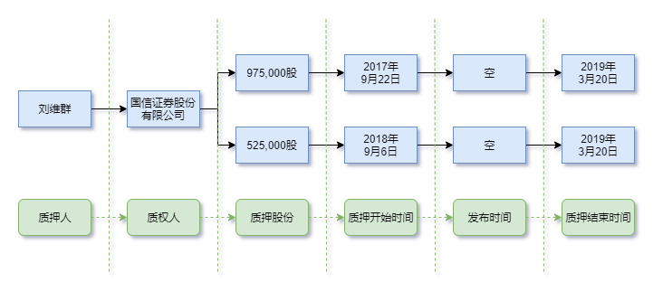

# 文档级事件抽取介绍

[TOC]

## 简介

本文主要介绍目前的一些文档级事件抽取方案, 涉及到的论文主要有以下的五篇:

+ DCFEE: [论文](https://aclanthology.org/P18-4009/)
+ Doc2EDAG: [论文](https://arxiv.org/abs/1904.07535) [代码](https://github.com/dolphin-zs/Doc2EDAG)
+ GIT: [论文](https://arxiv.org/abs/2105.14924) [代码](https://github.com/RunxinXu/GIT)
+ PTPCG: [论文](https://www.ijcai.org/proceedings/2022/0632.pdf) [代码](https://github.com/Spico197/DocEE)
+ DE-PPN: [论文](https://aclanthology.org/2021.acl-long.492/) [代码](https://github.com/HangYang-NLP/DE-PPN)

在本文中, 没有明确说明的情况下, **事件抽取任务** 指的都是 **句子级别的事件抽取任务**, 有时会简写成 **EE 任务** (event extraction)。篇章级事件抽取任务统一简写成 **DEE 任务** (document-level event extraction)。

目前 中文 DEE 数据集主要都是金融领域的, 包括 Doc2EDAG 论文中发布的 [ChFinAnn](https://github.com/dolphin-zs/Doc2EDAG) 和 百度发布的 [DuEE-Fin](https://www.luge.ai/#/luge/dataDetail?id=7) 。阿里天池中有 [CCKS2020](https://tianchi.aliyun.com/dataset/111211) 数据集也是可以使用的, 但是验证集和测试集没有答案 (其验证集是 A 榜, 测试集是 B 榜) 。

## 引言

我们知道, 在事件抽取任务中, 每一个 **事件** 由一个 **触发词** 和若干个 **论元** 组成。我们实际在应用时, 只会关注论元, 并不会关注触发词。在不考虑触发词的情况下, 事件的本质就是 **论元组合**。那么为什么设计任务时需要 **触发词** 呢?

朱桐大佬在其 [分享会](https://www.bilibili.com/video/BV1JK411o7se/) 中给出了一种答案: 减少论元的组合数。比方说, 一句话中, 我们通过 NER 模型抽取出来了 10 个论元实体, 那么就会有 $2^{10}$ 个论元组合。此时我们需要从 1024 个论元组合中去判断哪些是一个完整的事件。但是如果有触发词的话, 我们可以将问题简化成判断每一个论元和触发词之间的关系, 和触发词相关的论元组成一个事件。绝大部分情况下, 我们会选择一句话中的动词或者谓语作为触发词。

大部分事件抽取的方案都是基于上述思想, 但是也是有问题的, 那就是一个触发词可能会触发多个同类型的事件。目前大部分的事件抽取方案都解决不了这个问题。

除了使用触发词外, 有没有其它方法能够解决 **论元组合** 数过多的问题呢? 答案是有的, 那就是让论元之间构成某种 **数据结构**, 然后去预测这种结构, 从而解决问题。常用的数据结构就是 **图**。这种方案在神经网络出现后, 尤其是 BERT 模型出现后, 被广泛采纳。在统计自然语言时代, 或者说特征工程时代, 这种方案的实现难度太大了。

一般情况下, 事件抽取是针对 **句子** 而言的, 即从句子中找出相关的事件。然而, 在实际应用时, 论元实体往往是分布在一篇 **文档** 的多个句子中的。大部分的 NLP 模型输入的文本是有长度限制的。我们将从 **文档** (或者说长文本) 中抽取事件的任务称为 **文档级事件抽取**, 简称 DEE 任务。

对于 DEE 任务来说, 一般都不会使用上面所说的 **触发词** 方案, 而是使用 **数据结构** 的方案, 主要原因是触发词的标注难度非常大。本文介绍的所有方法中, 除了 DCFEE, 其它都不包含触发词。

如果你了解过事件任务的标注, 就知道其难度有多高。一般情况下, 事件任务的标注会转化为 **关系抽取** 任务的标注, 即标注每一个论元和触发词之间的关系。对于 DEE 任务来说, 人工标注的难度就更高了。很多时候, 数据集都是采用 **远程监督** (Distance Supervision) 的方式生成的。

## 数据生成: 远程监督

假定我们已经有 **事件知识库** 了, 里面包含已经整理好的事件论元。这个知识库一般是人工常年积累得到的。

比方说你从事证券分析工作, 需要统计 股权质押 相关的事件, 那么你可能会将你每天看到的和 股权质押 相关的事情记录下来, 以帮助你分析这类事件对于股市的影响。又比方说你是律师, 专门处理版权相关的案件。那么你在工作中就会去整理过往和版权相关的案件, 并记录信息, 在新案件到来时能够快速的找到相似的案件, 从而辅助你的工作。

在上面两种场景下, 你可能会按照表格的方式来记录信息。比方说, 对于 股权质押 事件, 你可能会记录质押人, 质权人, 质押股份, 质押时间, 股价变动等等信息。这些信息的来源也可能多种多样, 比方说公司发布的公告, 小道消息, 媒体报导等等。

然而, 实际情况可能是你完全没有这种知识库。那么, 你可以说服老板聘请专家来整理, 和别的企业合作要数据, 自己通过正则表达式瞎搞, 等等。总之, 你现在已经有了这么一个事件知识库。

然后我们去搜集文章。对于金融领域, 可能是上市公司发布的公告, 公司的年报年报。这些文章中可能包含事件知识库中的事件。现在我们有了 **文本**, 有了 **事件**, 需要做的事情就是将文本和事件关联起来。

我们假设, 一篇文章中, 如果包含了某一个事件全部的论元实体, 那么这篇文章就包含这个事件。也就是说, 现在需要做的事情是在每篇文章中进行 **字符串匹配**, 如果匹配到了某一个事件的全部论元实体, 那么我们就认为这篇文章中含有这个事件。

上面这种方式被称为 **远程监督**。当然, 一篇文档中包含事件的全部论元实体的难度比较高。在实际使用中, 我们需要放宽要求, 当然也需要根据文本的情况进行分析。

这种方式最大的问题是, 存在 **漏标** (文章中的事件在知识库中没有) 和 **错标** (文章中虽然有这些论元, 但是根本没有说明这个事件)。从实际操作的情况来看, 对于事件抽取来说, 错标的情况比较少, 漏标的情况比较多。

### DCFEE 数据生成

在 DCFEE 中, 作者以 **句子** 为单位进行数据生成的, 不是以 **文档** 为单位的 !!! 同时也标注了触发词。

数据集是金融领域的, 一共有 4 中类型的事件, 分别是: 股权冻结 (Equity Freeze), 股权质押 (Equity Pledge), 股权回购 (Equity Repurchase) 和 股权增持 (Equity Overweight)。一共生成了约 3,000 个样本, 按照 8:1:1 分训练, 验证和测试。数据集没有开源。具体的生成流程如下:

首先, 作者说事件知识库是由金融领域的专家总结得到, 其它的没有做说明。文档是从 [搜狐证券](https://q.stock.sohu.com/cn/000001/gsgg.shtml) 中采集得到的。

接下来, 对于每一个事件类型, 作者整理收集了一个触发词字典。

然后, 就是事件和文本对齐了。作者假设, 如果一句话中包含某一个事件的大部分论元, 同时还包含这个事件的触发词, 那么这句话中就含有这个事件。

需要注意以下一些问题:

+ 实际在实现时, 我们不能将知识库中每一条数据和每一篇文章进行匹配, 这样效率太低, 可以通过一些方式减小搜索空间, 比方说根据文章的发布时间筛选
+ 在进行匹配时, 我们需要注意简写的情况, 比方说: "隆鑫控股有限公司" 和 "隆鑫控股" 之间是可以匹配上的, 可以通过正则表达式, 或者公司的简称库实现
+ 进行匹配时, 还需要加一些规则, 比方说, 句子中说 "开始时间是 2022年4月22日, 持续一年", 此时, 如果知识库中的某个事件结束时间是 "2023年4月22日", 那么应该算作匹配上

在数据生成完成后, 作者抽选了 200 个样本进行人工核验, 精度可以达到 94% 以上, 属于可以使用的状态。

### Doc2EDAG 数据生成

在 Doc2EDAG 中, 作者不是以 "句子" 为单位进行数据生成, 而是以 "文档" 为单位进行。同时不再标注触发词 !!!

**ChFinAnn** 数据集也是金融领域的, 一共包含 5 种类型的事件, 分别是 股权冻结 (Equity Freeze), 股权质押 (Equity Pledge), 股权回购 (Equity Repurchase), 股权增持 (Equity Overweight) 和 股权减持 (Equity Underweight) 。一共生成了 32,000 个样本。数据集开源了, 可以在其 GitHub 代码库种找到。具体的生成流程如下:

首先, 作者说事件知识库是人工总结出来的, 文档是从 [巨潮资讯网](http://www.cninfo.com.cn/new/index) 中采集得到的。

接下来, 作者对于每一个事件, 定义了必须要包含的论元角色。(具体的论元角色可以在论文附录的 Table 6 中查看)

然后, 作者假设: 如果一篇文章包含了某一个事件绝大部分的论元, 同时也包含了这个事件类型的必要论元角色, 那么就认为该文章中包含这个事件。

在数据生成完成后, 作者抽选 100 个样本进行人工核验, F1 值在 94%, 也是属于可以使用的状态。

其中精确度能达到 98%, 但是召回率只能达到 89% 。也就是说, **错标** 的很少, 但是 **漏标** 的较多。

## 数据实例与概念说明

现在我们来看 ChFinAnn 中的一条数据样式, 也是论文 Doc2EDAG 中 Figure 2 的例子。下面是这个样本中包含论元实体的 7 个句子, 冒号前面的是句子在文章中的索引, 加粗的是论元实体。

> 5: **2017年9月22日**，**刘维群**将其持有的**750,000股**公司股份质押给**国信证券股份有限公司**。
> 7: 公司实施资本公积金转增股本后，其质押股份变为**975,000股**。
> 8: **2018年9月6日**，**刘维群**将其持有的**525,000股**公司股份质押给**国信证券股份有限公司**，作为对上述质押股份的补充质押。
> 9: 上述质押及补充质押股份合计为**1,500,000股**，原定购回日期为**2018年9月20日**。
> 10: **2018年9月20日**，**刘维群**针对其质押的**1,500,000股**股份办理了延期购回业务，购回日期延长至**2019年3月20日**。
> 11: 公司控股股东、实际控制人为张忠正及其一致行动人（张忠正、石秦岭、王树华、王黎明、金建全、初照圣、李德敏、杜秋敏、**刘维群**、赵红星等十人）（以下简称“控股股东”）。
> 12: 截至本公告日，**刘维群**持有公司股份**16,768,903股**，占公司总股本的**1.0858%** 。

在这篇文章中, 一共有两个 **股权质押** 事件, 表格如下:

|论元角色|事件一|事件二|
|:--:|:--:|:--:|
|质押人|刘维群|刘维群|
|质权人|国信证券股份有限公司|国信证券股份有限公司|
|质押股份|975,000股|525,000股|
|质押开始时间|2017年9月22日|2018年9月6日|
|质押结束时间|2019年3月20日|2019年3月20日|
|质押人持有的股份|16,768,903股|16,768,903股|
|质押人持有的股份占比|1.0858%|1.0858%|
|质押股份总数|1,500,000股|1,500,000股|
|发布时间|空|空|

观察上面的例子, 我们可以感受到 DEE 任务的难度:

1. 同一个论元实体在文档中会多次 **提及**。比方说, 质押人 "刘维群" 在文档中出现了 5 次。我们将实体在文档中出现的片段称为 **mention**。也就是说, "刘维群" 在文档中有 5 个 mention。
2. 每一个 mention 在文档中并不一定能作为事件的论元。比方说, 第 11 句中的 "刘维群" 并不能作为事件一和事件二的论元, 其表示的是他是公司的股东, 并不能表示他是质押人。
3. 一个事件的论元在文档中可能对应多个 mention。比方说, 对于事件一而言, 第 5 句和第 10 句中的 "刘维群" 都可以作为其的论元。
4. 在某些时候, 论元可能以代词的形式出现, 比方说 "刘维群" 可能会以 "他" 的形式出现。如果想要解决这种问题, 就需要引入 "指代消解" 任务了。
5. 句子级别的论元和文档级别的论元可能是不同的。比方说, 对于事件一, 如果我们只看第 5 句, 那么质押的股份应该是 **750,000股**, 但是如果加上第 7 句的信息, 此时质押的股份应该是 **975,000股**。同样的例子还有质押结束时间。

由于 DEE 的数据集是通过远程监督的方式生成的, 并不能确定哪些 mention 是事件的论元, 因此在 ChFinAnn 和 DuEE-Fin 中, 都没有实体的位置信息。在 DuEE-Fin 中, 有事件的触发词, 但是也没有它们的位置信息。

上面一部分以及说过了, 论元实体可能在文档中多次提及, 我们将每一个提及称为 **mention**。在很多 DEE 的方案中, 都不会去考虑触发词, 因此也会将 **论元** 称为 **要素**, 将 **事件** 称为 **event record**, **argument combination** 或者 **event table**。虽然说法不同, 但是表示的含义是相似的, 你可以借助下图来理解不同说法之间的细微差别:

一般情况下, 论文中将 DEE 任务的难点总结为以下两个方面:

1. arguments-scattering: 同一事件的不同论元会分散在多个句子中
2. multi-event: 同一篇文档中会包含多个事件

目前, 无论是什么方案, 如果文档中有多个事件, 效果都不会特别好。下面, 让我们来看看这些解决方案。

## 方案一: DCFEE

论文全称: [DCFEE: A Document-level Chinese Financial Event Extraction System based on Automatically Labeled Training Data](https://aclanthology.org/P18-4009/)

本文作者将 DEE 任务转化为句子级别的事件抽取 (SEE) 任务。如果文档中只有一个事件, 效果还是不错的。

首先, 我们定义: 如果一句话中包含事件的触发词和大部分论元, 那么这句话就是这个事件的 key event。联系上面说的远程监督方案, 我们会发现, 只要是生成的样本数据, 都是 key event 的。

然后, 使用 Bi-LSTM-CRF 模型来识别每一个句子中的实体和触发词。实体的类型和论元的角色是一致的, 触发词单独作为一种类型。(这一步对应论文中的 SEE 模型)

接下来, 对于每一个句子, 我们将所有的 token 向量, 以及 实体 向量 (作者没有说怎么得到的, 你可以通过最大池化或者平均池化得到) 拼接在一起, 通过 一维卷积 的方式, 融合得到特征。通过融合的特征, 进行二分类, 判断每一个句子是否是某一个事件的 key event。(这一步对应论文中的 key event detection 部分)

最后, 通过规则, 基于每一个 key event, 补充事件的论元。比方说, 如果某一句不是 key event, 但是识别到了实体, 我们可以将其补充到离其最近的 key event 中。(这一步对应论文中的 arguments-completion strategy 部分)

论文中有很多细节都没有明说, 也没有代码。在 Doc2EDAG 中有实现, 但是模型的架构发生了改变 (为了公平比较)。下面是我结合之后的论文, 对于 实体识别 部分的一些猜测:

1. 在实体识别任务中, 识别的应该是 mention。比方说, 在上面的例子中, 第 5 句是事件一的 key event, 那么文档中所有的 "刘维群" 都应该被标注成 **质押人** 类型, 即使在第 11 句中, 他不是质押人。
2. 在实体识别部分, 只有 key event 中实体的 mention 会被标记成正样本, 其它实体的 mention 不会标记成正样本, 比方说, 对于事件一, 由于第 5 句是 key event, 那么第 10 句的 "结束时间" 则不会被标记成正样本。

从上面两点来看, 实体识别部分的数据比较 "脏", 在后续的模型中也有类似的问题。

在 key event 检测部分, 我们已经知道了 **事件类型**。在最后一步的 论元补充 中, 我们可以借助 事件 schema, 来完善规则。在 Doc2EDAG, 作者说其采用了两种规则策略, DCFEE-O 和 DCEFF-M。

最终, 实体识别部分能达到 90% 的 F1 分数, 但是整体的 F1 分数只有 70% 。Doc2EDAG 分析其能达到这么好的效果, 是因为其数据集有 97% 的文档中只包含一个事件 (根据 table 1 估算得到)。

个人认为, 在这个方案中, 最大的问题是: 没有考虑论元组合。这里面隐含了一个弱假设: 一句话中只包含一个事件的信息。如果在 key event 检测部分, 一句话检测到两个事件类型, 那么哪些论元应该作为一个事件呢? 论文中作者并没有交代。

由于没有考虑论元组合的情况, 只要检测到事件, 那么就将所有的论元实体都归为一个事件。此时触发词的作用在整个方案中就显得无足轻重了, 仅仅起到了其辅助 key event 的检测。

对于触发词来说, 比较完善的方案应该是将一个 **触发词** 作为一个事件, 判断检测出来的每一个 **实体** 是否属于这个 **触发词** 所触发的事件。或者将 **触发词** 的信息融入 token 向量中, 然后再进行 **论元** 识别。

## 方案二: Doc2EDAG

论文全称: [Doc2EDAG: An End-to-End Document-level Framework for Chinese Financial Event Extraction](https://arxiv.org/abs/1904.07535)

这篇文章可以说是 DEE 任务的经典之作, 后续的很多工作都是基于这篇文章的。其是由微软亚洲研究院于2019 年发表于 EMNLP 会议上。

Doc2EDAG 采用 **数据结构** 的方式来解决 **论元组合** 的问题, 没有使用 **触发词** 的方式。其使用的是 **有向无环图** (directed acyclic graph), 后续简称 DAG。构建方式如下:

对于每一个事件类型来说, 其包含的论元角色是固定的, 那么我们就可以事先定义好一个论元角色的识别顺序。接下来, 我们在识别时, 按照这个顺序去识别即可。

比方说, 对于上面的例子, 我们可以构建如下的 DAG 图:

其中绿色的部分是我们预先定义好的 论元角色 顺序。这两个事件, 在 "股权质押" 处分裂成两条路径。需要注意的是, 这两个事件, 有 4 个相同的论元。在分裂前, 相同的论元是共享结点的, 在分裂后, 相同的论元则不共享结点。这是和普通的 DAG 最大的区别。

从模型的角度来看, 属于 **管道模型**, 采用 **联合训练** 的方式。整体的架构图如下:

第一步, **句子编码**: 对于长文本来说, 我们首先还是要分句。然后用 transformer 的 encoder 对每一个句子的 token 进行编码。然后对每一个句子的所有 token 向量, 采用最大池化的方式, 得到句子向量, 我们记作 $c$ 。

第二步, **实体识别**: 我们使用 CRF 模型, 识别每一个句子中的 mention 实体。需要注意的是, 这里的 mention 类型并不重要, 不会影响后续的流程。你可以使用论元角色作为 mention 的实体类型, 也可以自己定义一套 mention 的类型类型标签。在识别出来每一个 mention 实体后, 采用最大池化的方式, 获得每一个 mention 向量, 我们记作 $e$ 。

第三步, **文档编码**: 我们将句子向量和 mention 向量放在一起, 使用 transformer 的 encoder 对每一个向量进行交叉编码。编码后的句向量记作 $c^d$。对于编码后的 mention 向量, 我们将同一个 实体 的所有 mention 向量进行最大池化, 得到 实体向量, 记作 $e^d$ 。需要注意的是, 由于 transformer 是没有位置信息的, 我们需要使用句子位置编码, 在同一个句子中的 mention 使用同一个位置编码。

第四步, **类型检测**: 对于所有的 $c^d$ 句向量, 我们使用最大池化的方式, 得到文档向量 $t$。然后基于 $t$, 采用 多标签分类 的方式, 去检测文档中可能包含的事件类型。

第五步, **生成 DAG 图**: 对于每一个事件, 我们定义好了一个 **角色列表**, 并为每一个角色初始化一个可训练的 **角色向量**。然后, 对于每一个上一步检测到的事件, 我们进行如下的操作:

1. 初始化 **memory 集合**, 里面包含所有的 $c^d$ 句向量, 我们记作 $M$
2. 初始化 **实体列表**, 我们记作 entity_list
3. 遍历 **角色列表** 中的每一个角色, 我们将当前步骤的 **角色向量** 记作 role_vec
   1. 我们将 $M$ 集合中的向量和所有的 $e^d$ 实体向量都加上 role_vec, 再使用 transformer 的 encoder 进行交叉编码
   2. 对于每一个交叉编码后的实体向量, 进行二分类, 判断是否属于当前步骤的论元角色
   3. 如果检测到一个实体, 将实体加入 entity_list 中, 将对应的 $e^d$ 向量加入 $\mathbf{M}$ 集合中, 继续循环
   4. 如果没有检测到实体, 将 null 加入 entity_list 中, 将 **零向量** 加入 $\mathbf{M}$ 集合中, 继续循环
   5. 如果检测到多个实体, 为每一个实体拷贝 $M$ 集合和 entity_list, 然后走 3.3 步

上述过程, 第一次看可能有点懵, 结合图多看几次应该就能看懂了。整个设计还是非常巧妙的。

对于 管道模型+联合训练, 一般会有训练和推理时输入不一致的问题。作者采用 [Scheduled Sampling](https://arxiv.org/abs/1506.03099) 的方式, 在训练时, 逐渐让模型的输入从 **数据集的标准答案** 变成 **模型预测出来的结果**, 根据消融实验, 这一步有 5% 的性能提升。

除此之外, 在生成 DAG 图时, 假阳性 (false positive) 比 假阴性 (false negative) 的影响大很多。比方说, 对于某一个论元角色, 只有一个实体, 如果我们没有识别出来, 会添加 **零向量** 继续往下走, 路径数量不会变化; 但是如果识别出来超过一个实体, 那么我们会为每一个实体创建一个新路径, 这样路径的数量就会增加。于是在 DAG 图生成时, 作者将 **负类** (实体不是论元) 的权重增加, 设置为 3。这是一个反直觉的操作, 正常情况下, 我们应该增加 **正类** 的权重, 因为他们的样本数量偏少。根据消融实验, 这一步有 1% 的性能提升。

最终结果, 在 ChFinAnn 数据集上, 论元级别的 F1 分数能达到 76%, 其中单事件的 F1 分数可以达到 82%, 多事件的 F1 分数却只有 67% 。虽然说方案设计的很好, 但是效果却不是很理想。同时, 对于计算资源的要求也比较高, 训练时需要至少 64 GB 的显存, 要跑一个星期。

## 方案三: GIT

论文全称: [Document-level Event Extraction via Heterogeneous Graph-based Interaction Model with a Tracker](https://arxiv.org/abs/2105.14924)

这篇论文是对 Doc2EDAG 论文的改进, 整理性能提升了约 4%, 多事件情况下, F1 分数能达到 72%, 属于目前的 SOTA 方案, 当然, 对于计算资源的要求也提升了, 需要 128 GB 的显存。

其改进主要体现在两个方面: (这里的符号系统延续 Doc2EDAG 的符号系统)

一、Tracker 模块

在生成 DAG 图时, 作者希望将其它的路径信息添加进来, 辅助分类任务。简单来说, 在 第五步的 3.1 小步, 不仅仅使用 $M$ 集合中的向量, 还要使用 **路径向量**, 和 $e^d$ 向量一起, 进行交叉编码。

**路径向量** 怎么得到呢? 我们可以将 **路径** 理解为 **序列**, 使用 LSTM 模型进行编码。具体流程如下:

首先, 我们对于每一个事件, 我们定义一个可训练的 **事件向量**, 记作 event_vector; 同时, 对于每一个角色, 我们定义一个可训练的 **角色向量**, 记作 field_vector 。

然后, 使用 [LSTMCell](https://pytorch.org/docs/stable/generated/torch.nn.LSTMCell.html) 模块进行编码。对于一条路径来说, 首先输入 event_vector, 然后输入每一步的 $e^d$ 向量, 如果为空, 用对应的 field_vector 替代。最终输出的 hidden state 作为 **路径向量**。

输入 第五步 3.1 小步 transformer 的 **路径向量** 有两种: 一是上一步生成的全部路径, 一是其它事件的全部路径。

由于将其它事件的路径信息也添加进来了, 此时事件 DAG 图的生成顺序也就非常重要了。论文中没有对其进行说明, 是一个值得探究的点。比方说, 让样本数量多的事件路径先生成, 让其辅助样本数量少的事件路径生成, 能否缓解不同 事件类型 样本数量不均衡的问题?

作者在最后对这个模块的作用进行了消融实验, 发现有 2% 的性能提升。同时, 如果文档中事件越多, 提升效果提升越明显。

二、Graph Interaction 模块

在 Doc2EDAG 模型中的第三步, 作者采用的是 transformer 架构对文档进行编码。本文作者换了一种方式, 采用 图卷积神经网络 (Graph Convolution Network) 的方式进行文档编码, 得到了 2% 性能的提升。

首先, 我们要构建 **异构图** (图中的结点类型不同), 一共有两种类型的结点: **句子结点** 和 **mention 结点**。然后构建四种 **边**:

+ S-S 边: 所有的 **句子** 之间都是完全相连的
+ S-M 边: **mention** 和其所属的 **句子** 之间是相连的
+ M-M intra 边: 同一个实体的所有 **mention** 之间是相连的
+ M-M inter 边: 同一个句子内的所有 **mention** 之间是相连的

构建完成后, 使用 [Deep Graph Library](https://github.com/dmlc/dgl) 对所有的结点向量进行重新编码, 得到的新句向量记作 $c^d$, 新 mention 向量进行 平均池化 后得到实体向量, 记作 $e^d$ 。

关于具体的运算过程, 可以去阅读 **图卷积神经网络** 相关的知识。

除了上面两个改进外, 其它的改进主要体现在两个方面: (1) 将部分 **最大池化** 的操作变成了 **平均池化**; (2) 第四步的事件类型检测采用了注意力机制进行分类。

整体来说, 模型变得更加复杂, 显存占得更大 (主要是 tracker 模块), 运行速度更慢, 性能提升确实很明显。

## 方案四: DE-PPN

论文全称: [Document-level Event Extraction via Parallel Prediction Networks](https://aclanthology.org/2021.acl-long.492/)

上面的方案采用的是 DAG, 论文实体是一步一步出来的, 和 **自回归模型** 很像, 因此也被称为 autoregressive decoder。这种方式运算的十分缓慢。本文作者希望可以并行化计算, 直接出结果, 以提升运算的速度。

本文的方法和 CV 领域目标检测 DETR 是相似的。那边起名叫 set prediction, 本文也使用这种说法。整体的架构图如下:

其中前三步和 Doc2EDAG 是一致的。我们将经过 **文档编码** 后得到的 **句向量** 记作 $H^s$, **实体向量** 记作 $H^a$。同时, 我们也检测完成了事件类型。然后, 对于每一个 **事件类型**, 我们进行如下的操作:

一、方案概述

对于一篇文档, 我们事先并不知道其有多少个同类型的事件, 因此我们假设为 $m$ 个。

对于一个事件, 我们事先已经知道了有多少个角色, 我们用 $n$ 表示。

前面已经预测得到了所有可能的实体, 我们用 $N_a^{\prime}$ 表示实体数。

现在我们想要并行化预测, 直接得到一个 $m \times n \times (N_a^{\prime} + 1)$ 的 logits 张量, 然后对最后一个维度进行 argmax 操作, 就可以得到所有的事件和论元。我们将这个 logits 张量记作 $P^{role}$ 。

需要注意的是, 由于会存在角色没有实体的情况, 因此 $N_a^{\prime}$ 需要加一。

$m$ 是模型的一个超参数, 可以直接设置成训练集中 文档 包含的最大事件数, 论文中说是设置成比平均数大的一个数字。

以上是针对一个 **事件类型** 而言的, 也就是说, 我们在上一步检测到多少个事件类型, 就要生成多少个 logits 张量。

整个方案最神奇的就是 $m$ 维度, 因为我们除了不能事先知道 $m$ 的值外, 也没有定义 事件 的顺序。也就是说, 同一个事件, 可以出现在矩阵的任意位置, 既可以是第一个位置, 也可以是第二个位置。这和 set (集合) 的特性是一致的, 因此, 我们可以将其称为 set prediction。

二、Multi-Granularity Decoder

我们定义 NAD (non-autoregressive decoder)。其架构和 transformer 的 decoder 架构是相似的, 只是不再使用 masked self attention, 直接变成和 encoder 架构一样的 self attention。此时, 依然有两个注意力层, 一个是 self attention, 一个是 cross attention。这里放出 transformer 的架构图帮助理解:

第一步, **Event Decoder**: 我们准备 $m$ 个可训练的 **事件向量**, 记作 $Q^{event}$ 。如果我们设所有向量的维度是 $d$, 那么 $Q^{event}$ 的维度就是 $\mathbb{R}^{m \times d}$ 。接着, 我们让所有的句向量 $H^s$ 作为 encoder 的输出, $Q^{event}$ 作为 decoder 的输入, 使用 NAD 进行编码, 得到重新编码后的事件向量, 我们记作 $H^{evnet}$, 其维度依然是: $\mathbb{R}^{m \times d}$。

第二步, **Role Decoder**: 我们准备 $n$ 个可训练的 **角色向量**, 记作 $Q^{role}$, 维度是 $\mathbb{R}^{n \times d}$。然后将其作为 decoder 的输入, 将 论元向量 $H^a$ 作为 encoder 的输出, 使用 NAD 进行编码, 得到重新编码的角色向量, 我们记作 $H^{role}$, 其维度依然是: $\mathbb{R}^{n \times d}$。

第三步, **Event-to-Role Decoder**: 目的是让 $H^{role}$ 和 $H^{event}$ 之间进行交互。论文中并没有详细说明其计算方式, 按照代码来理解, 让 $H^{role}$ 作为 decoder 的输入, $H^{event}$ 中的每一个向量作为 encoder 的输出, 进入 NAD 模型中进行编码, 就可以得到 $m$ 个 $\mathbb{R^{n \times d}}$ 的矩阵, 拼接在一起得到 $\mathbb{R^{m \times n \times d}}$ 的张量, 我们记作 $H^{e2r}$ 。

这一步有一个很大的问题, 那就是如果 cross attention 中的 value 矩阵只有一个向量的话, 那么 NAD 中的 self attention 就没有什么意义了。

三、Events Predictions

第一步, 我们用 $H^{event}$ 进行二分类, 判断 $m$ 个事件中哪些是空事件。

第二步, 我们将 $H^{e2r}$ 中的所有向量和 $H^a$ 中所有的向量相加, 然后进行二分类, 得到 $P^{role}$ 张量。

第三步, 我们从 $P^{role}$ 张量中取出所有的所有非空事件, 作为最终的结果。

四、Matching Loss

正常的模型, 到这里应该就结果了。但是由于我们无法在预测结果中指定 **事件** 的顺序, 在计算 loss 时会产生问题, 那就是哪些事件和标准答案中的事件是相互匹配的呢? 当然, 你也可以强制一个顺序, 但是这样就不是 set 了。

作者使用 **匈牙利算法** (Hungarian Algorithm) 进行匹配。这个算法是用于解决 **分配问题** 的, 属于 **图论** 中的算法。

此时就产生了另一个问题, 在推理时, 相同的输入得到的结果应该是相同的, 即预测到的 **事件** 在 $m$ 维度上是的固定的位置, 并不是像 set 那样是随机的。模型怎么知道哪些位置应该输出事件, 哪些位置不应该输出呢? 有没有可能, 模型始终是一些位置在输出事件, 而其它位置则不会输出。这些问题需要实验来验证, 也值得思考。

总的来说, 这个方案的设计还是很巧妙的, 虽然有一些小的瑕疵。最终的性能和 Doc2EDAG 差不多, 和 GIT 差距有点大。

## 方案五: PTPCG

论文全称: [Efficient Document-level Event Extraction via Pseudo-Trigger-aware Pruned Complete Graph](https://www.ijcai.org/proceedings/2022/0632.pdf)

本文的作者尝试使用另外一种数据结构: **完全图** 来解决问题。其和苏剑林大佬的 [GPLinker](https://spaces.ac.cn/archives/8926) 的思路是相仿的。

除此之外, 作者觉得 Doc2EDAG 方法的模型太占显存了, 将里面的 transformer encoder 层变成了 bi-LSTM 层。最终, 得到了和 GIT 差不多的性能。

**完全图** 的想法很直接, 同一个事件的 **论元实体** 两两相连, 构成 **完全图**。不同的两个事件之间会存在某些 **论元实体** 不相连的情况, 无法构成 **完全图**。解码过程就变成了找 完全子图 的问题了。

但是这样会存在一个问题, 那就是对于某些 **事件类型** 来说, 部分 **论元角色** 缺失的比例可能会较大, 此时训练起来比较困难。也就是文中所说的, 不同 **论元角色** 的重要性不同。于是, 作者放宽了约束, 对完全图进行了 **剪枝**, 只让部分的 **角色** 对应的 **实体** 之间构成 **完全图**。

我们将重要的 **论元角色** 称为 **伪触发词**, 其它的称为 **普通角色**。那么如何选择 **伪触发词** 呢? 我们假设 **伪触发词** 的个数是 $r$, 然后我们列出所有的 **伪触发词** 组合, 每一组 **伪触发词** 记作 $R$, 对于 $R$, 我们通过以下两个方面来计算重要性:

+ 存在性 (触发词可以表明事件的存在): $R$ 中论元角色 不全空 的占比
+ 区分性 (触发词可以区分不同的事件): 在一篇文档中, $R$ 中论元角色对应的实体 不重复 的占比

重要性等于上面两个指标相乘。我们选取重要性分数最高的组合作为 **伪触发词** 集合。

图的邻接矩阵构建方式如下:

+ 同一个事件, 所有 **伪触发词** 实体之间是双向连接
+ **伪触发词** 对应的实体有自连接, 其它的没有
+ 同一个事件, **伪触发词** 实体指向 **普通角色**

那么怎么解码呢? 方式如下:

1. 如果除去自循环, 实体结点有 **出边**, 则认为其是 **伪触发词**
2. 如果 $r = 1$, 一个 **伪触发词** 代表一个事件
3. 如果 $r > 1$, 一个 **伪触发词** 的 **完全子图** 代表一个事件, 用 Bron-Kerbosch (BK) 算法找所有可能的 **完全子图**
4. 最后, 将一个事件内所有和 **伪触发词** 指向的 **普通实体** 加入事件中, 构成完整的事件

那么会出现 事件 没有 **伪触发词** 的情况吗? 在 ChFinAnn 的数据生成规则中, 为每一个 事件类型 定义了必须包含的 论元角色, 只要从这些 论元角色 中选 **伪触发词** 就不会出现问题。

**剪枝完全图** 剪了哪一些边呢? (1) **普通角色** 实体之间的双向连接; (2) **普通角色** 实体指向 **伪触发词** 实体的连接。总结一下, 就是所有从 **普通角色** 实体的 **出边** 都被剪了, 因此我们可以通过结点是否有 **出边** 来判断它们是否是 **伪触发词**。

整体的模型架构图如下:

第一步, **句子编码**: 我们将文档切分成句子。对于每一个句子, 我们使用 bi-LSTM 模型进行编码, 将正向的最后一个 hidden state 和反向的第一个 hidden state 进行 concat 操作, 作为句向量, 记作 $g$ 。

第二步, **事件类型检测**: 采用注意力机制, 使用句向量 $g$, 对文档进行多标签分类, 检测文档中包含的事件类型。

第三步, **实体识别**: 使用 bi-LSTM-CRF 模型识别所有的 mention。作者对 mention 的类型进行了修正。然后对 mention 中的 token 向量进行 max pooling 操作, 并和 mention type 向量 (可训练参数) 进行 concat 操作, 得到 **mention 向量**。接下来, 将同一实体的所有 mention 向量进行 max pooling 操作, 得到 **实体向量**。最后将所有的 实体向量 输入 bi-LSTM 进行重新编码, 得到新的 **实体向量** 记作 $e$ 。

需要注意的是, 这里没有将 **句向量** 和 **实体向量** 进行联合编码, 只是单独将 **实体向量** 进行了重新编码, 值得关注。另外, 我们知道, bi-LSTM 模型对于输入的顺序是很敏感的, 而 **实体向量** 应该是无序的 (**mention 向量** 才是有序的), 这一点也是值得思考的。(相对应的, 如果没有位置编码, transformer 架构是没有位置信息的, 因此没有这个问题。)

第四步, **预测剪枝完全图**: 我们将所有的 **实体向量** 两两进行点乘, 得到一个 token-pair 的 logits 矩阵, 判断两个实体之间是否相连。然后进行解码, 得到所有的 **实体组合**, 即事件。(token-pair 矩阵得到的方式有很多种, global pointer, 双仿射, 多头选择都是可以的)

第五步, **角色分类**: 和之前模型不同的是, 这里的 **剪枝完全图** 是针对所有事件类型的, 而不是单个事件类型的。我们将第二步检测到的所有 **事件类型** 和第四步得到的所有 **实体组合** 两两配对, 判断每一个实体的角色。注意, 由于一个实体只能担任一个角色, 因此是多标签分类。如果任意一个实体没有识别出来角色, 那么就将认为这个 **实体组合** 和 **事件类型** 之间是不匹配。

这个方案设计的也很巧妙。最难得的是居然使用 LSTM 达到了和 Transformer 相似的效果。不仅如此, 作者貌似还没有使用预训练的词向量, 可以说非常强大了。

作者貌似还使用了小米公司提出的 [Masked CRF](https://aclanthology.org/2021.naacl-main.163.pdf) 算法, 可以探索一下。

## 总结

本文简单介绍了 篇章级事件抽取 的几种方案。其中, 关于长文档编码的方式值得关注, 可以尝试将其用于解决其它长文档的问题。另外, 本文所说的 DAG, set 和 PCG 方案也可以用于句子级别的事件抽取。

上述方案还有很多问题没有考虑到, 比方说 指代 的问题。后续也有人引入 指代消解 任务来解决问题, 比方说： [Document-Level Event Argument Extraction by Leveraging Redundant Information and Closed Boundary Loss](https://aclanthology.org/2022.naacl-main.222/) 。这些都留到后面再探索了。

总的来说, 事件抽取 可以理解为将 无结构化的文本数据 转化成 有结构的表格数据。虽然比不上 语法结构化 (成分句法树, 依存句法树, 抽象语义表示), 但是整个过程还是十分繁琐的。
