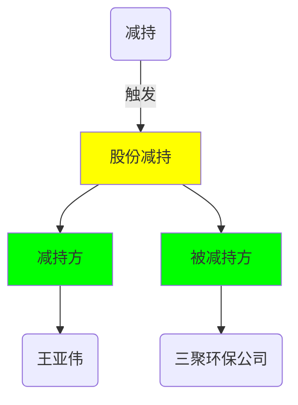
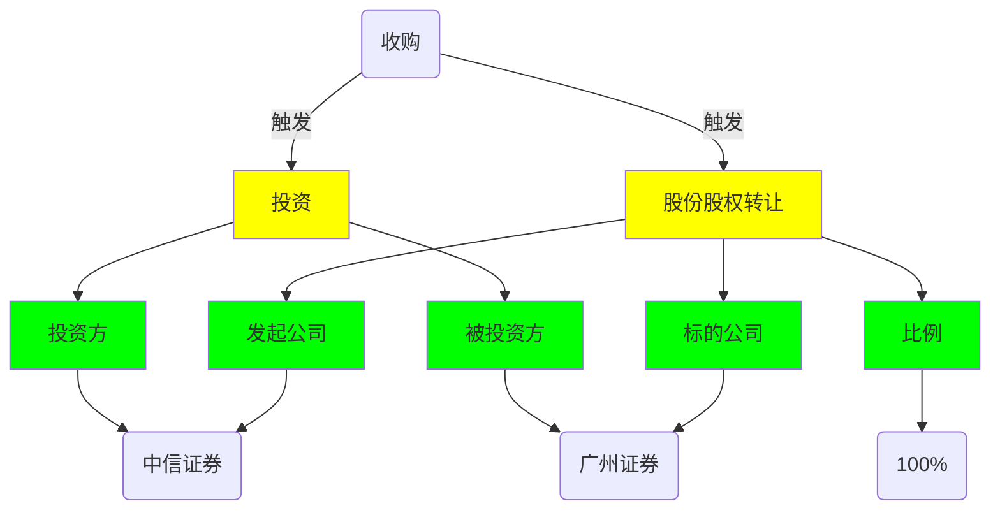
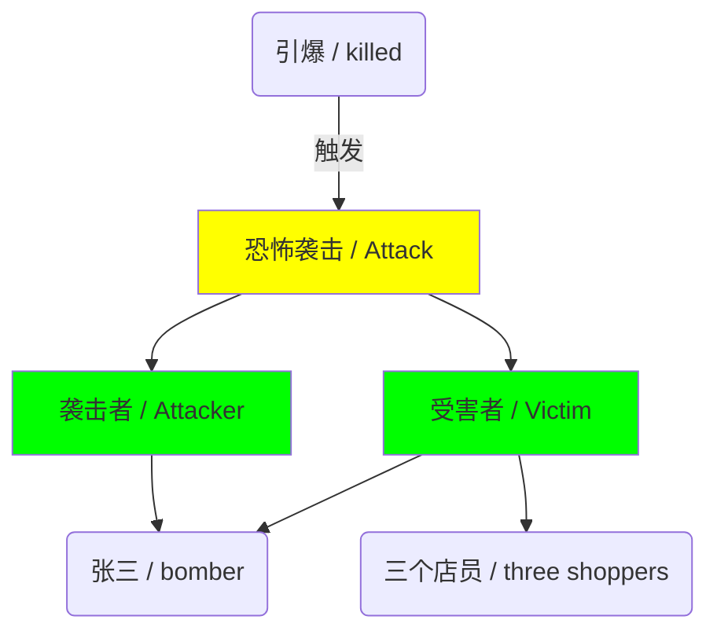
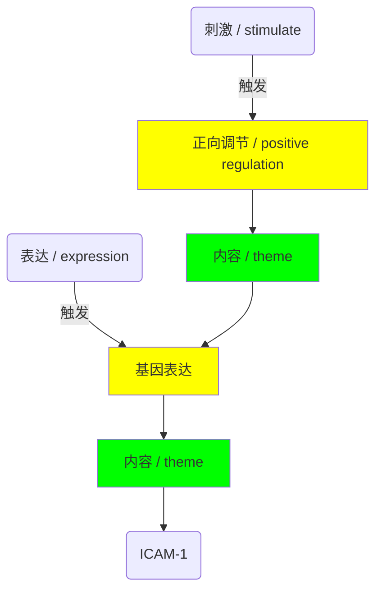

# OneEE

[TOC]

## 简介

官方链接如下:

+ [论文链接](https://arxiv.org/abs/2209.02693)
+ [官方代码](https://github.com/Cao-Hu/OneEE)

## 重叠和内嵌事件

本论文将事件样式分成了三种类型:

+ Flat Event 普通事件
+ Overlapped Event 重叠事件
+ Nested Event 内嵌事件

**例一**: 普通事件

我们可以用下图表示句子中的事件, 其中黄色部分是 **事件类型**, 绿色部分是 **论元角色**。

> 王亚伟减持三聚环保公司的股份。
> Wang Yawei reduced shares in Sanju environmental protection.

**重叠事件** 在之前的 PLMEE 论文笔记中已经介绍了, 表达的意思就是一个实体担任多个论元角色的情况。

**例二**: 不同事件之间的实体重叠

> 中信证券收购广州证券 100% 的股份。
> Citic Securities acquired 100% equity of Guangzhou Securities.

在这个例子中, "收购" 关键词会触发两个事件, 图示如下:

翻译过来就是: 中信证券投资了广州证券; 中信证券获得了广州证券 100% 的股份。

**例三**: 同一事件内部的论元重叠

> 恐怖分子张三在商场中引爆了炸弹, 炸死了自己和三个店员。
> The explosion killed the bomber and three shoppers.

在这里 "张三" 即使 "袭击者", 也是 "受害者", 图示如下:

**内嵌事件** 的意思是某个事件是另一个事件的论元。

**例四**: 内嵌事件

> 降低 CGN 含量会刺激单核细胞 ICAM-1 的表达。
> Degraded CGN stimulated ICAM-1 expression in monocytes.

图示如下:

大致上的意思就是这样, 个人认为论文给出的这个例子并不是很好。内嵌事件在结构上和 AMR 有一点相似。那么在数据集中一般是如何表示的呢?

如果 B 事件是 A 事件的一个论元, 那么就把 B 事件的触发词标记称为 A 事件的论元。

个人认为, 内嵌事件其实是重叠事件的一种特殊情况。
