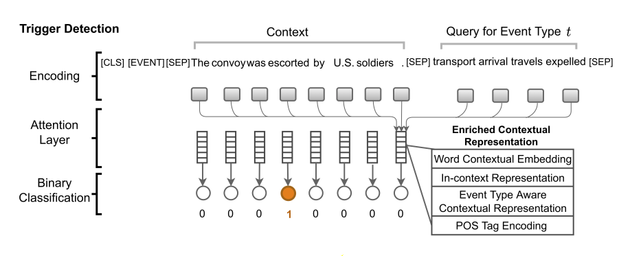
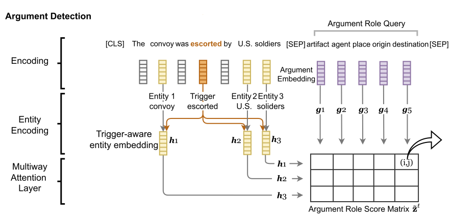

# Query and Extract

[TOC]

## 简介

论文的全名是: **Query and Extract: Refining Event Extraction as Type Oriented Binary Decoding** , 其发表于 ACL2022 , 属于用 **抽取式问答** 方式做事件抽取方法的延申。

截至 2023年3月14日, 官方没有给全数据预处理的代码, 还没有给实体识别的训练代码, 如果要复现, 需要花大量的时间去重构其代码, 我只重新整理了触发词检测的模型代码。

官方链接如下:

+ [论文地址](https://arxiv.org/abs/2110.07476)
+ [官方代码](https://github.com/VT-NLP/Event_Query_Extract)

## 引言

零样本学习 (zero-shot learning) 一直是很多研究者的梦想, 但是其难度让很多人都望而却步。

在早期的深度模型中, 主流的方式是将 **标签向量** 和 **样本向量** 以某种方式融合在一起进行 **二分类**。这样的话, 就需要一个 **标签文本** 的编码器, 可以是 word2vec, glove, fasttext 等模型。但是其效果一直不是很理想。

这一时期, 针对事件抽取的零样本学习也是有的, 比方说: [Zero-Shot Transfer Learning for Event Extraction](https://aclanthology.org/P18-1201/) 。这篇论文中, 作者巧妙地将事件抽取任务转化为 AMR 任务。

后来 BERT 模型出来后, 由于其出色的效果, 人们尝试将信息抽取任务 (包括 NER, RE 和 EE) 转化为 **抽取式问答** 任务, 一方面性能得到大幅度地提升, 另一方面也可以用于零样本学习。 对于这一类模型来说, **问题模板** 的设计至关重要。相关论文比方说: [Event Extraction by Answering (Almost) Natural Questions](https://arxiv.org/abs/2004.13625) 。

本论文的作者就是在此基础上, 提出了 Query and Extract, 尝试通过 "折腾" 模型的方式, 而非 "折腾" 问题模板的方式, 来提升效果。

那么如何 "折腾" **模型** 呢? 答案是注意力机制 (Attention)。阅读本文, 假设你对 [Attention is all you need](https://arxiv.org/abs/1706.03762v5) 中的注意力机制运算过程非常了解。

本论文属于 **管道模型**, 总共使用了三个独立的 BERT 编码器, 主要将事件抽取问题分成了两个子任务: 将事件抽取问题分成了三个子任务: 触发词检测, 实体检测和论元检测。

## 触发词检测

这一部分的示例图如下:



### 模型输入

对于每一个事件来说, 我们只用 **事件类型** 的文本来描述一个事件显然是不合理的, 因为会出现 **一词多义** 的情况。那么怎么办呢?

一种方式是人为的用一句话来描述这个事件的含义, 以避免歧义性。

另一种方式是用一组词来描述这个事件的含义。这组词的选择一般是 训练集 中事件的触发词。在早期的论文中, 这组词被称为 seeds。本文就是采用这种方式的。对于事件 $t$ 而言, 我们统计触发词触发事件 $t$ 的频率 (古典概率), 然后从高到低排序, 取 top4 的词作为 seeds。

使用上述方式需要注意以下两点:

1. 对于中文 NLP 来说, 进行上述计算需要分词, 可能需要事先将触发词加入词典中
2. 部分语料库标注时触发词采用的是检索的方式, 如果触发词没有触发事件, 则不标论元, 此时建议将没有论元的事件都剔除掉

模型的输入格式如下:

```text
[CLS] [EVENT] [SEP] sen_token1 sen_token2 ... [SEP] event_type event_seed1 event_seed2 ... [SEP] [PAD] [PAD] ...
```

模型输入的 token 有三种类型:

+ 特殊 token, 比方说: `[CLS]`, `[SEP]`, `[EVENT]`, `[PAD]` 等等
+ 句子 token, 对应 sen_tokens
+ 事件 token, 包括事件类型和 seed, 对应 event_type 和 event_seeds

### BERT 编码

经过 BERT 编码器编码后, 我们将 token_embeddings 拆开, 可以得到两个张量: sentn_embeddings 和 event_embeddings 。其中, sentn_embeddings 只包括 sen_tokens 部分, event_embeddings 只包括 event_type 和 event_seeds 部分。

sentn_embeddings 的 shape 是: `[batch_size, n_sentn_tokens, hidden_size]` 。

event_embeddings 的 shape 是: `[batch_size, n_event_tokens, hidden_size]` 。

### Word Contextual Embedding

指的就是 sentn_embeddings, 换个名字而已。

### Event Type Aware Contextual Representation

我们将 sentn_embeddings 作为 query 矩阵, event_embeddings 作为 key 矩阵和 value 矩阵, 采用注意力机制的运算方式, 即可得到重新编码的 sentn_embeddings, 我们记作 sentn_event_embeddings。

需要说明的是, query 矩阵和 key 矩阵在计算 attention_scores 时, 采用的是 cosine 相似度, 并且没用 softmax 转化成概率。

除此之外, 这里没有使用 multi-head 的方式, 你可以理解成 `head_size` 等于 1 。

### In-context Representation

我们将 BERT 编码器中后三层的 attention_probs 取出来, 其 shape 应该是 `[num_layers, batch_size, head_size, n_tokens_query, n_tokens_key]`。

然后再 `num_layers` 和 `head_size` 两个维度上求平均, 并在最后两个维度上只取 sentn 部分的 tokens, 得到 `[batch_size, n_sentn_tokens_query, n_sentn_tokens_key]` 维度的张量作为 attention_scores。

最后在 `n_sentn_tokens_key` 维度上进行概率标准化, 转化成概率 (不是使用 softmax 函数), 得到 attention_probs。

在有 attention_probs 的基础上, 将 sentn_embeddings 作为 value 矩阵, 得到 sentn_context_embeddings 矩阵, 其 shape 和 sentn_embeddings 是一样的。

这里计算 attention_probs 的方式很奇怪, 直接看论文中的公式估计是一脸迷茫。

### POS Tag Encoding

除了上述特征外, 作者还使用了 `spacy` 工具给每一个 sentn_token 进行词性标注, 然后采用 one-hot encoding 的方式变成 pos_embeddings, 其 shape 是 `[batch_size, n_sentn_tokens, pos_size]` 。

这里的思想很简单, 那就是触发词大多数情况下都是 动词, 很少的一部分会是 名词, 其它词性的概率更低。

### 触发词检测分类任务的设计

经过上面一系列的 "折腾", 我们得到四个张量: sentn_embeddings, sentn_event_embeddings, sentn_context_embeddings 和 pos_embeddings, 然后将他们 concat 在一起, 得到 shape 为 `[batch_size, n_sentn_tokens, hidden_size * 3 + pos_size]` 的张量, 我们记作 sentn_vectors 。

然后对每一个 token 进行二分类, 是触发词还是不是。

作者这里进行了一个假设, 那就是触发词一定不会相连。用序列标注的方式来说就是这里采用的不是 BIO 标注, 而是 IO 标注。从语言学的角度上来说, 貌似也没有什么问题。

## 论元检测

这一部分的示例图如下:



### 模型输入与 BERT 编码

和触发词检测相比, 论元检测部分的模型输入就要简单很多。其输入的格式如下:

```text
[CLS] sen_token1 sen_token2 ... [SEP] arg_token1 arg_token2 ... [SEP] [PAD] [PAD] ...
```

然后用 BERT 编码器进行编码, 得到 token_embeddings。

实际上一个论元可能对应多个 token, 论元类型的文本也可能对应多个 token, 这个时候应该怎么办呢? (在触发词检测模型中, 我们通过假设忽略了这个问题)

对于论元标签, 我们将其对应的 token 取平均值, 得到 argument_embeddings, 其 shape 是 `[batch_size, n_arguments, hidden_size]` 。

对于论元实体, 我们先额外训练了一个 BERT+CRF 的模型 (作者没有公开这个模型的训练代码), 事先将所有的实体都识别出来。然后将实体所对应的 token 取平均值, 得到 entity_embeddings, 其 shape 是 `[batch_size, n_entities, hidden_size]`。

### Trigger-aware Entity Embedding

为了丰富实体向量的特征, 对于每一个实体向量, 我们融入触发词的特征。

我们将触发词所对应的 token 取平均值, 记作 trigger_embedding, 其 shape 应该是 `[batch_size, hidden_size]`。

我们将 entity_embeddings 中的每一个向量和 trigger_embedding 进行 concat 操作, 然后再进行一次线性变换, 就可以得到融入触发词特征的 entity_embeddings 张量, shape 和原来一致。

需要注意的是:

1. 这里出现了代码和论文不一致的情况。论文中说用了, 但是实际上代码中没有用。
2. 按照论文中的说法, 还融入了 **逐位相乘** 的特征, 没有融入 **逐位相减取绝对值** 的特征。

### 论元检测分类任务的设计

有了 entity_embeddings 和 argument_embeddings, 我们将其两两 concat, 得到 `[batch_size, n_entities, n_arguments, hidden_size]` 的特征张量, 然后进行二分类, 即实体属于这个 argument 还是不属于这个 argument 。问题得以解决。

### Multiway Attention

我在截图的时候没有截取这一部分的内容。如果按照上面的方式走, 就没有 "折腾" 模型了, 这怎么可以呢?

我们以 entity_embeddings 作为 query 矩阵, argument_embeddings 作为 key 矩阵和 value 矩阵, 使用注意力机制, 可以得到和 entity_embeddings 的 shape 一致的张量, 我们记作 entity_embeddings_1 。

需要注意的是:

+ 这里没有使用多头注意力
+ 这里使用的式 点乘 (不是 cosine 相似度) 的方式计算 query 和 key 向量之间的相关性, 但是没有使用 softmax 函数将分数转化为概率

同理, 我们将 argument_embeddings 作为 query 矩阵, entity_embeddings 作为 key 矩阵和 value 矩阵, 使用注意力机制, 可以得到和 argument_embeddings 的 shape 一致的张量, 我们记作 argument_embeddings_1 。

上述操作在论文中被称为  bidirectional attention mechanism 。

除此之外, 我们还可以使用 In-context Representation 的方式, 分别得到 entity_embeddings_2 和 argument_embeddings_2 。

最后, 我们将 entity_embeddings 的三个张量 concat 在一起, argument_embeddings 的三个张量 concat 在一起即可。剩下的按照上一部分的流程走就可以了。

## 总结

作者在 ACE2005 和 ERE 两个数据集上进行了实验, 取得了 SOTA 的成绩, 但效果提升并不明显。

效果提升明显的是在 zero-shot learning 任务中, 论元检测直接从 17% 提升到 43% F1 分数。

个人认为, 比较巧妙的是论元检测部分的分类任务的设计, 虽然这一部分需要两个 BERT 编码器, 但是比之前的基于 QA 的 EE 速度还是快很多, 同时也一定程度上的缓解了分类任务标签不均衡的问题。

和其同一年发布的 [UIE](https://aclanthology.org/2022.acl-long.395/) 信息抽取的统一框架, 可以看作是其延续。
