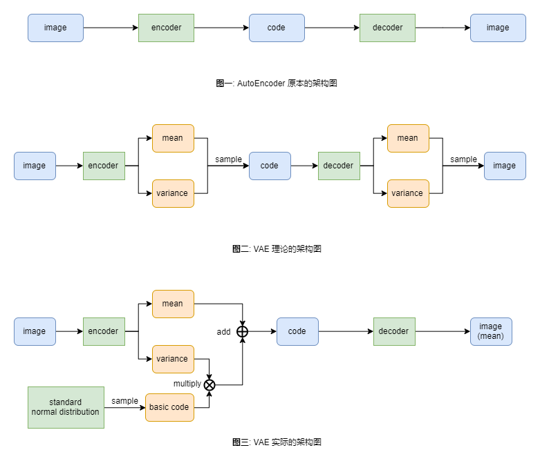

# 图片生成概述 (一) 任务简介

[TOC]

## 前言

图片生成任务是近些年来热门的话题, 也是我非常感兴趣的技术之一。同时台大的李宏毅教授对这个任务有非常详细的教学视频。多种因素在一起, 我决定将其整理成一个系列的博客。

这个系列的博客主要介绍两大类模型: GAN 和 diffusion model。但这是后续博客的任务, 本博客主要介绍图片生成任务, 评估方案和 VAE 模型。

## 图片向量

如果我们将 图片矩阵 铺平, 那么其就是一个 向量。比方说一张 $(64, 64, 3)$ 形状的张量铺平后就是一个 $(64 \times 64 \times 3, )$ 的向量。我们可以将 **图片向量** 理解为高维空间的一个点。这样, 在高维空间中, 有一部分区域的点对应人脸图片, 有一部分区域的点对应猫图片, 我们只要找到这样的区域, 从中随便拿出一个点, 就是我们想要的图片。

换一种说法, 我们可以认为 图片向量 符合某一种 **概率分布**, 只要是从这个 **概率分布** 中抽样出来的图片很可能就是符合我们期望的图片。举例来说, 如果我们希望程序生成 人脸, 那么我们需要一个 **人脸图片概率分布**, 然后从中采样即可。

这样, 图片生成问题就转化为寻找概率分布的问题了。

## 概率模型

如何寻找这个概率分布呢? 最经典的方法是 **假设法**。图片的概率分布可能是一个非常复杂且无法求解的概率分布, 但是我们可以 **假设** 它是一个 **正态分布**, 或者和 **正态分布** 非常贴近。

接下来的事情就是: 收集一部分相关的图片, 使用 **参数估计** 的方式找到和样本分布最贴合的正态分布即可。有了这个估算出来的概率分布, 我们直接从中抽样, 即可得到要生成的图片。一般使用的参数估算方式是 **最大似然估计** (maximum likelihood estimation)。

我们设 $x$ 为图片向量, $\{x^1, x^2, \cdots, x^m\}$ 是我们收集到的 $m$ 个图片, $P_G$ 是我们假设的概率分布 (可以是正态分布, 也可以是其它的分布), $\theta$ 是 $P_G$ 分布中的参数 (如果是正态分布, 参数就是 mean 和 variance)。

此时, 图片向量 是随机变量。也就是说, 在一次抽样中, 不同的图片向量之间是 互斥事件; 在多次抽样中, 每一次抽到的图片向量之间是 独立事件。

现在进行 $m$ 次抽样, 根据独立事件的概率公式, 将每一次抽样得到图片向量的概率相乘, 可以得到整个抽样结果的概率 $L$, 公式如下:

$$
L = \prod_{i=1}^m P_G (x^i; \theta) \tag{1}
$$

我们现在要做的事情是, 找到 $\theta^{\star}$, 使得公式 $(1)$ 中 $L$ 的值最大, 也就是产生这次抽样结果的概率最大。

我们知道, 样本数据的概率分布并不一定是真实的图片概率分布, 我们用 $P_{data}$ 表示样本数据的概率分布, 上面做的事情其实等价于: 寻找一个 $P_G$, 使得其和 $P_{data}$ 之间的 KL 散度最小。具体的推导过程如下:

$$
\begin{align*}
    \theta^{\star} &= arg \max_{\theta} \prod_{i=1}^m P_G(x^i; \theta) \tag{2.1}\\
    &= arg \max_{\theta} \sum_{i=1}^m \log P_G(x^i; \theta) \tag{2.2}\\
    &\approx arg \max_{\theta} E_{x \sim P_{data}} [\log P_G(x; \theta)] \tag{2.3}\\
    &= arg \max_{\theta} \int_x [P_{data}(x) \log P_G(x; \theta)] dx \tag{2.4}\\
    &= arg \max_{\theta} \int_x [P_{data}(x) \log P_G(x; \theta)] dx - \int_x [P_{data}(x) \log P_{data}(x)] dx \tag{2.5} \\
    &= arg \min_{\theta} \mathrm{KL} (P_{data} || P_G) \tag{2.6}
\end{align*}
$$

简单解释一下推导过程:

+ 公式 $(2.1)$ 到公式 $(2.2)$: 使用 **取对数** 的策略将概率求积转化为求和
+ 公式 $(2.2)$ 到公式 $(2.3)$: 抽样方法求期望的公式
+ 公式 $(2.3)$ 到公式 $(2.4)$: 积分求期望的公式
+ 公式 $(2.4)$ 到公式 $(2.5)$: 添加一个常数项 (和交叉熵与 KL 散度的关系是一致的)
+ 公式 $(2.5)$ 到公式 $(2.6)$: KL 散度公式 (max 变成 min 是因为多了一个 负号)

整体的思路很清晰, 可以使用 [gaussianMLE](https://github.com/metjush/gaussianMLE) 中的代码进行 多元正态分布 的参数估计。用这种方法出来的效果图非常模糊。这是为什么呢? 一种解释是图片向量的概率分布就不是 正态分布!!!

我们知道, 图片中包含了很多冗余的信息。比方说, 如果图片中有一大块面积是草地, 那么草地区域内的向量之间是可以相互表示的。因此, 图片矩阵往往是一个 **低秩矩阵**, 即其中向量可以用周围向量的线性组合来表示。由此我们可以推测, 图片往往是高维空间里面一个低维的 manifold 。但是正态分布无论怎么调整都不可能变成一个低维的 manifold。

## Variational Auto-Encoder (VAE)

VAE 是 Auto-Encoder 的一种变形, 出自论文: [Auto-Encoding Variational Bayes](https://arxiv.org/abs/1312.6114), 代码实现可以参考: [PyTorch-VAE](https://github.com/AntixK/PyTorch-VAE)。

首先, 说明一下 高斯混合模型 (Gaussian Mixture Model), 其核心思想是: 对于一个非常复杂的概率分布, 我们可以将其分解成多个 正态分布 来拟合。

$m$ 表示某一个正态分布, $M$ 表示正态样本的数量, $x$ 表示某一个样本。实际的抽样过程如下: 首先, 我们根据 **多项式分布** (multinomial distribution), 从 $M$ 个正态分布中选择出一个正态分布 $m$, 再从 $m$ 分布中采样出样本 $x$。我们用 $p(m)$ 表示选择 $m$ 分布的概率, 用 $p(x|m)$ 表示 $m$ 分布下选择 $x$ 的概率, 则:

$$
p(x) = \sum_m p(m) p(x|m) \tag{3}
$$

对于 高斯混合模型 来说, 最重要的参数就是正态分布的个数 $M$。有了它之后, 就可以使用 EM 算法进行参数估计了。

如果我们希望用无穷多个 正态分布 来拟合, 应该怎么处理呢? 首先, 我们从标准正态分布 $N(0, 1)$ 中采样出一个向量 $z$, 通过神经网络, 计算出 $\mu(z)$ 和 $\sigma(z)$, 然后再从 $N(\mu(z), \sigma(z))$ 这个正态分布中采样出样本 $x$ 。那么我们可以得到:

$$
p(x) = \int_z p(z) p(x|z) dx \tag{4}
$$

公式 $(3)$ 和公式 $(4)$ 在本质上是一样的, 区别在于:

+ $m$ 是从 **多项式分布** 中采样出来的一个类别, 这个类别对应一个 目标正态分布
+ $z$ 是从 **标准正态分布** 中采样出来的一个向量, 这个向量通过神经网络得到 目标正态分布的参数

VAE 做的事情就是公式 $(4)$。整体的架构图如下:

图一是原本的 AutoEncoder 架构, 我们用编码器将 image 编码成 code, 再用解码器将 code 解码成 image, 然后计算输入和输出 image 之间的 欧式距离, 作为 reconstruction error。我们要做的事情就是最小化 reconstruction error。

在实际使用时, 我们一般只用编码器部分, 不用解码器部分。编码器部分可以将 image 编码成 code, 我们用 code 进行图片分类或者检索。

那么能不能用 decoder 部分进行图片生成任务呢? 如果 code 所处的分布符合 **标准正态分布**, 那么我们就可以从标准正态分布中采样出 code, 然后使用 decoder 来生成图片。VAE 想要实现的就是这样的效果。

如果希望 code 的概率分布符合 标准正态分布, 那么就要调整网络架构。我们可以使用公式 $(4)$ 的方式强制让其是 标准正态分布。

图二是理论上的架构图, 整个过程是: 对于 image $x$, 用 encoder 网络预测 $e$ 正态分布的参数 $\mu_e$ 和 $\sigma_e$, 然后从 $e$ 分布中采样出 code $z$; 再用 decoder 网络预测 $d$ 正态分布中的参数 $\mu_d$ 和 $\sigma_d$, 然后从 $d$ 分布中采样出图片 $\hat{x}$。我们希望 $x$ 和 $\hat{x}$ 的欧式距离越小越好, 这个距离被称为 reconstruction error, 记作 $\mathrm{loss}_{error}$ 。

除此之外, 我们还希望 $e$ 分布 $N(\mu_e, \sigma_e)$ 和 标准正态分布 $N(0, 1)$ 之间的 KL 散度越低越好, 根据论文附件 B 部分, 我们可以得到:

$$
\mathrm{loss}_{kl} = 1 + \log (\sigma_e^2) - \mu_e^2 - \sigma_e^2 \tag{5}
$$

观察公式 $(5)$, 很容易发现, 当 $\mu_e = 0$ 且 $\sigma_e = 1$ 时, $\mathrm{loss}_{kl}$ 最小, 值为 $0$ 。完整的目标函数如下:

$$
\mathrm{loss}_{total} = \mathrm{loss}_{error} + \lambda \cdot \mathrm{loss}_{kl} \tag{6}
$$

然而上面的架构有一个很大的问题: 采样处无法求导。因此, 实际上使用的架构如图三所示。

首先是 encoder 部分的采样, 我们修改成如下的样式: 先从标准正态分布 $N(0, 1)$ 中采样出一个向量 $z^\prime$, 然后让其乘以 $\sigma_e$, 再加上 $\mu_e$, 得到的结果等价于从 $N(\mu_e, \sigma_e)$ 中采样出来的向量了, 整个过程可以理解成反 z-score 化。

其次是 decoder 部分的采样, 我们使用更暴力的方式: 对于正态分布来说, 均值处的样本被采样的概率是最高的。那么, 我们可以直接把 **均值样本** $\mu_d$ 作为 $\hat{x}$, 这样就没有采样的问题了。

另一种解释是, 如果我们将 $\mu_e$ 作为 $z$, 那么就和原本的 AutoEncoder 没有什么区别了。VAE 所做的事情就是: 希望在 code 处加上一定量的噪声后依然能解码成原本的图片。

我觉得更好的解释是, 我们其实只需要 $z$ 符合标准正态分布, 并不需要 $\hat{x}$ 符合正态分布。它符合什么分布并不重要, 只要 decoder 能生成图片即可, 因此不需要算什么 $\mu_d$ 和 $\sigma_d$。

在推理阶段就很简单了, 直接从 标准正态分布 $N(0, 1)$ 中采样 code $z$, 然后经过 decoder 就可以得到我们想要的图片了。

这里比较感性的介绍了 VAE, 其内部还包含了很多数学原理, 之后有机会再介绍。

## 评估

图片生成问题怎么评估呢? 其实在很多相关的论文中, 并没有进行评估, 仅仅是放出其生成图片的效果。那么, 有没有什么比较客观的评估方式呢?

一、利用概率模型评估

对于传统的概率模型, 我们可以直接根据公式 $(1)$, 计算采样得到测试集的概率, 这个概率自然是越大越好。

那如果不是概率模型呢? 一种办法是让模型生成大量的图片, 然后用 正态分布 来拟合生成的模型, 这样就可以得到一个概率模型了。接下来和上面一样, 用公式 $(1)$ 计算采样得到测试集的概率。这种方式被称为 kernel density estimation。

这种基于概率模型的评估方式有很多问题: 首先, 其没有办法判断生成图片的多样性; 其次, 用正态分布拟合的概率大的图片一定是高质量的图片吗?

二、利用检测模型评估

如果是通用图片生成, 那么我们可以使用在 ImageNet 上训练好的模型 $C$ 来判断, 具体方式如下:

对于 $C$ 模型来说, 给定图片 $x$, 其输出 1000 类别的概率分布。对于一张生成的图片, 如果在 1000 个类别上的概率分布越 sharp, 也就意味着模型知道图片中的内容是什么, 这张图片生成的概率就越高。

对于多张生成的图片, 我们将其在 1000 个类别上的概率分布叠加起来, 如果这个分布越 smooth, 也就意味着生成图片的多样性越高, 反之亦然。

如何评判一个概率分布的 sharp 和 smooth 程度呢? 答案是 **信息熵**: 如果概率分布的信息熵越高, 那么这个概率分布越 smooth, 反之则越 sharp。我们将两部分的信息熵加起来, 得到的分数称为 [inception score](https://en.wikipedia.org/wiki/Inception_score) 。

如果是人脸图片生成呢。此时用 inception score 显然不合理, 因为这些图片在 1000 类中可能只是一个类别, 甚至可能没有这个类别。一种解决办法是: 使用训练好的 **人脸目标检测** 模型, 看有多少百分比的图片能检测到人脸。

这样的评估其实有一个潜在的问题, 这个在 GAN 中也会被提及, 那就是训练 $C$ 模型的图片都是真正的图片, 但是模型生成的图片可能是毫无意义的图片。$C$ 模型在训练时没有见过这些毫无意义的图片的, 此时很难保证模型会做出什么样子的判断。

三、图片编码评估

另一种想法是用类似于 Autoencoder 的方式将图片编码成一个 code。我们将生成图片的 code 和 测试集图片的 code 都符合正态分布, 求解出两个分布后计算两者之间的 [Frechet Distance](https://en.wikipedia.org/wiki/Fréchet_distance)。

这种方式简称是 FID, 对图片编码使用的是 Inception 网络。它的问题和第一类差不多: 图片的 code 向量真的符合正态分布吗?

四、总结

其实这里面还有很多其它问题, 比方说: 生成图片自身的质量, 生成图片的多样性, 生成的图片和训练集的差异性等等。对于生成问题来说, 如何客观的评价是一个很值得研究的方向, 更多相关内容请参考: [Pros and Cons of GAN Evaluation Measures](https://arxiv.org/abs/1802.03446) 。

## 总结

本文简单的介绍了图片生成问题, 以及 VAE 算法。更多时候是在介绍 概率模型。图片生成领域和概率论的联系是非常紧密的, 正好可以借助这次机会加深对相关知识的理解。

除了 VAE, GAN 和 diffusion model 外, 还有其它的图片生成方式, 比方说: Flow-based 模型, PixelRNN / PixelCNN 模型等等, 有兴趣的可以自行了解。

相关链接:

+ [Pixel Recurrent Neural Networks](https://arxiv.org/abs/1601.06759)

## References

+ [GAN Lecture 4 (2018): Basic Theory](https://www.youtube.com/watch?v=DMA4MrNieWo)
+ [ML Lecture 17: Unsupervised Learning - Deep Generative Model (Part I)](https://www.youtube.com/watch?v=YNUek8ioAJk)
+ [ML Lecture 18: Unsupervised Learning - Deep Generative Model (Part II)](https://www.youtube.com/watch?v=8zomhgKrsmQ)
