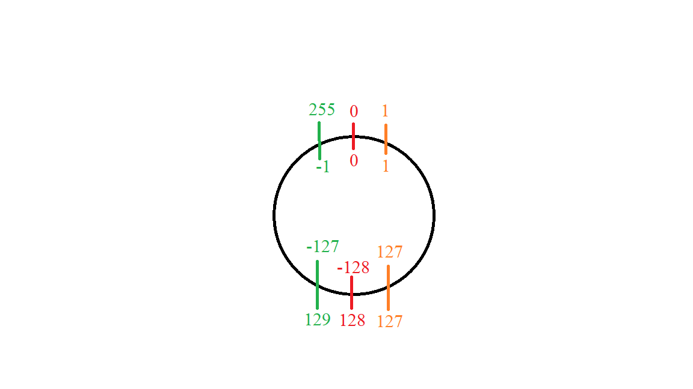

# 基础知识

[TOC]

## 数据的单位

在计算机中, 数据的最小单位是 **比特** (bit), 但是实际上的在使用时, 数据的基本单位是 **字节** (byte)。我们常用的 KB, MB, GB 和 TB 中的 **B** 指的都是字节 (byte), 它们之间相差的数量级是 1024, 也就是说:

$$
1 \mathbf{TB} = 1024^1 \mathbf{GB} = 1024^2 \mathbf{MB} = 1024^3 \mathbf{KB} = 1024^4 \mathbf{bytes}
$$

硬件厂商在生产硬盘时, 往往是以 1000 作为数量级, 但是电脑计算时会以 1024 作为数量级, 也就是说 512 GB 的硬盘实际上只有 $512 * 1000^3$ bytes, 对应 476 GB。完整的计算方式如下:

$$
\frac{512 * 1000^3}{1024^3} = 476.84 \mathbf{GB}
$$

我们常说的网速 `100兆网速`, 里面有两个坑:

+ 这里的 **兆** 指的是 **百万**, 对应 MB 单位。(在古代, "兆" 指 **万亿**)
+ 运营商不是以字节作为单位, 而是以比特作为单位

也就是说, 网速上限是 $100 / 8 = 12.5 \mathbf{MB/S}$ 。

## 数量级的表示

英文中经常以 1000 作为数量级, 常用的英文单词是: thousand, million, billion 和 trillion 。对应中文是: 千, 百万, 十亿 和 万亿。

因此, 大家常常用 **K** 表示 **千**, **M** 表示 **百万**, **B** 或者 **G** 表示 **十亿**, **T** 表示 **万亿**。在看模型参数时, 需要以此为基础来分析。

|模型名称|参数量 (英文)|参数量 (中文)|量级|
|:---:|:---:|:---:|:---:|
|ELMO|94M|九千四百万|千万级|
|BERT-large|340M / 0.3B|三亿四千万|亿级|
|GPT2|1542M / 1.5B|十五亿|十亿级|
|GPT3|175B|一千七百五十亿|千亿级|
|Switch Transformer|1.6T|一万六千亿|万亿级|

为什么 GPT3 发布时那么震撼, 因为直接从 **十亿** 模型膨胀到了 **千亿** 模型。

关于单位, 大致上理解一下:

+ 1 吨是 1000 千克, 也就是 一百万克
+ 1 MB 对应一百万字节; 1 GB 对应十亿字节; 1 TB 对应万亿字节

## 二进制计算

如何将一个 **二进制** 的小数转化成 **十进制** 呢? 直接看下面的例子:

$$
110.101_{(2)} = 1 * 2^2 + 1 * 2^1 + 0 * 2^0 + 1 * 2^{-1} + 0 * 2^{-2} + 1 * 2^{-3} = 6.625_{(10)}
$$

这种想法的来源很简单:

$$
6.625 = 6 * 10^0 + 6 * 10^{-1} + 2 * 10^{-2} + 5 * 10^{-3}
$$

**十进制** 转 **二进制** 的方式就比较麻烦了, 需要上述过程的逆运算。人们总结出一种方式可以快速的计算。我们看例子说明:

整数转二进制方式: 整数除二取余倒序排列, 直到商是 0 为止。

小数转二进制方式，小数乘二取整顺序排列, 直到积是 0 为止。由于有 **无限小数** 的存在, 我们不一定能得到积是 0 的数字, 此时就需要截断, 也就是存在精度问题。

下面展示了 6.625 转二进制的过程。

```text
6 / 2 = 3 ... 0
3 / 2 = 1 ... 1
1 / 2 = 0 ... 1
0 ==> 终止运算
```

```text
0.625 * 2 = 1.25
0.250 * 2 = 0.50
0.500 * 2 = 1.00
0.000 ==> 终止运算
```

分别对余数倒序排, 对积取整正序排, 可以得到: $6.625_{(10)} = 110.101_{(2)}$

需要注意的是, 在十进制下是有限小数的, 转换成二进制可能会变成 **无限小数** !!! 比方说 **0.3** , 其转换成二进制是: `0.01001, 1001 无限循环` 。这也是为什么一般浮点数不能直接用 **相等** 去判断, 而要用 **近似相等** 去判断。

如果你理解了上述过程, 那么十进制和任意进制都可以互转 !!! 如果是任意进制和任意进制互转, 可以以十进制作为中间桥梁。

## 位运算

在计算机的硬件实现中, **位运算** 是最容易实现的, 在这之上才是数值运算。一般的位运算包括:

+ 位移运算
  + 左移 `<<`: 单个二进制数, 向左移动位数, 低位补零
  + 无符号右移 `>>>`: 单个二进制数, 向右移动位数, 高位补零
  + 带符号右移 `>>`: 单个二进制数, 向右移动位数, 如果最高位是 1, 则高位补一; 如果最高位是 0, 则高位补零
+ 按位与: `&`
  + 两个二进制数, 同位数字都是 1, 运算结果为 1, 否则为 0
+ 按位或: `|`
  + 两个二进制数, 同位数字只要有一个是 1, 运算结果为 1, 否则为 0
+ 按位异或: `^`
  + 两个二进制数, 同位数字相同, 运算结果为 1; 否则为 0
+ 按位取反: `~`
  + 单个二进制数, 每一位取反, 1 变成 0, 0 变成 1

**位移运算** 需要说明的是:

1. 在描述 **位移运算** 时, 默认左边的位数为高位, 右边的位数为低位
2. 右移分带符号和不带符号的情况, 左移则没有, 这和整数的表示有关系, 一般最高位表示的是数的正负号, 对于负数, 如果高位补零, 则会改变数字的正负号
3. 左移等价于 **乘法**, 右移等价于 **整除**, 都是以 2 为底数

**按位与或非** 与 **逻辑与或非** 一定要分清楚:

+ 在 C 语言中, **逻辑与或非** 符号是: `&&`, `||` 和 `!`, 在 Python 中则是 `and`, `or` 和 `not`
+ 在 C 语言和 Python 中, **按位与或非** 的符号是一致的, 对应: `&`, `|` 和 `~`
+ C 语言和 Python 中都有符号重载, 只能重载 **按位运算符**, 不能重载 **逻辑运算符**
+ 对于布尔类型的变量来说, **按位与或非** 和 **逻辑与或非** 运算结果是一致的, 这导致很多程序员会将两者混用
+ 在 Python 中, **逻辑与或非** (`and`, `or` 和 `not`) 会隐式调用 `bool` 函数

正是因为以上的特性, 很多班科程序员会批判 Python, 认为以下的内容属于 bug:

+ 在 pandas 的索引机制中, 只能写 `df[df.a == 1 & df.b == 2]`, 不能写 `df[df.a == 1 and df.b == 2]`
+ 忽略隐式的 `bool` 函数调用, 直接将 `and` 和 `&` 混用

## 整数的表示

在计算机中, 整数是以 **补码** 的形式存在的。为什么用补码呢? 因为方便加法运算。

### 原码

最高位表示符号, 0 是整数, 1 是负数。其它位就是整数的二进制表示。

此时 0 有两种表示, `+0` 和 `-0`, 对应 `int8` 类型是: `0000 0000` 和 `1000 0000` 。

`+6` 的表示方式是 `0000 0110`, `-6` 的表示方式是 `1000 0110` 。

换一种说法, 对于 `int8` 来说, 我们用 128 到 255 来表示 -0 到 -127。

这种表示方式最大的问题是两个数不能直接相加, 需要先进行符号判定。但是在电路层面, 符号判定并不容易实现。

如果不判定符号, 直接相加, `+6 + (-6)` 的计算过程如下:

$$
6 + (-6)_{int8} = 6 + 134_{uint8} = 140_{uint8} = (-12)_{int8}
$$

我们将上述计算过程称为 **简单加法**, 此时所有 `int8` 类型的加法都会变成 `uint8` 进行计算。

那么, 我们应该如何设计通过 **编码** 的方式, 使得负数也可以进行 **简单加法** 呢?

### 整数的加法运算

这一部分对应计算机组成原理的内容, 一般会用 **同余** 来定义。这里只说明其思想。

在电路层, 进行加法运算时, 高位结果会被截断。我们知道 255 + 1 = 256。对于 `uint8` 来说, 最大的可表示数是 255, 得到 256 后高位被截断, 也就变成了 0 。

这个现象使得加法运算和三角函数运算一样, 具有了 **周期性**, 即 $a + 256 = a$, 符号表示是: $a + T = a$, 其中 $a$ 为任意整数, $T$ 为周期。

我们在小学是怎么定义加法的呢?

**被加数 + 加数 = 和**, 其中 **被加数** 表示 **位置**, **加数** 表示 **移动**, **和** 表示移动后的位置。

一般上述过程是在 **数轴** 上体现的, **被加数** 是点的初始位置, **加数** 为正向右移动, 为负向左移动。

现在加法运算有了周期性, 我们可以将数轴变成时钟, 0 点和 256 点重合, **被加数** 表示在时钟上的位置, **加数** 为正 顺时针方向 移动, 为负 逆时针方向 移动。

在这样的背景下, 我们会发现: $a + b = a + (-(T-b))$, 即顺时针移动 $b$ 个单位等价于逆时针移动 $(T-b)$ 个单位, 用具体的数字表示就是:

+ $a + 10 = a + (-246)$
+ $a + (-6) = a + 250$

从上面可以看出, 对于 $(-6)_{int8}$ , 我们可以用 $250_{uint8}$ 来表示。也就是说:

$$
6_{int8} + (-6)_{int8} = 6_{uint8} + (250)_{uint8} = 256_{uint8} = 0_{uint8} = 0_{int8}
$$

我们可以用下图来表示 `int8` 数字的位置, 其中外圈是 `uint8` 表示, 内圈是 `int8` 表示。



总结如下:

+ 对于 `int8` 类型, 我们可以认为是数轴上 0 点和 256 点相连, 相连的点表示 0, 不表示 256
+ 对于 `uint8` 类型, 我们可以认为是数轴上 -128 点和 128 点相连, 相连的点表示 -128, 不表示 128

这样, 问题就得以解决了。这里仅仅给出了解决的思路, 如果想了解具体的定义, 请参考计算机组成原理。

我们可以通过以下的 python 代码进行测试:

```python
import numpy as np 

int8_array = np.array([127, ], dtype=np.int8)
int8_array += 1  # 这里一定要用 +=, 不然 numpy 会自动转换成 int16
print(int8_array)  # 127 + 1 = -128 / -128 - 1 = 127

uint8_array = np.array([0], dtype=np.uint8)
uint8_array -= 1
print(uint8_array)  # 0 - 1 = 255 / 255 + 1 = 0
```

### 反码和补码

我们在学习整数的计算机存储时, 经常会提及这一概念。其本质上是通过 **按位运算** 实现上一部分描述的整数表示, 方式如下:

+ 对于正整数来说, 其原码, 反码和补码是一致的
+ 对于负整数来说, 其反码是除最高位的原码取反, 补码是反码加一

举例来说: `-32` 的计算方式如下:

1. `32` 的原码: `0010 0000`
2. `-32` 的原码: `1010 0000`
3. `-32` 的反码: `1101 1111`
4. `-32` 的补码: `1110 0000`

当然, 我们也可以这样算:

$$
(-32)_{int8} = (256 - 32)_{uint8} = 224_{uint8} = 1110 \space 0000_{(2)}
$$

反码和补码的设计更加贴合电路设计, 我们一般都是用 **补码** 作为计算机中整形的存储方式。

为什么补码等于反码加一呢? 道理很简单: `a + ~a = 255`, 而我们的计算周期是 256, 此时就需要减一了。

### C 语言中的数据类型

在 C 语言中:

+ `int8` → `char`
+ `int16` → `short`
+ `int32` → `long` / `int`
+ `int64` → `long long`

对, 你没有看错, `int8` 和 `char` 是一致的, 这也是为什么 Python 中的 `bytes` 对象有部分整形的功能:

```python
bytes_str = b"abcdefg"

print(bytes_str)

print(list(bytes_str))
```

## 浮点数

说了那么多整数, 那么小数在计算机中是以什么方式存在的呢? 答案是 浮点数。

什么是浮点数呢? 浮点数的本质就是 **科学计数法**, 其可以通过 **指数位** 来改变 **小数点** 的位置。

和浮点数相对应的是 **定点数**, 即小数点的位置是固定的, 也就是我们常用的方式:

+ 定点整数: 小数点的位置在最低位的后面
+ 定点小数: 小数点的位置在符号位 (最高位) 的后面

我们可以将定点整数和定点小数组合起来表示数字, 但是表示数字的范围比较有限。于是人们使用 **浮点数** 来表示小数。

我们看下面一个例子: `112.5`, 首先转化为二进制的科学技术法:

$$
(112.5)_{(10)} = (111 \space 0000.1)_{(2)} = 1.1100 \space 0010 \times 2^6
$$

我们将 $6$ 称为 **阶码**, 或者说 **指数位**, $1100 \space 0010$ 称为 **尾数**。浮点数的存储就是由: **符号位** + **阶码** + **尾数** 组成的。

所有的浮点类型都有一个符号位, **阶码** 和 **尾数** 的位数分配方式则不同, 具体看下一部分。

### 双精度浮点数

对于 `float64` 来说, 有 11 位阶码, 52 位尾数。

阶码实际上对应的是指数位, 其也是有正负号的, 因此其最大值应该是 $2^{11 - 1} = 1024$ 。

那么 `float64` 所能表示的最大数字约是 $2^{1024} \approx 1.80 \times 10 ^ {308}$ 。

尾数位表示的是数字的精度。由于在二进制中, 第一个有效数字一定是 1, 所以在尾数部分是不存储的。在二进制下, 如果尾数部分是 52 个 0 后面接 1 个 1, 那么 `float64` 就没办法表示了, 此时对应: $2 ^ {-53} \approx 1.11 * 10 ^ {-16}$, 也就是说能精确到小数点后 15 位 (第 16 位的存储就不精确了)。

如果你了解 `javascript`, 应该知道 **最大安全整数** 的概念。什么意思呢? 在 `float64` 中, $2 ^ {53}$ 和 $2 ^ {53} + 1$ 表示方式是一致的, 尾数部分都是 1。转化成 Python 的验证方式如下:

```python
print(
    float(2 ** 53) == float(2 ** 53 + 1)
)
```

换言之, `float64` 所能表示的不会出现歧义的最大整数是: $2 ^ {53} -1$。如果使用 snowflake 算法生成数据 ID, 在 JavaScript 中不能直接用 `Number` 类型接收, 一定要用字符串类型接收。可以通过 `Number.MAX_SAFE_INTEGER` 获取到该值。(在 JavaScript 中没有整数类型!!!)

### 汇总表

常用的浮点数类型包括 `float64` 和 `float32` 。在深度学习中, 为了运算更快, 节约显存, 还有 `float16`, `bfloat16` 类型。他们的分析方式和上面一样, 这里用一个表格来表示:

|类型|阶码 (位数)|尾数 (位数)|精度 (小数点后几位)|
|:--:|:--:|:--:|:--:|
|float64|11|53|15|
|float32|8|23|7|
|float16|5|10|3|
|bfloat16|8|7|2|

### 与 "深度学习" 领域的关系

在深度学习领域, 默认的精度是 `float32`, 使用 `float16` 或者 `bfloat16` 精度都非常低。此时需要增大 loss 值, 防止梯度值过低发生 **数值下溢**。相关内容参考: [Mixed Precision Training](https://arxiv.org/abs/1710.03740) 和 [torch.amp](https://pytorch.org/docs/stable/amp.html) 。

除此之外, nvidia 还设计出来 `TensorFloat32` 数据类型, 使用 19 位比特表示浮点数, 其中 8 位阶码, 10 位尾数, 分别取自 `bfloat16` 的阶码位数和 `float16` 的尾数位。需要注意的是, 其在内存中还是占 4 个字节, 并不能节约内存, 但是可以使得训练变快。其属于 Ampere 架构。在 PyTorch 中, 开启方式参考: [文档](https://pytorch.org/docs/stable/notes/cuda.html) 。

### 数值溢出

从上面可以看出, 在计算机运算中, 数值必须在一定的范围内, 如果超过了这个范围就会出错。如果是运算结果数值溢出了, 属于无法避免的事情; 但是如果是运算过程中出现数值溢出, 就需要改变运算公式, 尽量避免这种事情的发生。

在数值计算中, 如果数字的绝对值过大, 超过了浮点类型所能表示的最大值, 就会溢出, 此时称为 **上溢** (overflow); 如果数字的绝对值过小, (过于趋近于零), 浮点类型的精度不能够准确表示数字了, 也是溢出, 此时称为 **下溢** (underflow)。

上面说过了, 对于 `float64` 来说, 虽然理论上正数的取值范围在 $10^{-308}$ 到 $10^{308}$ 之间, 但是实际上有效的取值范围在 $10^{-15}$ 到 $10^{15}$ 范围内。

上述范围对于 **指数爆炸** 来说, 简直就是小意思, 可以通过下面代码得到结论:

```python
import sys
import math 

print("float64 能达到的理论最大正数是: ", sys.float_info.max)  # 10 ** 308
print("对应 log 值是: ", math.log(sys.float_info.max))  # 709

print("float64 能达到的理论最小正数是: ", sys.float_info.min)  # 10 ** (-308)
print("对应 log 值是: ", math.log(sys.float_info.min))  # -708
```

在机器学习领域, 我们常用 `softmax` 将分数转化为概率, 如果直接用公式, 分数达到 34 时就已经到有效范围的边界了。一般通过 减去最大值 的方式来解决 **上溢** 的问题。

## 总结

本文从多个角度复习了计算机的基础知识, 并简单的和深度学习建立联系。为之后了解大模型打下坚实的基础。
