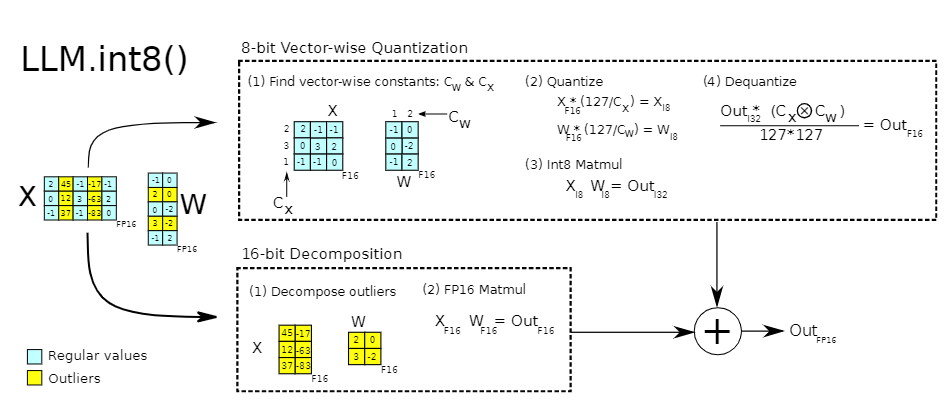

# LLM.int8() 论文阅读

[TOC]

## 简介

关键词:

+ 模型量化
+ 矩阵运算
+ 语言模型特征离群值

相关资料:

+ 论文地址: [LLM.int8(): 8-bit Matrix Multiplication for Transformers at Scale](https://arxiv.org/abs/2208.07339)
+ 代码地址: [bitsandbytes](https://github.com/TimDettmers/bitsandbytes)
+ 作者博客1: [A Gentle Introduction to 8-bit Matrix Multiplication for transformers at scale using Hugging Face Transformers, Accelerate and bitsandbytes](https://huggingface.co/blog/hf-bitsandbytes-integration)
+ 博客1中文版: [大规模 Transformer 模型 8 比特矩阵乘简介 - 基于 Hugging Face Transformers、Accelerate 以及 bitsandbytes](https://zhuanlan.zhihu.com/p/604338403)
+ 作者博客2: [LLM.int8() and Emergent Features](https://timdettmers.com/2022/08/17/llm-int8-and-emergent-features/)

## "模型量化" 简介

模型压缩一直是深度学习的研究方向之一, 常用的方式包括: **蒸馏**, **剪枝** 和 **量化** (包括二值化)。

**蒸馏** 和 **剪枝** 都是通过减少模型的参数量来实现模型压缩, 而 **量化** 则是通过改变模型参数的类型来实现模型压缩。

什么是 **量化** 呢? [百度百科](https://baike.baidu.com/item/量化/8959421) 给出的定义如下:

> 量化，在数字信号处理领域，是指将信号的连续取值（或者大量可能的离散取值）近似为有限多个（或较少的）离散值的过程。

在深度学习领域, 一般都是使用 32 位浮点数进行运算的, 每一个数字占 4 个字节。为了节约内存, 加速运算, 我们会使用 半精度 进行运算, 也就是 16 位浮点数, 此时每一个数字占 2 个字节。但这样真的是极限吗? 我们可以使用 1 个字节来表示数字吗?

答案是可以的, 但是我们不再使用 浮点数 了, 而是使用 整形 来表示数字, 即 `int8`。也就是说, 将原本 `float16` 的数字映射到 `int8` 上。我们可以认为 `float16` 是 连续取值, 而 `int8` 是离散取值。因此, 这样的操作也被称为 **模型量化** (model quantization)。

### 例子

套用作者博客中的例子, 我们现在有一组参数值: `[1.2, -0.5, -4.3, 1.2, -3.1, 0.8, 2.4, 5.4]`, 我们怎么将其映射到 -127 到 127 的范围内呢?

+ 首先, 我们找到这组数字绝对值的最大值, 也就是 `5.4`
+ 然后, 我们用 `127 / 5.4`, 得到 **缩放比例** 值 `23.5`
+ 我们将这组参数都乘以 `23.5`, 然后根据精度取整, 就可以得到量化后的值: `[28, -12, -101, 28, -73, 19, 56, 127]`

如果要反量化, 也很简单, 直接除以 **缩放比例** 即可。

这种方式被称为 absmax quantization, 更常用的还有 zero-point quantization。

对于一组数据 $d$ 来说, 我们设其最大值为 $d_{max}$, 最小值为 $d_{min}$。我们设量化后的数据最大值为 $Q_{max}$, 最小值为 $Q_{min}$。对于 `int8` 来说, $Q_{max}$ 的值是 127, $Q_{min}$ 的值是 -127。

我们设 scale 为缩放因子, 计算方式如下:

$$
sacle = \frac{d_{max} - d_{min}}{Q_{max} - Q_{min}} \tag{1}
$$

此时 $d$ 中的数据只需要除以 scale 就可以和 `int8` 的 **单位长度** 是一致的了。但是此时映射并没有完成, 我们还需要 **移动** zp 个单位。由于量化后所有的数据点 移动 的单位数都是一致的, 我们可以用最大值 / 最小值的情况来计算 zp 值, 计算方式如下:

$$
zp = Q_{max} - \frac{d_{max}}{sacle} = Q_{min} - \frac{d_{min}}{sacle} \tag{2}
$$

由此, 我们可以得到完整的量化公式:

$$
d_{quantized} = \lfloor \frac{d}{scale} + zp \rceil \tag{3}
$$

其中, $d_{quantized}$ 表示 $d$ 量化后的结果, 是 `int8` 类型的, 其余的都是 `float16` 类型的。

由于 0 点量化后的位置恰好和 zp 是一致的 (0 点缩放后还在 0 点的位置), 因此我们将 **移动** 的单位数称为 zeropoint, 整个方案也被称为 zero-point quantization。

反量化的方式如下:

$$
d = (d_{quantized} - zp) \cdot scale \tag{4}
$$

由于 $zp$ 和 $scale$ 都是 `float16`, 虽然 $d_{quantized}$ 是 `int8`, 结果 $d$ 是 `float16` 。公式 $(3)$ 和 $(4)$ 是几乎是相反的操作, 除了 **取整** 的操作, 精度损失主要也是在这里。

### 运算

量化后的数字怎么运算呢? 当然是要反量化回去了。如果是量化后的两个数相乘, 我们可以用公式 $(4)$, 将括号展开, 进行运算。对于两个低精度的数字 (比方说 `int8`), 其运算结果可以是高精度的数字 (比方说 `int16`) 。

进行这样的运算, 需要考虑很多因素, 比方说: 每一步的数据类型, 硬件的支持等等。这篇论文并没有详细的介绍, 只是简单的列出公式, 需要读其它的论文来辅助理解。

除此之外, 模型量化还有 PTQ 与 QAT 等模式, 有时间也需要去了解。

### 问题

整个过程中存在最大的问题是 **精度损失**。那么什么情况下的 **精度损失** 会导致预测性能极具下降呢? 答案是 **离群值**。

比方说我们现在有一组数: `[-0.10, -0.23,  0.08, -0.38, -0.28, -0.29, -2.11,  0.34, -0.53, -67.0]`, 采用 absmax 量化后, 再反量化, 得到的结果是: `[0.0, 0.0, 0.0, -0.5, -0.5, -0.5, -2.1, 0.5, -0.5, -66.8]`, 和原来的结果相差甚远。

观察原始数据, 我们不难发现, 问题是 `-67.0` 这个 **离群值** 导致的, 如果将其去掉, 则量化的性能相差就不会太多。

## 特征 "离群值" 分析

在深度学习中, 我们知道, 模型的 **参数值** 过大容易导致模型过拟合 (具体可以参考 L2 正则化)。对于一个泛化性较好的模型来说, 其参数值不会特别大。

分析 `BertModel`, 我们会发现, 有 99.9% 以上的参数值会在 0.2 到 -0.2 之间, 同时参数绝对值的最大值会达到 11。代码如下:

```python
import torch 
from transformers import BertModel

model = BertModel.from_pretrained("hfl/chinese-bert-wwm-ext").eval().cpu()

param_vector = torch.cat(
    [param.detach().cpu().flatten() for param in model.parameters()],
    dim=0
).numpy()

total_params = param_vector.shape[0]
print(f"参数的最大值是: {param_vector.max()}, 最小值是: {param_vector.min()}")

selected_params = ((param_vector <= 0.2) & (param_vector >= -0.2)).sum()
print(f"参数值在 -0.2 到 0.2 之间的占比是: {round(selected_params / total_params * 100, 6)}%")
```

那么对于 **特征值** (在语言模型中, 就是 hidden_states) 呢? 虽然有模型参数的限制, 但是其值会大很多。

分析 `BertModel`, 我们会发现, 在 0.2 到 -0.2 之间的特征值仅 30%, 有 99% 的特征值集中在 2 到 -2 之间, 同时特征绝对值的最大值能达到 20。代码如下:

```python
import torch 
from transformers import BertModel, BertTokenizer

pretrained_name = "hfl/chinese-bert-wwm-ext"
tokenizer = BertTokenizer.from_pretrained(pretrained_name)
model = torch.no_grad()(
    BertModel.from_pretrained(pretrained_name).eval()
)

inputs = tokenizer("今天的天气非常好", return_tensors="pt")
outputs = model(**inputs, output_hidden_states=True)

hidden_size = outputs.last_hidden_state.shape[-1]
features = torch.cat(
    [hidden_state.detach().cpu().reshape(-1, hidden_size) for hidden_state in outputs.hidden_states],
    dim=0
).numpy()

print(f"参数的最大值是: {features.max()}, 最小值是: {features.min()}")

selected_nums = ((features <= 2) & (features >= -2)).sum()
print(f"参数值在 -2 到 2 之间的占比是: {round(selected_nums / features.size * 100, 6)}%")
```

由此可见, 计算中出现的离群值主要集中在 **特征值** 中。

那么对于大语言模型呢? 作者在论文中指出, 对于一个 13B 的语言模型, 每 2048 个 token 序列中最多可达到 15 万个特征离群值。同时这些离群值是成体系的, 主要会分布在 7 个特征维度中。同时, 它们会在多个 transformer 的输出层中一直是离群值。

作者还指出, 如果语言模型的参数值达到 67 亿以及以上, 离群特征值就会出现系统性。系统性指的是, 模型在多个 encoder/decoder 输出的 hidden state 中, 相同 **特征维度** 都是 **离群值**。

不仅如此, 特征离群值对于模型性能影响非常之大。基于上述特性, 作者还将 **特征离群值** 称为 **涌现特征** (Emergent Features)。为什么特征离群值对模型性能影响很大呢?

作者在其博客中指出, 模型的特征值主要有两个功能: (a) 解释输入的信号; (b) 移除其它无用的特征。这些 特征离群值 可以帮助模型移除无用的特征。比方说, 在 attention 中, 通过 query 矩阵和 key 矩阵计算 attention_probs 时, 如果点乘的结果很小 (比方说 `-60`), 那么输入到 softmax 函数后, 输出的概率值也会很小, 对应 **线性组合** 中的权重值很小, 对应 value 矩阵的特征影响力就会非常小。

作者还发现, 对于大模型来说, 特征离群值的大小会随着参数量的增加而变大。对于 6B 模型来说, 特征离群值大约在 15 左右; 而 13B 模型可以达到 60; 66B 模型则可以达到 95。除此之外, attention 层会变得 "稀疏", FFN 层会变得 "密集", 大模型也会变得更加 "稳定"。

特征 "离群值" 的分析非常有意思。有时间需要去读其它相关的内容, 并用 LLaMA 进行实验。

## LLM.int8()

通过上面的内容, 我们得到的信息是: 特征离群值对模型的性能影响非常之大; 但是也是导致模型量化后, 性能大幅下降的罪魁祸首。对此, 作者对量化计算提出了两个改进方案:

### vector-wise quantization

矩阵乘法的本质是向量点乘, 也就是 **左矩阵的行向量** 和 **右矩阵的列向量** 进行点乘。之前的做法往往是对整个矩阵进行量化, 作者提出, 可以以 向量 为单位进行量化。即左矩阵一行量化一次, 右矩阵一列量化一次, 以降低精度损失。

### mixed-precision decomposition

矩阵的运算是可以拆解的。矩阵乘法的本质是 **左矩阵的行向量** 和 **右矩阵的列向量** 进行点乘。那么我们可以将 **左矩阵** 以 **列** 为单位进行拆解, **右矩阵** 以 **行** 为单位进行拆解。

具体的, 我们设 $X$ 为特征矩阵, 记为 **左矩阵**; $W$ 为模型的参数矩阵，记为 **右矩阵**。如果 $X$ 中的某一列中出现了 **特征离群值**, 我们就将这一列单独拿出来, 并将 $W$ 中对应的行也单独拿出来。

此时, 我们将包含 **特征离群值** 的矩阵进行正常的矩阵运算, 而没有包含 **特征离群值** 的矩阵则采用量化的方式进行计算, 最终加起来即可。

整体的图示如下:



### 总结

由于 **特征离群值** 对模型的性能影响非常大, 同时其相关的计算是没有精度损失的, 因此作者提出的方案对模型最终的性能影响非常小。根据实验, 其性能下降最多在 0.9%, 因此作者说这个方案是 0 退化 (0 degradation)。

有优点的方案自然有缺点。**模型量化** 不仅能降低显存消耗, 还能加速运算。但是这篇论文中的量化是以 **向量** 为单位的, 因此仅仅能降低显存消耗, 并不能加速运算。根据实验, 本方案会降低 20% 左右的推理速度。

总结一下, 本文属于 **用时间换内存** 的一种方案。
