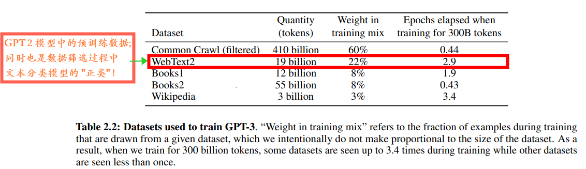
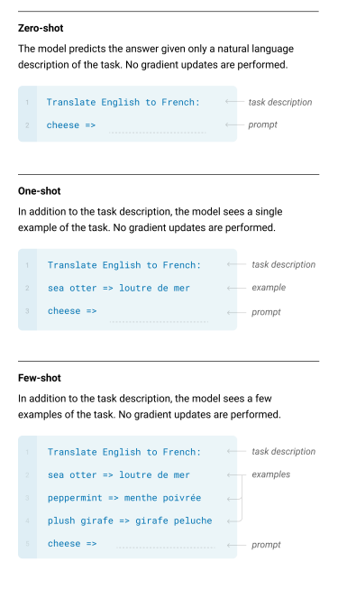
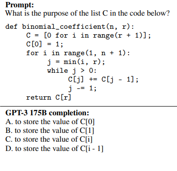
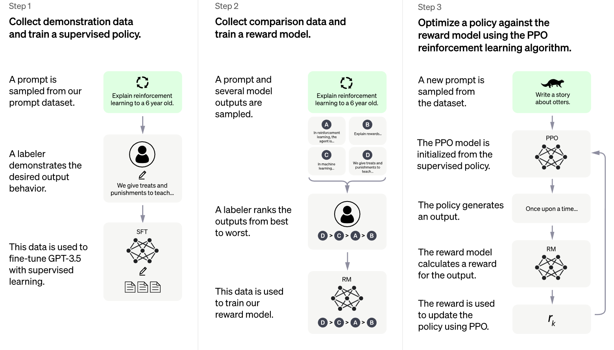
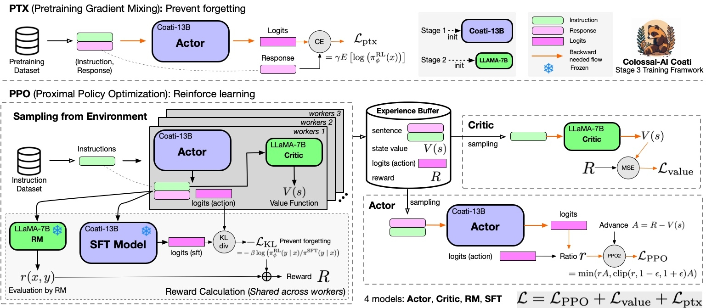

# LLM 和 RLHF 简介

[TOC]

## GPT 模型架构

GPT 系列的模型架构非常简单, 属于 decoder-only 模型。如果用 transformers 架构来描述的话, 有两种方式:

+ transformers 中的 decoder 部分去掉 cross attention 部分
+ transformers 中的 encoder 部分将 self-attention 部分变成 masked self-attention

其做的事情和标准的语言模型一样: 一句话中根据前 $n$ 个词来预测第 $n + 1$ 个词的概率。整个计算过程是:

+ 将 $n$ 个词语通过 **映射** 的方式编码成向量 (`nn.Embedding`)
+ 用 self-attention 的方式不断地对这些词向量进行重新编码
+ 用第 $n$ 个词向量, 通过 softmax 回归给出词表中每一个词是第 $n+1$ 个词的概率

需要注意的是, 虽然最后做的事情类似于 uni-gram (1-gram), 即用第 $n$ 个词去预测第 $n+1$ 个词, 但是在前面的 self-attention 运算中, 第 $n$ 个词向量已经包含了前面所有词语的信息, 因此属于标准的语言模型。除了 GPT 外, 单向的 LSTM 模型也可以实现标准的语言模型, 方式是类似的, 只是计算单元从 self-attention 变成了 `LSTMCell`。

额外提醒一下, 在更早的 word2vec 算法中, 是在一个 **窗口** 内相互预测词语的概率。skip-gram 是用 **中心词** 去预测 **周围词** 的概率, cbow 是用 **周围词** 去预测 **中心词** 的概率。这些都不是标准的语言模型。

## GPT-3 预训练数据

上面所说的内容并不能够让 GPT-3 模型如此成功, 真正让其成功的原因是 **参数量** 和 **预训练数据**。我们知道, GPT-3 模型的参数量有 1750 亿, 属于 大力出奇迹 的典范。

**预训练** 任务上面已经说过了, 那就是收集来大量的文本, 然后进行 下一个词预测。核心在于数据集的收集。

在 GPT-2 中, OpenAI 整理了一个 [WebText](https://paperswithcode.com/dataset/webtext) 数据集, 其收集了 reddit 网站上 karma 大于 3 的贴子 (可以理解为贴吧上点赞数大于 3 的贴子)。最终一共八百万篇文章, 共计 40 GB 的数据。OpenAI 没有开源这个数据集, 后来有人仿照这个样式, 开源了 [OpenWebTextCorpus](https://skylion007.github.io/OpenWebTextCorpus/) 和 [OpenWebText2](https://openwebtext2.readthedocs.io/en/latest/) 数据集, 有兴趣的可以去了解一下。

40GB 的文本数据对于一个 15 亿参数量的模型来说是足够了, 但是对于 1750 亿参数量的模型来说是远远不够的。于是 OpenAI 又尝试从 [Common Crawl](https://commoncrawl.org/) 项目中选取数据。

Common Crawl 是一个公开的大型爬虫项目, 从 2016 年到 2019 年一共爬取了 45 TB 的数据。这个数据中有很多都是 **脏数据** (低质量的文本数据), 或者重复的数据。OpenAI 是怎么处理它们的呢?

首先, 使用 LSH (Locality-Sensitive Hashing 局部敏感哈希) 算法对海量的数据进行去重; 然后使用 文本分类 模型来过滤脏数据。文本分类模型的构建如下:

+ 正类: reddit 上 karma 大于 3 的贴子, 和 WebText 数据集类似
+ 负类: 所有 common crawl 中的数据

这样, 就可以筛选出 Common Crawl 中和 WebText 类似的文本, 一共有 570 GB 的数据, 相当于原本数据的 $\frac{1}{90}$。对这些数据进行分词, 最终大约有 四千亿 个 token。

GPT-3 整个预训练混合了以下的数据集:

第一列表示的是数据集分词后的总 token 数 (billion 表示十亿), 第二列是在训练的过程中一个 batch 采样的占比, 第三列是训练三千亿个 token 后每一个数据集过了多少遍。

从第三列可以看出, OpenAI 对 Wikipedia 数据集最看重, 其次是 WebText 数据集, 而对过滤后的 Common Crawl 数据集并不是很看重。至于第二列的权重是怎么计算出来的, 论文中并没有详细说明。

## GPT-3 效果

那么 GPT-3 究竟有多成功呢?

OpenAI 认为 GPT-2 是 [Unsupervised Multitask Learners](https://openai.com/research/better-language-models), 在大部分任务上并不需要微调, 只有很小一部分任务需要微调。实际上零样本学习的效果并不是很好, 在其 [开源](https://github.com/openai/gpt-2) 后, 依然有很多人基于其进行特定任务的微调。

OpenAI 在论文中给 GPT-3 起的名字是 [Few-Shot Learners](https://arxiv.org/abs/2005.14165), 所有的 NLP 任务都不需要微调, 直接告诉模型要做什么即可, 效果比之前的好很多。同时, 越来越多的人尝试将所有的 NLP 问题统一成为一个范式 (在 GPT-3 之前就已经有人尝试)。比较可惜的是, 这个模型没有开源。但是 OpenAI 公开了 API, 很多人基于这个 API 开发出许多有趣的应用。

GPT-3 的输入形式大概是这样的:

很多人, 包括我, 在第一次看到的时候非常惊讶。预训练的数据集仅仅是从网上爬取下来的, 为什么你让模型将 cheese 翻译成中文, 模型就一定会输出 "奶酪" 呢? 模型有没有可能输出完全不相关的内容呢?

一种比较合理的解释是这样的模板在预训练的语料库中出现过, 另一种解释是大模型非常强大, 能够 "理解" 你的想法。总之, 只有预训练, 没有微调的大语言模型能力非常地强。后续, 我们将模型的输入文本称为 **prompt** (提示), 模型的输出文本称为 **response**。

那么如果想做 **少样本学习**, 怎么办呢? 那么可以将样本放在输入的位置, 模型可以通过这些样本知道输出的样式。这种方式被称为 **上下文学习** (in-context learning) 。

如果你只了解早期的深度学习, 没有接触过大语言模型的话, 估计很难相信 GPT-3 会有这种效果。当然, 这种输出不是完全可控的, 模型有可能输出完全不相关的内容, 下图是 Instruct GPT 论文中给出的例子:

我们希望模型解释这段代码的含义, 模型却输出了四个选项, 两者之间完全不相关。

现在, 所有的 NLP 任务可以统一成为一种范式了, 都是 **文本生成** 任务。如果是分类任务, 直接让模型输出标签的名字, 然后用正则提取即可; 如果是 **对话** 任务, 那么直接将历史的对话内容拼接在一起作为 prompt, 让模型输出后续的回复内容。不同的任务只是 prompt 的形式不同而已。

## 指令微调 与 少参数微调

虽然 GPT-3 的能力很强, 但是并不一定会按照人的想法输出, 一种比较直觉的做法还是微调。但是和之前的微调形式完全不一样了, 我们将新的微调方式称为 **指令微调** (instruction tuning)。

传统的微调范式是: 删除 **预训练任务** 相关的网络层, 将剩下的网络层作为 **特征提取器**, 添加 **下游任务** 相关的网络层, 然后开始训练。

在指令微调中, 所有的任务都是 **文本生成** 任务, 模型的输入按照 prompt 的形式进行转换, 输出按照你期望的 response 形式进行转换, 计算 loss 只计算 response 部分的即可。

我们将只更新一部分参数的方式称为 **少参数微调** (parameter-efficient fine-tuning), 整个神经网络所有参数都更新的方式称为 **全量微调**。

那么新的问题又来了。在传统的微调范式下, 如果你的预训练模型非常非常大, 参数量非常多, 我们可以将整个特征提取器部分的参数固定住, 只更新下游任务相关的参数即可。这样可以很大程度上的节约显存 (因为更新参数是需要消耗大量显存的)。但是, 在指令微调中, 模型往往都是非常巨大的, 但是又没有新的模型参数, 难道只有 **全量微调** 这一种办法吗?

为了解决上述问题, 在指令微调的过程中, 我们可以自己给语言模型添加新的参数, 然后只训练这些参数即可。添加新参数的方式有 LoRA, Prefix Tuning, P-Tuning 等等, 更多相关内容可以参考: [PEFT](https://huggingface.co/docs/peft/index) 。

当然, 这些技术也不是只能用于指令微调, 对于传统的微调, 你也可以用类似的方式为特征提取器部分添加可训练参数。

## 指令微调 的问题

我们可以认为 GPT-3 是 "通用型" 人才, 可以解决任意的 NLP 任务, 但是输出并不稳定。经过 指令微调 后, 模型可以变成 "专门型" 人才。比方说, 我只希望模型去做 摘要生成 这个任务, 那么可以在已有的摘要生成数据集上进行训练, 让模型成为 摘要生成 的大模型。

那么, 如果用 **指令微调** 后的 摘要生成大模型 去做其它 NLP 任务呢? 此时的效果会变得非常糟糕。那么能不能让模型在经过 **指令微调**, 摘要生成的能力变强了, 其它能力不变呢? 也就是说依旧是一个 "通用性" 人才, 只是在 摘要生成 任务上做的更好了。答案是非常困难, 一种可参考的解决办法是让 **指令微调** 任务和 **预训练** 任务混合在一起进行训练。

现在, 我们希望模型依旧是 "通用型" 人才, 但是其输出和人类期望的回答更加贴切, 和人类更加地 **对齐** (align), 不要出现上图中 "答非所问" 的情况, 应该怎么办呢? 可以使用 指令微调 实现吗?

John Schulman 是 ChatGPT 的作者之一, 下面是他在最近的一次演讲中的观点:

我们可以认为大语言模型的权重中存在一个 **知识图谱**, 并且对图谱中的每一个结点都有一个置信度分数。**指令微调** 的数据一般是远远小于预训练的数据的, 因此其做的事情是学习一个 **简单的函数**, 这个函数操作知识图谱, 并按照人类的意图进行输出。如果 **指令微调** 数据集中人类编写的答案和 **知识图谱** 中的事实不相符 (可能是知识图谱中的正确, 可能是人类编写的正确), 那么就是在让模型拒绝使用 **知识图谱** 中的内容, 进行 **胡言乱语**。

换句话说, 如果使用 **指令微调** 的数据集, 那么人在编写对应的 response 时, 也需要根据这个 **知识图谱** 去编写, 否则很可能只在数据集涉及到的领域表现良好, 而其它领域效果变得很差。但是问题是我们没有办法拿到这个 **知识图谱**, 因此单纯的 **指令微调** 并不是一个和人类 **对齐** 的好办法。

当然, 这只是他的观点。透过他的观点, 我们可以知道: (1) 大语言模型的知识学习往往是在 **预训练** 阶段, 在 **指令微调** 阶段想注入新的知识是比较困难的 (主要是两者的数据量不在一个等级上); (2) 单纯的 **指令微调** 很难让大语言模型保持原有的能力。

对于第一个问题, 是现在的研究方向之一, 被称为 model (neural) editing, 属于研究的初期阶段, 想了解的可以参考 [博客](https://zhuanlan.zhihu.com/p/609177437) 。

对于第二个问题, 就要说到本文的第二个主角: RLHF。

## RLHF 训练

其实本文是想介绍 InstructGPT 的, 但是为了说明为什么要使用 RLHF, 写了一大堆的内容。用一句话概括就是, InstructGPT 中使用 RLHF 想要做的事情是: 让模型和人类期望的答案 "对齐", 同时尽可能地保持原有的能力。

如果你真去了解 RLHF, 会发现这是一个非常大的话题, 里面涉及到的内容非常广泛。但是实际上涉及到的强化学习知识包括: Actor-Critic 模型, PPO 算法和 Reward (Preference) 模型。当然, 想要完全掌握这些知识也是非常困难的 (感觉不去实际训练几个强化学习的模型, 很难理解这些算法要解决的问题)。

简单来说, prompt 是初始状态 state, 大语言模型是 actor, 其输出的 response 是 action, reward 模型根据 prompt (state) 和 response (action) 返回对应的 reward 值, 下一个状态是 终止状态。

另一种说法是, prompt 是初始状态 state, 大语言模型是 actor, 其输出的 response 中每一个 token 是一个 action, actor 每一次根据 prompt + 已生成的 token 决定下一个 token 是什么, 直到 **终止状态** (response 达到最大长度或者出现 `EOS` 字符) 才有 reward 值, reward 值由 reward 模型输出。

使用 强化学习 的直觉是: 如果 大语言模型 (actor) 生成的 response (action) 是人类所希望的, 那么就增加输出其的概率; 如果 大语言模型 (actor) 生成的 response (action) 不是人类所希望的, 那么就降低输出其的概率。和 指令微调 的思路不同, 其不告诉模型应该输出什么样子的 response, 而是调整模型输出 response 的概率。

OpenAI 提供的流程图如下:

具体的讲解如下:

### 第一步: 指令微调

首先, 对 GPT-3 进行 **指令微调**。指令微调的数据集大约是 13,000 个, 由标注人员自己根据 prompt 写 response。我们将经过 **指令微调** 的模型成为 SFT (Supervised Fine-Tuning)。

SFT 是后续所有模型的起点, SFT-6B 表示的是基于 60 亿参数的 GPT-3 模型训练出来的 SFT 模型, 同理, SFT-175B 表示的是基于 1750 亿参数的 GPT-3 模型训练出来的 SFT 模型。

不仅如此, OpenAI 在论文中说, 其还将 SFT 模型训练到 过拟合 的状态, 对后续的任务是有帮助的。

这里很奇怪, 你刚刚说了 指令微调 不好, 为什么还要先用 指令微调 进行训练呢? 甚至训练到过拟合的状态。一种解释是 这一步 可以让模型成为某一 "领域" 的 "专家"。但是我觉得这种解释太过牵强了, 目前也没有太合理的解释。

### 第二步: 奖励模型

在 强化学习 中, 环境程序需要根据 state 和 action 返回一个 reward 值。对应到这里, 我们需要给 prompt 和 response 对进行打分, 作为 reward 值。由于现在的目标是要模型和人类 "对齐", 那么自然这个 reward 分数应该由人来定。

然而在用强化学习进行训练时, 不太可能一直由人给 prompt 和 response 进行打分。我们需要训练一个 **回归模型**, 输入是 prompt 和 response, 输出是一个标量值。这个标量值就是 reward 分数。这个模型被称为 **奖励模型** (reward model)。

但是, 让标注人员来打分是很难的事情, 因为不同人之间的评分标准很可能是不一样的。怎么办呢? 一种解决办法是让标注人员对多个 response 进行排序, 然后奖励模型输出的分数满足这个排序即可。

我们设 $x$ 为 prompt, $y_w$ 和 $y_l$ 是这个 prompt 对应的两个 response, 并且根据标注人员的判断, $y_w$ response 是要优于 $y_l$ response 的。$\theta$ 表示的是模型参数, $r_{\theta}$ 表示奖励模型的输出, $\sigma$ 表示的是 sigmoid 函数, 则:

$$
\mathrm{loss} (\theta) = - \log \{
    \sigma [r_{\theta} (x, y_w) - r_{\theta} (x, y_l)]
\} \tag{1}
$$

简单来说, 我们让 $r_{\theta} (x, y_w)$ 和 $r_{\theta} (x, y_l)$ 的差值作为 logit 值, 然后用 sigmoid 函数将 logit 值转化成概率值, 表示 $y_w$ 比 $y_l$ 好的概率。最后, 和 逻辑回归 一样, 用概率的负对数作为 loss 值。这种 loss 也被称为 pairwise ranking loss。

对于每一个 prompt, 我们用使用 采样生成 的方式, 一共生成 9 个不同的 response, 然后让标注人员对这 9 个 response 进行排序。在训练阶段, 对这 9 个 response 两两配对, 一共有 $C_9^2 = 36$ 个结果, 然后根据公式 $(1)$ 计算 loss 即可。

需要注意的是, 奖励模型使用的是 SFT-6B 语言模型, 和传统的微调一致, 将预训练相关的任务层去掉, 添加一个 **回归层**。作者在论文中说, 它们尝试用 SFT-175B 进行训练, 发现训练的不稳定, 就采用了 SFT-6B 的模型。

### 第三步: 强化学习

有了奖励模型, 我们就可以套用强化学习的方式来训练模型了。但是作者认为还需要对 reward 值进行修正, 修正方式如下:

$$
R(x, y) = r_{\theta} (x, y) - \beta \log \frac{\pi^{RL}_{\phi} (y | x)}{\pi^{SFT}(y | x)} \tag{2}
$$

其中, $r_{\theta}$ 表示的是上面的奖励模型; $\pi$ 是大语言模型, 也就是 actor 模型, $\pi(y|x)$ 表示 actor 模型根据 x prompt 生成 y response 的概率; $\pi^{RL}_{\phi}$ 是我们需要更新的 actor 模型, $\phi$ 表示需要更新的模型参数; $\pi^{SFT}$ 是一个参考模型, 一般情况下就是初始的 $\pi^{RL}$ 模型。

使用公式 $(2)$ 的原因是希望 $\pi^{RL}$ 模型更新的幅度不要和 $\pi^{SFT}$ 太大, 也就是不要和初始的 $\pi^{RL}$ 相差太大。具体计算时, 用 response 中的每一个 token 的概率相除, 取对数, 再求平均值即可。

有了 $R(x, y)$ 后, 我们就可以套用 actor-critic PPO 的强化学习框架了。

不仅如此, 在 InstructGPT 的论文中, 还添加了 预训练 的任务。需要注意的是, 预训练的数据集和强化学习的数据集是分开的, 也就是: 从不同的两个数据集中取 batch, 分别走神经网络, 计算出 loss 后加权求和, 结果就是最终的 loss, 再反向传播计算梯度。

我们用 $\gamma$ 表示预训练部分 loss 的权重值, 具体训练的超参数可见论文附录的 $C.4$ 章节。其中, $\gamma = 27.8$, $\beta=0.02$ 。

套用 actor-critic PPO 框架后, 一共有四个模型 (所有模型都是基于 SFT 模型初始化参数的, 而不是 GPT-3 模型):

+ reward model: 奖励模型, 根据 prompt 和 response 计算对应的 reward 值
+ actor model: 最终使用的语言模型
+ critic model: 用于估算 prompt 的 reward 期望值, 整体架构和奖励模型差不多
+ reference model: 初始的语言模型, 防止 actor 模型更新幅度过大

[ColossalAI](https://github.com/hpcaitech/ColossalAI) 中给出了 RLHF 训练完整的示意图:

## RLHF 额外说明

### 奖励模型数据集

在 InstructGPT 发布之后, ChatGPT 发布之前, Anthropic 发布了一篇类似的论文: [Anthropic LLM](https://arxiv.org/abs/2204.05862)。其提出了更加合理的 reward 模型数据收集方案, 并且主要是针对 对话任务 来收集数据的。

在 Anthropic LLM 中, 数据集会按照 helpful 和 harmless 两个方向来收集。

在收集 helpful 数据集时, 标注人员正常和模型进行交互, 然后再某一轮对话后给出两个不同的 response, 让标注人员选择哪一个更好, 对人类有帮助。

在收集 harmless 数据集时, 标注人员要 "诱导" 模型输出不应该输出的内容, 然后再某一轮对话后给出两个不同的 response, 让标注人员选择哪一个更好, 对人类更加地 "无害"。

然后将两个数据集合并在一起, 训练奖励模型。"有助性" 和 "无害性" 在某种程度上是相互抵触的, 但都是必要的。

个人认为, 奖励模型的数据集最好是从待训练的 actor 模型中采样出来的, 但是这样的标注成本很高。目前开源的比较著名的数据集有: (目前没有中文的, 期待中文 RLHF 数据集的开源)

+ Anthropic 的 [hh-rlhf](https://huggingface.co/datasets/Anthropic/hh-rlhf)
+ 北大的 [safe-rlhf](https://github.com/PKU-Alignment/safe-rlhf)

### 模型迭代

那么整个过程可以迭代吗? Anthropic LLM 中给出了一个方案: 我们用训练完成的 actor 模型重新按照上面的过程收集 奖励模型的数据集, 然后和原本的数据集混合在一起, 重新训练 奖励模型, 再按照 RLHF 的步骤重新训练 actor 模型, 如此往复。

在模型上线后, 需要去大量收集用户提问的 prompt, 然后大量标注 奖励模型数据集。这里也验证了我上面的说法, 开源的 RLHF 数据集帮助可能不是很大, 如果你没有 "财力" 去大量地标注数据, 想要迭代模型是一件很困难的事情, 模型的效果自然也会大打折扣。

### 优缺点

使用 RLHF 有什么优点呢? 除了上面说的内容外, 更多地体现在数据标注上:

+ 只判断 response 的好坏比直接写 response 的速度要快很多
+ 有一些问题让人写 response 是非常困难的, 但是比较好坏是很快的, 比方说: 写一首赞美 AI 的诗

但是问题也是存在的, 那就是不同人的判断标准不同。在 Instruct GPT 中, 作者说标注人员对于观点的一致性有约 75%; 在 Anthropic LLM 中, 作者说标注人员对于 response 好坏判断的一致性只有约 62% 。当然, 这是所有文本生成任务都存在的问题, 同样的文本, 让不同人来写摘要和做翻译, 结果相差可能都会很大。

强化学习的训练本来就不是很稳定, 再加上这种标注一致性的问题, 可能会导致模型训练的更加不稳定。

### 总结

虽然说 ChatGPT 的效果非常惊艳, 但是 RLHF 的研究目前还处于初期阶段。同时, "文本生成" 任务的评估是非常困难的。比方说, 你让 ChatGPT 做考试题, 是不是应该先确保预训练的数据集中没有出现过这些考试题呢? ChatGPT 改变了目前科研的范式, 未来会发展成什么样子谁都不知道。或许通用人工智能很快就会到来, 或许又迎来一次 AI 寒冬。只能说: 敬请期待。

## References

代码相关:

+ [Colossal AI Chat](https://github.com/hpcaitech/ColossalAI/tree/main/applications/Chat)
+ [HuggingFace TRL](https://huggingface.co/blog/stackllama)
+ [DeepSpeed Chat](https://github.com/microsoft/DeepSpeedExamples/tree/master/applications/DeepSpeed-Chat)
+ [PKU Beaver](https://github.com/PKU-Alignment/safe-rlhf)

论文 / 技术报告相关内容:

+ [GPT-1 paper | Improving Language Understanding by Generative Pre-Training](https://s3-us-west-2.amazonaws.com/openai-assets/research-covers/language-unsupervised/language_understanding_paper.pdf)
+ [GPT-2 paper | Language Models are Few-Shot Learners](https://arxiv.org/abs/2005.14165)
+ [GPT-3 paper | Language Models are Unsupervised Multitask Learners](https://cdn.openai.com/better-language-models/language_models_are_unsupervised_multitask_learners.pdf)
+ [GPT-4 paper | GPT-4 Technical Report](https://arxiv.org/abs/2303.08774)
+ [Instruct GPT | Training language models to follow instructions with human feedback](https://arxiv.org/abs/2203.02155)
+ [Anthropic LLM | Training a Helpful and Harmless Assistant with Reinforcement Learning from Human Feedback](https://arxiv.org/abs/2204.05862)
+ [Sparks of Artificial General Intelligence: Early experiments with GPT-4](https://arxiv.org/abs/2303.12712)
+ [GPTs are GPTs: An Early Look at the Labor Market Impact Potential of Large Language Models](https://arxiv.org/abs/2303.10130)

博客相关:

+ [HuggingFace blog | Illustrating Reinforcement Learning from Human Feedback (RLHF)](https://huggingface.co/blog/rlhf)
+ [HuggingFace blog | StackLLaMA: A hands-on guide to train LLaMA with RLHF](https://huggingface.co/blog/stackllama)
+ [OpenAI blog | Aligning language models to follow instructions](https://openai.com/research/instruction-following)
+ [OpenAI blog | Introducing ChatGPT](https://openai.com/blog/chatgpt)
+ [OpenAI blog | GPT-4](https://openai.com/research/gpt-4)

视频相关:

+ [李沐 | GPT，GPT-2，GPT-3 论文精读](https://www.bilibili.com/video/BV1AF411b7xQ/)
+ [李沐 | InstructGPT 论文精读](https://www.bilibili.com/video/BV1hd4y187CR)
+ [李沐 | Anthropic LLM 论文精读](https://www.bilibili.com/video/BV1XY411B7nM)
+ [李沐 | GPT-4论文精读](https://www.bilibili.com/video/BV1vM4y1U7b5)
+ [李宏毅](https://www.youtube.com/@HungyiLeeNTU/videos)
