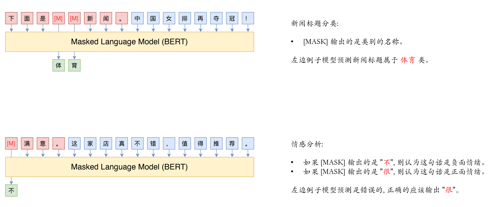

# AutoPrompt

[TOC]

## 简介

对于 prompt engineering 来说, 最重要的事情就是如何构建 prompt。在只有极其少量样本数据 (比方说 10 条) 的情况下, 我们只能凭借经验和语文功底, 绞尽脑汁来写 prompt, 然后测试效果。

如果我们有少量的样本数据 (比方说 300 条) 呢? 我们可以用某种算法自动构建 prompt 吗?

在 [AUTOPROMPT: Eliciting Knowledge from Language Models with Automatically Generated Prompts](https://arxiv.org/abs/2010.15980) 这篇论文中, 作者借鉴了 [NLP 对抗攻击](https://github.com/QData/TextAttack) 中的 [hotfilp](https://arxiv.org/abs/1712.06751) 方式来自动构建 prompt。项目开源在 [GitHub](https://github.com/ucinlp/autoprompt) 上。

## MLM 与 prompt

首先, 需要说明的一点是 AutoPrompt 并不是针对 CLM (因果语言模型, 如 GPT) 来设计 prompt 的, 而是针对 **MLM** (掩码语言模型, 如 BERT) 来设计 prompt 的。此时, 你获取会产生疑问, MLM 模型怎么和 prompt engineering 挂上钩的呢? 可以参考下图:

其中, 红色方块的部分是 prompt, 蓝色方块的部分是输入的句子。对于特定的问题, 我们需要设置特定的 prompt, 同时为每一个 类别 设置对应的 候选词。这样, 我们就可以达成我们的目标。

需要说明的是, 候选词的选择和 `[MASK]` 的位数是相关的。比方说, 对于上面的 情感分析 任务来说, 如果开头有两个 `[MASK]`, 那么 "正面情绪" 的候选词可能是 "非常", "十分", "相当" 等等, "负面情绪" 的候选词可能有 "很不", "极不" 等等。

如果 输出的候选词 长度没有办法固定, 那么就需要跑多次模型, 每一次的 `[MASK]` 数量不一致。更多相关的内容可以参考博客 [必须要GPT3吗？不，BERT的MLM模型也能小样本学习](https://spaces.ac.cn/archives/7764)。

上面所说的主要是针对 NLU 任务而言, AutoPrompt 也是针对 NLU 任务而言的。

总的来说, AutoPrompt 是针对 MLM + NLU 任务来设计的。个人认为, 是可以扩展到 CLM 和 NLG 上面的。其解决问题的思路是非常值得学习的。

## prompt 构建: 原理篇

我们将模型的输入标准化成三部分: 输入的句子 $xi$, 任务提示词部分 $xp$, 以及 mask 部分 $xm$。$xm$ 处输出的 token 记作 $\hat{y}$。如果是 分类任务, 我们期待 $\hat{y}$ 是类别的名称; 如果是 [knowledge probing](https://github.com/facebookresearch/LAMA), 我们期待 $\hat{y}$ 输出相关的知识。我们用 $y$ 表示标准答案。有了 $y$ 和 $\hat{y}$, 就可以计算 loss 值 $L$ 了。

了解过 对抗攻击 (adversarial attack) 的应该知道, 模型是很 "脆弱" 的。在输入中加入一个 人难以察觉的 噪声, 都可以使得模型输出截然相反的内容。当然, 这个噪声不是随机的, 如何找到这个噪声就是 对抗攻击 主要的研究方向。

既然如此, 我们可以用这种方式来寻找 $xp$。只要在 $xi$ 后面添加上 $xp$, 模型在 $xm$ 部分就会输出我们期待的 $y$。和 对抗攻击 不同的是, 我们完全不用在意 $xp$ 是否 "可读", 其可以是任意 token 的组合, 只要能完成任务即可。这是 AutoPrompt 的核心思想。

如何找到 $xp$ 呢? 对于程序员来说, 最简单的方式是 **穷举法**。我们假设 $xp$ 中包含 $n$ 个 token, 词表的大小是 $K$, 那么一共有 $K^n$ 种 $xp$。每一种都进行实验, 计算在已有数据集上的准确率, 取最大的那一个即可。

这种方式的问题是计算的成本太高了。我们希望用类似 梯度下降法 这种 **迭代** 的方式来寻找 token。也就是说, 先随机初始化 $xp$ 中的 token, 然后计算梯度, 再根据梯度来替换 token。

但是, 这是不现实的一件事情。因为 token 只是高维空间中一群离散的点。我们不能只将 token 点往左或者往右移动一点点, 而是要移动到另一个确切的 token 点上。此时应该怎么处理呢?

我们假设 $xp^{(i)}$ 表示 $xp$ 中的第 $i$ 个 token。初始状态下, 我们给 $xp^{(i)}$ 随机赋予一个 token, 记作 $xp^{(i)}_0$。

根据上面所说, 我们可以认为, $xp^{(i)}$ 和 $L$ 之间的关系是连续的, 但是只能取其中的一部分离散的点。现在, 我们用 其在 $xp^{(i)}_0$ 处的切线 来拟合这些离散的点。也就是说:

$$
\nabla_{xp^{(i)}_0} L = \frac{\Delta L}{w - xp^{(i)}_0} \tag{1}
$$

其中, $\nabla_{xp^{(i)}_0} L$ 表示 $L$ 在 $xp^{(i)}_0$ 处的梯度, $w$ 表示词表中随机一个 token 对应的点, $\Delta L$ 表示 $L$ 的变化程度, 即 $xp^{(i)}$ 从 $xp^{(i)}_0$ 变成 $w$ 后 $L$ 的变化值。我们将公式整理一下, 变成:

$$
\Delta L = \nabla_{xp^{(i)}_0} L \cdot (w - xp^{(i)}_0) \tag{2}
$$

如果 $xp^{(i)}$ 从 $xp^{(i)}_0$ 变成 $w$ 后, $L$ 的值变大了, 那么 $\Delta L$ 是大于 0 的。相反, 如果 $xp^{(i)}$ 从 $xp^{(i)}_0$ 变成 $w$ 后, $L$ 的值变大了, 那么 $\Delta L$ 是小于 0 的。

我们希望 $L$ 的值越低越好。也就是 $\Delta L$ 的值应该是小于 0 的。在小于 0 的前提下, 我们期待 $L$ 变化的程度越大越好。综合来说, 也就是 $\Delta L$ 的值越小越好。我们遍历所有可能的 $w$, 找到使得 $\Delta L$ 最小的 $w$, 记作 $xp^{{i}}_1$。

上述方式在论文中被称为 泰勒公式的一阶近似 (first-order approximation)。其实, 仔细想一想, 梯度下降法用的也是这种一阶近似法, 只是每一次迭代更新幅度的 "非常小", 问题不大。但是在这里, 更新幅度大概率是 "巨大的", 这种方式就有很大的问题了。怎么办呢?

答案是, 每一次我们取使得 $\Delta L$ 值最小的 $k$ 个 token, 作为候选词。然后和上面的 **穷举法** 一样, 一个一个进行实验, 计算在数据集上的准确率, 取准确率最高的那个词进行替换。

观察公式 $(2)$, 每一次计算 $\Delta L$ 时, $w$ 都要减去 $xp_0^{(i)}$。反正最后只是比大小, 还有后续实验验证, 那么减去 $xp_0^{(i)}$ 的部分就可以忽略了。我们用 $V$ 表示词表, $V_{cand}$ 表示得到的候选词集合, 则公式 $(2)$ 可以变成:

$$
V_{cand} = \mathop{\mathrm{top \text{-} k}} \limits_{w \in V} (- w \cdot \nabla L) \tag{3}
$$

这里的公式 $(3)$ 和 [论文](https://arxiv.org/abs/2010.15980) 中的公式 $(2)$ 就可以对应上了。需要注意的是, 我多加了一个负号, 个人认为这样更加严谨。(论文中很可能是按照 对抗样本 中的公式写的, 在 对抗样本 中, 我们希望 loss 越大越好, 因此不需要负号)

## prompt 构建: 流程篇

AutoPrompt 完整的 prompt 构建流程是什么呢?

首先, $xp$ 中的 token 数 $n$ 是一个超参数, 需要自己设置。然后将 $xp$ 中所有的 token 初始化成 `[MASK]` token。接下来开始迭代:

+ 从训练集中随机抽取一部分数据, 计算损失值 $L$
+ 从 $xp$ 中随机选择一个 token, 记作 $xp^{(i)}$
+ 计算 $L$ 关于 $xp^{(i)}$ 的梯度 $\nabla L$
+ 根据公式 $(3)$, 得到替换 $xp^{(i)}$ 的 $V_{cand}$
+ 从训练集中随机抽取一部分数据, 计算在不进行替换情况下的正确率 $s^{\prime}$
+ 遍历 $V_{cand}$ 中的每一个 token, 替换 $xp^{(i)}$, 用上一步相同的数据计算正确率; 取最大的那一个, 正确率记作 $s^{\star}$, token 记作 $w^{\star}$
+ 如果 $s^{\star}$ 的值比 $s^{\prime}$ 值大, 则将 $xp^{(i)}$ 替换成 $s^{\star}$, 否则不进行替换

反复进行上述迭代, 直至收敛。

## prompt 构建: 思考篇

论文中虽然是针对 MLM 设计的, 但是我认为也是可以用于 CLM 的, 只是 $xp$ 中的 token 不再初始化成 `[MASK]` token, 而是其它随机的 token。

上述的方案最初是在 [hotflip](https://arxiv.org/abs/1712.06751) 论文中提出的, 是针对 单个样本 的 对抗攻击。后续在 [Universal Adversarial Triggers for Attacking and Analyzing NLP](https://arxiv.org/abs/1908.07125) 中变成了针对 模型 的对抗攻击。最后才到这篇论文中, 作为自动寻找 prompt 的方案。

回过头来思考 语言模型 的训练过程, 我们是怎么处理 离散 的 token 呢?

我们是直接将 token 映射到一个高维空间中的, 初始是随机的位置或者用 word2vec 算法计算出来的位置。在训练语言模型时, 除了模型参数是可以改变的, token 在高维空间中的位置也是可以改变的。最终, token 在高维空间中的位置 + 模型的参数 在一起使得 loss 值尽可能地低。

那么, 我们的 prompt 一定要是词表中 token 所对应的点吗? 可以是高维空间中其它的点吗? 答案是可以的, 这就是 soft prompt。

## 类别候选词 构建

首选要说明, 这里仅仅针对 分类任务 而言, 不是对 knowledge probing 这样的任务设计的。

对于分类任务来说, 我们用 类别名称 作为输出很可能是不合理的。比方说, 对于 情感分析 任务, 表示正面的词汇除了 positive, 还可以是 marvelous, powerful 这样的词。那么, 如何扩展 类别的候选词 呢?

最直接的方式是: 对于 训练集 中每一个类别 $y$ 的所有数据, 统计 $xm$ 处输出的所有 $\hat{y}$ token, 作为候选词。然后对比不同类别之间的候选词, 人工进行判断。(之所以要人工判断, 是因为不同类别的候选词间可能会有重复)

论文中提出了另一个办法。我们知道, 对于 语言模型 来说, 其实有两个 word embedding:

+ input embedding: 将 token 映射成 高维空间 中的点
+ output embedding: 特征向量和 token 向量点乘, 得到 logits 值

我们假设 $xm$ 部分只有一个 `[MASK]` token, 这个 token 经过模型一系列的计算后, 在 output embedding 层之前的输出是 $h$ 向量。这个 $h$ 向量经过 output embedding 层后得到每一个词的 logits 分数。

对于 output embedding, 我们可以这样理解: 每一个 token, 都有一个向量 $w_o$。$h$ 向量和 $w_o$ 向量进行点乘, 再加上一个 bias, 即为输出当前 token 的 logits 分数值。

我们现在用 $h$ 向量, 重新训练一个 softmax 回归模型。注意, 此时的模型只有一个线性层。这个线性层输出的就是 每一个类别 的 logits 分数。

换一种说法, 就是将原本语言模型的 output embedding 层替换成一个新的线性层, 然后用这个线性层完成分类任务。这里的思路和普通微调的方式差不多。只不过, 对于普通的微调, 我们会替换很多 task-specific 层, 而这里只替换最后一个线性层。

在训练的过程中, 除了新添加的 线性层 外, 其它的都不更新参数。训练完成后, 每一个类别 $y$, 都可以得到一个分类向量 $y_c$。此时, $h$ 向量和 $y_c$ 向量进行点乘, 再加上一个 bias, 即为输出当前类别的 logits 值。

在不考虑 bias 的情况下, 我们有理由相信 $y_c$ 向量和 $w_o$ 向量在同一个向量空间中。那么, 我们可以将 $y_c$ 和每一个 $w_o$ 向量进行点乘, 分数最高的 $k$ 个 token 作为类别 $y$ 的候选词。(如果考虑 bias, 我们可以理解为: $y_c$ 所处的向量空间和 $w_o$ 所处的向量空间是一致的, 但是 零点 所在的位置不一致。)

$y_c$ 向量综合考虑了所有类别的情况, 这样选出的 $w_o$ 比上面的更有说服力。这里也反映了一个问题, 那就是 softmax 回归没有考虑到 标签 本身的含义, 而是期待通过训练自己学习出 标签 的含义。 (这也是为什么之前 label embedding 比较火的原因)。

论文中没有解释, 直接定义的分数。这里是我自己的理解。

## 补充

在构建 prompt 时, 我们针对 input embedding 进行的处理, 在寻找 类别候选词 时, 我们针对 output embedding 进行的处理。

实际上, 在 BERT 和 GPT2 的实现中, 都参考了 [Using the Output Embedding to Improve Language Models](https://arxiv.org/abs/1608.05859), 将 input embedding 和 output embedding 连接成一个张量。不同的是, BERT 的 output embedding 中加了额外的 bias 参数, GPT2 的 output embedding 中没有增加额外的 bias 参数。

在更早期的 word2vec 算法中, input embedding 和 output embedding 是分开的。在 GPT2 之后, 有人提出将 input embedding 和 output embedding 连在一起会降低性能, 又拆开了。总而言之, 两者是否联在一起 仁者见仁智者见智 吧。

## 总结

本文的效果其实并没有多好。和 普通微调 相比, 性能是差不多的, 需求的数据量也是差不多的, 训练资源也是差不多的。

但是, 其思想是值得学习和借鉴的! 其可以帮助我们更好地理解 prompt! 理解深度学习中的一些概念!
