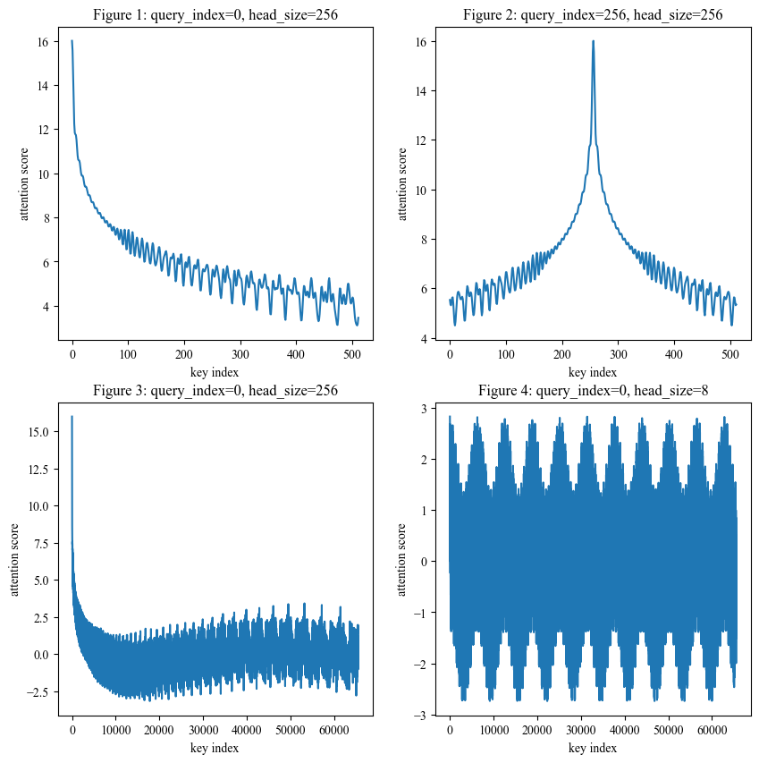

# 旋转式位置编码

[TOC]

## 一、前言

本文主要是整理苏剑林大佬关于 **旋转式位置编码** (Rotary Position Embedding, 简写 RoPE) 的一系列相关工作。目前, RoPE 已经是开源语言大模型, 比方说 [LLaMA](https://arxiv.org/abs/2302.13971), 的标准配置了。但是, 苏剑林大佬的博客写的有点晦涩难懂, 本文尝试用相对简洁的数学语言来描述他们, 并配上相关的基础知识, 方便大家理解。本文假设你对 [Transformer](https://arxiv.org/abs/1706.03762) 架构和 Attention 机制非常的了解。

我们知道, 目前主流的 Attention 计算公式如下:

$$
\bold{o}^{\mathsf{T}} = \mathrm{softmax} \left(
    \frac{\bold{q}^{\mathsf{T}} \cdot \bold{K}^{\mathsf{T}}}{\sqrt{d_k}}
\right) \cdot \bold{V}
\tag{1.1}
$$

整个过程中并没有对 **位置信息** 进行建模, 所有的位置信息是通过 **位置编码** 告诉模型的。这样的好处是使得模型更加灵活, 诞生了 [Vision Transformer 和 Masked AutoEncoder](https://zhuanlan.zhihu.com/p/660058466) 等等一系列工作, 缺点是长度难以扩展。本文也会包含 RoPE 长度扩展的相关内容。

## 二、位置编码简介

位置编码分为两种, 一种是绝对位置编码, 一种是相对位置编码。

**绝对位置编码** 就是用 **位置索引** 直接进行编码, 一般都是直接构建 **位置嵌入向量**, 和 词嵌入向量 直接相加。[Transformer](https://arxiv.org/abs/1706.03762) 中的 正弦波位置编码, BERT 和 GPT 中的 可训练式位置编码 都属于这一种。

**相对位置编码** 则是用 **相对位置索引** 进行编码。"相对" 指的是有参照物。如果两个向量的位置索引分别是 $m$ 和 $n$, 那么他们的 **相对位置索引** 是 $m - n$, 其中 $n$ 就是参照物。一般是作用于矩阵 $\bold{Q}$ 和 $\bold{K}^{\mathsf{T}}$ 点乘时。

我们用 $\bold{q}_m$ 表示矩阵 $\bold{Q}$ 中的第 $m$ 个向量, $\bold{k}_n$ 表示矩阵 $\bold{K}$ 中的第 $n$ 个向量。两个向量之间的 **注意力分数** 计算方式是:

$$
score(\bold{q}_m, \bold{k}_n) = \bold{q}^{\mathsf{T}}_m \cdot \bold{k}_n \tag{2.1}
$$

而 **相对位置编码** 则是希望 **注意力分数** 中包含 **相对位置信息**, 即 $m - n$。

一种可行的方式是为所有可能的 **相对位置** 创建 嵌入向量 $\bold{p}_{m-n}$, 然后将公式 $(2.1)$ 改成:

$$
score(\bold{q}_m, \bold{k}_n) =
(\bold{q}_m + \bold{p}_{m - n})^{\mathsf{T}} \cdot (\bold{k}_n + \bold{p}_{m - n}) -
\bold{p}^{\mathsf{T}}_{m - n} \cdot \bold{p}_{m - n}
\tag{2.2}
$$

更多相关内容可以参考论文: [Self-Attention with Relative Position Representations](https://arxiv.org/abs/1803.02155) 和 [Improve Transformer Models with Better Relative Position Embeddings](https://arxiv.org/abs/2009.13658)。

另一种现在非常常用的方式是: 旋转式位置编码 (RoPE), 也就是本文的主角!

最近发布的大语言模型都倾向于使用相对位置编码, 而不是绝对位置编码, 这是为什么呢? 原因很简单, 可以引入 NLP 模型的假设: 一个 词语 和其附近 词语 相关性高的概率偏大。应用于 [Transformer](https://arxiv.org/abs/1706.03762) 架构就是: 向量 $\bold{q}$ 和其相邻的向量 $\bold{k}$ 之间 **注意力分数** 应该偏高。有一些长度外推性的工作就是基于此展开的, 比方说 [ALiBi](https://arxiv.org/abs/2108.12409), 这个之后有机会再介绍。

## 三、点乘 与 旋转变换

我们知道, 在 **直角坐标系** 中, 对于向量 $\bold{x}$ 和 $\bold{y}$ 来说, 其点乘满足公式: $\bold{x}^{\mathsf{T}} \cdot \bold{y} = ||\bold{x}|| \cdot ||\bold{y}|| \cdot \cos \gamma$, 其中 $\gamma$ 是两个向量的夹角。这个夹角就是两个向量之间的 **相对位置**。换言之, 只要两个向量的模长不变, 夹角不变, 无论它们在坐标系中的什么位置, 点乘的结果都不会发生变化。

假设向量 $\bold{x}$ 和 $\bold{y}$ 是二维向量, 如果将其绕原点旋转一定的角度, 那么改变的仅仅是两个向量之间的夹角, 此时, 将旋转后的向量点乘, 其结果一定包含 **旋转弧度的相对信息**。这就是 RoPE 的核心思想!

下面, 我们用数学语言来进行描述。学过线性代数的应该知道, 矩阵可以用来表示 [线性变换](https://en.wikipedia.org/wiki/Linear_map) 的。对于二维向量 $\bold{x}$, 绕原点旋转 $m$ 弧度后, 变成 $\bold{R}_m \cdot \bold{x}$。其中, 矩阵 $\bold{R}_m$ 的形式如下:

$$
\bold{R}_m = \begin{bmatrix}
    \cos m & -\sin m \\
    \sin m & \cos m
\end{bmatrix}
\tag{3.1}
$$

还记得高中学过的 **和角公式** 吗:

$$
\begin{align*}
\sin(\alpha + \beta) &= \sin\alpha \cdot \cos\beta + \cos\alpha \cdot \sin\beta \\
\sin(\alpha - \beta) &= \sin\alpha \cdot \cos\beta - \cos\alpha \cdot \sin\beta \\
\cos(\alpha + \beta) &= \cos\alpha \cdot \cos\beta - \sin\alpha \cdot \sin\beta \\
\cos(\alpha - \beta) &= \cos\alpha \cdot \cos\beta + \sin\alpha \cdot \sin\beta
\end{align*}
\tag{3.2}
$$

我们可以通过矩阵乘法的定义, 结合 和角公式, 得到以下的结论: $\bold{R}^{\mathsf{T}}_m \cdot \bold{R}_n = \bold{R}_{n - m}$。其中, $n - m$ 就可以理解为 **旋转弧度的相对信息**。

学过线性代数的还应该知道, [转置矩阵](https://en.wikipedia.org/wiki/Transpose) 具有如下的特性: $(\bold{A} \cdot \bold{B})^{\mathsf{T}} = \bold{B}^\mathsf{T} \cdot \bold{A}^\mathsf{T}$。同时, 矩阵乘法虽然不满足 交换律, 但是满足 结合律。

假设向量 $\bold{x}$ 和向量 $\bold{y}$ 都是二维向量, 分别将其旋转 $m$ 和 $n$ 弧度, 再进行点乘, 我们可以进行如下的推理:

$$
\begin{align*}
&\quad (\bold{R}_m \cdot \bold{x})^{\mathsf{T}} \cdot (\bold{R}_n \cdot \bold{y}) \\
&= \bold{x}^{\mathsf{T}} \cdot \bold{R}^{\mathsf{T}}_m \cdot \bold{R}_n \cdot \bold{y} \\
&= \bold{x}^{\mathsf{T}} \cdot \bold{R}_{n - m} \cdot \bold{y}
\end{align*}
\tag{3.3}
$$

而推导过程 $(3.3)$ 正好验证了这一部分开头所说的数学思想。如果我们再暴力一点, 用 $x_0$ 和 $x_1$ 表示向量 $\bold{x}$ 中的元素值, 用 $y_0$ 和 $y_1$ 表示向量 $\bold{y}$ 中的元素值, 可以进行如下的推导:

$$
\begin{align*}
&\quad (\bold{R}_m \cdot \bold{x})^{\mathsf{T}} \cdot (\bold{R}_n \cdot \bold{y}) \\
&= \left(
\begin{bmatrix} \cos m & -\sin m \\ \sin m & \cos m \end{bmatrix}
\cdot
\begin{bmatrix} x_0 \\ x_1 \end{bmatrix}
\right)^{\mathsf{T}} \cdot
\begin{bmatrix} \cos n & -\sin n \\ \sin n & \cos n \end{bmatrix}
\cdot
\begin{bmatrix} y_0 \\ y_1 \end{bmatrix}
\\ &= (x_0 \cdot \cos m - x_1 \cdot \sin m) \cdot (y_0 \cdot \cos n - y_1 \cdot \sin n) \\
&\quad + (x_0 \cdot \sin m + x_1 \cdot \cos m) \cdot (y_0 \cdot \sin n + y_1 \cdot \sin n)
\\ &= x_0 \cdot y_1 \cdot \sin (m - n) + x_1 \cdot y_0 \cdot \sin (n - m) \\
&\quad + x_0 \cdot y_0 \cdot \cos (m - n) + x_1 \cdot y_1 \cdot \cos (n - m)
\end{align*}
\tag{3.4}
$$

根据推导过程 $(3.3)$ 和 $(3.4)$, 我们可以发现, 如果向量 $\bold{x}$ 和向量 $\bold{y}$ 旋转相同的弧度, 那么旋转前和旋转后的点乘的结果是一致的。这和我们开头所说的内容是相互吻合的。

## 四、旋转变换 与 位置编码

那么, 如何将上面提到的思想应用到位置编码上呢?

如果 $\bold{q}$ 和 $\bold{k}$ 都是二维向量, 其实很简单: 将向量 $\bold{q}$ 和 $\bold{k}$ 旋转其 **位置索引** 弧度即可。也就是将 $\bold{q}_m$ 旋转 $m$ 弧度, $\bold{k}_n$ 旋转 $n$ 弧度。结合公式 $(3.1)$, 现在公式 $(2.1)$ 变成:

$$
score(\bold{q}_m, \bold{k}_n) = (\bold{R}_m \cdot \bold{q}_m)^{\mathsf{T}} \cdot (\bold{R}_n \cdot \bold{k}_n)
\tag{4.1}
$$

那如果不是二维向量呢? 我们用 $d$ 表示向量 $\bold{q}$ 和 $\bold{k}$ 的维度。RoPE 中的做法是: 对向量 $\bold{q}$ 的维度进行分组操作, 相邻的两个维度作为一组, 一共可以分成 $d / 2$ 组, 每组旋转 $m \cdot \theta_i$ 度。此时, $R_m$ 变成:

$$
\bold{R}_m = \scriptsize{\left[
\begin{array}{cc:cc:cc:cc}
\cos m\theta_0 & -\sin m\theta_0 & 0 & 0 & \cdots & \cdots & 0 & 0 \\
\sin m\theta_0 & \cos m\theta_0 & 0 & 0 & \cdots & \cdots & 0 & 0 \\
\hdashline
0 & 0 & \cos m\theta_1 & -\sin m\theta_1 & \cdots & \cdots & 0 & 0 \\
0 & 0 & \sin m\theta_1 & \cos m\theta_1 & \cdots & \cdots & 0 & 0 \\
\hdashline
\vdots & \vdots & \vdots & \vdots & \ddots & \ddots & \vdots & \vdots \\
\vdots & \vdots & \vdots & \vdots & \ddots & \ddots & \vdots & \vdots \\
\hdashline
0 & 0 & 0 & 0 & \cdots & \cdots & \cos m\theta_{d/2-1} & -\sin m\theta_{d/2-1} \\
0 & 0 & 0 & 0 & \cdots & \cdots & \sin m\theta_{d/2-1} & \cos m\theta_{d/2-1} \\
\end{array}
\right]}
\tag{4.2}
$$

其中, $i$ 是维度分组索引, $\theta_i$ 的设置沿用 [Transformer](https://arxiv.org/abs/1706.03762) 中 sinusoid 位置编码的设置, 即:

$$
\theta_i = 10000^{-2i/d} \tag{4.3}
$$

我们可以这样理解: 公式 $(4.2)$ 主对角线上是一个一个 旋转矩阵, 其它的元素都是 0。其实这个 **分组思路** 也是从 [Transformer](https://arxiv.org/abs/1706.03762) 的 sinusoid 位置编码来的。

## 五、实现公式

创建一个公式 $(4.2)$ 样式的矩阵是非常耗资源的 (大部分元素都是 0)。根据矩阵和向量乘法的定义, 我们可以进行如下的推导:

$$
\begin{align*}
\bold{R}_m \cdot \bold{q}_m &=
\begin{bmatrix} \cos m & -\sin m \\ \sin m & \cos m \end{bmatrix} \cdot
\begin{bmatrix} q_0 \\ q_1 \end{bmatrix} \\ &=
\begin{bmatrix} q_0 \cdot \cos m - q_1 \cdot \sin m \\ q_0 \cdot \sin m + q_1 \cdot \cos m \end{bmatrix} \\ &=
\begin{bmatrix} q_0 \\ q_1 \end{bmatrix} \otimes
\begin{bmatrix} \cos m \\ \cos m \end{bmatrix} +
\begin{bmatrix} -q_1 \\ q_0 \end{bmatrix} \otimes
\begin{bmatrix} \sin m \\ \sin m \end{bmatrix}
\end{align*}
\tag{5.1}
$$

其中, $\otimes$ 表示 **逐位相乘**。公式 $(5.1)$ 中的向量是二维向量, 推广到 $d$ 向量后的公式如下:

$$
\bold{R}_m \cdot \bold{q}_m =
\begin{bmatrix}q_0 \\ q_1 \\ q_2 \\ q_3 \\ \vdots \\ q_{d-2} \\ q_{d-1} \end{bmatrix} \otimes
\begin{bmatrix}\cos m\theta_0 \\ \cos m\theta_0 \\ \cos m\theta_1 \\ \cos m\theta_1 \\ \vdots \\ \cos m\theta_{d/2-1} \\ \cos m\theta_{d/2-1}
\end{bmatrix} +
\begin{bmatrix}-q_1 \\ q_0 \\ -q_3 \\ q_2 \\ \vdots \\ -q_{d-1} \\ q_{d-2}
\end{bmatrix} \otimes
\begin{bmatrix}\sin m\theta_0 \\ \sin m\theta_0 \\ \sin m\theta_1 \\ \sin m\theta_1 \\ \vdots \\ \sin m\theta_{d/2-1} \\ \sin m\theta_{d/2-1}
\end{bmatrix}
\tag{5.2}
$$

个人觉得, 公式 $(5.2)$ 还可以继续优化。在实现时, $\sin$ 和 $\cos$ 部分可以预先的创建好, 因此可以将计算方式改成下面这样, 避免每一次还要对向量 $\bold{q}$ 和 $\bold{k}$ 取负号。

$$
\bold{R}_m \cdot \bold{q}_m =
\begin{bmatrix}q_0 \\ q_1 \\ q_2 \\ q_3 \\ \vdots \\ q_{d-2} \\ q_{d-1} \end{bmatrix} \otimes
\begin{bmatrix}\cos m\theta_0 \\ \cos m\theta_0 \\ \cos m\theta_1 \\ \cos m\theta_1 \\ \vdots \\ \cos m\theta_{d/2-1} \\ \cos m\theta_{d/2-1}
\end{bmatrix} +
\begin{bmatrix}q_1 \\ q_0 \\ q_3 \\ q_2 \\ \vdots \\ q_{d-1} \\ q_{d-2}
\end{bmatrix} \otimes
\begin{bmatrix} -\sin m\theta_0 \\ \sin m\theta_0 \\ -\sin m\theta_1 \\ \sin m\theta_1 \\ \vdots \\ -\sin m\theta_{d/2-1} \\ \sin m\theta_{d/2-1}
\end{bmatrix}
\tag{5.3}
$$

## 六、远程衰减

我们简单的分析一下公式 $(4.3)$: $i$ 表示分组索引, 取值范围在 $[0, d/2)$ 之间, 对应 $\theta_i$ 是单调递减函数, 取值范围在 $[1, 10^{-4})$ 之间。

为什么要这样设置呢? 苏剑林大佬给出的原因是具有 **远程衰减** 的特性, 也就是之前所说的 NLP 的假设: 如果向量 $\bold{k}$ 在向量 $\bold{q}$ 的附近, 那么他们的 **注意力分数** 应该偏高, 反之应该偏低。

我们可以通过画图来验证, 将向量 $\bold{q}$ 和向量 $\bold{k}$ 设置为全一向量, 固定向量 $\bold{q}$ 的索引位置, 画出向量 $\bold{k}$ 的索引位置 和 **注意力分数** 之间的关系图:



从图一和图二可以看出, **相对位置** 和 **注意力分数** 之间是震荡递减的关系, 从图三可以看出, 当 **相对位置** 超过一万时, 震荡递减关系就不存在了。为什么会有这种关系呢?

在图四中, 我们将 $d$ 的值设置为 8, 可以发现, 两者之间还是 周期函数, 周期大概在 10000 左右, 这符合我们对三角函数的认知。也就是说, 图一到图三中呈现的震荡递减关系只是因为 周期不够大! 初步估算, 当 $d$ 的值为 32 时, 周期应该是 亿级别的, 因此正常完全够用。

最后给出画图的代码, 你可以自己进行画图实验:

```python
import numpy as np 
import matplotlib.pyplot as plt 
from matplotlib.axes import Axes


def create_sin_cos_cache(max_num_tokens, head_size):
    theta = 10000 ** (-np.arange(0, head_size, 2) / head_size)
    theta = theta.reshape(-1, 1).repeat(2, axis=1).flatten()
    
    pos = np.arange(0, max_num_tokens)
    table = pos.reshape(-1, 1) @ theta.reshape(1, -1)  # [max_num_tokens, head_size]
    
    sin_cache = np.sin(table)
    sin_cache[:, ::2] = -sin_cache[:, ::2]
    
    cos_cache = np.cos(table)
    return sin_cache, cos_cache


def rotate_half(vec):
    return vec.reshape(-1, 2)[:, ::-1].flatten()


def rotary(vec, pos, sin_table, cos_table):
    return vec * cos_table[pos] + rotate_half(vec) * sin_table[pos]


def plot(plt_obj: Axes, pic_index, query_index=0, head_size=256, max_num_tokens=8192, step=1):
    q_vec = np.ones(head_size)
    k_vec = np.ones(head_size)
    sin_table, cos_table = create_sin_cos_cache(max_num_tokens, head_size)

    rotated_q_vec = rotary(q_vec, query_index, sin_table, cos_table)
    k_indices = np.arange(0, max_num_tokens, step)
    rotated_k_vecs = rotary(k_vec, k_indices, sin_table, cos_table)
    attn_scores = (rotated_k_vecs @ rotated_q_vec) / np.sqrt(head_size)

    plt_obj.plot(k_indices, attn_scores)
    plt_obj.set_title(f"Figure {pic_index}: query_index={query_index}, head_size={head_size}")
    plt_obj.set_xlabel("key index")
    plt_obj.set_ylabel("attention score")
    

plt.rcParams.update({
    "font.sans-serif": ["Times New Roman", ],
    "font.size": 10
})

_, axes = plt.subplots(nrows=2, ncols=2, figsize=(10, 10))
plot(axes[0, 0], 1, query_index=0, max_num_tokens=512)
plot(axes[0, 1], 2, query_index=256, max_num_tokens=512)
plot(axes[1, 0], 3, query_index=0, max_num_tokens=65535)
plot(axes[1, 1], 4, query_index=0, head_size=8, max_num_tokens=65535)
```

当然, 公式 $(4.3)$ 和 远程衰减 之间不是充分必要的关系: 公式 $(4.3)$ 具有一定的远程衰减特性, 其它公式可能也有这种特性。如果选择其它公式, 需要通过实验来验证其效果 (毕竟深度学习是以实验为导向, 数学为辅助的)。

## 七、直接外推 与 线性内插

接下来, 我们来讨论一下 **长度外推性** 这个话题。什么是 **长度外推性** 呢? 那就是: 推理时的长度比训练时的长度要长怎么办。具体来说, 如果 大语言模型 在训练阶段文本的最大长度是 2048, 而下游任务的文本长度可以达到 4096, 此时应该怎么处理?

初步感觉, 这对于 RoPE 来说并不是一个大问题。和 训练式位置编码 (位置嵌入) 不同, 这里对于长度没有限制, 直接推理即可。这种方式被称为 **直接外推**。

可是事实如此吗? 实验发现, 如果这样做, 性能会下降特别多。为什么呢? 观察公式 $(4.3)$:

当 $i = 0$ 时, $\theta_i$ 的值为 $1$, 预训练的序列长度只要达到 6, 向量 $\bold{q}$ 和 $\bold{k}$ 就可以旋转一圈, 如果预训练最大序列长度是 2048, 那么向量 $\bold{q}$ 和 $\bold{k}$ 最多可以旋转 326 圈, 这是没有问题的。

但是当 $i = d / 2$ 时, $\theta_i$ 的值为 $10^{-4}$, 预训练的序列长度要达到 62,832 才能旋转一圈。这样就出现了问题: 现在语言模型预训练的长度一般是 2048, 推理时, 对于超过的部分, 模型在预训练阶段没有旋转过那么多弧度, 效果自然不好。

换言之, 在预训练阶段, 向量 $\bold{q}$ 和 $\bold{k}$ 靠前的维度已经旋转很多圈了, 而靠后的维度连 $1/4$ 圈都没有旋转到, 因此 直接外推 效果不好。

怎么解决上述问题呢? 最直接的有两种方式: (1) 将预训练的最大长度提到 62,832 以上; (2) 改变 $\theta_i$ 函数。无论哪一种消耗的资源都特别多。

怎么办呢? [国外网友 kaiokendev](https://kaiokendev.github.io/til#extending-context-to-8k) 和 [Meta](https://arxiv.org/abs/2306.15595) 同时提出了一种方式: **线性内插** (Positional Interpolation)。将公式 $(4.1)$ 改成:

$$
score(\bold{q}_m, \bold{k}_n) = (\bold{R}_{m/k} \cdot \bold{q}_m)^{\mathsf{T}} \cdot (\bold{R}_{n/k} \cdot \bold{k}_n)
\tag{7.1}
$$

或者说, 将公式 $(4.3)$ 改成:

$$
\theta_i = 10000^{-2i/d} \cdot k^{-1}
\tag{7.2}
$$

其中, $k$ 是 推理时最大长度 除以 预训练时最大长度, 且 $k > 1$。也就是说: 如果预训练时位置索引的取值范围是 $[0, 2048)$, 而推理时位置索引的取值范围是 $[0, 4096)$, 那么我们就将 $[0, 4096)$ 映射到 $[0, 2048)$ 的范围内, 确保 推理时向量旋转角度 在 预训练时向量旋转角度 的范围之内。

这样做的效果如何呢? 实验发现, 在没有额外训练的情况下, **线性内插** 的效果比 **直接外推** 的效果要差; 如果额外训练 1000 步, **线性内插** 的效果和原本效果是接近的。

## 八、NTK-aware Scaled RoPE

**线性内插** 虽然效果还可以, 但需要增量训练, 有没有办法在不需要增量训练的情况下实现长度外推呢? 于是, 有人想到, 对于向量 $\bold{q}$ 和 $\bold{k}$, 靠前的维度 **直接外推**, 靠后的维度 **线性内插**, 此时公式 $(4.3)$ 变成:

$$
\begin{align*}
    \theta_i &= (10000 \cdot k)^{-2i/d} \\
             &= 10000^{-2i/d} \cdot k^{-2i/d}
\end{align*}
\tag{8.1}
$$

$k$ 是 推理时长度 除以 预训练时最大长度, 且 $k > 1$。我们用 $tl$ 表示预训练时的最大长度, 那么推理时的序列长度就是 $k \cdot tl$。如何理解公式 $(8.1)$ 呢?

当 $i = 0$ 时, $\theta_i = 1$, 此时有没有 $k$ 都不影响, 那就是 **直接外推**, 也就是将推理的位置索引从 $[0, k \cdot tl)$ 映射到 $[0, k \cdot tl)$。

当 $i = d/2$ 时, $\theta_i = 10^{-4} \cdot k^{-1}$, 和公式 $(7.1)$ 是等价的, 就是 **线性内插**。将推理的位置索引从 $[0, k \cdot tl)$ 映射到 $[0, tl)$。

我们可以将 $k^{-2i/d}$ 看作是 **位置索引的缩放函数**, 也就是说, 公式 $(8.1)$ 做的事情其实就是 **直接外推** 和 **线性内插** 的光滑方案。

需要注意的是, 实际上, $i$ 是取不到 $d/2$ 的, 最小只能是 $d/2 - 1$, 为了保证最后一组是 **线性内插**, 我们需要将公式 $(8.1)$ 改为:

$$
\begin{align*}
\theta_i &= \left[ 10000 \cdot k^{d/(d-2)} \right]^{-2i/d} \\
&= 10000^{-2i/d} \cdot k^{-2i/(d-2)}
\end{align*}
\tag{8.2}
$$

我们将公式 $(8.2)$ 称为 NTK-aware Scaled RoPE, 至于为什么叫这个名字, 貌似和作者的学术背景有关, 不建议去深究。

这样的效果如何呢? 根据实验, 在不进行增量训练的情况下, **线性内插** 的性能下降了近 40%, 而这种方案的性能下降仅仅为 5%, 可以说效果非常好了。

接着, 有人提出公式 $(8.2)$ 更一般的形式:

$$
\begin{align*}
\theta_i &= \left[ 10000 \cdot (\alpha k - \alpha + 1)^{d/(d-2)} \right]^{-2i/d} \\
&= 10000^{-2i/d} \cdot (\alpha k - \alpha + 1)^{-2i/(d-2)}
\end{align*}
\tag{8.3}
$$

其中, $\alpha$ 是一个超参数, 且 $\alpha > 1$。作者实验发现 $\alpha$ 为 2 效果不错。

在 HuggingFace 的 Transformers 库中, [LLaMA](https://github.com/huggingface/transformers/blob/v4.31.0/src/transformers/models/llama/modeling_llama.py) 模型的 `LlamaDynamicNTKScalingRotaryEmbedding` 类就是基于公式 $(8.3)$ 实现的。

苏剑林大佬根据上面所说的内容, 将 RoPE 理解成是一种 任意进制的编码, 个人觉得有点复杂, 就不分析了。他基于此, 又提出了两种公式 $(8.2)$ 的改进策略:

$$
\begin{align*}
\theta_i &= (10000 \cdot k^{d/d-2})^{-2i/d} \cdot k^{-2/d} \\
&= 10000^{-2i/d} \cdot (\alpha k - \alpha + 1)^{-2i/(d-2) - 2/d}
\end{align*}
\tag{8.4}
$$

$$
\theta_i = 10000^{-2i/d} \cdot \exp(-a \cdot (2i+1)^b) \tag{8.5}
$$

在公式 $(8.5)$ 中, $a$ 和 $b$ 之间满足 $a(\frac{d}{2})^b = \log k$, 且 $0 \le b \le 1$。苏剑林实验的结果是 $b$ 取 0.625 或者 0.75 都可以。

相较于公式 $(8.2)$, 公式 $(8.3)$ 到 $(8.5)$ 都有 1% 到 2% 的性能提升。虽然公式非常的花里胡哨, 但是他们性能提升的原因都是一致的:

它们采用了不同的 **位置索引的缩放函数**, 对于向量的最后一组, 也就是当 $i = d/2 - 1$ 时, 将推理时的位置索引映射到一个比 $[0, tl)$ 更小的范围内。为什么这样可以提升效果呢? 因为越长的位置索引训练越不充分, 效果自然也就越差。

这部分对应的原始帖子或者博客有:

+ [NTK-Aware Scaled RoPE allows LLaMA models to have extended (8k+) context size without any fine-tuning and minimal perplexity degradation](https://www.reddit.com/r/LocalLLaMA/comments/14lz7j5/ntkaware_scaled_rope_allows_llama_models_to_have/)
+ [Dynamically Scaled RoPE further increases performance of long context LLaMA with zero fine-tuning](https://www.reddit.com/r/LocalLLaMA/comments/14mrgpr/dynamically_scaled_rope_further_increases/)
+ [transformers/src/transformers/models/llama/modeling_llama.py](https://github.com/huggingface/transformers/blob/v4.31.0/src/transformers/models/llama/modeling_llama.py)
+ [Transformer升级之路：10、RoPE是一种β进制编码](https://spaces.ac.cn/archives/9675)
+ [Transformer升级之路：11、将β进制位置进行到底](https://spaces.ac.cn/archives/9706)
+ [rerope/ntk_patch.py](https://github.com/bojone/rerope/blob/main/ntk_patch.py)

## 九、ReRoPE

在上面的 NTK-aware 方案中, 我们考虑的是向量 $\bold{q}$ 和 $\bold{k}$ 中不同维度组 旋转角度 的训练程度, 制定了不同的 **位置索引缩放策略**。

那么, 我们能不能根据 **相对位置** 的训练程度来优化 **长度外推性** 呢? 根据公式 $(3.3)$ 和 $(4.1)$, 我们知道:

$$
score(\bold{q}_m, \bold{k}_n) = \bold{q}^{\mathsf{T}}_m \cdot \bold{R}_{n - m} \cdot \bold{k}_n
\tag{9.1}
$$

如果只考虑 单向语言模型 (GPT), 那么 $m \ge n$, 此时的相对位置矩阵是:

$$
\scriptsize\begin{bmatrix}
0 & \\
1 & 0 & \\
2 & 1 & 0 &\\
3 & 2 & 1 & 0 & \\
\ddots & 3 & 2 & 1 & 0 & \\
\ddots & \ddots & 3 & 2 & 1 & 0 & \\
\ddots & \ddots & \ddots & \ddots & \ddots & \ddots & \ddots \\
\tiny{L - 2} & \ddots & \ddots & \ddots & \ddots & \ddots & \ddots & \ddots \\
\tiny{L - 1} & \tiny{L - 2} & \ddots & \ddots & \ddots & 3 & 2 & 1 & 0 & \\
\end{bmatrix}
\tag{9.2}
$$

其中, $L$ 表示推理时序列的长度。在一个序列中, 相对位置越小, 出现的次数越多, 被训练的程度越高。即使是向量 $\bold{q}$ 和 $\bold{k}$ 维度的最后一组, 如果 相对位置 在预训练的范围内, 那么其推理能力应该是不变的。

ReRoPE 的含义是 Rectified Rotary Position Embedding, 名字是从 [ReLU (Rectified Linear Unit)](https://en.wikipedia.org/wiki/Rectifier_(neural_networks)) 那里借鉴过来的。其核心思想是: 如果向量 $\bold{q}$ 和 $\bold{k}$ 的相对位置超过 $w$, 那么就进行 截断, 直接将其设置为 $w$。此时, 公式 $(4.1)$ 变成分段函数:

$$
score(\bold{q}_m, \bold{k}_n) = \left\{
\begin{aligned}
    \bold{q}^{\mathsf{T}}_m \cdot \bold{R}_{n - m} \cdot \bold{k}_n
    \qquad (m - n \lt w) \\
    \bold{q}^{\mathsf{T}}_m \cdot \bold{R}_{-w} \cdot \bold{k}_n
    \qquad (m - n \ge w)
\end{aligned}
\right .
\tag{9.3}
$$

除以之外, 我们还可以仿照 Leaky ReLU, 将向量 $\bold{q}$ 和 $\bold{k}$ 的相对位置超过 $w$ 的部分用斜率为 $\frac{1}{k}$ 的函数进行光滑处理, 此时公式 $(4.1)$ 变成:

$$
score(\bold{q}_m, \bold{k}_n) = \left\{
\begin{aligned}
    \bold{q}^{\mathsf{T}}_m \cdot \bold{R}_{n - m} \cdot \bold{k}_n
    \qquad (m - n \lt w) \\
    \bold{q}^{\mathsf{T}}_m \cdot \bold{R}_{-w^{\star}} \cdot \bold{k}_n
    \qquad (m - n \ge w)
\end{aligned}
\right .
\tag{9.4}
$$

其中, $w^{\star}$ 的公式如下:

$$
w^{\star} = \frac{m - n - w}{k} + w \tag{9.5}
$$

其中 $k$ 不再和序列长度挂钩, 只要大于 1, 且 相对位置 都在预训练的范围内即可。苏剑林的实验发现, 如果预训练是 512, 推理是 4096, $k$ 的值设置为 16 最好。

在公式 $(9.5)$ 中, $m - n$ 就是相对位置, $m - n - w$ 就是除去 $w$ 后的长度, 现在这个公式就不难理解了。我们将这种方式称为 Leaky ReRoPE。

根据苏剑林大佬的实验, NTK-aware 方案有 5% 的性能下降, 而 ReRoPE 的性能下降在 1% 以内 ($w$ 设置成预训练最大长度的一半), 而且 ReRoPE 理论上可以处理任意长度, 属于比较完美的方案。

但是, 这个方案有一个很大的问题: 推理成本。在 NTK-aware 的方案中, 我们可以通过改 $\theta_i$ 函数来实现 长度外推, 增加的推理成本几乎可以忽略; 但是在 ReRoPE 中, Attention 的运算规则都发生了变化 (分段函数), 此时的推理成本会增加非常多。

于是, 苏剑林大佬又想到一个办法, 在预训练时采用 Leaky RoPE, 而在推理时采用原始的 RoPE, 不过公式 $(9.5)$ 变成:

$$
w^{\star} = - \left( k(m - n - w) + w \right) \tag{9.6}
$$

这样的好处是: Train Short, Test Long. 如果预训练的最大长度是 2048, $k$ 值是 16, 那么推理时的最大长度是 $2048 \times 16 = 32768$。经过实验, 这样做性能下降也是在 1% 以内。如果你有资源重新训练大模型, 这会是一个很好的方案。

## 十、二维 RoPE

上面所说都是针对语言模型, 或者说一维序列而言, 那如果是 [Vision Transformer](https://zhuanlan.zhihu.com/p/660058466) 这种 二维输入 应该怎么办呢?

具体来说, 现在需要用两个数字来表示向量 $\bold{q}$ 和 $\bold{k}$ 的坐标, 记作 $\bold{q}_{m_1, m_2}$ 和 $\bold{k}_{n_1, n_2}$。

在公式 $(4.2)$ 中, 我们将向量 $\bold{q}$ 和 $\bold{k}$ 中每两个维度作为一组, 现在, 我们需要将每四个维度作为一组, 一组内的旋转矩阵形式如下:

$$
\bold{R}_{m_1, m_2}=\left[
\begin{array}{cc:cc}
\cos m_1 \theta & -\sin m_1 \theta & 0 & 0 \\
\sin m_1 \theta &  \cos m_1 \theta & 0 & 0 \\
\hdashline
0 & 0 & \cos m_2 \theta & -\sin m_2 \theta \\
0 & 0 & \sin m_2 \theta &  \cos m_2 \theta \\
\end{array}
\right]
\tag{10.1}
$$

我们可以将上述过程理解为 分组再分组, 其满足:

$$
\bold{R}_{m_1, m_2}^{\mathsf{T}} \cdot \bold{R}_{n_1, n_2} =
\bold{R}_{n_1 - m_1, n_2 - m_2}
\tag{10.2}
$$

并且还可以继续推广, 如果是像 视频 (Video) 这种三维的输入, 我们将向量 $\bold{q}$ 和 $\bold{k}$ 中每六个维度作为一组即可。可以说, 非常巧妙 !!!

## 十一、RoPE 原始的构思过程

上面的内容虽然非常多, 但是如果你一口气看下来的话, 应该还是能比较快速理解的。苏剑林大佬的原始构思过程更加复杂, 如果你想了解, 可以参考以下的博客:

+ [让研究人员绞尽脑汁的Transformer位置编码](https://kexue.fm/archives/8130) 最后 **融合式** 的部分
+ [Transformer升级之路：1、Sinusoidal位置编码追根溯源](https://spaces.ac.cn/archives/8231) 关于 **远程衰减** 的理解
+ [Transformer升级之路：2、博采众长的旋转式位置编码](https://spaces.ac.cn/archives/8265) 正式提出 RoPE
+ [Transformer升级之路：4、二维位置的旋转式位置编码](https://spaces.ac.cn/archives/8397) 构思二维 RoPE
+ [Transformer升级之路：6、旋转位置编码的完备性分析](https://spaces.ac.cn/archives/9403) 完善之前的想法

其中, 涉及到 复数, 复平面, [欧拉公式](https://en.wikipedia.org/wiki/Euler%27s_formula), [矩阵指数](https://en.wikipedia.org/wiki/Matrix_exponential) 相关的数学知识。如果你对这些知识都很了解, 一定要看看, 感受一下大佬的数学直觉! 在他的系列博客中, 还有其它概念, 比方说 window attention 和 performer, 之后有空再详细介绍。

最后附上苏剑林大佬截至 2023 年 10 月的系列博客:

+ [Transformer升级之路：1、Sinusoidal位置编码追根溯源](https://spaces.ac.cn/archives/8231)
+ [Transformer升级之路：2、博采众长的旋转式位置编码](https://spaces.ac.cn/archives/8265)
+ [Transformer升级之路：3、从Performer到线性Attention](https://spaces.ac.cn/archives/8338)
+ [Transformer升级之路：4、二维位置的旋转式位置编码](https://spaces.ac.cn/archives/8397)
+ [Transformer升级之路：5、作为无限维的线性Attention](https://spaces.ac.cn/archives/8601)
+ [Transformer升级之路：6、旋转位置编码的完备性分析](https://spaces.ac.cn/archives/9403)
+ [Transformer升级之路：7、长度外推性与局部注意力](https://spaces.ac.cn/archives/9431)
+ [Transformer升级之路：8、长度外推性与位置鲁棒性](https://spaces.ac.cn/archives/9444)
+ [Transformer升级之路：9、一种全局长度外推的新思路](https://spaces.ac.cn/archives/9603)
+ [Transformer升级之路：10、RoPE是一种β进制编码](https://spaces.ac.cn/archives/9675)
+ [Transformer升级之路：11、将β进制位置进行到底](https://spaces.ac.cn/archives/9706)
+ [Transformer升级之路：12、无限外推的ReRoPE？](https://spaces.ac.cn/archives/9708)
+ [Transformer升级之路：13、逆用Leaky ReRoPE](https://spaces.ac.cn/archives/9728)
+ [Transformer升级之路：14、当HWFA遇见ReRoPE](https://spaces.ac.cn/archives/9731)
