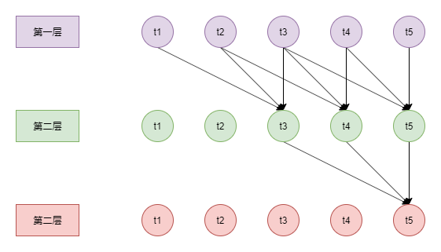

# 长度外推性 (Length Extrapolation)

[TOC]

## 一、简介

本文主要是沿着苏剑林大佬的博客, 整理一下目前大语言模型 **长度外推性** (Length Extrapolation) 相关的工作。什么是长度外推性呢?

对于基于 深度学习 的 NLP 模型来说, 无论是基于 RNN, CNN 还是 [Transformer](https://arxiv.org/abs/1706.03762) 架构, 我们都需要事先设定一个文本序列的最大长度。对于特定领域或者任务的 NLP 模型来说, 这种限制或许不是什么大问题。但是对于像 ChatGPT 这种通用领域的 NLP 模型来说, 这种限制就很大了。

**长度外推性** 的概念是 2021 年由 [ALiBi](https://arxiv.org/abs/2108.12409) 论文提出的, 其含义是: Train Short, Test Long! 即在短文本序列上训练, 在长文本序列上推理。举例来说, 我们现在要做的事情是: 在预训练阶段, 我们将文本长度设置为 2048, 但是推理时长度可以达到 32768, 并且性能没有特别大的下降!

对于 [Transformer](https://arxiv.org/abs/1706.03762) 架构来说, 长度外推性 和 位置编码 之间是有关联的。目前的 位置编码 可以分成两种形式:

一种是可训练式位置编码。[BERT](https://arxiv.org/abs/1810.04805) 和 [GPT](https://cdn.openai.com/research-covers/language-unsupervised/language_understanding_paper.pdf) 模型都是使用这种方式的, 长度一般不具有可扩展性。在 [Vision Transformer](https://arxiv.org/abs/2010.11929) 中作者尝试用 [线性插值](https://pytorch.org/docs/stable/generated/torch.nn.functional.interpolate.html) 的方式来扩展长度。

另一种是用数学的方式进行位置编码。[Transformer](https://arxiv.org/abs/1706.03762) 论文中的 正弦波位置编码, 以及苏剑林的 [旋转式位置编码](https://spaces.ac.cn/archives/8265) 都是属于这一种的。对于这种方式来说, 序列长度是有很强的扩展性的, 我们只需要改变一下计算方式即可。

长度外推性的工作也分为两种: 一种是基于已经训练好的模型进行 **长度外推**; 另一种是需要重新训练模型, 使其在推理时可以进行 **长度外推**。本文两种方式都会涉及。

## 二、修正 Attention 中的 scale 操作

这种方式是苏剑林大佬于 2021 年提出的, 属于非常通用的方式, 可以 "嵌在" 其它任何的 **长度外推性** 工作之中。

我们知道, Attention 的计算公式如下:

$$
\bold{o}^{\mathsf{T}} = \mathrm{softmax} \left(
    \frac{\bold{q}^{\mathsf{T}} \cdot \bold{K}^{\mathsf{T}}}{\sqrt{d_k}}
\right) \cdot \bold{V}
\tag{2.1}
$$

对于向量 $\bold{q}$ 来说, 如果序列长度越长, 那么就有越多的向量 $\bold{k}$ 参与 **注意力分数** 的计算, 也就意味着越 **加权平均数** 趋近于 **一般平均数** (所有的权重值都相同)。

换种说法, 当序列增长时, 对于相同的 $\bold{q}$ 和 $\bold{k}$ 来说, 它们之间的注意力分数没有发生变化, 但是有更多的向量 $\bold{k}$ 来 "分摊" 权重值。这样, 向量 $\bold{q}_m$ 可能不再 "聚焦" 在某些 $\bold{k}$ 上, 使得模型效果下降。

虽然这里 softmax 函数输出的是 **加权平均数** 的权重值, 我们也可以将其理解成 **概率**, 那么就可以计算 **信息熵** 了。我们现在希望, 当输入的序列长度增加时, 注意力权重的信息熵保持不变。应该怎么做呢?

在 [Transformer](https://arxiv.org/abs/1706.03762) 中, 作者为了减少 向量维度 对于注意力分数的影响, 将注意力分数除以 $\sqrt{d_k}$。这里也采用相同的方式, 让注意力分数乘以某一个数, 以降低序列长度的影响。

我们用 $n$ 表示输入的序列长度, 此时信息熵的最大值是 $\log n$。用 $tl$ 表示预训练时的序列长度, 当 $n \le tl$ 时, 计算方式还是公式 $(2.1)$; 当 $n \gt tl$ 时 (也就是进行长度外推时), 公式 $(2.1)$ 变成:

$$
\bold{o}^{\mathsf{T}} = \mathrm{softmax} \left(
    \frac{\log n}{\log tl} \cdot \frac{\bold{q}^{\mathsf{T}} \cdot \bold{K}^{\mathsf{T}}}{\sqrt{d_k}}
\right) \cdot \bold{V}
\tag{2.2}
$$

上面的公式很容易理解: 缩放因子是 $\frac{\log n}{\log tl} = \log_{tl} n$。当 $n > tl$ 时, 缩放因子会大于 1, 注意力分数会增加, "聚焦" 能力自然也会增加。换句话说, 现在向量 $\bold{q}$ 和 $\bold{k}$ 之间的注意力分数是受到序列长度影响的。

这样做的效果如何呢? 根据苏剑林大佬的实验, 在进行 **长度外推** 时, 会一定程度的缓解性能下降的问题, 但是起不到 "质变" 的作用。说明还有其它因素导致 性能下降。

仔细想想, 这也很正常。[Transformer](https://arxiv.org/abs/1706.03762) 架构是能够自适应 长度变化 的。有人发现, 对于训练好的 Transformer 模型而言: 在网络浅层, Attention 会更加关注 "局部" 的信息, 也就是向量 $\bold{q}$ 和其附近的 $\bold{k}$ 之间 **注意力分数** 高; 在网络的深层, Attention 会更加关注 "全局" 的信息。这一定程度上缓解了 长度变化 所带来的影响。

苏剑林大佬还特别指出, 如果你有资源进行 预训练, 可以直接用公式 $(2.2)$ 代替 $(2.1)$, 使得模型更加普适。

相关引用:

+ [从熵不变性看Attention的Scale操作](https://spaces.ac.cn/archives/8823)
+ [熵不变性Softmax的一个快速推导](https://spaces.ac.cn/archives/9034)
+ [从JL引理看熵不变性Attention](https://spaces.ac.cn/archives/9588)

## 三、ALiBi (Attention with Linear Biases)

这篇论文是 **长度外推性** 的开山之作。主要是针对 **单向语言模型** (GPT) 提出的解决方案, 并且需要重新训练模型。

其实, 在 [Transformer](https://arxiv.org/abs/1706.03762) 原始的论文中, 已经暗含了解决这个问题的思路: restricted attention。即向量 $\bold{q}$ 之和其 "附近" 的向量 $\bold{k}$ 计算 **注意力分数**, 然后通过网络层的 "叠加" 让所有的词向量之间都有 "关联性"。具体可以参考 [论文](https://arxiv.org/abs/1706.03762) 的 Table 1 和 下图:

在上图中, 第三层的 t5 词向量虽然是由第二层中的 t3 到 t5 词向量编码等到的, 但是由第一层的 t1 到 t5 共同编码得到的。[TextCNN](https://arxiv.org/abs/1408.5882) 也是采用这种策略的。此时, 我们甚至可以不用位置编码, 但是模型的性能会有所下降。(思考: 对于 TextCNN 而言, 加上位置编码效果会变好吗?)

之后, 人们给它起了很多 "别名": window attention, local attention 等等。在后文中, 我们统一称为 window attention。

在进行 **长度外推** 时, 我们完全可以采用这样的思路: 对于向量 $\bold{q}$ 而言, 所有超过预训练文本长度 $tl$ 的 $\bold{k}$ 和 $\bold{v}$ 都不参与 attention 的运算。此时, 我们可以认为, **注意力分数** 等价于:

$$
score(\bold{q}_m, \bold{k}_n) = \left\{ \begin{aligned}
    \bold{q}^{\mathsf{T}}_m \cdot \bold{k}_n - 0 \qquad m -n \le tl \\
    \bold{q}^{\mathsf{T}}_m \cdot \bold{k}_n - \infty \qquad m - n \gt tl
\end{aligned}
\right .
\tag{3.1}
$$

这里只考虑 **单向语言模型** (GPT), 即 $m \ge n$, 因此不需要考虑 $m - n \lt 0$ 的情况。需要注意的是, restricted attention 肯定不是这样实现, 否则没有办法节约计算资源。

ALiBi 就是公式 $(3.1)$ 的光滑版本, 将 **注意力分数** 公式改成:

$$
score(\bold{q}_m, \bold{k}_n) =
\bold{q}^{\mathsf{T}}_m \cdot \bold{k}_n -
\lambda \cdot (m - n)
\tag{3.2}
$$

当相对位置 $m - n$ 很大时, **注意力分数** 就会非常小, 可以认为是忽略了对应的 $\bold{k}_n$ 和 $\bold{v}_n$。同时, 这里不需要额外的位置编码了, 因为位置信息已经告诉模型了。[论文](https://arxiv.org/abs/2108.12409) Figure 6, 附件的 Table 2, Table 3 和 Table 4 展示了外推性的性能, 结论是: 当推理长度是预训练的 3 倍以内时, 性能没有下降, 当推理长度是预训练的 10 倍时, 性能下降都在可接受的范围内。

在这之后, 有 [KERPLE](https://arxiv.org/abs/2205.09921) 和 [Sandwich](https://arxiv.org/abs/2212.10356) 等一系列工作, 主要就是改公式 $(3.2)$ 中的 平滑方式。个人认为, 改的方式并不 "优雅", 这里就不介绍了。

相关引用:

+ [Transformer升级之路：7、长度外推性与局部注意力](https://spaces.ac.cn/archives/9431)
+ [Bias项的神奇作用：RoPE + Bias = 更好的长度外推性](https://spaces.ac.cn/archives/9577)
+ [Train Short, Test Long: Attention with Linear Biases Enables Input Length Extrapolation](https://arxiv.org/abs/2108.12409)
+ [KERPLE: Kernelized Relative Positional Embedding for Length Extrapolation](https://arxiv.org/abs/2205.09921)
+ [Dissecting Transformer Length Extrapolation via the Lens of Receptive Field Analysis](https://arxiv.org/abs/2212.10356)
+ [A Length-Extrapolatable Transformer](https://arxiv.org/abs/2212.10554)

## 四、HWFA (Hybird Window-Full Attention)

HWFA 也是苏剑林大佬提出的一种解决办法, 也需要重新训练模型。可以看作是上一部分 window attention 的延申。

在 [Transformer](https://arxiv.org/abs/1706.03762) 中, 作者说后续要测试 restricted attention (window attention) 的效果, 但是却没有下文了, 这是为什么呢? 因为其实验效果不理想。如何改进呢? 苏剑林大佬想到了 HWFA:

我们将原本的 Attention (公式 $(2.1)$) 称为 full attention。假设 Transformer 语言模型有 $L$ 层。那么前 $L-1$ 层采用 window attention + RoPE 的方式, 最后一层采用 full attention 的方式, 并且不使用任何相对位置编码。

这样做的效果如何呢? 苏剑林大佬通过实验发现, 在推理时将序列长度扩展 8 倍, 性能下降在 0.5% 左右, 可以说效果非常的惊人。从这里可以看出, 通过多层 "叠加" 的方式, window attention 是可以学习到语义信息的, 只是缺少一个 "汇总" 层, 而最后的 Full Attention 层就充当了这个角色。

在这之后, 苏剑林大佬还尝试给 full attention 添加上 ReRoPE 位置编码, 性能还可以提升, 在推理时将序列长度扩展 8 倍, 性能可能还有所提升。这可以说是比较 "完善" 的解决方案了。

相关引用:

+ [Transformer升级之路：9、一种全局长度外推的新思路](https://spaces.ac.cn/archives/9603)
+ [Transformer升级之路：14、当HWFA遇见ReRoPE](https://spaces.ac.cn/archives/9731)

## 五、Randomized Positional Encodings

这是 DeepMind 的工作, 思想也非常简单, 基于 **可训练式位置编码** 的 **长度扩展性** 工作, 也是需要重新训练模型的。

假设预训练时文本序列的长度是 $N$, 推理时文本序列的长度是 $M$, 以及超参数 $L$ (其中, $L \gt M \gt N$)。然后设置 $L$ 个位置嵌入向量:

在预训练阶段, 随机从 $L$ 个位置向量中选择 $N$ 个不重复的向量, 按照位置索引从小到大进行排序, 作为位置嵌入向量, 和词嵌入向量相加, 输入到模型中, 进行训练。

在推理阶段, 从 $L$ 个位置向量中 **等距** 选择 $M$ 个不重复的向量, 作为位置嵌入向量, 和词嵌入向量相加, 输入到模型中, 进行推理。

也就是说, 我们希望模型 "学会" $L$ 个位置向量之间的顺序关系, 看到这个思想, 我首先想到的是 pairwise ranking loss。整体来说, 想法还是非常巧妙的。

相关引用:

+ [Transformer升级之路：8、长度外推性与位置鲁棒性](https://spaces.ac.cn/archives/9444)
+ [Randomized Positional Encodings Boost Length Generalization of Transformers](https://arxiv.org/abs/2305.16843)

## 六、NBCE (Naive Bayes-based Context Extension)

这个也是苏剑林大佬的工作, 虽然不用重新训练模型, 但是使用的方式却很不一样。NBCE 可以看作是 **小范围检索** 的替代方案。

对于智能问答任务来说, 假设现在有问题 $Q$, 以及 $n$ 个文本片段, 记作 $C_1, C_2, \cdots, C_n$, 现在我们需要根据这 $n$ 个片段来回答问题。按照 GPT 语言模型的做法, 我们应该将问题 $Q$ 和 $n$ 个片段拼接在一起, 输入到模型中, 计算下一个 token $T$ 的概率分布。

但是, 将所有的 $n$ 个片段拼在一起超过了 GPT 语言模型的长度限制, 而单个片段没有超过这个长度限制。换言之, 我们无法计算 $p(T|C_1, C_2, \cdots, C_n, Q)$, 只能计算 $p(T|C_1, Q)$, $p(T|C_2, Q)$, $\cdots$, $p(T|C_n, Q)$ 的值, 那么应该怎么办呢?

苏剑林大佬给出的解决办法是 **朴素贝叶斯**。[Native Bayes](https://scikit-learn.org/stable/modules/naive_bayes.html) 可以理解为 贝叶斯公式 + 独立假设。

根据贝叶斯公式, 我们可以进行如下的推导:

$$
\begin{align*}
    p(T|C_1, C_2,\cdots, C_n, Q)
    &= p(T|Q) \cdot \frac{p(C_1, C_2,\cdots, C_n|T, Q)}{p(C_1, C_2,\cdots,C_n|Q)} \\
    &\propto p(T|Q) \cdot p(C_1, C_2,\cdots, C_n|T, Q) \\
    &= p(T|Q) \cdot \prod_{i=1}^n p(C_i|T, Q) \\
    &= p(T|Q) \cdot \prod_{i=1}^n p(C_i|Q) \cdot \frac{p(T|C_i, Q)}{p(T|Q)} \\
    &\propto p(T|Q) \cdot \prod_{i=1}^n \frac{p(T|C_i, Q)}{p(T|Q)} \\
    &= \frac{1}{p^{n-1}(T|Q)} \cdot \prod_{i=1}^n p(T|C_i, Q) \\
    &\propto - (n - 1) \log p(T|Q) + \sum_{i=1}^n \log p(T|C_i, Q)
\end{align*}
\tag{6.1}
$$

推导过程的解释如下:

+ 第一行: 贝叶斯公式
+ 第二行: 排除和 $T$ 无关的常数因子
+ 第三行: 独立假设: 在给定 $T$ 的情况下, $S_1, S_2, \cdots, S_n$ 这 $n$ 个片段之间是相互独立的
+ 第四行: 贝叶斯公式
+ 第五行: 排除和 $T$ 无关的常数因子
+ 第六行: 化简
+ 第七行: 取对数

推导过程非常简单。需要注意的是, 由于 $Q$ 作为所有概率的 "条件", 因此在推理过程中可以省略不写, 苏剑林大佬的推理过程就将其省略了。现在我们可以直接根据公式 $(6.1)$ 进行推理了。

进一步, 我们可以将求和项 $\sum_{i=1}^n \log p(T|C_i, Q)$ 理解成 **平均池化**, 即:

$$
\begin{align*}
    \sum_{i=1}^n \log p(T|C_i, Q) &= n \cdot \frac{1}{n} \sum_{i=1}^n \log p(T|C_i, Q) \\
    &= n \cdot \overline{\log p(T|C, Q)}
\end{align*}
\tag{6.2}
$$

其中, $\overline{\log p(T|C, Q)}$ 表示的就是平均池化。此时, 我们可以往一般的形式进行推广:

+ 我们可以换一种 池化方式, 比方说 最大池化
+ 池化方式改变了, $n$ 就失去了原本的意义了, 我们可以将其作为 超参数 进行调节

现在, 我们用 $\beta + 1$ 来替换公式 $(6.1)$ 中的 $n$, 那么, 现在的公式变成:

$$
\begin{equation}
    p(T|C_1, C_2,\cdots, C_n, Q)
    =  (\beta + 1) \cdot \overline{\log p(T|C, Q)} - \beta \cdot \log p(T|Q)
\end{equation}
\tag{6.3}
$$

苏剑林大佬经过一系列的实验发现: 池化方式改成 "取最小熵者", 同时 $\beta$ 设置成 0.25 效果最好。

所谓 "取最小熵者", 就是对于每一个 $p(T|C_i, Q)$ 概率分布, 计算信息熵, 然后取信息熵最小的那个概率分布。更准确地说, 这已经不是 "池化" 了, 而是 取最小值 (arg min) 操作了。其实也很好理解, 不同概率分布之间的 "池化" 意义不明确, 不如直接 "选择" 一个固定的概率分布。

原本的解码流程是什么样子, 还是什么样子, 只是改变了概率分布的计算方式:

1. 用语言模型计算在只有 $Q$ 的情况下, 下一个 token 的概率分布 $p_0$
2. 用语言模型计算在 $C_i$ 和 $Q$ 拼接的情况下, 下一个 token 的概率分布 $p_i$
3. 对于 $n$ 个概率分布 $p_i$, 采用 top-p 截掉的方式, 然后计算信息熵
4. 取信息熵最小者概率分布, 记作 $p^{\star}$
5. 计算 $(\beta + 1) \cdot p^{\star} - \beta \cdot p_0$, 作为最终的概率分布 $p$
6. 从概率分布 $p$ 中选取下一个 token $t$ (可以是 top-k/top-p 采样, 也可以是 贪婪搜索)
7. 将 token $t$ 拼接在 $Q$ 的后面, 回到第 1 步循环执行, 直至结束

整个过程可以说非常巧妙, 更多细节可以参考苏剑林大佬的 [源码](https://github.com/bojone/NBCE)。

问题也很明显, 适用场景是: 预测的答案可以分为若干个片段，每个片段只依赖于一个文本片段 $C_i$。从本质上说, 只是 "小范围检索" 的替代方案。如果需要综合多个文本片段来给出答案, 这个方案是行不通的。

相关引用:

+ [NBCE：使用朴素贝叶斯扩展LLM的Context处理长度](https://spaces.ac.cn/archives/9617)
+ [关于NBCE方法的一些补充说明和分析](https://spaces.ac.cn/archives/9632)
+ [Naive Bayes is all you need ?](https://spaces.ac.cn/archives/9648)
